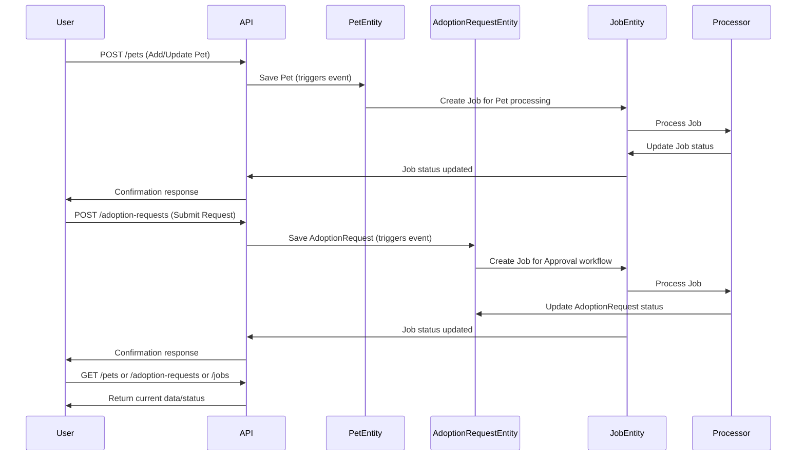

# Purrfect Pets API - Functional Requirements (Event-Driven Architecture)

## 1. Business Entities to Persist

- **Job**  
  Orchestration entity representing a processing job triggered by pet data changes (e.g., validations, notifications).

- **Pet**  
  Core business entity representing a pet in the system.

- **AdoptionRequest**  
  Business entity representing a user’s request to adopt a pet.

## 2. API Endpoints

### POST Endpoints (Add/Update + trigger events)

- `POST /pets`  
  Add or update pet details → triggers Pet save event → triggers Job creation for processing.

- `POST /adoption-requests`  
  Submit or update an adoption request → triggers AdoptionRequest save event → triggers Job for approval workflow.

### GET Endpoints (Retrieve results only)

- `GET /pets`  
  List all pets or filter by type/status.

- `GET /adoption-requests`  
  Retrieve adoption requests and their statuses.

- `GET /jobs`  
  Check the status of processing jobs.

## 3. Event Processing Workflows

- **On Pet Save:**  
  - Trigger a `Job` entity creation for processing (e.g., validation or notification).  
  - Job processes pet data, updates job status.

- **On AdoptionRequest Save:**  
  - Trigger a `Job` entity for adoption workflow (e.g., approval checks).  
  - Job updates adoption request status after processing.

- **On Job Save:**  
  - Automatically process job logic (e.g., send notifications, update entities).

## 4. Request/Response Formats

### Add/Update Pet

**Request**  
```json
{
  "id": "string (optional for new)",
  "name": "string",
  "type": "string (e.g., cat, dog)",
  "status": "string (available, adopted, pending)"
}
```

**Response**  
```json
{
  "id": "string",
  "message": "Pet saved successfully, processing job triggered."
}
```

### Submit Adoption Request

**Request**  
```json
{
  "id": "string (optional for new)",
  "petId": "string",
  "userId": "string",
  "status": "string (pending, approved, rejected)"
}
```

**Response**  
```json
{
  "id": "string",
  "message": "Adoption request saved successfully, approval job triggered."
}
```

---

## Mermaid Diagram: User Interaction & Event-Driven Flow


```mermaid
sequenceDiagram
    participant User
    participant API
    participant PetEntity
    participant AdoptionRequestEntity
    participant JobEntity
    participant Processor

    User->>API: POST /pets (Add/Update Pet)
    API->>PetEntity: Save Pet (triggers event)
    PetEntity->>JobEntity: Create Job for Pet processing
    JobEntity->>Processor: Process Job
    Processor->>JobEntity: Update Job status
    JobEntity->>API: Job status updated
    API->>User: Confirmation response

    User->>API: POST /adoption-requests (Submit Request)
    API->>AdoptionRequestEntity: Save AdoptionRequest (triggers event)
    AdoptionRequestEntity->>JobEntity: Create Job for Approval workflow
    JobEntity->>Processor: Process Job
    Processor->>AdoptionRequestEntity: Update AdoptionRequest status
    JobEntity->>API: Job status updated
    API->>User: Confirmation response

    User->>API: GET /pets or /adoption-requests or /jobs
    API->>User: Return current data/status
```