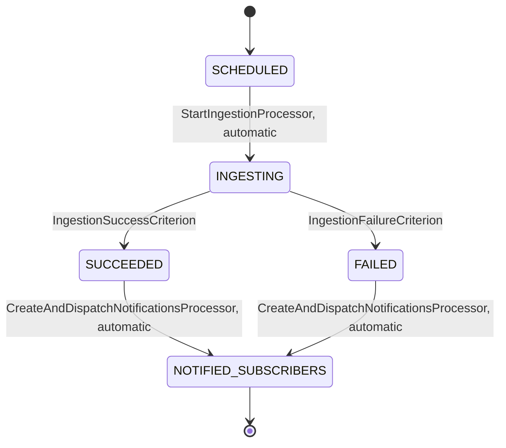
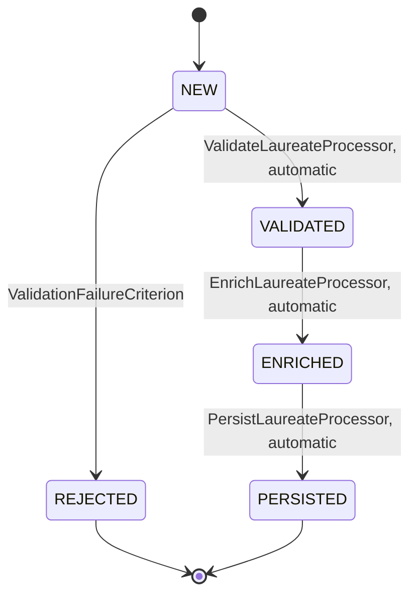
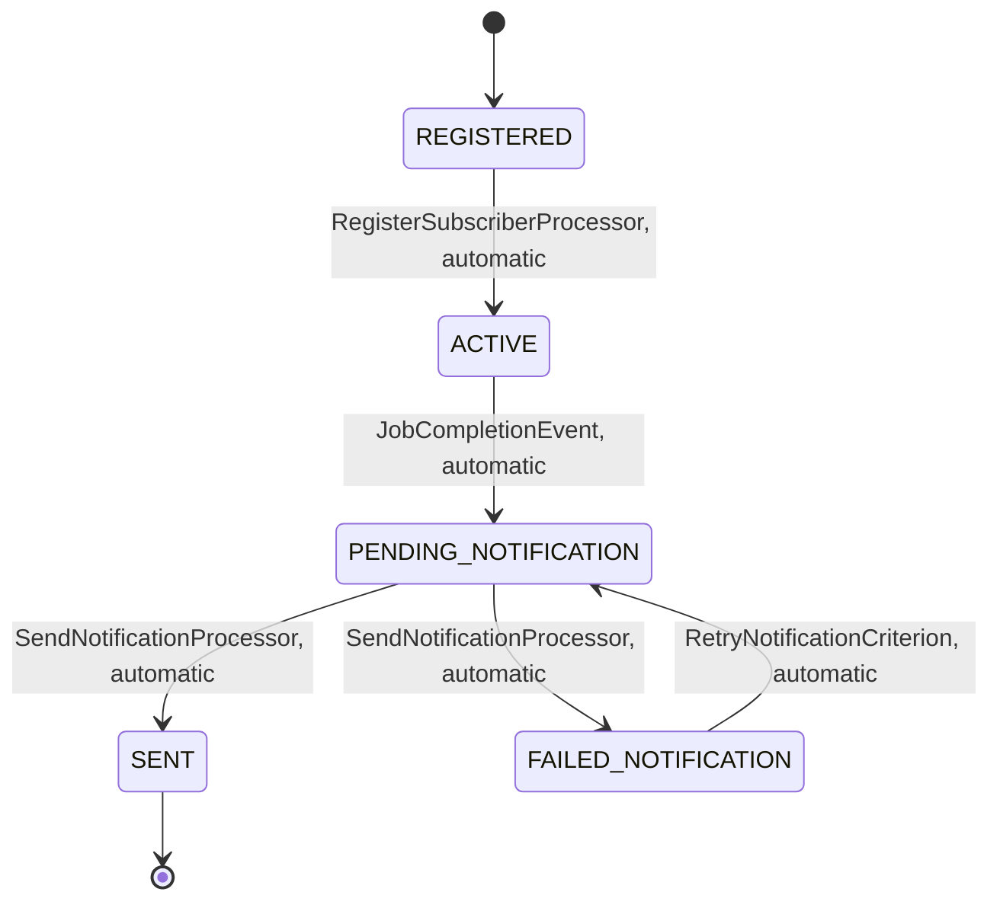

### 1. Entity Definitions
```
Job:
- id: String (business id from caller)
- scheduleDefinition: String (cron/interval/manual description)
- status: String (current lifecycle state)
- startedAt: String (ISO timestamp)
- finishedAt: String (ISO timestamp)
- ingestionSummary: Object (recordsFetched, recordsProcessed, recordsFailed)
- errorDetails: String (error summary when failed)
- notificationPolicy: Object (allSubscribers or filtered criteria)
- retryPolicy: Object (maxAttempts, backoffSeconds)
- triggeredBy: String (system or user)
- technicalId: String (datastore technical id returned by POST)

Laureate:
- id: Integer (source id from API)
- firstname: String
- surname: String
- name: String (affiliation or full name where applicable)
- gender: String
- born: String (ISO date)
- died: String (ISO date or null)
- bornCountry: String
- bornCountryCode: String
- bornCity: String
- year: String (award year)
- category: String
- motivation: String
- affiliation: Object (name, city, country)
- ageAtAward: Integer (derived)
- validationStatus: String (VALID / INVALID / PENDING)
- sourceJobTechnicalId: String (link to Job that created it)
- technicalId: String (datastore technical id)

Subscriber:
- id: String (business id)
- name: String
- contactType: String (email or webhook)
- contactAddress: String (email address or webhook URL)
- active: Boolean
- filters: Object (optional: years[], categories[], countries[])
- preferredPayload: String (summary / full)
- retryPolicy: Object (overrides)
- technicalId: String (datastore technical id)
```

Note: You asked for three entities — only these three are considered.

### 2. Entity workflows

Job workflow:
1. Initial State: SCHEDULED (Job persisted via POST triggers Cyoda process)
2. Start Ingestion: move to INGESTING (automatic)
3. Fetch & Process: call fetch -> validate laureates -> enrich -> persist laureates
4. Finalize: on success set SUCCEEDED; on unrecoverable error set FAILED
5. Notify: create notification tasks and dispatch to subscribers
6. Close: when all notifications attempted move to NOTIFIED_SUBSCRIBERS


```mermaid
stateDiagram-v2
    [*] --> SCHEDULED
    SCHEDULED --> INGESTING : StartIngestionProcessor, automatic
    INGESTING --> SUCCEEDED : IngestionSuccessCriterion
    INGESTING --> FAILED : IngestionFailureCriterion
    SUCCEEDED --> NOTIFIED_SUBSCRIBERS : CreateAndDispatchNotificationsProcessor, automatic
    FAILED --> NOTIFIED_SUBSCRIBERS : CreateAndDispatchNotificationsProcessor, automatic
    NOTIFIED_SUBSCRIBERS --> [*]
```

Job processors and criteria:
- Processors (4): StartIngestionProcessor, FetchLaureatesProcessor, PersistLaureatesProcessor, CreateAndDispatchNotificationsProcessor
- Criteria (2): IngestionSuccessCriterion, IngestionFailureCriterion

Laureate workflow:
1. Initial State: NEW (persisted by Job processing -> triggers Cyoda process)
2. Validation: VALIDATED or REJECTED (automatic)
3. Enrichment: ENRICHED (automatic after VALIDATED)
4. Persistence: PERSISTED (final available state)
5. REJECTED remains terminal for invalid records


```mermaid
stateDiagram-v2
    [*] --> NEW
    NEW --> VALIDATED : ValidateLaureateProcessor, automatic
    VALIDATED --> ENRICHED : EnrichLaureateProcessor, automatic
    ENRICHED --> PERSISTED : PersistLaureateProcessor, automatic
    NEW --> REJECTED : ValidationFailureCriterion
    REJECTED --> [*]
    PERSISTED --> [*]
```

Laureate processors and criteria:
- Processors (4): ValidateLaureateProcessor, EnrichLaureateProcessor, DeduplicateProcessor (invoked in PersistLaureateProcessor), PersistLaureateProcessor
- Criteria (2): ValidationFailureCriterion, DuplicateDetectedCriterion

Subscriber workflow:
1. Initial State: REGISTERED (subscriber created via POST triggers Cyoda process)
2. Validation & Activation: ACTIVE (automatic)
3. Listening: ACTIVE awaits JobCompletion events (automatic)
4. On job completion: PENDING_NOTIFICATION -> SENT or FAILED_NOTIFICATION (notifications retried per policy)
5. Manual transitions: admin can deactivate subscriber


```mermaid
stateDiagram-v2
    [*] --> REGISTERED
    REGISTERED --> ACTIVE : RegisterSubscriberProcessor, automatic
    ACTIVE --> PENDING_NOTIFICATION : JobCompletionEvent, automatic
    PENDING_NOTIFICATION --> SENT : SendNotificationProcessor, automatic
    PENDING_NOTIFICATION --> FAILED_NOTIFICATION : SendNotificationProcessor, automatic
    FAILED_NOTIFICATION --> PENDING_NOTIFICATION : RetryNotificationCriterion, automatic
    SENT --> [*]
```

Subscriber processors and criteria:
- Processors (3): RegisterSubscriberProcessor, SendNotificationProcessor, RetryNotificationProcessor
- Criteria (1): RetryNotificationCriterion

### 3. Pseudo code for processor classes

StartIngestionProcessor
```
class StartIngestionProcessor {
  process(job) {
    job.startedAt = now()
    job.status = INGESTING
    emit event JobIngesting(job.technicalId)
  }
}
```

FetchLaureatesProcessor
```
class FetchLaureatesProcessor {
  process(job) {
    response = fetchExternalApi(job.scheduleDefinition)
    records = parse(response)
    for each record in records:
      laureate = mapToLaureate(record)
      laureate.sourceJobTechnicalId = job.technicalId
      persistEntity(Laureate, laureate) // triggers Laureate workflow
    job.ingestionSummary.recordsFetched = records.size
  }
}
```

ValidateLaureateProcessor
```
class ValidateLaureateProcessor {
  process(laureate) {
    if missing required fields (id or year or category) then
      laureate.validationStatus = INVALID
      mark entity as REJECTED
    else
      laureate.validationStatus = VALID
      move to ENRICHED step
  }
}
```

EnrichLaureateProcessor
```
class EnrichLaureateProcessor {
  process(laureate) {
    laureate.ageAtAward = computeAge(laureate.born, laureate.year)
    laureate.bornCountryCode = normalizeCountryCode(laureate.bornCountry)
  }
}
```

PersistLaureateProcessor (includes dedup)
```
class PersistLaureateProcessor {
  process(laureate) {
    existing = findBySourceId(laureate.id)
    if existing then
      mergeOrVersion(existing, laureate)
    else
      insert(laureate)
    laureate.status = PERSISTED
  }
}
```

CreateAndDispatchNotificationsProcessor
```
class CreateAndDispatchNotificationsProcessor {
  process(job) {
    subscribers = findActiveSubscribersMatching(job.notificationPolicy)
    for each sub in subscribers:
      create Notification entity (subscriber, job)
      dispatch asynchronously SendNotificationProcessor(notification)
    job.status = NOTIFIED_SUBSCRIBERS
    job.finishedAt = now()
  }
}
```

SendNotificationProcessor
```
class SendNotificationProcessor {
  process(notification) {
    payload = buildPayload(notification.job, notification.subscriber)
    resp = deliver(notification.subscriber.contactType, notification.subscriber.contactAddress, payload)
    if resp.success then mark notification SENT else schedule retry per policy
  }
}
```

RetryNotificationProcessor
```
class RetryNotificationProcessor {
  process(notification) {
    if notification.attempts < subscriber.retryPolicy.maxAttempts:
      increment attempts; re-dispatch SendNotificationProcessor
    else mark notification FAILED
  }
}
```

Criteria examples (pseudo)
- IngestionSuccessCriterion: True if no unrecoverable errors and recordsProcessed > 0
- ValidationFailureCriterion: True if required fields missing
- RetryNotificationCriterion: True if attempts < maxAttempts

### 4. API Endpoints Design Rules

Rules applied:
- POST endpoints create orchestration or subscriber entities and trigger Cyoda workflows. POST responses return only technicalId.
- GET by technicalId present for all entities created via POST (Job, Subscriber). Laureate is created by Job processing so has GET by technicalId for retrieval.
- No GET by condition endpoints provided (not explicitly requested).
- GET all endpoints are optional; included only for Laureates (optional listing).

Endpoints:

1) Create Job
POST /jobs
Request:
```json
{
  "id": "job-2025-08-01",
  "scheduleDefinition": "manual",
  "notificationPolicy": { "type": "allSubscribers" },
  "retryPolicy": { "maxAttempts": 3, "backoffSeconds": 60 },
  "triggeredBy": "user"
}
```
Response:
```json
{
  "technicalId": "tech-job-0001"
}
```

GET Job by technicalId
GET /jobs/{technicalId}
Response:
```json
{
  "technicalId": "tech-job-0001",
  "id": "job-2025-08-01",
  "status": "NOTIFIED_SUBSCRIBERS",
  "startedAt": "2025-08-25T12:00:00Z",
  "finishedAt": "2025-08-25T12:05:00Z",
  "ingestionSummary": { "recordsFetched": 10, "recordsProcessed": 9, "recordsFailed": 1 }
}
```

2) Create Subscriber
POST /subscribers
Request:
```json
{
  "id": "sub-42",
  "name": "Nobel Alerts",
  "contactType": "webhook",
  "contactAddress": "https://example.com/webhook",
  "active": true,
  "filters": { "categories": ["Chemistry","Physics"] },
  "preferredPayload": "summary"
}
```
Response:
```json
{
  "technicalId": "tech-sub-0001"
}
```

GET Subscriber by technicalId
GET /subscribers/{technicalId}
Response:
```json
{
  "technicalId": "tech-sub-0001",
  "id": "sub-42",
  "name": "Nobel Alerts",
  "contactType": "webhook",
  "contactAddress": "https://example.com/webhook",
  "active": true,
  "filters": { "categories": ["Chemistry","Physics"] }
}
```

3) Get Laureate by technicalId (created by Job processing)
GET /laureates/{technicalId}
Response:
```json
{
  "technicalId": "tech-laureate-0853",
  "id": 853,
  "firstname": "Akira",
  "surname": "Suzuki",
  "year": "2010",
  "category": "Chemistry",
  "affiliation": { "name": "Hokkaido University", "city": "Sapporo", "country": "Japan" },
  "ageAtAward": 80,
  "validationStatus": "VALID",
  "sourceJobTechnicalId": "tech-job-0001"
}
```

Notes and Cyoda behavior:
- Persisting a Job or Subscriber via POST emits an event; Cyoda starts the corresponding entity workflow automatically.
- Persisting Laureate records is done by Job processors (persisting each laureate will itself trigger the Laureate workflow inside Cyoda).
- All state transitions, criteria and processors listed above are the business-level definitions Cyoda will call when the corresponding entity persistence or events occur.