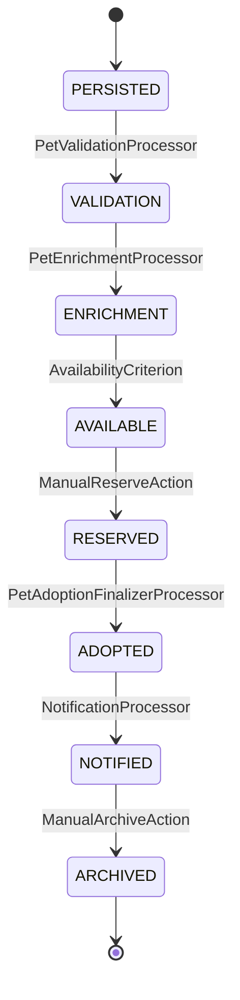
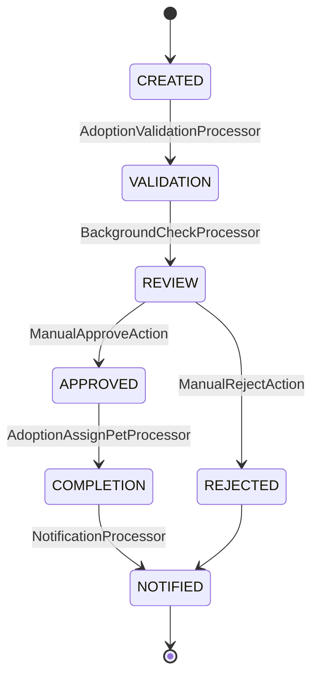
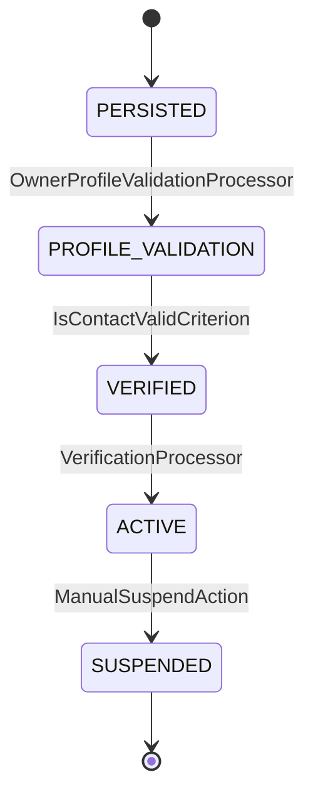

### 1. Entity Definitions
Pet:
- id: String (business id)
- name: String (pet name)
- species: String (cat/dog/etc)
- breed: String (breed)
- ageMonths: Integer (age in months)
- sex: String (M/F)
- status: String (available/pending/adopted/unavailable)
- mood: String (happy/playful/sleepy)
- description: String (free text)
- imageUrl: String (representative image)
- tags: List<String> (keywords)
- origin: String (Petstore/Manual)
- addedAt: String (ISO timestamp)

Owner:
- id: String (business id)
- name: String
- email: String
- phone: String
- address: String
- bio: String
- favorites: List<String> (pet ids)
- adoptedPets: List<String> (pet ids)
- createdAt: String (ISO timestamp)

AdoptionRequest:
- id: String (business id)
- petId: String
- ownerId: String
- message: String
- status: String (pending/under_review/approved/rejected/cancelled)
- createdAt: String (ISO timestamp)
- decidedAt: String (ISO timestamp)
- decisionNote: String

Notes: Default to these 3 entities per request. Each entity persistence is an EVENT that triggers its workflow in Cyoda.

### 2. Entity workflows

Pet workflow:
1. PERSISTED (event when pet saved)
2. VALIDATION: verify mandatory fields
3. ENRICHMENT: auto-add image/tags if origin is Petstore
4. AVAILABLE: visible for browsing
5. RESERVED: temporary hold when adoption request approved
6. ADOPTED: final ownership assigned
7. ARCHIVED: removed from listings (manual)
Processors/Criteria: PetValidationProcessor, PetEnrichmentProcessor, AvailabilityCriterion, PetAdoptionFinalizerProcessor, NotificationProcessor


```mermaid
stateDiagram-v2
    [*] --> PERSISTED
    PERSISTED --> VALIDATION : PetValidationProcessor
    VALIDATION --> ENRICHMENT : PetEnrichmentProcessor
    ENRICHMENT --> AVAILABLE : AvailabilityCriterion
    AVAILABLE --> RESERVED : ManualReserveAction
    RESERVED --> ADOPTED : PetAdoptionFinalizerProcessor
    ADOPTED --> NOTIFIED : NotificationProcessor
    NOTIFIED --> ARCHIVED : ManualArchiveAction
    ARCHIVED --> [*]
```

AdoptionRequest workflow:
1. CREATED (POST event)
2. VALIDATION: check message and references
3. REVIEW: shelter/admin review (automatic background check + manual decision)
4. APPROVED or REJECTED
5. COMPLETION: if approved, Pet transitions to ADOPTED and Owner.adoptedPets updated
6. NOTIFICATION: owner informed
Processors/Criteria: AdoptionValidationProcessor, OwnerEligibilityCriterion, BackgroundCheckProcessor, AdoptionAssignPetProcessor, NotificationProcessor


```mermaid
stateDiagram-v2
    [*] --> CREATED
    CREATED --> VALIDATION : AdoptionValidationProcessor
    VALIDATION --> REVIEW : BackgroundCheckProcessor
    REVIEW --> APPROVED : ManualApproveAction
    REVIEW --> REJECTED : ManualRejectAction
    APPROVED --> COMPLETION : AdoptionAssignPetProcessor
    COMPLETION --> NOTIFIED : NotificationProcessor
    NOTIFIED --> [*]
    REJECTED --> NOTIFIED
```

Owner workflow:
1. PERSISTED (POST event)
2. PROFILE_VALIDATION: contact/identity checks
3. VERIFIED: can make adoption requests and favorites
4. SUSPENDED: manual admin action on violations
Processors/Criteria: OwnerProfileValidationProcessor, IsContactValidCriterion, VerificationProcessor, NotificationProcessor


```mermaid
stateDiagram-v2
    [*] --> PERSISTED
    PERSISTED --> PROFILE_VALIDATION : OwnerProfileValidationProcessor
    PROFILE_VALIDATION --> VERIFIED : IsContactValidCriterion
    VERIFIED --> ACTIVE : VerificationProcessor
    ACTIVE --> SUSPENDED : ManualSuspendAction
    SUSPENDED --> [*]
```

### 3. Pseudo code for processor classes (concise)

PetValidationProcessor:
- validate required fields (id,name,species,status)
- mark errors -> set status UNAVAILABLE and emit validation error event

PetEnrichmentProcessor:
- if origin == Petstore then fetch missing imageUrl/tags and set mood default
- update pet record

PetAdoptionFinalizerProcessor:
- mark pet.status = ADOPTED
- link pet id to owner.adoptedPets
- emit Notification event

AdoptionValidationProcessor:
- ensure petId and ownerId exist and pet.status == AVAILABLE
- create REVIEW event if passes else set status REJECTED

BackgroundCheckProcessor:
- run eligibility checks on owner (history, contact)
- if fails set AdoptionRequest.status = REJECTED else move to REVIEW

AdoptionAssignPetProcessor:
- reserve pet, update statuses, call PetAdoptionFinalizerProcessor

OwnerProfileValidationProcessor:
- validate email/phone format; set verificationNeeded flag

NotificationProcessor:
- prepare message payloads for owner/admin about status changes

(Each processor emits follow-up events that Cyoda picks up to continue the workflow.)

### 4. API Endpoints Design Rules

Rules applied:
- POST endpoints return only technicalId string.
- GET endpoints only retrieve results.
- All POST-created entities have GET by technicalId.

Endpoints:

1) Create Owner (POST /owners)
Request:
```json
{
  "name":"Alice",
  "email":"alice@example.com",
  "phone":"555-1234",
  "address":"123 Cat Lane",
  "bio":"cat lover"
}
```
Response:
```json
"technicalId-xyz-123"
```
GET owner by technicalId (GET /owners/{technicalId}) response:
```json
{
  "technicalId":"technicalId-xyz-123",
  "id":"owner-001",
  "name":"Alice",
  "email":"alice@example.com",
  "phone":"555-1234",
  "address":"123 Cat Lane",
  "bio":"cat lover",
  "favorites":[],
  "adoptedPets":[],
  "createdAt":"2025-08-28T12:00:00Z"
}
```

2) Create AdoptionRequest (POST /adoption-requests)
Request:
```json
{
  "petId":"pet-101",
  "ownerId":"owner-001",
  "message":"I have a loving home!"
}
```
Response:
```json
"technicalId-req-456"
```
GET adoption request by technicalId (GET /adoption-requests/{technicalId}) response:
```json
{
  "technicalId":"technicalId-req-456",
  "id":"req-202",
  "petId":"pet-101",
  "ownerId":"owner-001",
  "message":"I have a loving home!",
  "status":"pending",
  "createdAt":"2025-08-28T12:05:00Z"
}
```

3) Retrieve Pet (GET /pets/{id}) and List Pets (GET /pets)
GET by id response:
```json
{
  "id":"pet-101",
  "name":"Whiskers",
  "species":"cat",
  "breed":"tabby",
  "ageMonths":18,
  "sex":"F",
  "status":"available",
  "mood":"playful",
  "imageUrl":"https://...",
  "tags":["friendly","indoor"],
  "origin":"Petstore",
  "addedAt":"2025-08-20T09:00:00Z"
}
```

Notes:
- Pet creation is performed by ingestion/enrichment processors (events) and admin flows; hence no public POST /pets in this spec.
- All entity persistence triggers Cyoda workflows described above.
- If you want an orchestration Job (e.g., PetIngestJob) added, I can expand entities and add POST/GET for that job.