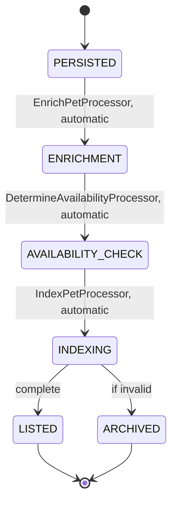
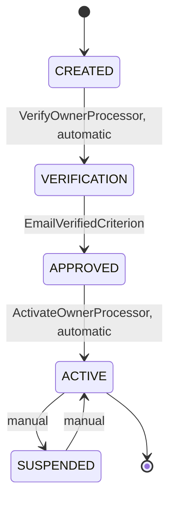
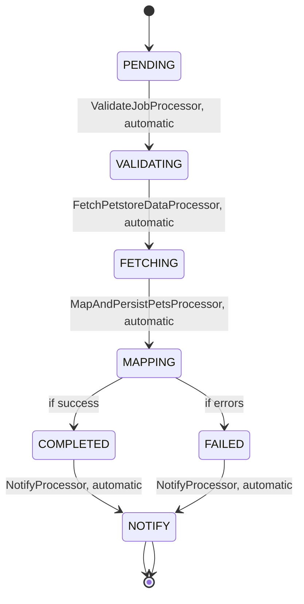

Noted: you did not specify entities, so I default to 3 entities (max 10 allowed). If you want more, tell me which ones.

### 1. Entity Definitions
```
Pet:
- id: String (business identifier, e.g., pet store id)
- name: String (pet name)
- species: String (cat, dog, etc.)
- breed: String (breed description)
- ageMonths: Integer (age in months)
- status: String (available, adopted, archived)
- metadata: Map (additional attributes like images, tags)

Owner:
- id: String (business identifier)
- name: String (owner full name)
- email: String (contact email)
- phone: String (contact phone)
- verified: Boolean (email/identity verification status)
- petsOwned: List<String> (pet ids owned)

IngestionJob:
- sourceUrl: String (external petstore API endpoint)
- requestedBy: String (user id or system)
- startedAt: String (timestamp)
- completedAt: String (timestamp)
- status: String (PENDING, RUNNING, COMPLETED, FAILED)
- summary: Map (counts of created/updated/failed)
```

### 2. Entity workflows

Pet workflow:
1. Initial State: PERSISTED (an event: Pet persisted)
2. Enrichment: run EnrichPetProcessor (automatic)
3. Availability: Determine if AVAILABLE or HOLD (automatic)
4. Indexing: IndexPetProcessor (automatic)
5. Final: LISTED or ARCHIVED


```mermaid
stateDiagram-v2
    [*] --> PERSISTED
    PERSISTED --> ENRICHMENT : EnrichPetProcessor, automatic
    ENRICHMENT --> AVAILABILITY_CHECK : DetermineAvailabilityProcessor, automatic
    AVAILABILITY_CHECK --> INDEXING : IndexPetProcessor, automatic
    INDEXING --> LISTED : complete
    INDEXING --> ARCHIVED : if invalid
    LISTED --> [*]
    ARCHIVED --> [*]
```

Pet workflow processors/criteria:
- Processors: EnrichPetProcessor, DetermineAvailabilityProcessor, IndexPetProcessor
- Criteria: ValidPetDataCriterion, EnrichmentCompleteCriterion

Owner workflow:
1. Initial State: CREATED (POST owner)
2. Verification: VerifyOwnerProcessor (automatic/email) or manual verification
3. Activation: set ACTIVE if verified
4. Suspension/Deactivation: manual transitions possible


```mermaid
stateDiagram-v2
    [*] --> CREATED
    CREATED --> VERIFICATION : VerifyOwnerProcessor, automatic
    VERIFICATION --> APPROVED : EmailVerifiedCriterion
    APPROVED --> ACTIVE : ActivateOwnerProcessor, automatic
    ACTIVE --> SUSPENDED : manual
    SUSPENDED --> ACTIVE : manual
    ACTIVE --> [*]
```

Owner processors/criteria:
- Processors: VerifyOwnerProcessor, ActivateOwnerProcessor, NotifyOwnerProcessor
- Criteria: EmailVerifiedCriterion

IngestionJob workflow:
1. Initial State: PENDING (POST job)
2. Validation: ValidateJobProcessor (automatic)
3. Fetching: FetchPetstoreDataProcessor (automatic)
4. Mapping/Persist: MapAndPersistPetsProcessor (automatic creates Pet entities)
5. Completion: COMPLETED or FAILED, then NotifyProcessor


```mermaid
stateDiagram-v2
    [*] --> PENDING
    PENDING --> VALIDATING : ValidateJobProcessor, automatic
    VALIDATING --> FETCHING : FetchPetstoreDataProcessor, automatic
    FETCHING --> MAPPING : MapAndPersistPetsProcessor, automatic
    MAPPING --> COMPLETED : if success
    MAPPING --> FAILED : if errors
    COMPLETED --> NOTIFY : NotifyProcessor, automatic
    NOTIFY --> [*]
    FAILED --> NOTIFY : NotifyProcessor, automatic
    NOTIFY --> [*]
```

IngestionJob processors/criteria:
- Processors: ValidateJobProcessor, FetchPetstoreDataProcessor, MapAndPersistPetsProcessor, NotifyProcessor
- Criteria: FetchSuccessCriterion, MappingSuccessCriterion

### 3. Pseudo code for processor classes
Example pseudocode (conceptual):

EnrichPetProcessor
```
class EnrichPetProcessor {
  void process(Pet pet) {
    if (ValidPetDataCriterion.evaluate(pet)) {
      // add images, tags, normalize fields
      pet.metadata.put("enrichedAt", now());
      pet.status = determineStatus(pet);
      save(pet);
    } else {
      // mark for manual review or archive
      pet.status = "archived";
      save(pet);
    }
  }
}
```

MapAndPersistPetsProcessor
```
class MapAndPersistPetsProcessor {
  void process(IngestionJob job, List<ExternalPet> externalList) {
    for each ext in externalList {
      Pet pet = mapExternalToPet(ext);
      persist(pet); // persisting Pet triggers Pet workflow (PERSISTED)
      job.summary.incrementCreated();
    }
    updateJobStatus(job, COMPLETED);
  }
}
```

FetchPetstoreDataProcessor
```
class FetchPetstoreDataProcessor {
  List<ExternalPet> process(IngestionJob job) {
    response = httpGet(job.sourceUrl);
    if (response.ok) return parse(response);
    else throw FetchFailedException;
  }
}
```

VerifyOwnerProcessor
```
class VerifyOwnerProcessor {
  void process(Owner owner) {
    sendVerificationEmail(owner.email);
    // waits for EmailVerifiedCriterion to be true or manual confirm
  }
}
```

NotifyProcessor
```
class NotifyProcessor {
  void process(IngestionJob job) {
    // send summary to requestedBy
  }
}
```

Criteria examples (conceptual):
- ValidPetDataCriterion.evaluate(pet): checks required fields present
- EmailVerifiedCriterion.evaluate(owner): checks owner.verified == true
- FetchSuccessCriterion.evaluate(job): verifies HTTP 200 and payload structure

### 4. API Endpoints Design Rules

Notes:
- POST endpoints create entities (emit event). POST must return only technicalId.
- GET endpoints retrieve stored results. Provide GET by technicalId for all POST-created entities.
- Pets are primarily created by IngestionJob processing (persisted by processors). You can add POST /owners and POST /jobs/ingest.

Endpoints:

1) Create ingestion job (start import)
POST /jobs/ingest
Request:
```json
{
  "sourceUrl": "https://petstore.example/api/pets",
  "requestedBy": "user-123"
}
```
Response (must contain only technicalId):
```json
"job-tech-0001"
```

GET job by technicalId:
GET /jobs/ingest/{technicalId} response:
```json
{
  "technicalId":"job-tech-0001",
  "sourceUrl":"https://petstore.example/api/pets",
  "status":"COMPLETED",
  "startedAt":"2025-08-01T12:00:00Z",
  "completedAt":"2025-08-01T12:00:45Z",
  "summary":{"created":24,"updated":3,"failed":1}
}
```

2) Create owner
POST /owners
Request:
```json
{
  "name":"Ava Catlover",
  "email":"ava@example.com",
  "phone":"+123456789"
}
```
Response:
```json
"owner-tech-2002"
```

GET owner by technicalId:
GET /owners/{technicalId} response:
```json
{
  "technicalId":"owner-tech-2002",
  "id":"owner-42",
  "name":"Ava Catlover",
  "email":"ava@example.com",
  "verified":false,
  "petsOwned":[]
}
```

3) Get pet by technicalId (pets created by job)
GET /pets/{technicalId} response:
```json
{
  "technicalId":"pet-tech-9001",
  "id":"pet-77",
  "name":"Mittens",
  "species":"cat",
  "breed":"tabby",
  "ageMonths":14,
  "status":"AVAILABLE",
  "metadata":{"images":[ "..."], "enrichedAt":"2025-08-01T12:00:10Z"}
}
```

Questions to refine scope:
- Do you want manual adoption workflows (Owner adopts Pet) as a separate entity (AdoptionRequest) or is ingestion + owner management sufficient?
- Do you need GET-by-condition endpoints (search pets by species/breed/status)? If yes, I will add search endpoints and related criteria/processors.