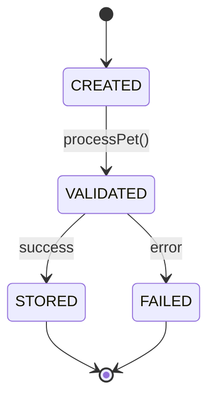
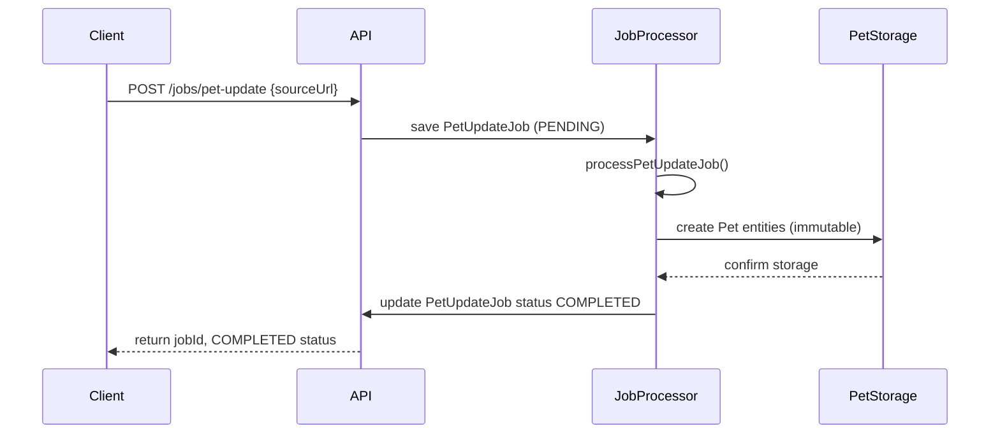

Certainly! Here is the finalized, well-formatted functional requirements document for the "Purrfect Pets" API app using Event-Driven Architecture:

---

### 1. Entity Definitions

``` 
PetUpdateJob:
- jobId: String (unique identifier for the job)
- sourceUrl: String (URL of Petstore API data source)
- status: StatusEnum (PENDING, PROCESSING, COMPLETED, FAILED)

Pet:
- petId: String (unique identifier for the pet)
- name: String (pet's name)
- category: String (pet type/category, e.g., dog, cat)
- status: StatusEnum (AVAILABLE, PENDING, SOLD)
```

---

### 2. Process Method Flows

```
processPetUpdateJob() Flow:
1. Initial State: PetUpdateJob created with PENDING status
2. Validation: Verify sourceUrl is reachable and valid
3. Processing: Fetch pets data from Petstore API, create immutable Pet entities from data
4. Completion: Update PetUpdateJob status to COMPLETED or FAILED depending on success
5. Notification: Log job result for audit purposes
```

```
processPet() Flow:
1. Initial State: Pet created with AVAILABLE (or given) status
2. Validation: Check mandatory fields (petId, name, category)
3. Processing: Store pet data in persistent storage
4. Completion: Mark pet entity as stored successfully
```

---

### 3. API Endpoints Design

- **POST /jobs/pet-update**  
  *Creates a new PetUpdateJob to trigger pet data ingestion from the Petstore API.*  
  Request:  
  ```json
  {
    "sourceUrl": "https://petstore.swagger.io/v2/pet/findByStatus?status=available"
  }
  ```  
  Response:  
  ```json
  {
    "jobId": "generated-job-id",
    "status": "PENDING"
  }
  ```

- **GET /pets**  
  *Retrieve the list of stored pets.*  
  Response:  
  ```json
  [
    {
      "petId": "string",
      "name": "string",
      "category": "string",
      "status": "AVAILABLE"
    }
  ]
  ```

- **POST /pets**  
  *Add a new pet manually (immutable creation).*  
  Request:  
  ```json
  {
    "petId": "string",
    "name": "string",
    "category": "string",
    "status": "AVAILABLE"
  }
  ```  
  Response:  
  ```json
  {
    "petId": "string",
    "status": "AVAILABLE"
  }
  ```

---

### 4. Mermaid Diagrams

**PetUpdateJob Lifecycle**


```mermaid
stateDiagram-v2
    [*] --> PENDING
    PENDING --> PROCESSING : processPetUpdateJob()
    PROCESSING --> COMPLETED : success
    PROCESSING --> FAILED : error
    COMPLETED --> [*]
    FAILED --> [*]
```

**Pet Lifecycle**


```mermaid
stateDiagram-v2
    [*] --> CREATED
    CREATED --> VALIDATED : processPet()
    VALIDATED --> STORED : success
    VALIDATED --> FAILED : error
    STORED --> [*]
    FAILED --> [*]
```

**Event-Driven Processing Chain**


```mermaid
sequenceDiagram
    participant Client
    participant API
    participant JobProcessor
    participant PetStorage

    Client->>API: POST /jobs/pet-update {sourceUrl}
    API->>JobProcessor: save PetUpdateJob (PENDING)
    JobProcessor->>JobProcessor: processPetUpdateJob()
    JobProcessor->>PetStorage: create Pet entities (immutable)
    PetStorage-->>JobProcessor: confirm storage
    JobProcessor->>API: update PetUpdateJob status COMPLETED
    API-->>Client: return jobId, COMPLETED status
```

---

If you have any further adjustments or additional features, please let me know. Otherwise, this serves as the core functional blueprint for your Purrfect Pets API app!