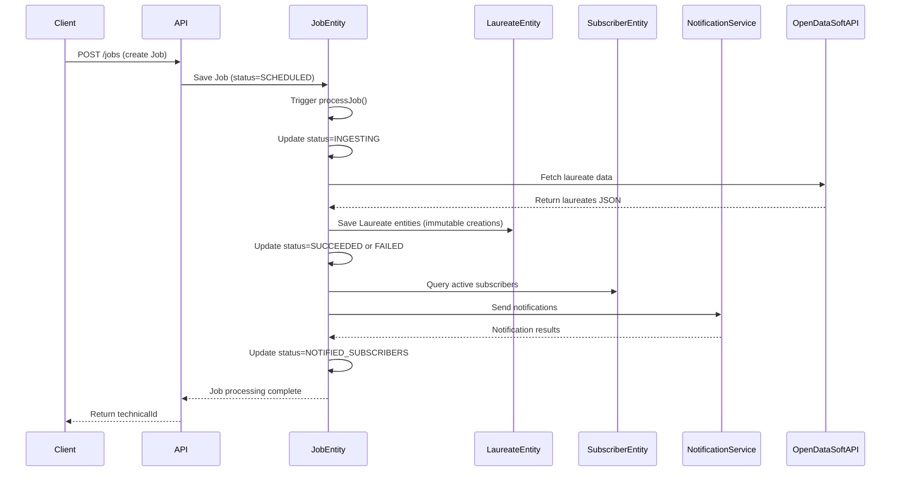
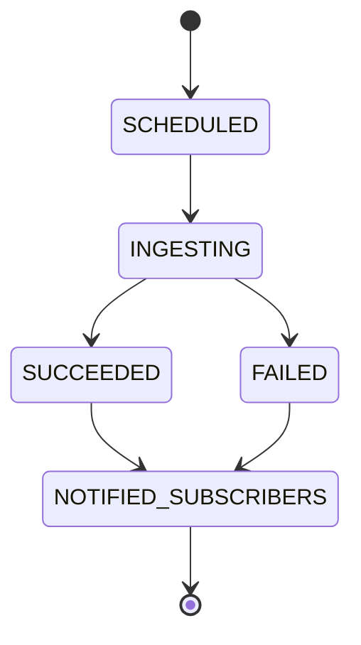

# Functional Requirements

---

## 1. Entity Definitions

```plaintext
Job:
- jobName: String (name or description of the data ingestion job)
- status: String (workflow state: SCHEDULED, INGESTING, SUCCEEDED, FAILED, NOTIFIED_SUBSCRIBERS)
- createdAt: String (job creation timestamp)
- ingestionSource: String (OpenDataSoft API endpoint)
- resultSummary: String (ingestion result summary)
- errorDetails: String (ingestion or notification error details)

Laureate:
- laureateId: String (unique laureate ID)
- firstname: String
- surname: String
- born: String
- died: String
- borncountry: String
- borncountrycode: String
- borncity: String
- gender: String
- year: String
- category: String
- motivation: String
- affiliationName: String
- affiliationCity: String
- affiliationCountry: String

Subscriber:
- subscriberId: String (unique ID)
- contactType: String (email or webhook)
- contactDetails: String (email address or webhook URL)
- subscribedCategories: String (optional, comma-separated)
- active: String ("true"/"false")
```

---

## 2. Process Method Flows

### processJob() Flow:

1. Create Job with status=SCHEDULED
2. Validate job parameters
3. Set status=INGESTING
4. Fetch laureates from OpenDataSoft API (ingestionSource)
5. Save Laureate entities (immutable creations)
6. Set status=SUCCEEDED or FAILED
7. Notify active Subscribers
8. Set status=NOTIFIED_SUBSCRIBERS

### processLaureate() Flow:

1. Create Laureate entity
2. Validate required fields (firstname, surname, year, category)
3. Enrich/normalize data
4. Persist laureate data

### processSubscriber() Flow:

1. Create Subscriber entity
2. Validate contactDetails based on contactType
3. Persist subscriber data

---

## 3. API Endpoints

| Entity    | Endpoint                      | Description                                  | Returns           |
|-----------|-------------------------------|----------------------------------------------|-------------------|
| Job       | POST /jobs                   | Create a new Job (triggers ingestion)        | `technicalId` only |
| Job       | GET /jobs/{technicalId}      | Retrieve Job details by technicalId           | Job entity JSON   |
| Laureate  | GET /laureates/{technicalId} | Retrieve Laureate details by technicalId      | Laureate entity JSON |
| Subscriber| POST /subscribers            | Create a new Subscriber                        | `technicalId` only |
| Subscriber| GET /subscribers/{technicalId}| Retrieve Subscriber details by technicalId    | Subscriber entity JSON |

---

## 4. Request/Response Formats

### POST /jobs

Request JSON:
```json
{
  "jobName": "Nobel Laureates Ingestion April 2024",
  "ingestionSource": "https://public.opendatasoft.com/api/explore/v2.1/catalog/datasets/nobel-prize-laureates/records"
}
```

Response JSON:
```json
{
  "technicalId": "uuid-or-generated-id"
}
```

---

### GET /jobs/{technicalId}

Response JSON:
```json
{
  "jobName": "Nobel Laureates Ingestion April 2024",
  "status": "NOTIFIED_SUBSCRIBERS",
  "createdAt": "2024-06-01T12:34:56Z",
  "ingestionSource": "https://public.opendatasoft.com/api/explore/v2.1/catalog/datasets/nobel-prize-laureates/records",
  "resultSummary": "Ingested 100 laureates, 0 errors",
  "errorDetails": null
}
```

---

### GET /laureates/{technicalId}

Response JSON:
```json
{
  "laureateId": "853",
  "firstname": "Akira",
  "surname": "Suzuki",
  "born": "1930-09-12",
  "died": null,
  "borncountry": "Japan",
  "borncountrycode": "JP",
  "borncity": "Mukawa",
  "gender": "male",
  "year": "2010",
  "category": "Chemistry",
  "motivation": "\"for palladium-catalyzed cross couplings in organic synthesis\"",
  "affiliationName": "Hokkaido University",
  "affiliationCity": "Sapporo",
  "affiliationCountry": "Japan"
}
```

---

### POST /subscribers

Request JSON:
```json
{
  "contactType": "email",
  "contactDetails": "subscriber@example.com",
  "subscribedCategories": "Chemistry,Physics",
  "active": "true"
}
```

Response JSON:
```json
{
  "technicalId": "uuid-or-generated-id"
}
```

---

### GET /subscribers/{technicalId}

Response JSON:
```json
{
  "subscriberId": "uuid-or-generated-id",
  "contactType": "email",
  "contactDetails": "subscriber@example.com",
  "subscribedCategories": "Chemistry,Physics",
  "active": "true"
}
```

---

## 5. Mermaid Diagrams


```mermaid
sequenceDiagram
    participant Client
    participant API
    participant JobEntity
    participant LaureateEntity
    participant SubscriberEntity
    participant NotificationService

    Client->>API: POST /jobs (create Job)
    API->>JobEntity: Save Job (status=SCHEDULED)
    JobEntity->>JobEntity: Trigger processJob()
    JobEntity->>JobEntity: Update status=INGESTING
    JobEntity->>OpenDataSoftAPI: Fetch laureate data
    OpenDataSoftAPI-->>JobEntity: Return laureates JSON
    JobEntity->>LaureateEntity: Save Laureate entities (immutable creations)
    JobEntity->>JobEntity: Update status=SUCCEEDED or FAILED
    JobEntity->>SubscriberEntity: Query active subscribers
    JobEntity->>NotificationService: Send notifications
    NotificationService-->>JobEntity: Notification results
    JobEntity->>JobEntity: Update status=NOTIFIED_SUBSCRIBERS
    JobEntity-->>API: Job processing complete
    API-->>Client: Return technicalId
```


```mermaid
stateDiagram-v2
    [*] --> SCHEDULED
    SCHEDULED --> INGESTING
    INGESTING --> SUCCEEDED
    INGESTING --> FAILED
    SUCCEEDED --> NOTIFIED_SUBSCRIBERS
    FAILED --> NOTIFIED_SUBSCRIBERS
    NOTIFIED_SUBSCRIBERS --> [*]
```
