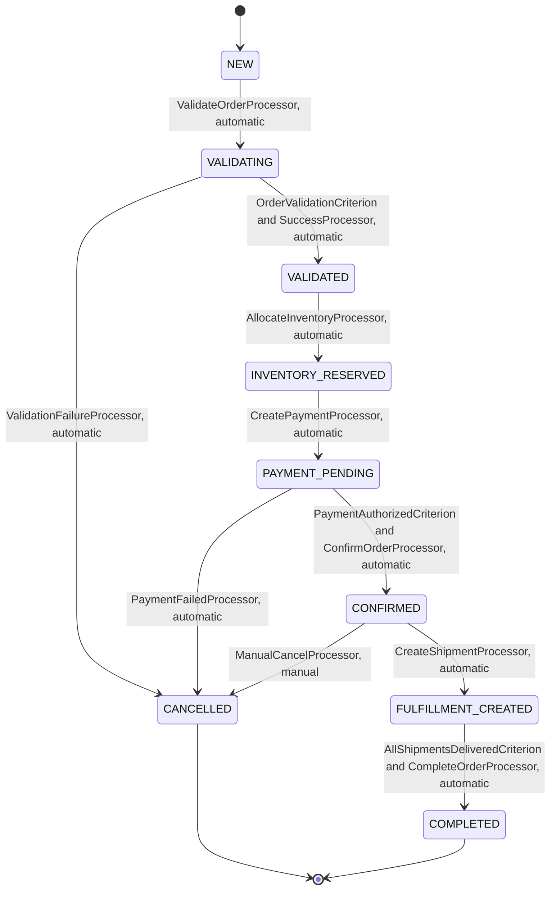
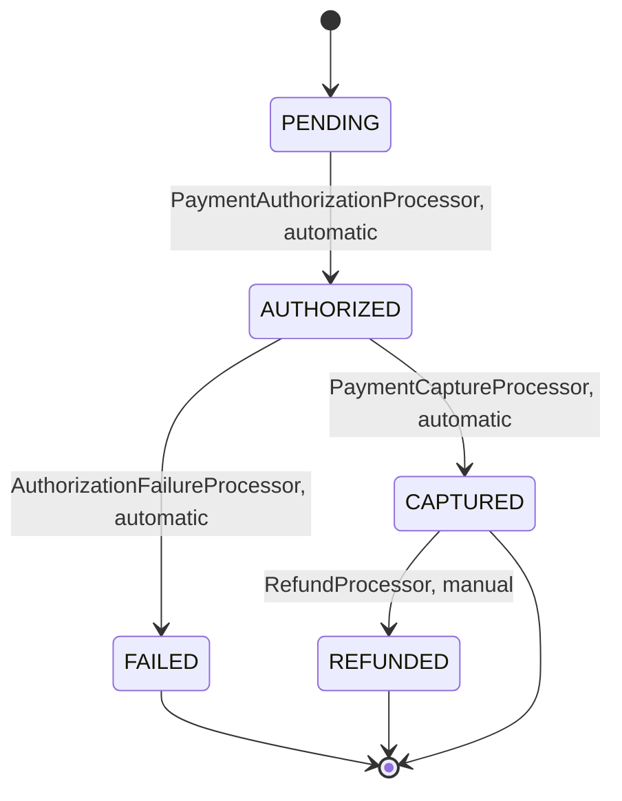
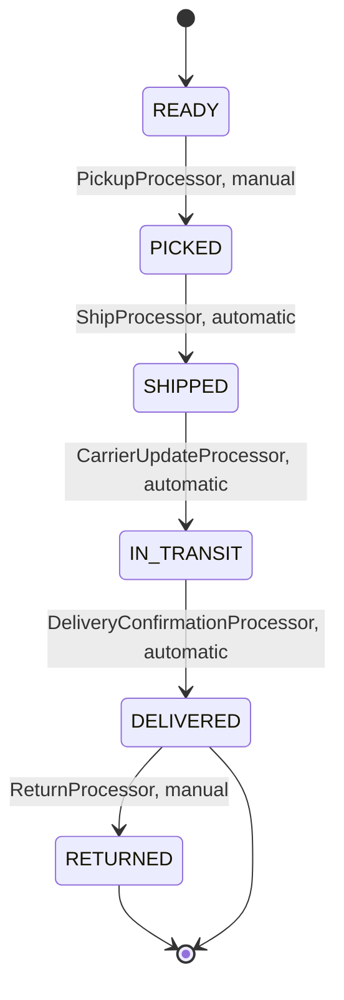

### 1. Entity Definitions
```
Order:
- orderId: String (business order number visible to users)
- customerId: String (link to customer)
- items: Array of { sku: String, quantity: Integer, price: Number } (line items)
- totalAmount: Number (calculated total)
- currency: String (currency code)
- shippingAddress: Object (address details)
- status: String (workflow-driven state)
- createdAt: String (ISO timestamp)

Payment:
- paymentId: String (payment provider id if any)
- orderId: String (linked order)
- method: String (card, wallet, etc.)
- amount: Number (payment amount)
- currency: String
- status: String (workflow-driven state)
- providerResponse: Object (raw provider result)
- createdAt: String

Shipment:
- shipmentId: String (carrier or internal id)
- orderId: String (linked order)
- items: Array of { sku: String, quantity: Integer }
- trackingNumber: String
- carrier: String
- status: String (workflow-driven state)
- createdAt: String
```

Note: technicalId is not part of these entities (POST returns technicalId).

### 2. Entity workflows

Order workflow:
1. Initial State: NEW (persisted by POST)
2. Validation: Validate items, address, totals
3. Reserve Inventory: try allocate inventory
4. Payment Trigger: create Payment entity (automatic) or wait for Payment
5. Fulfillment: create Shipment(s) when payment is captured
6. Completion: COMPLETED when all shipments delivered; CANCELLED if manual cancel or allocation/payment fails


```mermaid
stateDiagram-v2
    [*] --> NEW
    NEW --> VALIDATING : ValidateOrderProcessor, automatic
    VALIDATING --> VALIDATED : OrderValidationCriterion and SuccessProcessor, automatic
    VALIDATING --> CANCELLED : ValidationFailureProcessor, automatic
    VALIDATED --> INVENTORY_RESERVED : AllocateInventoryProcessor, automatic
    INVENTORY_RESERVED --> PAYMENT_PENDING : CreatePaymentProcessor, automatic
    PAYMENT_PENDING --> CONFIRMED : PaymentAuthorizedCriterion and ConfirmOrderProcessor, automatic
    PAYMENT_PENDING --> CANCELLED : PaymentFailedProcessor, automatic
    CONFIRMED --> FULFILLMENT_CREATED : CreateShipmentProcessor, automatic
    FULFILLMENT_CREATED --> COMPLETED : AllShipmentsDeliveredCriterion and CompleteOrderProcessor, automatic
    CONFIRMED --> CANCELLED : ManualCancelProcessor, manual
    CANCELLED --> [*]
    COMPLETED --> [*]
```

Order processors/criteria:
- Processors: ValidateOrderProcessor, AllocateInventoryProcessor, CreatePaymentProcessor, CreateShipmentProcessor, CompleteOrderProcessor, ManualCancelProcessor
- Criteria: OrderValidationCriterion, InventoryAvailableCriterion, AllShipmentsDeliveredCriterion

Payment workflow:
1. Initial State: PENDING (created automatically or via POST)
2. Authorization: attempt authorization
3. Capture: capture when order confirmed (or authorize+capture in one step)
4. Settlement/Refund: refunded if order cancelled after capture
5. Terminal: CAPTURED / REFUNDED / FAILED


```mermaid
stateDiagram-v2
    [*] --> PENDING
    PENDING --> AUTHORIZED : PaymentAuthorizationProcessor, automatic
    AUTHORIZED --> CAPTURED : PaymentCaptureProcessor, automatic
    AUTHORIZED --> FAILED : AuthorizationFailureProcessor, automatic
    CAPTURED --> REFUNDED : RefundProcessor, manual
    FAILED --> [*]
    REFUNDED --> [*]
    CAPTURED --> [*]
```

Payment processors/criteria:
- Processors: PaymentAuthorizationProcessor, PaymentCaptureProcessor, AuthorizationFailureProcessor, RefundProcessor
- Criteria: PaymentAuthorizedCriterion, PaymentCaptureNeededCriterion

Shipment workflow:
1. Initial State: READY (created by order processing)
2. Picking: mark picked/packed
3. Shipped: carrier pickup + tracking assigned
4. InTransit: carrier updates
5. Delivered: terminal delivered
6. Returned: optional return state


```mermaid
stateDiagram-v2
    [*] --> READY
    READY --> PICKED : PickupProcessor, manual
    PICKED --> SHIPPED : ShipProcessor, automatic
    SHIPPED --> IN_TRANSIT : CarrierUpdateProcessor, automatic
    IN_TRANSIT --> DELIVERED : DeliveryConfirmationProcessor, automatic
    DELIVERED --> RETURNED : ReturnProcessor, manual
    RETURNED --> [*]
    DELIVERED --> [*]
```

Shipment processors/criteria:
- Processors: PickupProcessor, ShipProcessor, CarrierUpdateProcessor, DeliveryConfirmationProcessor, ReturnProcessor
- Criteria: ShipmentReadyCriterion, AllItemsPickedCriterion

### 3. Pseudo code for processor classes (high level, Cyoda processors invoked by entity process method)

Example: ValidateOrderProcessor
```java
class ValidateOrderProcessor {
  void process(Order order) {
    // verify address, items not empty, totals match
    if (invalid) {
      order.status = "CANCELLED";
      // emit event to Cyoda for order update
    } else {
      order.status = "VALIDATED";
    }
    persist(order);
  }
}
```

AllocateInventoryProcessor
```java
class AllocateInventoryProcessor {
  void process(Order order) {
    boolean ok = InventoryService.reserve(order.items);
    if (ok) {
      order.status = "INVENTORY_RESERVED";
    } else {
      order.status = "CANCELLED";
      // optionally create backorder event
    }
    persist(order);
  }
}
```

CreatePaymentProcessor
```java
class CreatePaymentProcessor {
  void process(Order order) {
    Payment payment = new Payment(...); // amount = order.totalAmount
    persist(payment); // Cyoda will start Payment workflow
    order.status = "PAYMENT_PENDING";
    persist(order);
  }
}
```

PaymentAuthorizationProcessor
```java
class PaymentAuthorizationProcessor {
  void process(Payment p) {
    PaymentResult r = PaymentGateway.authorize(p);
    if (r.success) {
      p.status = "AUTHORIZED";
    } else {
      p.status = "FAILED";
    }
    p.providerResponse = r.raw;
    persist(p);
  }
}
```

CreateShipmentProcessor
```java
class CreateShipmentProcessor {
  void process(Order order) {
    Shipment s = buildShipmentFromOrder(order);
    persist(s); // triggers Shipment workflow
    order.status = "FULFILLMENT_CREATED";
    persist(order);
  }
}
```

(Other processors follow the same pattern: evaluate, set status, persist, emit events.)

### 4. API Endpoints Design Rules (POST returns only technicalId)

Order POST (creates Order -> triggers Order workflow)
Request:
```json
{
  "orderId":"O-1001",
  "customerId":"C-123",
  "items":[{"sku":"SKU-1","quantity":2,"price":10.0}],
  "currency":"USD",
  "shippingAddress": {"line1":"...", "city":"...", "postalCode":"..."}
}
```
Response:
```json
{
  "technicalId":"<generated-technical-id>"
}
```
GET Order by technicalId
Response (full stored Order):
```json
{
  "technicalId":"<id>",
  "orderId":"O-1001",
  "customerId":"C-123",
  "items":[...],
  "totalAmount":20.0,
  "status":"INVENTORY_RESERVED",
  "createdAt":"2025-08-20T12:00:00Z"
}
```

Payment POST (optional; payments can be created by Order processors)
Request:
```json
{
  "paymentId":"P-900",
  "orderId":"<orderId>",
  "method":"card",
  "amount":20.0,
  "currency":"USD"
}
```
Response:
```json
{
  "technicalId":"<generated-technical-id>"
}
```
GET Payment by technicalId returns full Payment object.

Shipment POST (usually created by Order processing but UI can create)
Request:
```json
{
  "shipmentId":"S-500",
  "orderId":"O-1001",
  "items":[{"sku":"SKU-1","quantity":2}],
  "carrier":"CarrierX"
}
```
Response:
```json
{
  "technicalId":"<generated-technical-id>"
}
```
GET Shipment by technicalId returns full Shipment object.

Rules recap:
- Every POST persists entity -> Cyoda starts entity workflow (process method).
- POST responses MUST contain only technicalId.
- Provide GET by technicalId for each entity created via POST.
- No GET-by-condition endpoints unless explicitly requested.

If you want, I can:
- Add an orchestration Job entity (for bulk imports or nightly reconciliation) with its POST + workflow.
- Adjust exact state names to match the Lovable UI if you provide them.