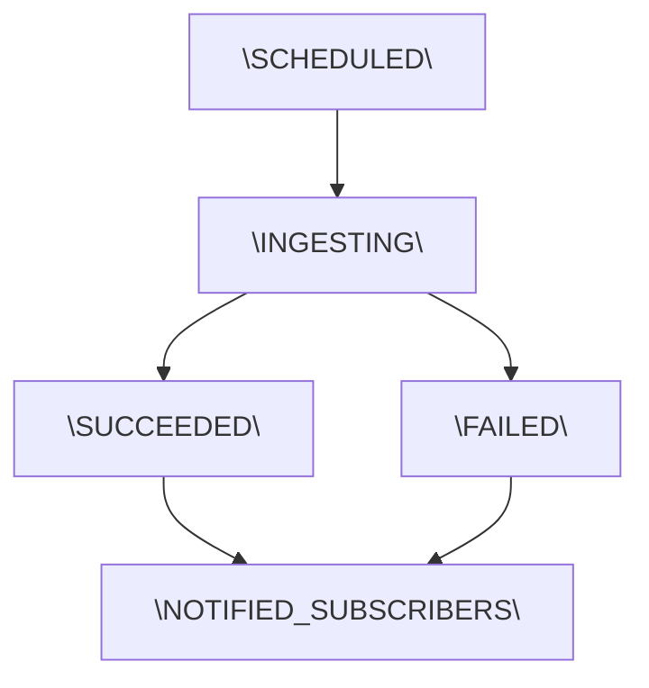
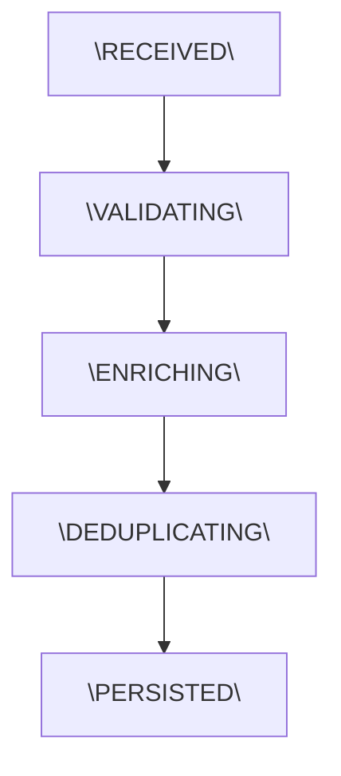
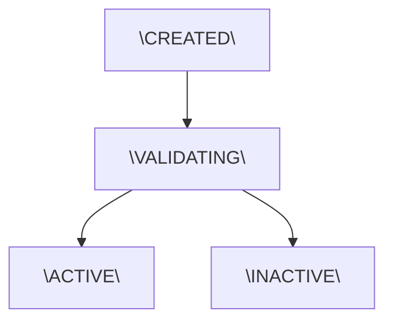

Questions (pick one option each if unsure)
- Would you like subscriber notifications delivered via "email", "webhook", or "both"?
- When ingesting from OpenDataSoft, should we ingest "all records" or only "new/updated (delta)"?
- For jobs, do you want "scheduled + manual trigger" or "only manual trigger"?

---

### 1. Entity Definitions
```
Job:
- id: String (domain identifier if any; not the datastore technicalId)
- name: String (human friendly job name)
- schedule: String (cron expression or null; scheduling information)
- status: String (current lifecycle state; e.g. SCHEDULED, INGESTING, SUCCEEDED, FAILED, NOTIFIED_SUBSCRIBERS)
- startedAt: String (ISO-8601 timestamp when job started)
- finishedAt: String (ISO-8601 timestamp when job finished)
- errorDetails: String (error message or stacktrace if any)
- sourceUrl: String (data source URL; default: https://public.opendatasoft.com/api/explore/v2.1/catalog/datasets/nobel-prize-laureates/records)
- createdAt: String (ISO-8601 timestamp)
- updatedAt: String (ISO-8601 timestamp)

Laureate:
- id: Integer (Nobel dataset id; from input payload)
- firstname: String (given name)
- surname: String (family name)
- born: String (birth date, e.g., "1930-09-12")
- died: String|null (death date or null)
- borncountry: String (country name where born)
- borncountrycode: String (country code, e.g., "JP")
- borncity: String (city where born)
- gender: String (e.g., "male"/"female")
- year: String (award year, e.g., "2010")
- category: String (award category, e.g., "Chemistry")
- motivation: String (award motivation)
- name: String (affiliation name, e.g., "Hokkaido University")
- city: String (affiliation city)
- country: String (affiliation country)
- ageAtAward: Integer|null (derived/enriched field; calculated from born/year)
- normalizedCountryCode: String|null (enriched/standardized code)
- createdAt: String (ISO-8601 timestamp)
- updatedAt: String (ISO-8601 timestamp)

Subscriber:
- id: String (domain identifier if any; not the datastore technicalId)
- name: String (subscriber name)
- contactMethods: Object (structured contact info)
  - email: String|null
  - webhookUrl: String|null
- active: Boolean (true = active recipient)
- filters: Object (filter criteria applied to laureates)
  - categories: Array[String]|null
  - years: Object|null
    - from: String|null
    - to: String|null
  - borncountry: Array[String]|null
  - affiliationCountry: Array[String]|null
- createdAt: String (ISO-8601 timestamp)
- updatedAt: String (ISO-8601 timestamp)
```

Notes:
- Max 3 entities used as specified by the requirement (Job, Laureate, Subscriber). No additional entities were added.
- Each entity add operation is an EVENT. Once an entity is persisted, Cyoda starts that entity workflow automatically to process it.

---

### 2. Entity workflows

Job workflow:
1. Initial State: Job created and persisted with status = "SCHEDULED"
2. Validation: Check job parameters (schedule, sourceUrl) and available subscribers
3. Ingesting: Transition to "INGESTING" and start asynchronous ingestion process
4. Laureate Processing: For each record fetched, persist Laureate entity (each persist triggers Laureate workflow)
5. Completion Decision:
   - If ingestion completes with no fatal errors → set status = "SUCCEEDED"
   - If fatal errors occurred → set status = "FAILED" and capture errorDetails
6. Notification: After SUCCEEDED or FAILED → transition to "NOTIFIED_SUBSCRIBERS" and trigger notifications to active subscribers
7. Finalize: Update finishedAt and set status accordingly

Job state diagram:

```mermaid
graph TD
    Job_SCHEDULED["\"SCHEDULED\""]
    Job_INGESTING["\"INGESTING\""]
    Job_SUCCEEDED["\"SUCCEEDED\""]
    Job_FAILED["\"FAILED\""]
    Job_NOTIFIED["\"NOTIFIED_SUBSCRIBERS\""]
    Job_SCHEDULED --> Job_INGESTING
    Job_INGESTING --> Job_SUCCEEDED
    Job_INGESTING --> Job_FAILED
    Job_SUCCEEDED --> Job_NOTIFIED
    Job_FAILED --> Job_NOTIFIED
```

Laureate workflow:
1. Event: Laureate entity is persisted (created/updated) by Job ingestion → Cyoda starts Laureate workflow
2. Validation: Validation Processor ensures required fields are non-null and formats are correct (id, firstname/surname, year, category, born date)
3. Enrichment: Enrichment Processor calculates derived fields (ageAtAward), standardizes country codes (normalizedCountryCode), normalizes name fields
4. Deduplication: Duplicate Detection Processor checks existing laureates by id/year/category and decides create vs update vs ignore
5. Persist/Upsert: Persist normalized/enriched record to store; mark as PERSISTED
6. Emit Event: Emit "LAUREATE_STORED" event for downstream processes (reports, notification filtering)

Laureate state diagram:

```mermaid
graph TD
    Laureate_RECEIVED["\"RECEIVED\""]
    Laureate_VALIDATING["\"VALIDATING\""]
    Laureate_ENRICHING["\"ENRICHING\""]
    Laureate_DEDUP["\"DEDUPLICATING\""]
    Laureate_PERSISTED["\"PERSISTED\""]
    Laureate_RECEIVED --> Laureate_VALIDATING
    Laureate_VALIDATING --> Laureate_ENRICHING
    Laureate_ENRICHING --> Laureate_DEDUP
    Laureate_DEDUP --> Laureate_PERSISTED
```

Subscriber workflow:
1. Event: Subscriber entity is persisted via POST → Cyoda may validate contact methods and apply initial subscription setup
2. Validation: Contact Validator ensures email/webhook formats and required info
3. Activation: If valid and active=true, subscriber becomes eligible for notifications
4. Notification Filtering: Upon Job → NOTIFIED_SUBSCRIBERS event, Subscription Filter Evaluator applies subscriber.filters against laureates created/updated by the Job and triggers delivery actions
5. Delivery Status: Track delivery attempts and update subscriber delivery status if persistent failures occur

Subscriber state diagram:

```mermaid
graph TD
    Subscriber_CREATED["\"CREATED\""]
    Subscriber_VALIDATING["\"VALIDATING\""]
    Subscriber_ACTIVE["\"ACTIVE\""]
    Subscriber_INACTIVE["\"INACTIVE\""]
    Subscriber_CREATED --> Subscriber_VALIDATING
    Subscriber_VALIDATING --> Subscriber_ACTIVE
    Subscriber_VALIDATING --> Subscriber_INACTIVE
```

---

### 3. Event-driven processing rules (EDA specifics)
- Each POST that creates an entity is an EVENT that triggers Cyoda workflows automatically.
- Job.POST → starts Job workflow (ingestion orchestration). During ingestion Job workflow persists Laureate entities, each persist starts Laureate workflow.
- Laureate persisted → starts Validation → Enrichment → Dedup → Persist state transitions; successful persist emits a "LAUREATE_STORED" event.
- Job completion (SUCCEEDED or FAILED) → triggers Notification step that collects all laureates created/updated by that job, applies subscriber.filters, and issues notifications (email/webhook) asynchronously with retries.
- All processing steps are asynchronous and should support retries for transient failures (webhook/SMTP). Persistent failures should be surfaced in subscriber delivery tracking and job.errorDetails.

Preserved integration details:
- Data Source:
  - API Endpoint:
    https://public.opendatasoft.com/api/explore/v2.1/catalog/datasets/nobel-prize-laureates/records
- JSON parsing libraries suggested: Jackson or Gson
- Job scheduling suggestion preserved: Quartz or Spring Scheduler

---

### 4. API Endpoints (Design Rules applied)
Rules applied:
- POST endpoints: create entity and trigger events; response must return only {"technicalId":"<id>"} (technicalId is datastore-specific and not a field on the entity).
- GET endpoints: only for retrieving stored results.
- GET by technicalId: present for entities that are created via POST.
- GET by condition: provided only where user requested filters (Laureate list with filters).
- Orchestration entity Job has POST and GET by technicalId.
- Subscriber has POST and GET by technicalId (subscriber creation is via POST).
- Laureate is primarily created by Job ingestion (no public POST required); therefore only GET endpoints for retrieval (with filter support as requested).

Endpoints list and JSON formats:

1) Jobs
- POST /api/jobs
  - Request JSON:
    ```json
    {
      "name": "String",
      "schedule": "String|null",
      "sourceUrl": "String|null"
    }
    ```
    - Notes: sourceUrl defaults to https://public.opendatasoft.com/api/explore/v2.1/catalog/datasets/nobel-prize-laureates/records if null.
  - Response JSON:
    ```json
    {
      "technicalId": "String"
    }
    ```

- GET /api/jobs/{technicalId}
  - Response JSON (full job representation):
    ```json
    {
      "technicalId": "String",
      "id": "String",
      "name": "String",
      "schedule": "String|null",
      "status": "String",
      "startedAt": "String|null",
      "finishedAt": "String|null",
      "errorDetails": "String|null",
      "sourceUrl": "String",
      "createdAt": "String",
      "updatedAt": "String",
      "laureatesCount": "Integer"
    }
    ```

- GET /api/jobs
  - Response JSON: list of job summary objects (optional)
  - Example:
    ```json
    [
      {
        "technicalId": "String",
        "name": "String",
        "status": "String",
        "startedAt": "String|null",
        "finishedAt": "String|null"
      }
    ]
    ```

- POST /api/jobs/{technicalId}/trigger
  - Request JSON: empty or optional {"reason":"String"}
  - Response JSON:
    ```json
    {
      "technicalId": "String"
    }
    ```
  - Behavior: Manually triggers job ingestion; persists a transition to INGESTING as an event.

- GET /api/jobs/{technicalId}/laureates
  - Response JSON: list of laureates created/updated by that job (Laureate representation as below)

2) Laureates (read-only public API; created by Job ingestion)
- GET /api/laureates
  - Query parameters supported (filters): year, category, borncountry, affiliationCountry, firstname, surname, limit, offset
  - Response JSON: array of Laureate objects:
    ```json
    [
      {
        "id": 853,
        "firstname": "Akira",
        "surname": "Suzuki",
        "born": "1930-09-12",
        "died": null,
        "borncountry": "Japan",
        "borncountrycode": "JP",
        "borncity": "Mukawa",
        "gender": "male",
        "year": "2010",
        "category": "Chemistry",
        "motivation": "\"for palladium-catalyzed cross couplings in organic synthesis\"",
        "name": "Hokkaido University",
        "city": "Sapporo",
        "country": "Japan",
        "ageAtAward": 80,
        "normalizedCountryCode": "JP",
        "createdAt": "String",
        "updatedAt": "String"
      }
    ]
    ```

- GET /api/laureates/{id}
  - Response JSON: single Laureate object (same structure as above)

3) Subscribers
- POST /api/subscribers
  - Request JSON:
    ```json
    {
      "name": "String",
      "contactMethods": {
        "email": "String|null",
        "webhookUrl": "String|null"
      },
      "active": true,
      "filters": {
        "categories": ["String"],
        "years": {"from":"String|null","to":"String|null"},
        "borncountry": ["String"],
        "affiliationCountry": ["String"]
      }
    }
    ```
  - Response JSON:
    ```json
    {
      "technicalId": "String"
    }
    ```

- GET /api/subscribers/{technicalId}
  - Response JSON (full subscriber representation):
    ```json
    {
      "technicalId": "String",
      "id": "String",
      "name": "String",
      "contactMethods": {"email":"String|null","webhookUrl":"String|null"},
      "active": true,
      "filters": {
        "categories": ["String"],
        "years": {"from":"String|null","to":"String|null"},
        "borncountry": ["String"],
        "affiliationCountry": ["String"]
      },
      "createdAt": "String",
      "updatedAt": "String"
    }
    ```

- GET /api/subscribers
  - Response JSON: list of subscriber summaries (optional)

Notes on POST responses:
- Every POST endpoint returns ONLY {"technicalId":"..."} and nothing else.

---

### 5. Visualize request/response flows (Mermaid)

Jobs POST flow:
```mermaid
graph TD
    Client["\"Client POST /api/jobs\""]
    JobsAPI["\"/api/jobs (creates Job)\""]
    CyodaJobEvent["\"Cyoda: Job persisted (EVENT)\""]
    JobWorkflow["\"Job Workflow: SCHEDULED→INGESTING→...\""]
    Client --> JobsAPI
    JobsAPI --> CyodaJobEvent
    CyodaJobEvent --> JobWorkflow
```

Laureate ingestion flow (high-level):
```mermaid
graph TD
    JobWorkflow["\"Job Workflow (INGESTING)\""]
    OpenDataSoft["\"OpenDataSoft API\nhttps://public.opendatasoft.com/api/explore/v2.1/catalog/datasets/nobel-prize-laureates/records\""]
    LaureatePersist["\"Persist Laureate (EVENT)\""]
    LaureateWorkflow["\"Laureate Workflow: VALIDATING→ENRICHING→DEDUP→PERSISTED\""]
    JobWorkflow --> OpenDataSoft
    OpenDataSoft --> LaureatePersist
    LaureatePersist --> LaureateWorkflow
```

Notification delivery flow:
```mermaid
graph TD
    JobNotified["\"Job → NOTIFIED_SUBSCRIBERS\""]
    NotificationEngine["\"Notification Processor\n(filter & delivery)\""]
    Subscriber["\"Subscriber (active)\""]
    EmailService["\"Email / SMTP\""]
    Webhook["\"Subscriber Webhook\""]
    JobNotified --> NotificationEngine
    NotificationEngine --> Subscriber
    NotificationEngine --> EmailService
    NotificationEngine --> Webhook
```

---

### 6. Processing & filtering rules (business logic)
- Job ingestion collects records via the OpenDataSoft API (support pagination).
- Each record is parsed (Jackson/Gson) into Laureate fields exactly as specified in the example:
  {
    "id": 853,
    "firstname": "Akira",
    "surname": "Suzuki",
    "born": "1930-09-12",
    "died": null,
    "borncountry": "Japan",
    "borncountrycode": "JP",
    "borncity": "Mukawa",
    "gender": "male",
    "year": "2010",
    "category": "Chemistry",
    "motivation": "\"for palladium-catalyzed cross couplings in organic synthesis\"",
    "name": "Hokkaido University",
    "city": "Sapporo",
    "country": "Japan"
  }
- Validation Processor enforces required fields and formats.
- Enrichment Processor calculates derived fields (e.g., ageAtAward) and normalizes country codes.
- Duplicate Detection Processor ensures id/year/category uniqueness; decides create vs update.
- On Job completion, Notification Trigger collects laureates created/updated by that job and applies subscriber.filters (categories, years range, borncountry, affiliationCountry).
- Notifications are sent asynchronously to subscriber.contactMethods (email and/or webhook) with retries. Persistent failures should be tracked in subscriber delivery status.

---

Please review the generated entities and workflows. If you need any changes, please let me know. Feel free to click Approve if this requirement meets your expectations or if you are ready to proceed.