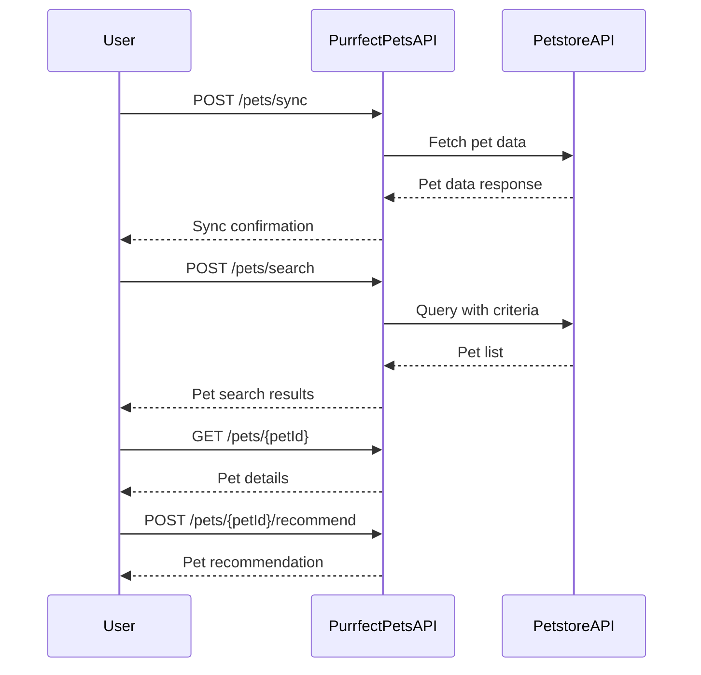
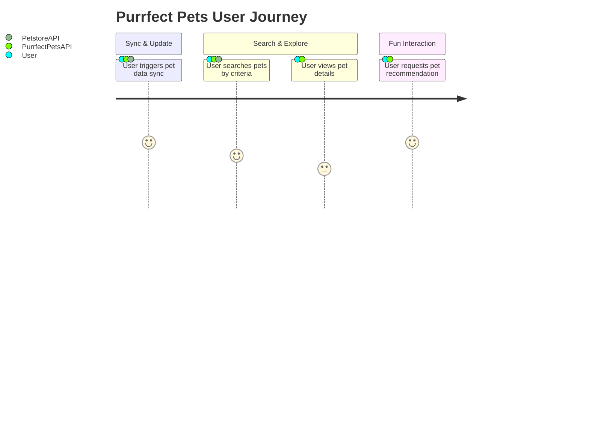

# Purrfect Pets API – Functional Requirements

## API Endpoints

### 1. Add or Update Pet Data (POST /pets/sync)
- **Description:** Synchronizes pet data from the external Petstore API or updates pet info.
- **Request:**
  ```json
  {
    "source": "petstore",
    "action": "sync" | "update",
    "petData": {
      "id": "string",
      "name": "string",
      "category": "string",
      "photoUrls": ["string"],
      "tags": ["string"],
      "status": "available" | "pending" | "sold"
    }
  }
  ```
- **Response:**
  ```json
  {
    "success": true,
    "message": "Pet data synchronized/updated",
    "updatedPetId": "string"
  }
  ```

### 2. Get Pet Details (GET /pets/{petId})
- **Description:** Retrieves details of a pet by ID.
- **Response:**
  ```json
  {
    "id": "string",
    "name": "string",
    "category": "string",
    "photoUrls": ["string"],
    "tags": ["string"],
    "status": "available" | "pending" | "sold"
  }
  ```

### 3. Search Pets (POST /pets/search)
- **Description:** Searches pets based on criteria; uses POST because it invokes business logic and external data retrieval.
- **Request:**
  ```json
  {
    "category": "string (optional)",
    "status": "available" | "pending" | "sold (optional)",
    "tags": ["string"] (optional),
    "nameContains": "string (optional)"
  }
  ```
- **Response:**
  ```json
  [
    {
      "id": "string",
      "name": "string",
      "category": "string",
      "photoUrls": ["string"],
      "tags": ["string"],
      "status": "available" | "pending" | "sold"
    },
    ...
  ]
  ```

### 4. Add Pet Recommendation (POST /pets/{petId}/recommend)
- **Description:** Generates and stores a fun pet recommendation based on pet data.
- **Request:**
  ```json
  {
    "petId": "string"
  }
  ```
- **Response:**
  ```json
  {
    "recommendation": "string"
  }
  ```

---

## Mermaid Sequence Diagram: User Interaction with Purrfect Pets API


```mermaid
sequenceDiagram
    participant User
    participant PurrfectPetsAPI
    participant PetstoreAPI

    User->>PurrfectPetsAPI: POST /pets/sync
    PurrfectPetsAPI->>PetstoreAPI: Fetch pet data
    PetstoreAPI-->>PurrfectPetsAPI: Pet data response
    PurrfectPetsAPI-->>User: Sync confirmation

    User->>PurrfectPetsAPI: POST /pets/search
    PurrfectPetsAPI->>PetstoreAPI: Query with criteria
    PetstoreAPI-->>PurrfectPetsAPI: Pet list
    PurrfectPetsAPI-->>User: Pet search results

    User->>PurrfectPetsAPI: GET /pets/{petId}
    PurrfectPetsAPI-->>User: Pet details

    User->>PurrfectPetsAPI: POST /pets/{petId}/recommend
    PurrfectPetsAPI-->>User: Pet recommendation
```

---

## Mermaid Journey Diagram: Typical User Flow


```mermaid
journey
    title Purrfect Pets User Journey
    section Sync & Update
      User triggers pet data sync: 5: User, PurrfectPetsAPI, PetstoreAPI
    section Search & Explore
      User searches pets by criteria: 4: User, PurrfectPetsAPI, PetstoreAPI
      User views pet details: 3: User, PurrfectPetsAPI
    section Fun Interaction
      User requests pet recommendation: 5: User, PurrfectPetsAPI
```