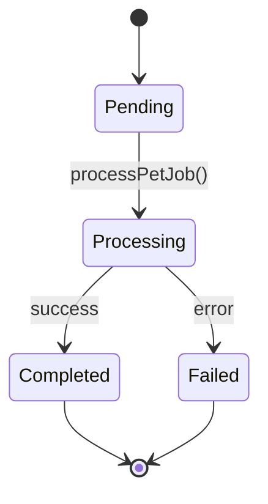
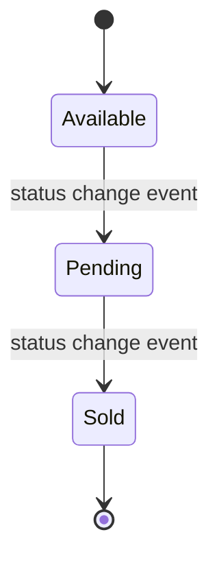
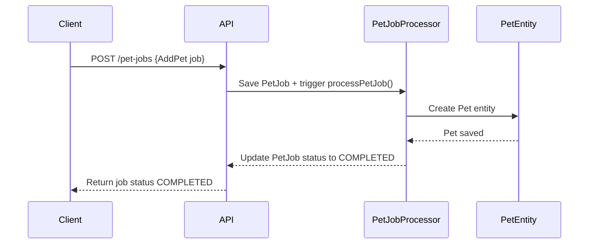

### 1. Entity Definitions

``` 
PetJob:  
- id: String (unique identifier for the job)  
- type: String (type of job, e.g., "AddPet", "UpdatePetStatus")  
- payload: JSON (data related to the job, e.g., pet details)  
- status: StatusEnum (PENDING, PROCESSING, COMPLETED, FAILED)  

Pet:  
- id: String (unique pet identifier)  
- name: String (pet's name)  
- category: String (pet category/type, e.g., cat, dog)  
- status: StatusEnum (AVAILABLE, PENDING, SOLD)  
- tags: List<String> (descriptive tags for the pet)  
- photoUrls: List<String> (links to pet photos)  
```

### 2. Process Method Flows

```
processPetJob() Flow:  
1. Initial State: PetJob created with PENDING status  
2. Validation: Verify job type and payload correctness  
3. Processing:  
   - If type = "AddPet", create a new Pet entity with AVAILABLE status  
   - If type = "UpdatePetStatus", create a new Pet entity state with updated status (immutable update)  
4. Completion: Update PetJob status to COMPLETED or FAILED  
5. Notification: Log the job result or send event downstream if needed  
```

```
processPet() Flow:  
1. Initial State: Pet entity persisted with status (AVAILABLE, PENDING, SOLD)  
2. Validation: Check mandatory fields (name, category)  
3. Processing: Trigger downstream processes such as indexing or notification (future scope)  
4. Completion: Confirm Pet entity saved successfully (read-only state)  
```

### 3. API Endpoints Design

- `POST /pet-jobs`  
  - Creates a PetJob (e.g., add pet or update pet status) triggering `processPetJob()`  
  - Request contains job type and payload  
- `GET /pets`  
  - Retrieves list of Pet entities and their current states  
- `GET /pets/{id}`  
  - Retrieves details of a specific Pet by ID  

### 4. Request/Response Formats

**POST /pet-jobs**  
Request:  
```json
{
  "type": "AddPet",  
  "payload": {  
    "name": "Whiskers",  
    "category": "cat",  
    "tags": ["cute", "small"],  
    "photoUrls": ["http://example.com/photo1.jpg"]  
  }
}
```  
Response:  
```json
{
  "id": "job-12345",  
  "status": "PENDING"
}
```

**GET /pets**  
Response:  
```json
[
  {
    "id": "pet-001",  
    "name": "Whiskers",  
    "category": "cat",  
    "status": "AVAILABLE",  
    "tags": ["cute", "small"],  
    "photoUrls": ["http://example.com/photo1.jpg"]
  }
]
```

---

### Mermaid Diagrams

**PetJob lifecycle state diagram**  

```mermaid
stateDiagram-v2
    [*] --> Pending
    Pending --> Processing : processPetJob()
    Processing --> Completed : success
    Processing --> Failed : error
    Completed --> [*]
    Failed --> [*]
```

**Pet lifecycle state diagram**  

```mermaid
stateDiagram-v2
    [*] --> Available
    Available --> Pending : status change event
    Pending --> Sold : status change event
    Sold --> [*]
```

**Event-driven processing chain for adding a pet**  

```mermaid
sequenceDiagram
    participant Client
    participant API
    participant PetJobProcessor
    participant PetEntity
    
    Client->>API: POST /pet-jobs {AddPet job}
    API->>PetJobProcessor: Save PetJob + trigger processPetJob()
    PetJobProcessor->>PetEntity: Create Pet entity
    PetEntity-->>PetJobProcessor: Pet saved
    PetJobProcessor-->>API: Update PetJob status to COMPLETED
    API-->>Client: Return job status COMPLETED
```

---

If you want, you may use this summary to describe your desired design:

```
I would like to have one orchestration entity named PetJob that handles adding and updating pets immutably. The business entity Pet stores pet details. POST /pet-jobs endpoints will create jobs which trigger processing to add or update pets. GET /pets endpoints will return current pet data. No updates or deletes, only new immutable states via POST jobs.
```

Please let me know if you need any further adjustments!