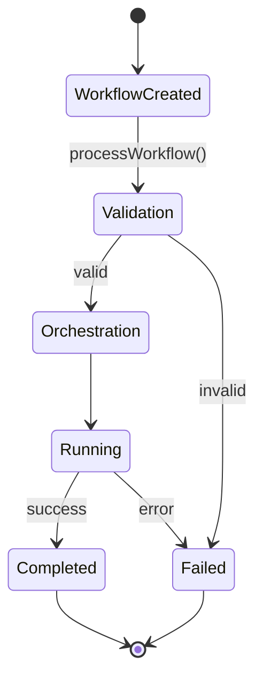
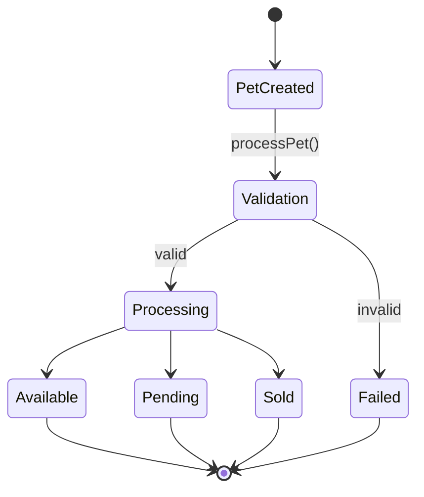
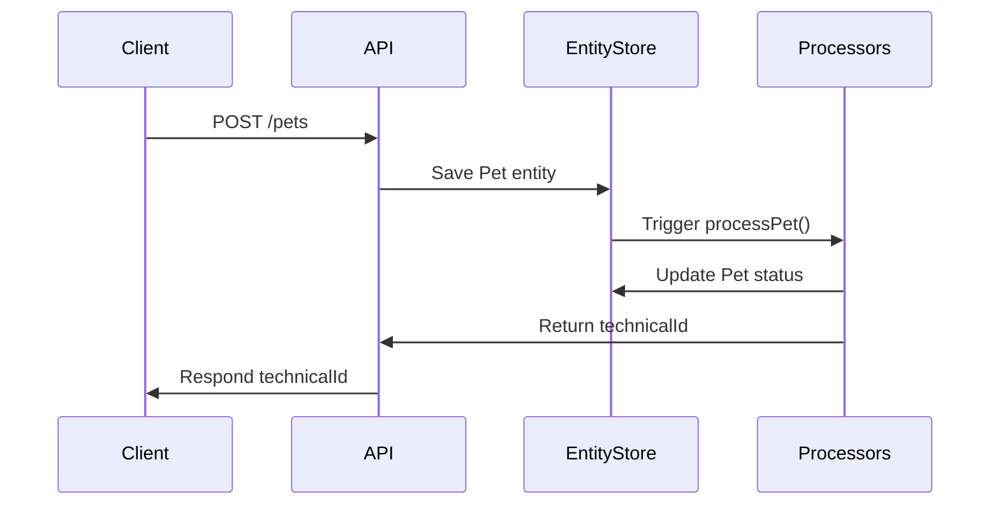

### 1. Entity Definitions

``` 
Workflow:
- name: String (Unique name of the workflow instance)
- description: String (Description of the workflow purpose)
- status: String (Current state of the workflow, e.g., PENDING, RUNNING, COMPLETED, FAILED)
- createdAt: String (Timestamp of creation)
- metadata: String (Optional additional info or JSON string for extensibility)

Pet:
- petId: String (Unique pet identifier from Petstore)
- name: String (Pet's name)
- category: String (Pet category, e.g., cat, dog)
- status: String (Pet availability status, e.g., AVAILABLE, PENDING, SOLD)
- tags: String (Comma-separated tags or labels)
- photoUrls: String (Comma-separated URLs of pet photos)
- createdAt: String (Timestamp when pet record created)

Order:
- orderId: String (Unique order identifier)
- petId: String (Associated pet's petId)
- quantity: Integer (Number of pets ordered)
- shipDate: String (Date/time when order is shipped)
- status: String (Order status, e.g., PLACED, APPROVED, DELIVERED)
- complete: Boolean (Order completion flag)
- createdAt: String (Timestamp of order creation)
```

---

### 2. Process Method Flows

```
processWorkflow() Flow:
1. Initial State: Workflow created with status = PENDING
2. Validation: Check workflow parameters and prerequisites
3. Orchestration: Trigger pet/order related processing events as per workflow logic
4. Update: Change workflow status to RUNNING during processing
5. Completion: Set status to COMPLETED or FAILED based on outcome
6. Notification: Optionally trigger events for downstream systems or log results

processPet() Flow:
1. Initial State: Pet entity created with status = AVAILABLE or as provided
2. Validation: Validate pet data (category, name, photoUrls)
3. Processing: Sync or enrich pet info with Petstore API data
4. Update: Set status to PENDING or SOLD based on business rules (e.g., adoption)
5. Completion: Finalize pet state and trigger any dependent workflows/orders

processOrder() Flow:
1. Initial State: Order created with status = PLACED
2. Validation: Check pet availability and order details
3. Processing: Reserve pet(s), update pet status to PENDING or SOLD
4. Shipping: Schedule or simulate shipping (update shipDate)
5. Completion: Mark order as APPROVED or DELIVERED
6. Notification: Trigger any post-order events (e.g., inventory update)
```

---

### 3. API Endpoints Design

| HTTP Method | Endpoint                  | Description                             | Request Body                | Response                   |
|-------------|---------------------------|-------------------------------------|----------------------------|----------------------------|
| POST        | /workflows                | Create new Workflow (triggers processWorkflow) | `{name, description, metadata}` | `{technicalId}`             |
| GET         | /workflows/{technicalId}  | Retrieve Workflow by technicalId    | n/a                        | Full Workflow entity       |

| POST        | /pets                     | Create Pet (triggers processPet)    | `{petId, name, category, status, tags, photoUrls}` | `{technicalId}`             |
| GET         | /pets/{technicalId}       | Retrieve Pet by technicalId          | n/a                        | Full Pet entity            |

| POST        | /orders                   | Create Order (triggers processOrder) | `{orderId, petId, quantity, shipDate, status, complete}` | `{technicalId}`             |
| GET         | /orders/{technicalId}     | Retrieve Order by technicalId         | n/a                        | Full Order entity          |

- No update or delete endpoints are provided.
- GET by conditions or GET all endpoints can be added later if explicitly requested.

---

### 4. Request/Response JSON Examples

**POST /pets request:**

```json
{
  "petId": "123",
  "name": "Whiskers",
  "category": "cat",
  "status": "AVAILABLE",
  "tags": "cute,small",
  "photoUrls": "http://example.com/photo1.jpg,http://example.com/photo2.jpg"
}
```

**POST /pets response:**

```json
{
  "technicalId": "abcde-12345"
}
```

**GET /pets/{technicalId} response:**

```json
{
  "petId": "123",
  "name": "Whiskers",
  "category": "cat",
  "status": "AVAILABLE",
  "tags": "cute,small",
  "photoUrls": "http://example.com/photo1.jpg,http://example.com/photo2.jpg",
  "createdAt": "2024-06-01T12:00:00Z"
}
```

---

### Visual Representations

**Workflow Entity Lifecycle**


```mermaid
stateDiagram-v2
    [*] --> WorkflowCreated
    WorkflowCreated --> Validation : processWorkflow()
    Validation --> Orchestration : valid
    Validation --> Failed : invalid
    Orchestration --> Running
    Running --> Completed : success
    Running --> Failed : error
    Completed --> [*]
    Failed --> [*]
```

**Pet Entity Lifecycle**


```mermaid
stateDiagram-v2
    [*] --> PetCreated
    PetCreated --> Validation : processPet()
    Validation --> Processing : valid
    Validation --> Failed : invalid
    Processing --> Available
    Processing --> Pending
    Processing --> Sold
    Available --> [*]
    Pending --> [*]
    Sold --> [*]
    Failed --> [*]
```

**Event-Driven Processing Chain**


```mermaid
sequenceDiagram
    participant Client
    participant API
    participant EntityStore
    participant Processors

    Client->>API: POST /pets
    API->>EntityStore: Save Pet entity
    EntityStore->>Processors: Trigger processPet()
    Processors->>EntityStore: Update Pet status
    Processors->>API: Return technicalId
    API->>Client: Respond technicalId
```

---

This completes the finalized functional requirements for the "Purrfect Pets" backend application using Event-Driven Architecture on Cyoda platform. Please let me know if you need any further elaboration or adjustments!