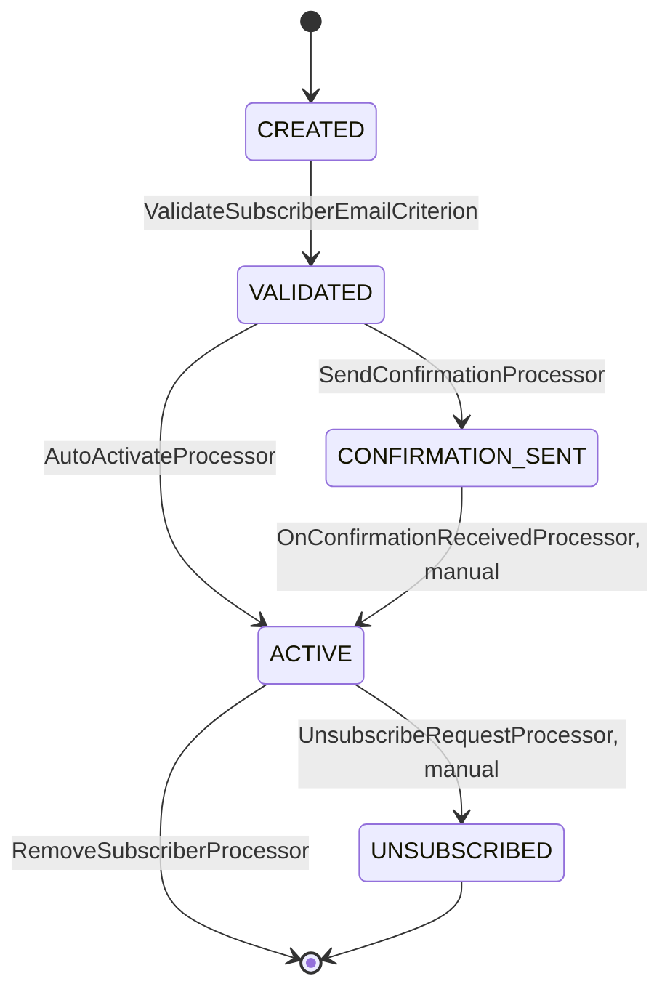
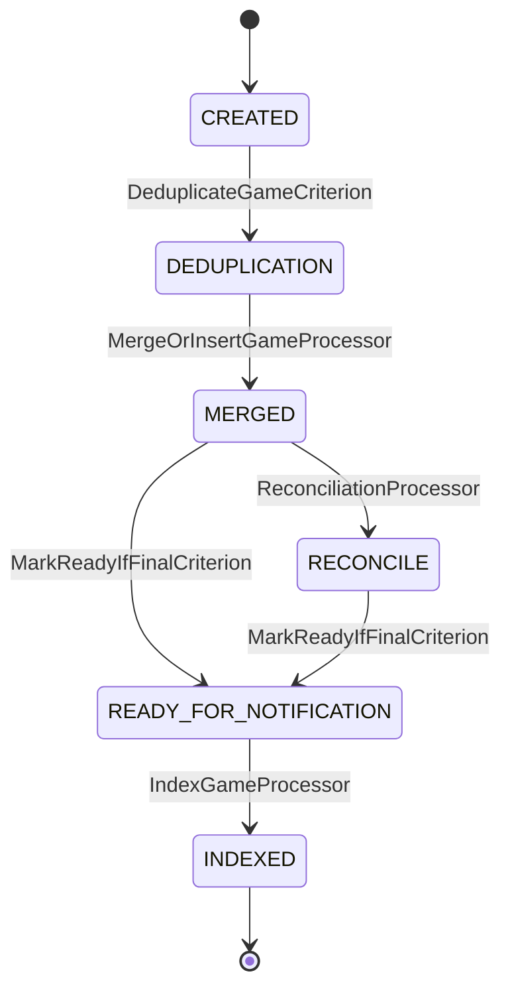
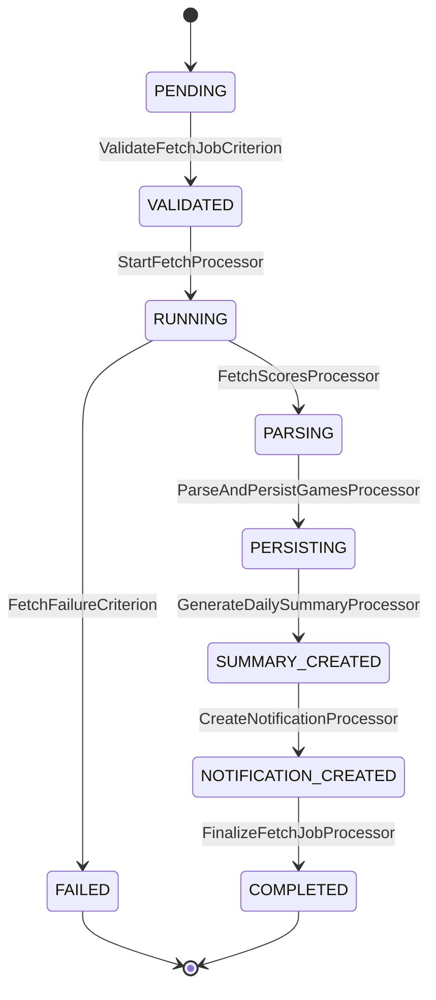
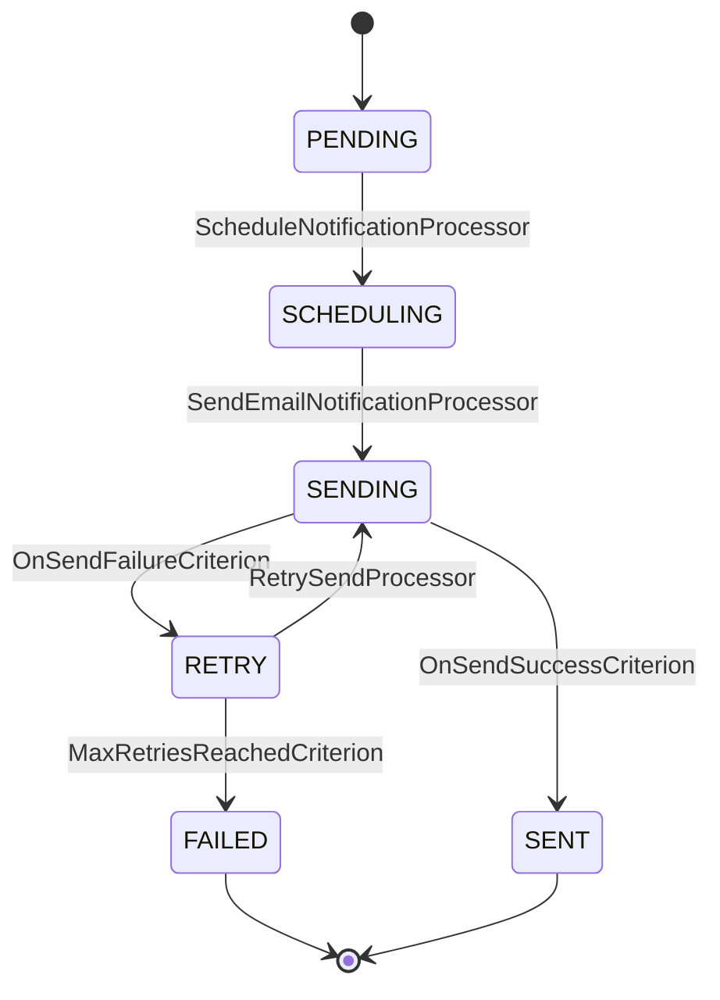
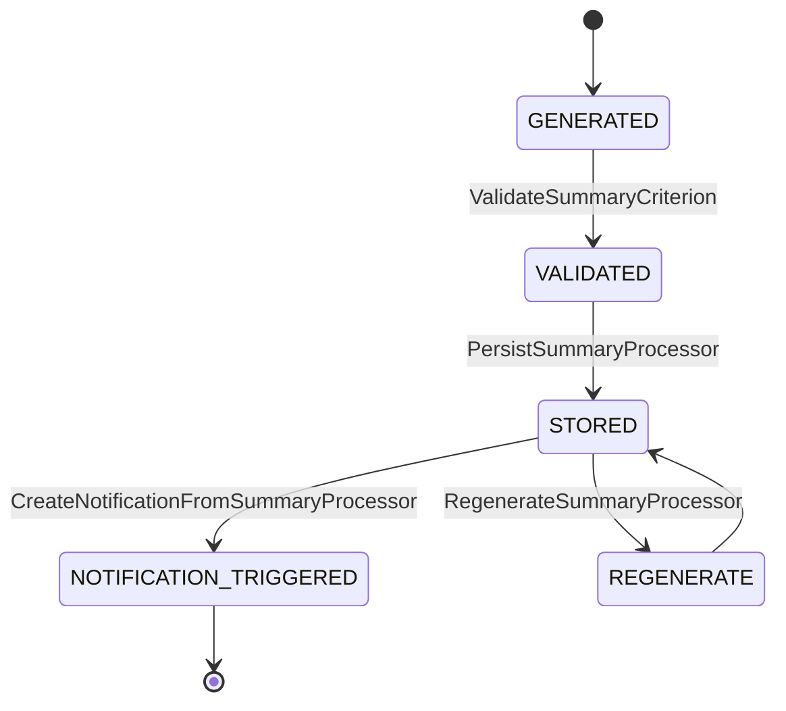
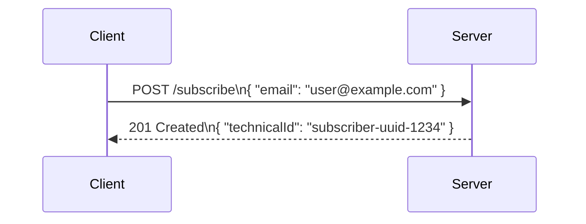
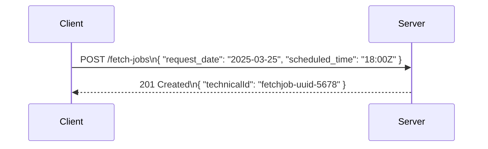
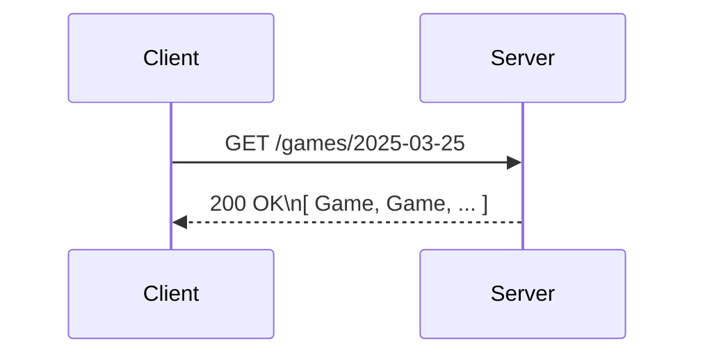
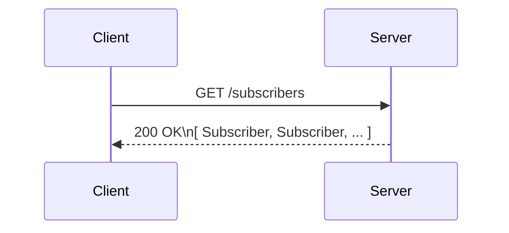
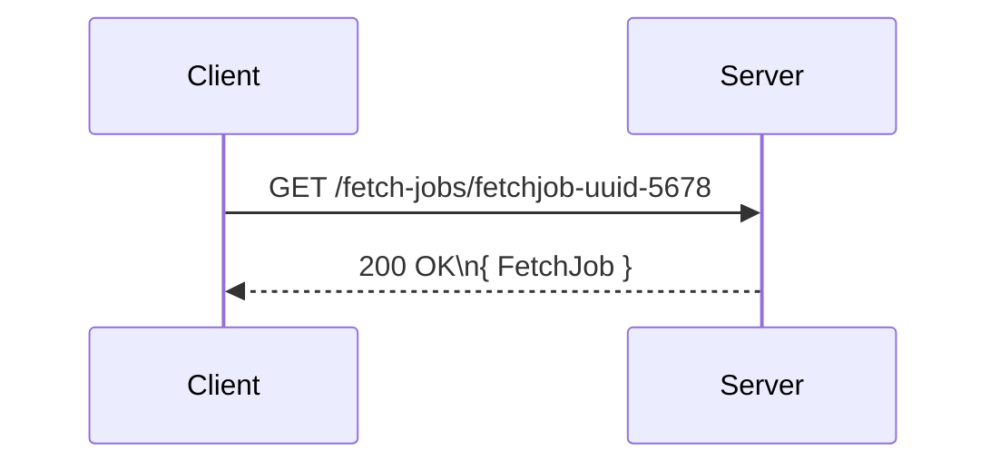

### Entity Definitions
(Max 10 entities allowed — user did not explicitly list entities so the following 6 entities are defined based on provided requirements.)

```
Subscriber:
- email: String (subscriber email address)
- subscribed_at: String (ISO-8601 timestamp when subscription was created)
- status: String (subscriber status such as active or unsubscribed)
- preferences: JSON (optional preferences, e.g., preferred_time, timezone, notification_format)
- confirmed: Boolean (whether subscription confirmation completed)
- last_notification_at: String (ISO-8601 timestamp of last notification sent)

Game:
- game_id: String (external identifier from sportsdata.io or generated if absent)
- date: String (YYYY-MM-DD) (game date)
- home_team: String (home team name)
- away_team: String (away team name)
- home_score: Integer (home team score)
- away_score: Integer (away team score)
- status: String (game state such as final, scheduled, in_progress)
- venue: String (venue name)
- league: String (league identifier, e.g., NBA)
- raw_payload: JSON (full raw payload from external API)
- last_updated: String (ISO-8601 timestamp of last update persisted)

FetchJob:
- request_date: String (YYYY-MM-DD) (the today parameter sent to API)
- scheduled_time: String (time when job was scheduled or triggered, e.g., 18:00Z)
- status: String (PENDING, RUNNING, COMPLETED, FAILED)
- started_at: String (ISO-8601 timestamp)
- completed_at: String (ISO-8601 timestamp)
- fetched_count: Integer (number of games fetched)
- failed_count: Integer (number of failed game parses/stores)
- response_payload: JSON (raw response from external API)
- error_message: String (error details if failed)

Notification:
- date: String (YYYY-MM-DD) (date the notification summarizes)
- summary_text: String (text content of the email summary)
- recipients_count: Integer (number of subscribers targeted)
- sent_at: String (ISO-8601 timestamp when notification was sent)
- status: String (pending, sending, sent, failed)
- payload: JSON (email payload or structured summary)
- attempt_count: Integer (number of send attempts)

DailySummary:
- date: String (YYYY-MM-DD)
- games_summary: JSON (array of per-game summary objects)
- generated_at: String (ISO-8601 timestamp)
- source_fetch_job_id: String (FetchJob request_date or technical reference)
- summary_id: String (domain id for the summary)
```

---

## 1. Entity workflows

Notes:
- Each entity add operation is modeled as an EVENT that triggers automated processing.
- When an entity is persisted, Cyoda starts the entity workflow invoking processors (actions) and criteria (conditions).
- Processors and criteria below are named as Java-like classes (Criterion and Processor). Pseudo-code snippets follow each entity workflow.

---

Subscriber workflow:
1. Initial State: Subscriber persisted with status = active (or pending if confirmation required).
2. Validation: Validate email format and uniqueness.
3. Confirmation (automatic optional): If preferences.require_confirmation = true → send confirmation email.
4. Activation: On confirmation (manual or automatic) → set confirmed = true; status remains active.
5. Added to Notification List: System ensures subscriber is marked active for future Notification sends.
6. Manual Unsubscribe: User can trigger status change to unsubscribed.
7. Cleanup: When unsubscribed → stop scheduling notifications for this subscriber.

Mermaid state diagram for Subscriber:

```mermaid
stateDiagram-v2
    [*] --> CREATED
    CREATED --> VALIDATED : ValidateSubscriberEmailCriterion
    VALIDATED --> CONFIRMATION_SENT : SendConfirmationProcessor
    VALIDATED --> ACTIVE : AutoActivateProcessor
    CONFIRMATION_SENT --> ACTIVE : OnConfirmationReceivedProcessor, manual
    ACTIVE --> UNSUBSCRIBED : UnsubscribeRequestProcessor, manual
    ACTIVE --> [*] : RemoveSubscriberProcessor
    UNSUBSCRIBED --> [*]
```

Subscriber criteria and processors:
- ValidateSubscriberEmailCriterion
  - checks email regex and uniqueness in datastore.
- SendConfirmationProcessor
  - sends confirmation email asynchronously.
  - pseudo:
    - void process(Subscriber s) { enqueueEmail(to=s.email, template=confirmation); }
- AutoActivateProcessor
  - sets confirmed=true if confirmation not required.
- OnConfirmationReceivedProcessor
  - invoked when confirmation event received (manual external event).
- UnsubscribeRequestProcessor
  - marks status=unsubscribed, records unsubscribed_at.

---

Game workflow:
1. Initial State: Game record persisted (created by FetchJob processing).
2. Deduplication: Check existing game by game_id and date.
3. Merge/Update: If exists → update scores/status and last_updated.
4. Finalization: If status == final → mark ready_for_notification.
5. Indexing: Make game available via GET endpoints.
6. Reconciliation: If same game later re-fetched with different data → update and flag summary regen required.

Mermaid state diagram for Game:

```mermaid
stateDiagram-v2
    [*] --> CREATED
    CREATED --> DEDUPLICATION : DeduplicateGameCriterion
    DEDUPLICATION --> MERGED : MergeOrInsertGameProcessor
    MERGED --> READY_FOR_NOTIFICATION : MarkReadyIfFinalCriterion
    READY_FOR_NOTIFICATION --> INDEXED : IndexGameProcessor
    MERGED --> RECONCILE : ReconciliationProcessor
    RECONCILE --> READY_FOR_NOTIFICATION : MarkReadyIfFinalCriterion
    INDEXED --> [*]
```

Game criteria and processors:
- DeduplicateGameCriterion
  - checks if game_id exists for same date.
- MergeOrInsertGameProcessor
  - pseudo:
    - void process(Game g) {
        existing = repo.findByGameId(g.game_id);
        if (existing == null) repo.insert(g);
        else repo.updateFields(existing, g);
      }
- MarkReadyIfFinalCriterion
  - if g.status equals final then mark a flag for notification.
- IndexGameProcessor
  - ensures GET /games endpoints will return updated data.
- ReconciliationProcessor
  - logs differences and increases fetched_count.failed_count if parse failures.

---

FetchJob workflow (orchestration entity - POST endpoint available):
1. Initial State: FetchJob created (PENDING) either by Scheduler or manual POST /fetch-jobs.
2. Validation: Check request_date format YYYY-MM-DD and rate limits.
3. Execution: Run FetchScoresProcessor — call external API asynchronously.
4. Parse: Parse API response into Game entities.
5. Persist: Persist Game entities (each persistence triggers Game workflow).
6. Summary: Generate DailySummary entity for the request_date.
7. Notification: Create Notification entity (status = pending) and trigger Notification workflow.
8. Completion: Update FetchJob status to COMPLETED or FAILED and record metrics.

Mermaid state diagram for FetchJob:

```mermaid
stateDiagram-v2
    [*] --> PENDING
    PENDING --> VALIDATED : ValidateFetchJobCriterion
    VALIDATED --> RUNNING : StartFetchProcessor
    RUNNING --> PARSING : FetchScoresProcessor
    PARSING --> PERSISTING : ParseAndPersistGamesProcessor
    PERSISTING --> SUMMARY_CREATED : GenerateDailySummaryProcessor
    SUMMARY_CREATED --> NOTIFICATION_CREATED : CreateNotificationProcessor
    NOTIFICATION_CREATED --> COMPLETED : FinalizeFetchJobProcessor
    RUNNING --> FAILED : FetchFailureCriterion
    FAILED --> [*]
    COMPLETED --> [*]
```

FetchJob criteria and processors:
- ValidateFetchJobCriterion
  - ensures request_date format YYYY-MM-DD, ensures scheduled_time valid.
- StartFetchProcessor
  - marks started_at and status RUNNING.
- FetchScoresProcessor
  - pseudo:
    - void process(FetchJob job) {
        String endpoint = "GET https://api.sportsdata.io/v3/nba/scores/json/ScoresBasicFinal/{today}?key=test";
        endpoint = endpoint.replace("{today}", job.request_date);
        HttpResponse r = httpClient.get(endpoint) // async
        job.response_payload = r.body;
        repo.save(job);
      }
  - MUST call exactly: GET https://api.sportsdata.io/v3/nba/scores/json/ScoresBasicFinal/{today}?key=test (today = YYYY-MM-DD)
  - asynchronous handling required.
- ParseAndPersistGamesProcessor
  - pseudo:
    - void process(FetchJob job) {
        parsedGames = parse(job.response_payload);
        for each g in parsedGames {
          gameRepo.save(g); // persistence will trigger Game workflow
        }
      }
- GenerateDailySummaryProcessor
  - builds DailySummary.games_summary from persisted Game records for request_date.
- CreateNotificationProcessor
  - creates Notification entity (status pending) and increments job.fetched_count.
- FinalizeFetchJobProcessor
  - sets completed_at, status COMPLETED, records fetched_count and failed_count.
- FetchFailureCriterion
  - triggers if HTTP status not 200 or exception occurs — marks job FAILED and captures error_message.

Note: FetchJob is an orchestration entity — a POST endpoint should exist to create a FetchJob manually, and GET by technicalId must be available per API rules.

---

Notification workflow:
1. Initial State: Notification created (pending) after DailySummary is available.
2. Schedule Send: Notification picks active Subscribers from Subscriber list.
3. Send Attempt: SendEmailNotificationProcessor attempts to send emails (batch or individualized).
4. Retry: On failure, retry up to 3 times with backoff.
5. Completion: On success → status = sent and sent_at recorded.
6. Failure: After retries exhausted → status = failed and error logged.

Mermaid state diagram for Notification:

```mermaid
stateDiagram-v2
    [*] --> PENDING
    PENDING --> SCHEDULING : ScheduleNotificationProcessor
    SCHEDULING --> SENDING : SendEmailNotificationProcessor
    SENDING --> SENT : OnSendSuccessCriterion
    SENDING --> RETRY : OnSendFailureCriterion
    RETRY --> SENDING : RetrySendProcessor
    RETRY --> FAILED : MaxRetriesReachedCriterion
    FAILED --> [*]
    SENT --> [*]
```

Notification criteria and processors:
- ScheduleNotificationProcessor
  - gathers active Subscribers (status == active and confirmed == true).
- SendEmailNotificationProcessor
  - pseudo:
    - void process(Notification n) {
        recipients = subscriberRepo.findActive();
        for batch in chunk(recipients) {
          mailClient.send(batch, n.summary_text);
        }
        n.recipients_count = recipients.size();
      }
  - implement asynchronous sending and update attempt_count.
- OnSendFailureCriterion
  - checks send result; if partial/total failure → mark for retry.
- RetrySendProcessor
  - implements retry logic up to 3 times; backoff schedule.
- MaxRetriesReachedCriterion
  - after attempt_count >= 3 mark FAILED.

---

DailySummary workflow:
1. Initial State: DailySummary created by FetchJob after games persisted.
2. Validation: Ensure games_summary not empty (if policy require at least one game).
3. Store: Persist summary and link to source FetchJob.
4. Trigger Notification: Create Notification entity for this summary.
5. Update: If games later change (reconciliation) → regenerate summary and update Notification if needed.

Mermaid state diagram for DailySummary:

```mermaid
stateDiagram-v2
    [*] --> GENERATED
    GENERATED --> VALIDATED : ValidateSummaryCriterion
    VALIDATED --> STORED : PersistSummaryProcessor
    STORED --> NOTIFICATION_TRIGGERED : CreateNotificationFromSummaryProcessor
    NOTIFICATION_TRIGGERED --> [*]
    STORED --> REGENERATE : RegenerateSummaryProcessor
    REGENERATE --> STORED
```

DailySummary criteria and processors:
- ValidateSummaryCriterion
  - ensures correct date format, non-empty summary if required.
- PersistSummaryProcessor
  - saves summary with generated_at timestamp.
- CreateNotificationFromSummaryProcessor
  - creates Notification entity and sets status pending.
- RegenerateSummaryProcessor
  - re-queries games for date and rebuilds summary.

---

## 2. Required Criterion and Processor Class List (summary)
- ValidateSubscriberEmailCriterion
- SendConfirmationProcessor
- AutoActivateProcessor
- OnConfirmationReceivedProcessor
- UnsubscribeRequestProcessor

- DeduplicateGameCriterion
- MergeOrInsertGameProcessor
- MarkReadyIfFinalCriterion
- IndexGameProcessor
- ReconciliationProcessor

- ValidateFetchJobCriterion
- StartFetchProcessor
- FetchScoresProcessor
- ParseAndPersistGamesProcessor
- GenerateDailySummaryProcessor
- CreateNotificationProcessor
- FinalizeFetchJobProcessor
- FetchFailureCriterion

- ScheduleNotificationProcessor
- SendEmailNotificationProcessor
- OnSendSuccessCriterion
- OnSendFailureCriterion
- RetrySendProcessor
- MaxRetriesReachedCriterion

- ValidateSummaryCriterion
- PersistSummaryProcessor
- CreateNotificationFromSummaryProcessor
- RegenerateSummaryProcessor

(Processor pseudo-code examples provided inline in each workflow section above.)

---

## 3. API Endpoints (Design Rules applied)

Rules applied:
- POST endpoints create entities and must return only entity technicalId.
- GET endpoints for retrieving stored application results.
- GET by technicalId must be present for all entities created via POST endpoints (Subscriber and FetchJob in this design).
- GET by non-technical fields included only if explicitly requested by user (we include GET /games/{date} as per original requirements).
- POST endpoints used for orchestration entity (FetchJob) and subscription (business action).

Endpoints list (include original ones and required GET-by-id endpoints):

- POST /subscribe
  - Purpose: create Subscriber entity (triggers Subscriber workflow).
  - Request Body: { "email": "user@example.com" }
  - Response: { "technicalId": "generated-uuid-or-id" }

- GET /subscribers
  - Purpose: retrieve list of all subscribed email addresses and minimal data.
  - Response: [ { "email": "user@example.com", "status": "active", "subscribed_at":"2025-03-25T18:00:00Z" }, ... ]

- GET /subscriber/{technicalId}
  - Purpose: retrieve subscriber by technicalId (required for POST-created entities)
  - Response: full Subscriber JSON (as stored)

- GET /games/all
  - Purpose: retrieve all NBA games stored (optional filtering/pagination)
  - Response: [ Game, Game, ... ] with fields as defined

- GET /games/{date}
  - Purpose: retrieve all NBA games for a specific date (date format YYYY-MM-DD)
  - Response: [ Game, Game, ... ]

- POST /fetch-jobs
  - Purpose: create a FetchJob (manual trigger) — orchestration entity that will run the fetch → parse → persist → summary → notification workflow.
  - Request Body:
    - { "request_date": "2025-03-25", "scheduled_time": "18:00Z" } 
      - request_date format must be YYYY-MM-DD
  - Response:
    - { "technicalId": "fetchjob-uuid" }

- GET /fetch-jobs/{technicalId}
  - Purpose: retrieve FetchJob by technicalId and see status, counts, logs.
  - Response: full FetchJob JSON (as stored)

Notes:
- The system will also run an automatic scheduled FetchJob everyday at a specified time (e.g., 6:00 PM UTC / 18:00Z) without requiring an API call. The Scheduler creates a FetchJob entity automatically (this creation triggers the FetchJob workflow).

---

## 4. Request/Response Formats (JSON) and Mermaid visualization

POST /subscribe
- Request:
  - { "email": "user@example.com" }
- Response:
  - { "technicalId": "subscriber-uuid-1234" }

Visualized with Mermaid sequence (request/response):

```mermaid
sequenceDiagram
    participant Client
    participant Server
    Client->>Server: POST /subscribe\n{ "email": "user@example.com" }
    Server-->>Client: 201 Created\n{ "technicalId": "subscriber-uuid-1234" }
```

POST /fetch-jobs (manual run)
- Request:
  - { "request_date": "2025-03-25", "scheduled_time": "18:00Z" }
- Response:
  - { "technicalId": "fetchjob-uuid-5678" }

Visualized with Mermaid sequence:

```mermaid
sequenceDiagram
    participant Client
    participant Server
    Client->>Server: POST /fetch-jobs\n{ "request_date": "2025-03-25", "scheduled_time": "18:00Z" }
    Server-->>Client: 201 Created\n{ "technicalId": "fetchjob-uuid-5678" }
```

GET /games/{date}
- Example request: GET /games/2025-03-25
- Response:
  - [ { "game_id": "game-1", "date":"2025-03-25", "home_team":"LAL", "away_team":"BKN", "home_score":120, "away_score":115, "status":"final", "venue":"Staples Center", "raw_payload": {...} }, ... ]

Visualized with Mermaid sequence:

```mermaid
sequenceDiagram
    participant Client
    participant Server
    Client->>Server: GET /games/2025-03-25
    Server-->>Client: 200 OK\n[ Game, Game, ... ]
```

GET /subscribers
- Response:
  - [ { "email":"user@example.com", "status":"active", "subscribed_at":"2025-03-25T17:00:00Z" }, ... ]

Visualized with Mermaid sequence:

```mermaid
sequenceDiagram
    participant Client
    participant Server
    Client->>Server: GET /subscribers
    Server-->>Client: 200 OK\n[ Subscriber, Subscriber, ... ]
```

GET /fetch-jobs/{technicalId}
- Response:
  - { "request_date": "2025-03-25", "status":"COMPLETED", "fetched_count": 15, "failed_count": 0, "started_at":"2025-03-25T18:00:05Z", "completed_at":"2025-03-25T18:00:30Z", "response_payload": {...} }

Visualized with Mermaid sequence:

```mermaid
sequenceDiagram
    participant Client
    participant Server
    Client->>Server: GET /fetch-jobs/fetchjob-uuid-5678
    Server-->>Client: 200 OK\n{ FetchJob }
```

---

## 5. Scheduler behavior (automatic orchestration)
- A background scheduler will create a FetchJob automatically every day at a specified time (for example, 6:00 PM UTC).
- Scheduler creates a FetchJob entity (request_date = todaysDate in YYYY-MM-DD, scheduled_time = 18:00Z). Creation of this entity triggers the FetchJob workflow automatically.
- The FetchJob workflow will:
  1. Call GET https://api.sportsdata.io/v3/nba/scores/json/ScoresBasicFinal/{today}?key=test (today substituted with YYYY-MM-DD) asynchronously.
  2. Parse response and persist Game entities (each Game persistence triggers Game workflow).
  3. Generate DailySummary for the date.
  4. Create Notification entity and execute Notification workflow to send emails to all subscribers.

Exact external API to call (must be used by FetchScoresProcessor):
GET https://api.sportsdata.io/v3/nba/scores/json/ScoresBasicFinal/{today}?key=test
- The today parameter will follow the format YYYY-MM-DD (e.g., 2025-03-25).
- The system should handle the request and response asynchronously.

---

## 6. Event-driven notes and recommended filters/triggers
- Persisting a Subscriber entity (POST /subscribe or via internal process) is an EVENT that triggers:
  - ValidateSubscriberEmailCriterion
  - SendConfirmationProcessor (if confirmation required)
  - Add to notification list (ScheduleNotificationProcessor will pick active subscribers)
- Persisting a Game entity is an EVENT that triggers:
  - DeduplicateGameCriterion
  - MergeOrInsertGameProcessor
  - If status=final -> MarkReadyIfFinalCriterion which leads to summary generation readiness
- Creating a FetchJob entity is an EVENT that triggers:
  - FetchScoresProcessor -> ParseAndPersistGamesProcessor -> GenerateDailySummaryProcessor -> CreateNotificationProcessor
- Creating a DailySummary entity is an EVENT that triggers:
  - CreateNotificationFromSummaryProcessor
- Creating a Notification entity is an EVENT that triggers:
  - SendEmailNotificationProcessor (with retry logic up to 3 attempts)

---

Please review the generated entities and workflows. If you need any changes, please let me know. Feel free to click Approve if this requirement meets your expectations or if you are ready to proceed.