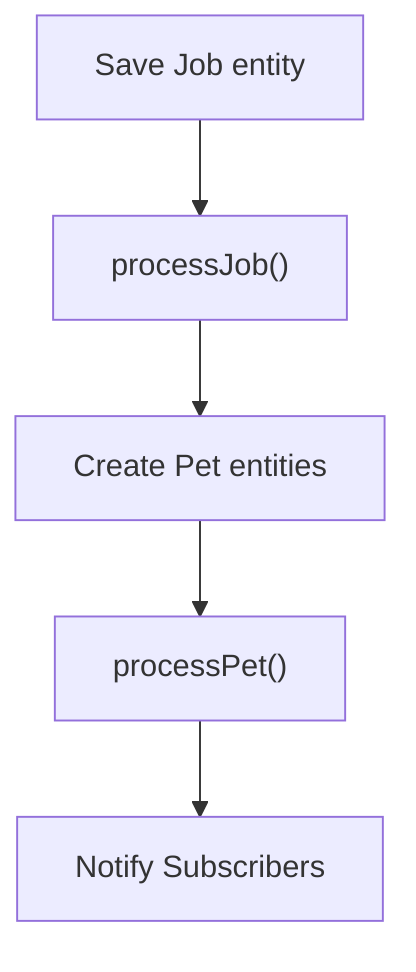

### 1. Entity Definitions

```
Job:
- jobId: String (unique identifier for the scheduled task)
- scheduleDetails: String (information about timing or frequency)
- status: String (current state of the job: PENDING, COMPLETED, FAILED)

Pet:
- id: String (unique pet identifier from Petstore API)
- name: String (pet's name)
- species: String (species/type of the pet)
- status: String (current status, e.g., available, sold)

Subscriber:
- email: String (subscriber's contact email)
- preferredPetTypes: String (comma-separated list of pet species the subscriber wants updates about)
```

---

### 2. Process Method Flows

```
processJob() Flow:
1. Initial State: Job created with status PENDING
2. Validation: Check scheduleDetails format and completeness
3. Processing:
   - Ingest pet data from Petstore API
   - For each new Pet entity created, trigger processPet event
   - Trigger processors to send notifications to Subscribers matching pet species
4. Completion: Update Job status to COMPLETED or FAILED based on outcome
5. Notification: Optionally notify system/admin of job result

processPet() Flow:
1. Validation: Run checkPetStatus to ensure the pet status is valid
2. Persistence: Save Pet entity immutably
3. Post-processing: Optionally invoke processors for logging or analytics

processSubscriber() Flow:
1. Validation: Ensure email format is valid and preferredPetTypes is provided
2. Persistence: Save Subscriber entity immutably
3. Post-processing: Optionally send welcome notification or confirmation
```

---

### 3. API Endpoints Design

- **POST /jobs**
  - Creates a new Job entity to trigger pet data ingestion and notifications.
  - Returns: `{ "technicalId": "..." }`

- **GET /jobs/{technicalId}**
  - Retrieves Job entity and its status.

- **GET /pets/{technicalId}**
  - Retrieves Pet entity details.

- **GET /subscribers/{technicalId}**
  - Retrieves Subscriber details.

- **POST /subscribers**
  - Creates a Subscriber entity.
  - Returns: `{ "technicalId": "..." }`

*Note:* Pet entities are created internally during Job processing; no POST endpoint for Pets.

---

### 4. Request/Response Formats

**POST /jobs** Request Example:
```json
{
  "scheduleDetails": "Every day at 10:00 AM",
  "status": "PENDING"
}
```

Response:
```json
{
  "technicalId": "job-12345"
}
```

**POST /subscribers** Request Example:
```json
{
  "email": "user@example.com",
  "preferredPetTypes": "cat,dog"
}
```

Response:
```json
{
  "technicalId": "sub-67890"
}
```

**GET /pets/{technicalId}** Response Example:
```json
{
  "id": "pet-001",
  "name": "Whiskers",
  "species": "cat",
  "status": "available"
}
```

---

### 5. Mermaid Diagram: Event-Driven Processing Chain


```mermaid
graph TD
  JobCreation["Save Job entity"]
  JobProcess["processJob()"]
  PetIngest["Create Pet entities"]
  PetProcess["processPet()"]
  SubscriberNotify["Notify Subscribers"]
  
  JobCreation --> JobProcess
  JobProcess --> PetIngest
  PetIngest --> PetProcess
  PetProcess --> SubscriberNotify
```
