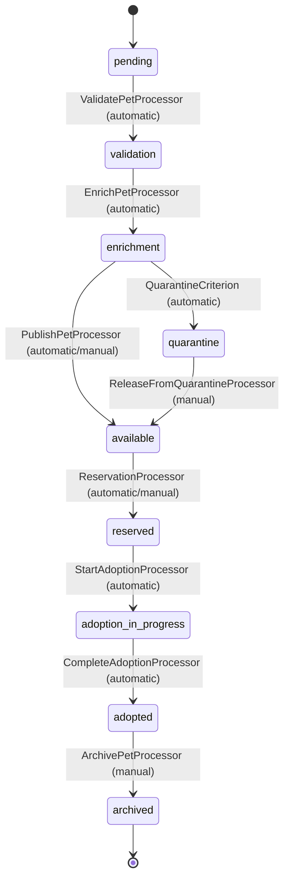
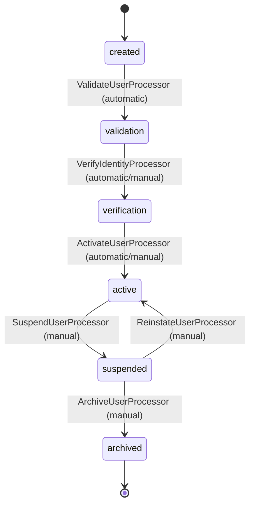
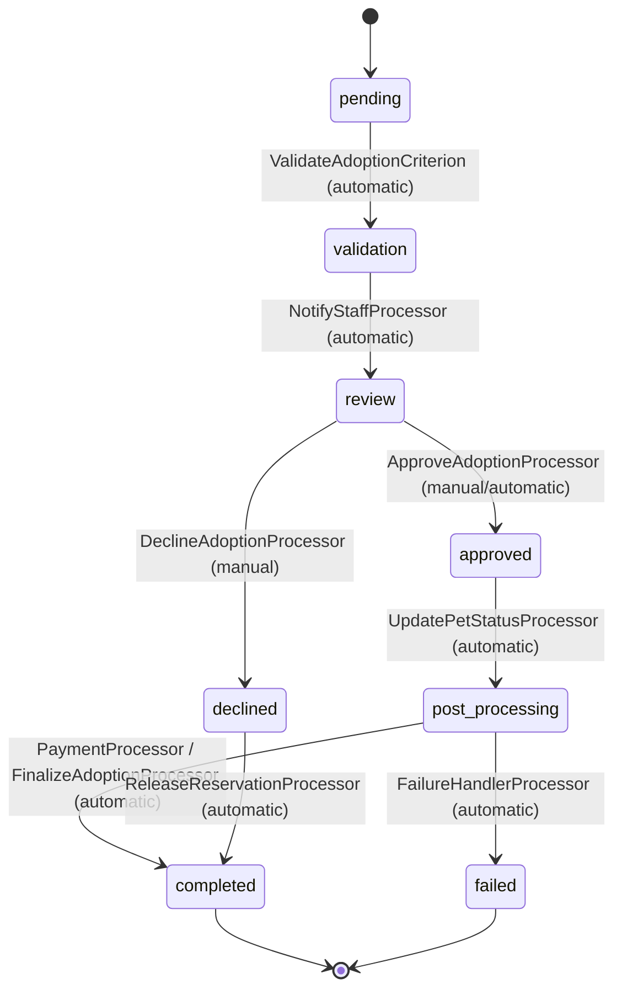

# Functional Requirements

This document describes the entities, workflows, processors, criteria and API design for the Pet Adoption prototype. It updates and harmonizes status names, fields and behavior so the functional logic is consistent and implementable.

---

## 1. Entity Definitions

All timestamps use ISO 8601 strings. Enum-like fields use lowercase values unless otherwise noted.

### Pet

- id: String (domain id)
- externalId: String (id from Petstore API if applicable)
- name: String (pet name)
- species: String (dog/cat/etc)
- breed: String (breed description)
- ageMonths: Integer (age in months)
- ageCategory: String (computed, e.g., puppy/young/adult/senior)
- sex: String (m/f/unknown)
- size: String (small/medium/large)
- color: String (description)
- description: String (free text)
- status: String (one of: pending, available, reserved, adoption_in_progress, adopted, quarantine, archived)
- reservedByUserId: String (user id who reserved the pet, null otherwise)
- reservedUntil: String (ISO timestamp for reservation expiration, optional)
- photos: Array of String (URLs)
- arrivalDate: String (ISO date)
- source: String (petstore/manual/shelter)
- adoptedByUserId: String (user id if adopted)
- healthRecords: Array of String (references)
- createdAt: String (ISO timestamp)
- updatedAt: String (ISO timestamp)

Notes:
- Default maximum photos: 8 (see PhotoLimitCriterion)
- status values are lowercase and canonical. Use these exact strings across processors and criteria.

### User

- id: String (domain id)
- name: String (full name)
- email: String (contact email)
- phone: String (contact phone)
- role: String (customer/admin/shelter_staff)
- address: String (postal address)
- favorites: Array of String (pet ids)
- status: String (one of: created, validation, verification, active, suspended, archived)
- createdAt: String (ISO timestamp)
- updatedAt: String (ISO timestamp)

Notes:
- The user.status field is required because many criteria check user.status (for example adoption eligibility requires active users).

### AdoptionJob

- id: String (domain id)
- technicalId: String (external technical id returned by POST endpoint)
- petId: String (target pet id)
- userId: String (requesting user id)
- requestType: String (adoption/reservation)
- requestedAt: String (ISO timestamp)
- status: String (one of: pending, validation, review, approved, declined, post_processing, completed, failed)
- decisionBy: String (staff/admin id)
- processedAt: String (ISO timestamp)
- fee: Number (adoption fee)
- notes: String (free text for staff)
- resultDetails: String (optional summary)

Notes:
- The job.status is the orchestration state and should be used to track lifecycle of the request.

---

## 2. Entity Workflows

All workflows below use the canonical lowercase status strings defined above.

### Pet workflow (high-level)

1. Initial State: Pet created (e.g., via PetSync ingestion or administrative action) with status = pending.
2. Validation: Automatic checks for required fields and photo limits.
3. Enrichment: Automatic enrichment (map externalId metadata, compute ageCategory).
4. Publish: Automatic or manual transition to available if criteria pass, or to quarantine if health checks require vet.
5. Reservation/Adoption transitions: reserved when reserved by a user; adoption_in_progress while adoption job processes; adopted when adoption completes; archived for removed pets.
6. Notifications: System notifies interested users on relevant status changes.

Mermaid state diagram (conceptual):


```mermaid
stateDiagram-v2
    [*] --> pending
    pending --> validation : ValidatePetProcessor (automatic)
    validation --> enrichment : EnrichPetProcessor (automatic)
    enrichment --> available : PublishPetProcessor (automatic/manual)
    enrichment --> quarantine : QuarantineCriterion (automatic)
    available --> reserved : ReservationProcessor (automatic/manual)
    reserved --> adoption_in_progress : StartAdoptionProcessor (automatic)
    adoption_in_progress --> adopted : CompleteAdoptionProcessor (automatic)
    adopted --> archived : ArchivePetProcessor (manual)
    quarantine --> available : ReleaseFromQuarantineProcessor (manual)
    archived --> [*]
```

#### Pet workflow processors (concise)

- ValidatePetProcessor
  - Checks required fields and photo count.
  - Sets updatedAt.
  - Throws a ValidationError when criteria fail.
- EnrichPetProcessor
  - Maps external metadata, computes ageCategory from ageMonths, appends source information to description when externalId present.
- PublishPetProcessor
  - Ensures criteria satisfied and sets status -> available; notifies feed/interested users.
- ReservationProcessor
  - Locks pet, verifies availability, sets status -> reserved and reservedByUserId and reservedUntil, updates updatedAt, persists and notifies.
- StartAdoptionProcessor / UpdatePetStatusProcessor
  - Moves pet to adoption_in_progress and later to adopted, sets adoptedByUserId when finalized.
- CompleteAdoptionProcessor
  - Finalizes adoption, persists final state and triggers post-adoption notifications.
- ArchivePetProcessor
  - Marks pet as archived and performs cleanup.

#### Pet criteria

- QuarantineCriterion
  - Returns true if healthRecords require a vet check (business rule: certain flags or missing vaccination records).
- PhotoLimitCriterion
  - Returns false (fail) if photos.length > MAX_PHOTOS (MAX_PHOTOS = 8).
- RequiredFieldsCriterion
  - Ensures name, species and initial status are present.


### User workflow (high-level)

1. Initial State: User created with status = created.
2. Validation: Automatic contact format checks, basic required fields.
3. Verification: Manual or automatic identity/contact verification (third-party checks optional).
4. Activation: Move to active after verification.
5. Suspension/Archive: Manual actions for fraud or inactivity; can be reinstated.

Mermaid state diagram (conceptual):


```mermaid
stateDiagram-v2
    [*] --> created
    created --> validation : ValidateUserProcessor (automatic)
    validation --> verification : VerifyIdentityProcessor (automatic/manual)
    verification --> active : ActivateUserProcessor (automatic/manual)
    active --> suspended : SuspendUserProcessor (manual)
    suspended --> active : ReinstateUserProcessor (manual)
    suspended --> archived : ArchiveUserProcessor (manual)
    archived --> [*]
```

#### User processors and criteria

- ValidateUserProcessor
  - Validates email/phone formats, required fields; updates timestamps.
- VerifyIdentityProcessor
  - Triggers manual verification or calls third-party identity providers.
- ActivateUserProcessor
  - Sets status to active and applies role-specific defaults/permissions.
- SuspendUserProcessor
  - Marks account suspended, records reason.

- UserContactVerifiedCriterion
  - True if email and/or phone have been validated.
- UserSanctionCheckCriterion
  - Check against blacklists/sanctions.


### AdoptionJob workflow (orchestration)

POST /jobs/adoption creates an AdoptionJob (status = pending) and starts orchestration.

High-level steps:
1. Initial State: AdoptionJob created with status = pending.
2. Validation: Automatic criterion checks (pet existence and status, user existence and status, duplicates).
3. Review: Automatic staff notification and optional manual review when rules require it.
4. Decision: Manual approve/decline by staff or automatic decision if rules permit.
5. Post-Decision Processing:
   - On approved: transition job to post_processing, update pet.status -> adoption_in_progress, charge/record fee, finalize adoption and set pet.adoptedByUserId -> userId, set job processedAt and status -> completed.
   - On declined: release any reservation, set job status -> completed (or declined->completed depending on policy), notify user.
6. Failure handling: set job.status -> failed and record resultDetails when errors occur.

Mermaid state diagram (conceptual):


```mermaid
stateDiagram-v2
    [*] --> pending
    pending --> validation : ValidateAdoptionCriterion (automatic)
    validation --> review : NotifyStaffProcessor (automatic) 
    review --> approved : ApproveAdoptionProcessor (manual/automatic)
    review --> declined : DeclineAdoptionProcessor (manual)
    approved --> post_processing : UpdatePetStatusProcessor (automatic)
    post_processing --> completed : PaymentProcessor / FinalizeAdoptionProcessor (automatic)
    declined --> completed : ReleaseReservationProcessor (automatic)
    post_processing --> failed : FailureHandlerProcessor (automatic)
    completed --> [*]
    failed --> [*]
```

#### AdoptionJob processors

- ValidateAdoptionCriterion
  - Ensures pet exists and user exists.
  - Ensures pet.status is one of: available, reserved.
  - If pet.status == reserved then reservedByUserId must match job.userId.
  - Ensures user.status == active.
  - Ensures there is no conflicting active AdoptionJob (see DuplicateRequestCriterion).

- DuplicateRequestCriterion
  - Returns true (fail) if there is an active/pending/review/post_processing job for the same pet by a different user or if multiple conflicting jobs exist.

- NotifyStaffProcessor
  - Creates staff work item(s) and sends notifications if manual review is required.

- ApproveAdoptionProcessor
  - Records decisionBy, decision timestamp and sets job.status -> approved.

- DeclineAdoptionProcessor
  - Records decisionBy, sets job.status -> declined and triggers ReleaseReservationProcessor.

- UpdatePetStatusProcessor / StartAdoptionProcessor
  - Acquires lock on pet, verifies still valid, sets pet.status -> adoption_in_progress and persists. If later finalized, sets pet.status -> adopted and adoptedByUserId.

- PaymentProcessor / FinalizeAdoptionProcessor
  - Attempts to charge the fee when required; on success marks job.processedAt and job.status -> completed; on failure triggers FailureHandlerProcessor.

- ReleaseReservationProcessor
  - Unlocks pet, clears reservedByUserId/reservedUntil and if appropriate sets status -> available.

- FailureHandlerProcessor
  - Sets job.status -> failed, stores resultDetails with error information and notifies admins.


---

## 3. Pseudocode for processors (updated and consistent)

Constants used in pseudocode:
- MAX_PHOTOS = 8

ValidatePetProcessor

```
class ValidatePetProcessor {
  process(pet) {
    if missing(pet.name) or missing(pet.species) then
      throw ValidationError("missing required pet fields")
    if pet.photos != null and pet.photos.length > MAX_PHOTOS then
      throw ValidationError("too many photos; max=" + MAX_PHOTOS)
    pet.updatedAt = now()
    persist(pet)
  }
}
```

EnrichPetProcessor

```
class EnrichPetProcessor {
  process(pet) {
    if (pet.externalId != null) {
      pet.description = (pet.description ?: "") + " Source: " + pet.source
    }
    pet.ageCategory = computeAgeCategory(pet.ageMonths)
    pet.updatedAt = now()
    persist(pet)
  }
}
```

ReservationProcessor

```
class ReservationProcessor {
  process(petId, userId, reservedUntilOptional) {
    pet = lockLoadPet(petId)
    if (pet == null) then throw NotFoundError
    if (pet.status != "available") then throw ConflictError("pet not available for reservation")
    pet.status = "reserved"
    pet.reservedByUserId = userId
    pet.reservedUntil = reservedUntilOptional ?: computeDefaultReservationExpiry()
    pet.updatedAt = now()
    persist(pet)
    notifyInterestedUsers(pet)
  }
}
```

ValidateAdoptionCriterion

```
class ValidateAdoptionCriterion {
  test(job) {
    pet = loadPet(job.petId)
    user = loadUser(job.userId)
    if pet == null or user == null then return false
    if user.status != "active" then return false
    if pet.status == "available" then return true
    if pet.status == "reserved" then return pet.reservedByUserId == job.userId
    return false
  }
}
```

UpdatePetStatusProcessor / StartAdoptionProcessor

```
class UpdatePetStatusProcessor {
  process(job) {
    pet = lockLoadPet(job.petId)
    if pet == null then throw NotFoundError

    // mark start of adoption
    pet.status = "adoption_in_progress"
    pet.updatedAt = now()
    persist(pet)

    // Payment and finalization happen in later processors
    // At finalization (e.g., after successful PaymentProcessor):
    pet.status = "adopted"
    pet.adoptedByUserId = job.userId
    pet.reservedByUserId = null
    pet.reservedUntil = null
    pet.updatedAt = now()
    persist(pet)
  }
}
```

NotifyStaffProcessor

```
class NotifyStaffProcessor {
  process(job) {
    createWorkItemForStaff(job)
    sendEmailToStaff(job)
  }
}
```

PaymentProcessor

```
class PaymentProcessor {
  process(job) {
    if job.fee > 0 then
      result = chargePayment(job.userId, job.fee)
      if not result.success then
        throw PaymentError(result.message)
    job.processedAt = now()
    persist(job)
  }
}
```

FailureHandlerProcessor

```
class FailureHandlerProcessor {
  process(job, error) {
    job.status = "failed"
    job.resultDetails = error.message
    persist(job)
    notifyAdmin(error, job)
  }
}
```

ReleaseReservationProcessor

```
class ReleaseReservationProcessor {
  process(petId) {
    pet = lockLoadPet(petId)
    if (pet == null) then return
    pet.reservedByUserId = null
    pet.reservedUntil = null
    if (pet.status == "reserved") {
      pet.status = "available"
    }
    pet.updatedAt = now()
    persist(pet)
  }
}
```


---

## 4. API Endpoints Design Rules (updated)

Principles:
- AdoptionJob is an orchestration entity. Provide POST to create it and GET by technicalId to retrieve job state/result.
- Business entities Pet and User are primarily managed by processors/workflows. Direct creation endpoints (POST /pets or POST /users) are not provided by default; administration or ingestion jobs should create them.
- All GET endpoints return current domain entity representation.

### 1) Create Adoption Job
- POST /jobs/adoption
- Request body (triggers orchestration):

```json
{
  "petId": "string",
  "userId": "string",
  "requestType": "adoption",
  "notes": "string",
  "fee": 25.0
}
```

- Response (minimal):

```json
{
  "technicalId": "job-1234567890"
}
```

Behavior:
- Endpoint returns technicalId immediately and creates AdoptionJob (status = pending).
- The orchestration checks ValidateAdoptionCriterion and proceeds to review/processing.

### 2) Get Adoption Job by technicalId
- GET /jobs/adoption/{technicalId}
- Response example:

```json
{
  "id": "string",
  "petId": "string",
  "userId": "string",
  "requestType": "adoption",
  "requestedAt": "2025-08-22T12:00:00Z",
  "status": "approved",
  "decisionBy": "staff-1",
  "processedAt": "2025-08-22T13:00:00Z",
  "fee": 25.0,
  "notes": "string",
  "resultDetails": "Adoption completed"
}
```

### 3) Get Pet by technicalId (read only retrieval)
- GET /pets/{technicalId}
- Response example:

```json
{
  "id": "string",
  "externalId": "petstore-123",
  "name": "Mittens",
  "species": "cat",
  "breed": "Tabby",
  "ageMonths": 18,
  "ageCategory": "young",
  "sex": "f",
  "size": "small",
  "color": "brown",
  "description": "Playful",
  "status": "available",
  "photos": ["https://.../1.jpg"],
  "arrivalDate": "2025-07-01",
  "source": "petstore",
  "reservedByUserId": null,
  "adoptedByUserId": null,
  "healthRecords": [],
  "createdAt": "2025-07-01T10:00:00Z",
  "updatedAt": "2025-07-02T11:00:00Z"
}
```

### 4) Get User by technicalId (read only retrieval)
- GET /users/{technicalId}
- Response example:

```json
{
  "id": "string",
  "name": "Jane Doe",
  "email": "jane@example.com",
  "phone": "+10000000000",
  "role": "customer",
  "address": "123 Main St",
  "favorites": ["pet-1","pet-2"],
  "status": "active",
  "createdAt": "2025-06-01T09:00:00Z",
  "updatedAt": "2025-07-01T12:00:00Z"
}
```

Notes on search and additional endpoints:
- GET-by-condition (search) endpoints are not included by default. Add them explicitly if needed (e.g., GET /pets?species=cat&status=available).
- If you want a PetSyncJob orchestration entity (to ingest Petstore catalog), add POST /jobs/pet-sync to model ingestion and creation of Pet records.

---

## 5. Additional Implementation Notes

- Concurrency: Reservation and adoption steps must lock the pet record (optimistic or pessimistic locking) to avoid race conditions.
- Timestamps: Always set createdAt when creating and updatedAt on modifications.
- Errors: Use typed errors (ValidationError, NotFoundError, ConflictError, PaymentError) so clients can react appropriately.
- Observability: Emit domain events on status transitions to allow notification, audit logs and downstream syncs.

---

If you want, I can:
- Add the PetSyncJob orchestration entity and its processors and API endpoint.
- Add search endpoints for Pet and User.
- Expand any pseudocode into more detailed implementation-level code for a specific framework (Spring Boot, etc.).

