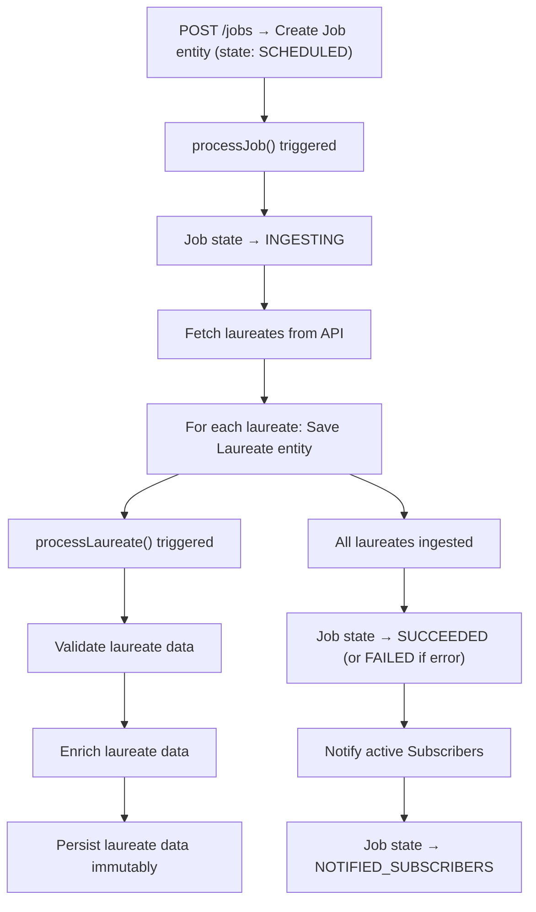

# Functional Requirements for Nobel Laureates Data Ingestion (Event-Driven Architecture)

---

## 1. Entity Definitions

```
Job:
- id: Long (primary key, internal technicalId)
- externalId: String (unique identifier for the job instance)
- state: String (SCHEDULED, INGESTING, SUCCEEDED, FAILED, NOTIFIED_SUBSCRIBERS)
- createdAt: DateTime (timestamp of job creation)
- completedAt: DateTime (timestamp of job completion, if applicable)
- resultSummary: String (summary or status message of ingestion result)

Laureate:
- id: Long (primary key, internal technicalId)
- laureateId: Integer (original laureate id from source)
- firstname: String
- surname: String
- gender: String
- born: String (date of birth in ISO format)
- died: String (date of death or null)
- borncountry: String
- borncountrycode: String
- borncity: String
- year: String (award year)
- category: String
- motivation: String
- affiliationName: String
- affiliationCity: String
- affiliationCountry: String
- calculatedAge: Integer (age calculated during enrichment, optional)

Subscriber:
- id: Long (primary key, internal technicalId)
- contactEmail: String (email address)
- webhookUrl: String (optional webhook URL)
- active: Boolean (subscriber is active or inactive)
```

---

## 2. Process Method Flows

### processJob() Flow:
1. Initial State: Job created with state = SCHEDULED  
2. Validation: Check job parameters and validate state transition  
3. State Transition: Move state to INGESTING  
4. Data Ingestion: Call external OpenDataSoft API to fetch laureates data  
5. For each fetched laureate:  
   - Save Laureate entity (triggers `processLaureate()`)  
6. Upon successful ingestion of all laureates:  
   - Update job state to SUCCEEDED  
7. On ingestion failure:  
   - Update job state to FAILED  
8. Notification: Notify all active Subscribers by email/webhook  
9. Update job state to NOTIFIED_SUBSCRIBERS  

---

### processLaureate() Flow:
1. Validation: Run validation processors (e.g., check required fields non-null, format checks)  
2. Enrichment: Calculate age, normalize country codes, etc.  
3. Persistence: Save enriched laureate data immutably  

---

### processSubscriber() Flow:
1. Validation: Validate contact information format (email/webhook URL)  
2. Persistence: Save subscriber details  
3. No further orchestration or workflow involvement  

---

## 3. API Endpoints Design

### Job Entity

- **POST /jobs**  
  Request:  
  ```json
  {
    "externalId": "string"
  }
  ```  
  Response:  
  ```json
  {
    "technicalId": "long"
  }
  ```

- **GET /jobs/{technicalId}**  
  Response:  
  ```json
  {
    "id": "long",
    "externalId": "string",
    "state": "string",
    "createdAt": "ISO8601 timestamp",
    "completedAt": "ISO8601 timestamp or null",
    "resultSummary": "string"
  }
  ```

---

### Laureate Entity

- No POST endpoint (created internally via job ingestion)  

- **GET /laureates/{technicalId}**  
  Response:  
  ```json
  {
    "id": "long",
    "laureateId": "integer",
    "firstname": "string",
    "surname": "string",
    "gender": "string",
    "born": "string",
    "died": "string or null",
    "borncountry": "string",
    "borncountrycode": "string",
    "borncity": "string",
    "year": "string",
    "category": "string",
    "motivation": "string",
    "affiliationName": "string",
    "affiliationCity": "string",
    "affiliationCountry": "string",
    "calculatedAge": "integer or null"
  }
  ```

---

### Subscriber Entity

- **POST /subscribers**  
  Request:  
  ```json
  {
    "contactEmail": "string",
    "webhookUrl": "string (optional)",
    "active": true
  }
  ```  
  Response:  
  ```json
  {
    "technicalId": "long"
  }
  ```

- **GET /subscribers/{technicalId}**  
  Response:  
  ```json
  {
    "id": "long",
    "contactEmail": "string",
    "webhookUrl": "string or null",
    "active": true
  }
  ```

---

## 4. Event-Driven Processing Chain Diagram


```mermaid
graph TD
  A["POST /jobs → Create Job entity (state: SCHEDULED)"]
  A --> B["processJob() triggered"]
  B --> C["Job state → INGESTING"]
  C --> D["Fetch laureates from API"]
  D --> E["For each laureate: Save Laureate entity"]
  E --> F["processLaureate() triggered"]
  F --> G["Validate laureate data"]
  G --> H["Enrich laureate data"]
  H --> I["Persist laureate data immutably"]
  E --> J["All laureates ingested"]
  J --> K["Job state → SUCCEEDED (or FAILED if error)"]
  K --> L["Notify active Subscribers"]
  L --> M["Job state → NOTIFIED_SUBSCRIBERS"]
```

---

This completes the finalized functional requirements for the Nobel Laureates Data Ingestion backend application in an Event-Driven Architecture approach.