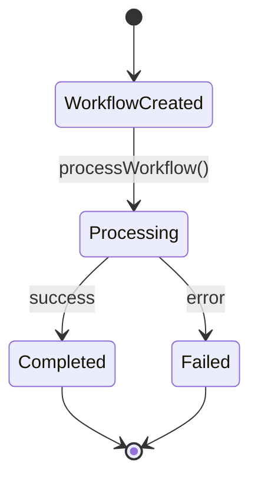
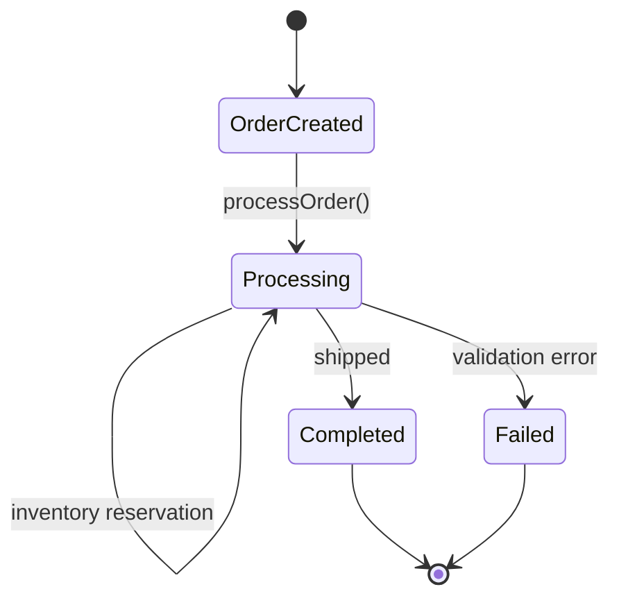
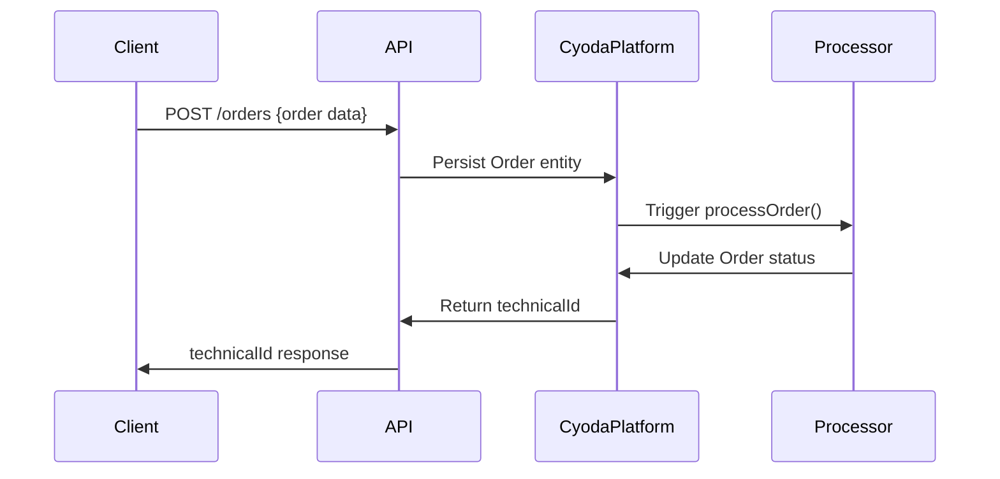

### 1. Entity Definitions

``` 
Workflow: 
- name: String (unique name of the workflow)
- description: String (brief description of the workflow purpose)
- createdAt: DateTime (timestamp when workflow was created)
- status: String (current status of the workflow instance, e.g. PENDING, RUNNING, COMPLETED, FAILED)

Order:
- orderId: String (business identifier for the order)
- customerName: String (name of the customer placing the order)
- productCode: String (code identifying the product ordered)
- quantity: Integer (amount of product ordered)
- orderDate: DateTime (when the order was placed)
- status: String (order status, e.g. NEW, PROCESSING, SHIPPED)

Customer:
- customerId: String (unique customer identifier)
- name: String (full name of the customer)
- email: String (customer contact email)
- phone: String (customer phone number)
- registeredAt: DateTime (date of customer registration)
```

---

### 2. Process Method Flows

```
processWorkflow() Flow:
1. Initial State: Workflow entity created with status = PENDING
2. Validation: Check workflow configuration and prerequisites
3. Processing: Trigger orchestration logic to handle related Orders and Customers
4. Completion: Update status to COMPLETED or FAILED based on processing outcome
5. Notification: Emit events or callbacks to interested consumers/systems

processOrder() Flow:
1. Initial State: Order created with status = NEW
2. Validation: Check order details (product availability, quantity limits)
3. Processing: Reserve inventory, initiate shipping process
4. Completion: Update status to PROCESSING or FAILED
5. Notification: Send order confirmation or failure notice

processCustomer() Flow:
1. Initial State: Customer created with basic info
2. Validation: Verify contact details format and uniqueness
3. Processing: Enrich customer profile, link to orders if applicable
4. Completion: Mark customer as ACTIVE or INVALID
5. Notification: Send welcome or update messages
```

---

### 3. API Endpoints Design

- **POST /workflows**  
  - Request: JSON with `name`, `description`  
  - Response: `{ "technicalId": "string" }`  
  - Action: Creates new immutable Workflow, triggers `processWorkflow()` event

- **GET /workflows/{technicalId}**  
  - Response: Full Workflow entity data with status

- **POST /orders**  
  - Request: JSON with `orderId`, `customerName`, `productCode`, `quantity`, `orderDate`  
  - Response: `{ "technicalId": "string" }`  
  - Action: Creates new immutable Order, triggers `processOrder()` event

- **GET /orders/{technicalId}**  
  - Response: Full Order entity data with status

- **POST /customers**  
  - Request: JSON with `customerId`, `name`, `email`, `phone`, `registeredAt`  
  - Response: `{ "technicalId": "string" }`  
  - Action: Creates new immutable Customer, triggers `processCustomer()` event

- **GET /customers/{technicalId}**  
  - Response: Full Customer entity data

**Note:** No update or delete endpoints are provided, following immutable entity creation principle.

---

### 4. Request/Response Formats

**POST /workflows Request Example:**

```json
{
  "name": "OrderProcessingWorkflow",
  "description": "Workflow to process incoming orders"
}
```

**POST /workflows Response Example:**

```json
{
  "technicalId": "wf-1234567890"
}
```

**GET /workflows/{technicalId} Response Example:**

```json
{
  "name": "OrderProcessingWorkflow",
  "description": "Workflow to process incoming orders",
  "createdAt": "2024-06-01T10:00:00Z",
  "status": "COMPLETED"
}
```

---

### Visual Representations

**Workflow Entity Lifecycle:**


```mermaid
stateDiagram-v2
    [*] --> WorkflowCreated
    WorkflowCreated --> Processing : processWorkflow()
    Processing --> Completed : success
    Processing --> Failed : error
    Completed --> [*]
    Failed --> [*]
```

**Order Entity Lifecycle:**


```mermaid
stateDiagram-v2
    [*] --> OrderCreated
    OrderCreated --> Processing : processOrder()
    Processing --> Processing : inventory reservation
    Processing --> Completed : shipped
    Processing --> Failed : validation error
    Completed --> [*]
    Failed --> [*]
```

**Event-Driven Processing Chain (Simplified):**


```mermaid
sequenceDiagram
    participant Client
    participant API
    participant CyodaPlatform
    participant Processor

    Client->>API: POST /orders {order data}
    API->>CyodaPlatform: Persist Order entity
    CyodaPlatform->>Processor: Trigger processOrder()
    Processor->>CyodaPlatform: Update Order status
    CyodaPlatform->>API: Return technicalId
    API->>Client: technicalId response
```

---

This completes the functional requirements based on your input and Event-Driven Architecture principles. If you need any further adjustments or additions, please feel free to ask!