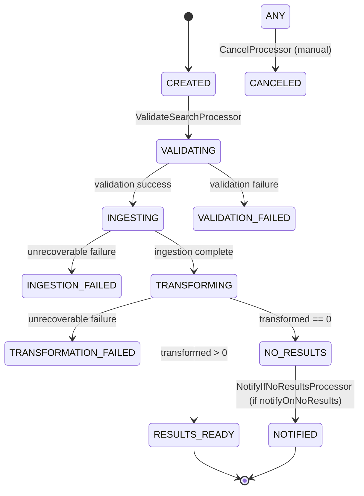
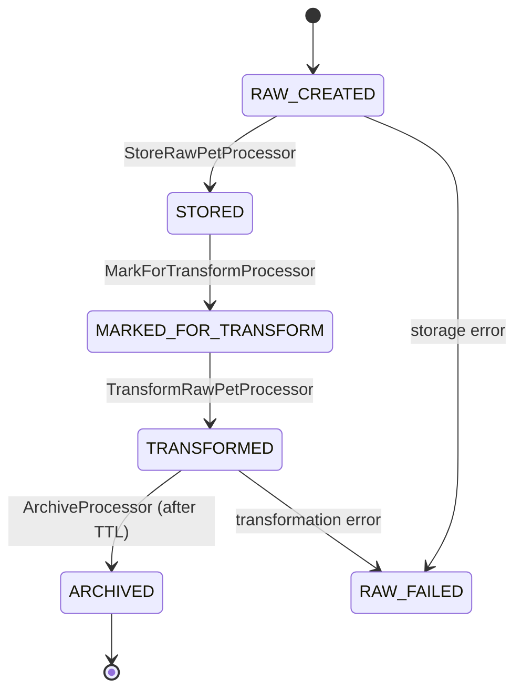
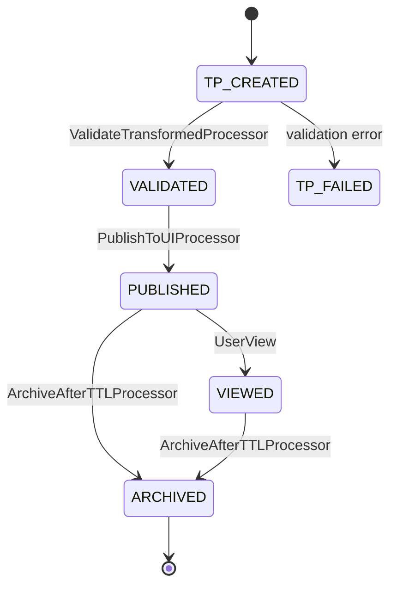

# Functional Requirements — Pet Search EDA

## 1. Overview
This document describes the current functional requirements for the event-driven pet search pipeline: how incoming search requests are validated, ingested against external APIs, transformed into business entities, and surfaced to users. It also captures expected state machines, processors and API contracts. The requirements below reflect the current (updated) logic, clarifying field naming, additional states for failures, idempotency, and a Notification entity.

Goals:
- Accept user search requests and orchestrate asynchronous ingestion and transformation of external pet data.
- Persist raw responses for traceability.
- Produce consistent business-facing TransformedPet records for UI consumption.
- Notify users on configured conditions (e.g., no results).

---

## 2. Entity Definitions
All timestamps MUST be ISO 8601 strings in UTC (e.g. `2025-08-21T10:00:00Z`). IDs follow these conventions:
- technicalId: system-generated stable identifier for orchestration entities (SearchRequest). Format `sr-<uuid>` or similar.
- rawId: identifier provided by external source for a pet.
- id: numeric or UUID business identifier for TransformedPet.

Fields use camelCase in persistence and API payloads.

### SearchRequest
- technicalId: String (system-generated)
- userId: String (requester)
- species: String? (optional filter; e.g., `dog`)
- status: String? (optional filter; e.g., `available`)
- categoryId: Integer? (optional filter)
- sortBy: String? (optional)
- page: Integer (default 1)
- pageSize: Integer (default 20, max 100)
- notifyOnNoResults: Boolean (default false)
- createdAt: String (timestamp)
- updatedAt: String (timestamp)
- state: Enum (CREATED, VALIDATING, VALIDATION_FAILED, INGESTING, INGESTION_FAILED, TRANSFORMING, TRANSFORMATION_FAILED, RESULTS_READY, NO_RESULTS, NOTIFIED, CANCELED)
- validationErrors: List<String>? (when validation failed)
- ingestionStarted: Boolean (indicates ingestion kicked off)
- resultSummary: object? (populated when results ready)

Notes:
- Only POSTing a SearchRequest creates an orchestration entity; RawPet and TransformedPet are produced by processors.
- POST must be idempotent for duplicate client retries. The system may de-duplicate by a client-supplied idempotency key or by matching identical filters within a short time-window.

### RawPet
- rawId: String (source id)
- payload: String (original JSON from external API)
- species: String?
- status: String?
- categoryId: Integer?
- ingestedAt: String (timestamp)
- searchRequestId: String (technicalId)
- state: Enum (RAW_CREATED, STORED, MARKED_FOR_TRANSFORM, TRANSFORMED, ARCHIVED, RAW_FAILED)
- transformedAt: String? (timestamp)

Notes:
- RawPet.payload stores the raw JSON for replay, debugging and reprocessing.
- RawPet entries should be deduplicated by rawId + source.

### TransformedPet
- id: Integer or String (business id)
- name: String (from petName or mapping)
- species: String
- breed: String?
- categoryId: Integer?
- availability: String (friendly text derived from status)
- age: String? (derived representation)
- displayAttributes: String? (summary attributes)
- sourceMeta: String (format: `<rawId>|<ingestedAt>`)
- searchRequestId: String (technicalId)
- createdAt: String (timestamp)
- state: Enum (TP_CREATED, VALIDATED, PUBLISHED, VIEWED, ARCHIVED, TP_FAILED)

Notes:
- Field names are normalized to lowerCamelCase for APIs and storage.

### Notification (added)
- id: String
- searchRequestId: String
- userId: String
- type: Enum (NO_RESULTS, INGESTION_FAILED, TRANSFORMATION_FAILED)
- payload: Object (notification details)
- createdAt: String
- delivered: Boolean
- deliveryAttempts: Integer

Notes:
- Notifications are created by processors and can be enqueued for delivery via downstream notification service.

---

## 3. State Machines and Workflows
Below are the canonical state flows for each entity with the processors that perform transitions. States include failure states to make processing and retries explicit.

### 3.1 SearchRequest workflow (orchestration)
Primary states:
- CREATED -> VALIDATING -> INGESTING -> TRANSFORMING -> {RESULTS_READY | NO_RESULTS}
- Failure states: VALIDATION_FAILED, INGESTION_FAILED, TRANSFORMATION_FAILED
- Terminal states: RESULTS_READY, NO_RESULTS, CANCELED
- Additional: NOTIFIED (post NO_RESULTS notification)

Typical transitions and processors:
- POST creates SearchRequest with state = CREATED.
- CREATED -> VALIDATING: ValidateSearchProcessor (synchronous or queued task).
  - If validation fails: VALIDATION_FAILED and populate validationErrors.
  - If valid: transition to INGESTING.
- INGESTING: IngestPetsProcessor kicks off ingestion (may be paginated). When ingestion starts, ingestionStarted = true. If ingestion fails after retries, INGESTION_FAILED.
- After ingestion of all pages and RawPet creation, transition to TRANSFORMING (or transformation may run incrementally as raw items arrive).
- TRANSFORMING: TransformPetsProcessor / TransformRawPetProcessor run; when all RawPets are processed the SearchRequest can be resolved to RESULTS_READY if at least one TransformedPet existed, or NO_RESULTS otherwise.
- NO_RESULTS -> NOTIFIED: NotifyIfNoResultsProcessor creates Notification when notifyOnNoResults=true. After notification is enqueued, state = NOTIFIED.
- USER_CANCEL can move CREATED/VALIDATING/INGESTING/TRANSFORMING -> CANCELED (CancelProcessor).

Mermaid (logical overview):


```mermaid
stateDiagram-v2
    [*] --> CREATED
    CREATED --> VALIDATING : ValidateSearchProcessor
    VALIDATING --> INGESTING : validation success
    VALIDATING --> VALIDATION_FAILED : validation failure
    INGESTING --> INGESTION_FAILED : unrecoverable failure
    INGESTING --> TRANSFORMING : ingestion complete
    TRANSFORMING --> TRANSFORMATION_FAILED : unrecoverable failure
    TRANSFORMING --> RESULTS_READY : transformed > 0
    TRANSFORMING --> NO_RESULTS : transformed == 0
    NO_RESULTS --> NOTIFIED : NotifyIfNoResultsProcessor (if notifyOnNoResults)
    ANY --> CANCELED : CancelProcessor (manual)
    RESULTS_READY --> [*]
    NOTIFIED --> [*]
```

Notes:
- The system must support partial progress reporting; SearchRequest.resultSummary may be updated incrementally (totalCount, page stats).
- Processors should be idempotent: repeating a processor run for the same SearchRequest must not create duplicate RawPet or TransformedPet entries.

### 3.2 RawPet workflow
States:
RAW_CREATED -> STORED -> MARKED_FOR_TRANSFORM -> TRANSFORMED -> ARCHIVED
Failure: RAW_FAILED

Processors: StoreRawPetProcessor, MarkForTransformProcessor, TransformRawPetProcessor, ArchiveProcessor

Mermaid:


```mermaid
stateDiagram-v2
    [*] --> RAW_CREATED
    RAW_CREATED --> STORED : StoreRawPetProcessor
    STORED --> MARKED_FOR_TRANSFORM : MarkForTransformProcessor
    MARKED_FOR_TRANSFORM --> TRANSFORMED : TransformRawPetProcessor
    TRANSFORMED --> ARCHIVED : ArchiveProcessor (after TTL)
    RAW_CREATED --> RAW_FAILED : storage error
    TRANSFORMED --> RAW_FAILED : transformation error
    ARCHIVED --> [*]
```

Notes:
- RawPet.payload must be stored atomically with metadata (rawId, ingestedAt, searchRequestId) to enable later replay.
- Deduplication rule: skip storing if an identical rawId/source for the same searchRequestId already exists.

### 3.3 TransformedPet workflow
States:
TP_CREATED -> VALIDATED -> PUBLISHED -> (VIEWED) -> ARCHIVED
Failure: TP_FAILED

Processors: ValidateTransformedProcessor, PublishToUIProcessor, ArchiveAfterTTLProcessor

Mermaid:


```mermaid
stateDiagram-v2
    [*] --> TP_CREATED
    TP_CREATED --> VALIDATED : ValidateTransformedProcessor
    VALIDATED --> PUBLISHED : PublishToUIProcessor
    PUBLISHED --> VIEWED : UserView
    PUBLISHED --> ARCHIVED : ArchiveAfterTTLProcessor
    VIEWED --> ARCHIVED : ArchiveAfterTTLProcessor
    TP_CREATED --> TP_FAILED : validation error
    ARCHIVED --> [*]
```

Notes:
- TransformedPet TTL: configurable (e.g., 7 days after publish) to support retention.
- Publication to UI should be eventual and support partial result sets (pagination).

---

## 4. Processors (pseudo-code and behavioral rules)
General processor rules:
- All processors MUST be idempotent.
- Transient failures: retry with exponential backoff; record attempt counts.
- Permanent failures: set appropriate failure state and create Notification (if applicable).
- Instrumentation: log attempts, durations, and outcomes for observability.

### ValidateSearchProcessor
```
input: SearchRequest
if any required filters missing (business-defined required set) then
  set state = VALIDATION_FAILED
  add validationErrors
  persist
  return
else
  set state = INGESTING
  persist
  enqueue IngestPetsProcessor(searchRequestId)
```
Notes: business may allow many optional filters; required fields must be documented.

### IngestPetsProcessor
```
input: searchRequestId
fetch SearchRequest
if state not in INGESTING then exit (idempotency guard)
for each page from external API (with rate-limit handling):
  call external pet API with search params and page/pageSize
  for each pet in response:
    if not exists RawPet(rawId, source, searchRequestId):
      create RawPet(payload=rawJson, rawId=pet.id, searchRequestId=sr.technicalId, ingestedAt=now())
mark SearchRequest.ingestionStarted = true
if all pages processed successfully:
  set SearchRequest state -> TRANSFORMING (or leave TRANSFORMING to TransformRawPetProcessor to update when transforms complete)
else:
  set state = INGESTION_FAILED and create Notification
```
Notes:
- Support incremental ingestion: pages may arrive over time; SearchRequest transition to TRANSFORMING should occur only when ingestion completion criteria are met.
- Backoff and retry for API errors; on consistent 4xx errors, mark ingestion failed.

### TransformRawPetProcessor
```
input: rawPetId or searchRequestId
for each RawPet where searchRequestId matches and state in (STORED, MARKED_FOR_TRANSFORM) and not transformed:
  parse payload (defensive parsing)
  map fields -> TransformedPet using mapping rules
  apply normalization and enrichment (e.g., availability friendly text)
  persist TransformedPet (idempotently)
  mark RawPet.transformed = true and state = TRANSFORMED, transformedAt = now()
if all expected RawPets processed and no outstanding ingestion pages:
  evaluate SearchRequest: if count(transformed) > 0 -> RESULTS_READY else -> NO_RESULTS
```
Notes:
- Mapping rules: name <- petName or 'unknown'; availability derived from status (e.g., `available` -> `Available now`). Keep mapping deterministic.
- Handle malformed payloads by marking RawPet as RAW_FAILED and continue.

### NotifyIfNoResultsProcessor
```
input: searchRequestId
fetch SearchRequest
if SearchRequest.state == NO_RESULTS and SearchRequest.notifyOnNoResults:
  create Notification(searchRequestId, userId, type=NO_RESULTS, payload={})
  set SearchRequest.state = NOTIFIED
```
Notes:
- Notification delivery handled by downstream notifier. This processor only creates the Notification record/enqueues a message.

### PublishToUIProcessor
```
input: searchRequestId
aggregate TransformedPet rows for searchRequestId with pagination
prepare resultSummary { totalCount, page, pageSize, transformedPets[] }
persist/attach resultSummary to SearchRequest to enable GET API
set SearchRequest.state = RESULTS_READY

```
Notes:
- Publishing may be incremental; if large sets exist, publish pages as they become available.

### CancelProcessor
- Accepts user cancel requests. If SearchRequest is in terminal state (RESULTS_READY, NO_RESULTS) cancel is rejected. Otherwise set state = CANCELED and halt further processing when safe.

---

## 5. API Endpoints and Contracts
Design rules:
- POST /searchRequests is the single entry point to create orchestration. All other entity creations are event-driven.
- APIs return minimal technicalId for creation; GET returns full status and results.
- All request and response timestamps must be ISO 8601 UTC strings.

### POST /searchRequests
- Description: create a SearchRequest (triggers EDA processing).
- Request headers: optionally an Idempotency-Key header to deduplicate client retries.
- Response: 202 Accepted with body { "technicalId": "sr-0001" }.

Request example:
```json
{
  "species": "dog",
  "status": "available",
  "categoryId": 42,
  "page": 1,
  "pageSize": 20,
  "notifyOnNoResults": true,
  "userId": "user-789"
}
```

Response example:
```json
{
  "technicalId": "sr-0001"
}
```

Notes:
- The API returns immediately; processing proceeds asynchronously.
- If user supplies an idempotency key, repeated identical POSTs must return the same technicalId while the request is considered the same.

### GET /searchRequests/{technicalId}
- Description: return SearchRequest status and any available results (paginated).
- Response contains: technicalId, searchRequest (metadata and state), resultSummary (when available), and optionally an array of transformedPets for the requested page.

Response example:
```json
{
  "technicalId": "sr-0001",
  "searchRequest": {
    "species": "dog",
    "status": "available",
    "categoryId": 42,
    "createdAt": "2025-08-21T10:00:00Z",
    "state": "RESULTS_READY"
  },
  "resultSummary": {
    "totalCount": 2,
    "page": 1,
    "pageSize": 20,
    "transformedPets": [
      {
        "id": 123,
        "name": "Buddy",
        "species": "dog",
        "breed": "Labrador",
        "availability": "Available now",
        "sourceMeta": "raw-555|2025-08-21T10:00:10Z"
      }
    ]
  }
}
```

### POST /searchRequests/{technicalId}/cancel
- Description: request to cancel processing for a specific SearchRequest.
- Response: 200 OK with updated state or 409 Conflict if in terminal state.

---

## 6. Non-Functional & Operational Requirements
- Idempotency: processors and API endpoints must be idempotent where appropriate.
- Retries: use exponential backoff for transient errors; cap retries and escalate to failure state with Notification for permanent failures.
- Observability: metrics and tracing per SearchRequest (ingestion time, transform time, counts), and logs for processor attempts.
- Scalability: ingestion and transformation should horizontally scale; external API rate limiting and pagination must be respected.
- Data retention: RawPet retention policy (e.g., 90 days), TransformedPet TTL (configurable, e.g., 7 days), archive processes should move older data to cold storage or remove per policy.
- Security: userId must be validated and authorized; sensitive information in payloads must be handled according to privacy rules.

---

## 7. Data Contracts, Mapping and Business Rules
- All mappings must be deterministic. Example mapping rules:
  - name <- payload.petName or payload.name or `unknown`
  - species <- payload.species (normalized lower-case)
  - availability <- mapStatusToFriendlyText(payload.status)
  - sourceMeta <- `${rawId}|${ingestedAt}`

- If a RawPet payload lacks required fields for transformation, mark the RawPet as RAW_FAILED and move on.

---

## 8. Open Items / Future Enhancements
- Saved-search management (persisting user subscriptions, scheduling recurring searches). This would add 1-2 entities and subscription lifecycle processors.
- Notification delivery adapters (email, push, SMS) and retry semantics. Currently Notification entity is created but delivery is delegated.
- Reprocessing API to re-run transform on RawPet payloads after mapping changes.

---

If you want, I can also add a separate section describing the Notification entity lifecycle in more depth or draft sequence diagrams for common scenarios (successful full flow, ingestion failure, user cancel).