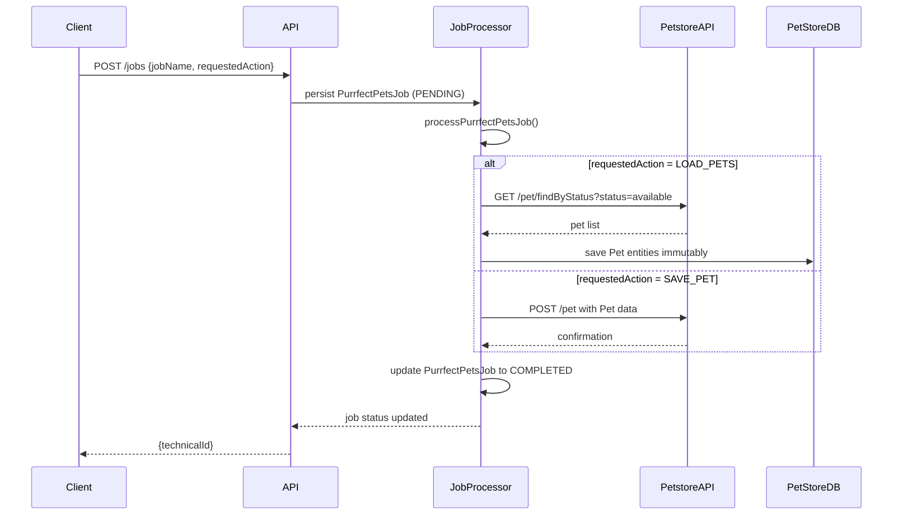

### 1. Entity Definitions

``` 
PurrfectPetsJob:  
- jobName: String (descriptive name of the pet loading/saving job)  
- requestedAction: String (e.g., "LOAD_PETS", "SAVE_PET")  
- status: StatusEnum (PENDING, PROCESSING, COMPLETED, FAILED)  

Pet:  
- petId: Long (Petstore API pet identifier)  
- name: String (pet's name)  
- category: String (category of the pet, e.g., "Cat", "Dog")  
- photoUrls: List<String> (URLs of pet photos)  
- tags: List<String> (additional tags or fun nicknames)  
- status: StatusEnum (available, pending, sold)  
```

---

### 2. Process Method Flows

``` 
processPurrfectPetsJob() Flow:  
1. Initial State: PurrfectPetsJob created with PENDING status  
2. Validation: Validate requestedAction field and jobName presence  
3. Processing:   
   - If requestedAction = "LOAD_PETS", call Petstore API to fetch pets by status "available"  
   - Persist each Pet entity immutably in local store  
   - If requestedAction = "SAVE_PET", validate Pet data and send POST request to Petstore API to save pet  
4. Completion: Update PurrfectPetsJob status to COMPLETED or FAILED based on processing outcome  
5. Notification: Optionally log or notify job completion  
```

``` 
processPet() Flow:  
1. Initial State: Pet entity created (usually by processPurrfectPetsJob)  
2. Validation: Validate pet fields (name, category, status, etc.)  
3. Processing: Enrich Pet entity if needed (e.g., add default tags)  
4. Completion: Mark Pet entity as persisted (status remains immutable)  
```

---

### 3. API Endpoints Design

| HTTP Method | Path                   | Description                                      | Request Body           | Response Body          |
|-------------|------------------------|------------------------------------------------|-----------------------|-----------------------|
| POST        | /jobs                  | Create a PurrfectPetsJob to trigger pet load/save | `{ "jobName": "", "requestedAction": "" }` | `{ "technicalId": "<job-id>" }` |
| GET         | /jobs/{technicalId}    | Retrieve job status and info                     | N/A                   | `{ jobName, requestedAction, status }` |
| GET         | /pets/{technicalId}    | Retrieve pet details by internal technicalId    | N/A                   | `{ petId, name, category, photoUrls, tags, status }` |

*Note:* No update/delete endpoints to preserve immutability and event history.

---

### 4. Request/Response Formats

**POST /jobs**

Request:
```json
{
  "jobName": "LoadAvailablePets",
  "requestedAction": "LOAD_PETS"
}
```

Response:
```json
{
  "technicalId": "job-123456"
}
```

**GET /jobs/{technicalId}**

Response:
```json
{
  "jobName": "LoadAvailablePets",
  "requestedAction": "LOAD_PETS",
  "status": "COMPLETED"
}
```

**GET /pets/{technicalId}**

Response:
```json
{
  "petId": 1001,
  "name": "Fluffy",
  "category": "Cat",
  "photoUrls": ["http://example.com/photo1.jpg"],
  "tags": ["Purrfect", "Fluffy"],
  "status": "available"
}
```

---

### Mermaid Diagrams

**Entity Lifecycle State Diagram for PurrfectPetsJob**


```mermaid
stateDiagram-v2
    [*] --> JobCreated
    JobCreated --> Processing : processPurrfectPetsJob()
    Processing --> Completed : success
    Processing --> Failed : error
    Completed --> [*]
    Failed --> [*]
```

**Entity Lifecycle State Diagram for Pet**


```mermaid
stateDiagram-v2
    [*] --> PetCreated
    PetCreated --> Validating : processPet()
    Validating --> Persisted : success
    Validating --> Failed : error
    Persisted --> [*]
    Failed --> [*]
```

**Event-Driven Processing Chain**


```mermaid
sequenceDiagram
    participant Client
    participant API
    participant JobProcessor
    participant PetstoreAPI
    participant PetStoreDB

    Client->>API: POST /jobs {jobName, requestedAction}
    API->>JobProcessor: persist PurrfectPetsJob (PENDING)
    JobProcessor->>JobProcessor: processPurrfectPetsJob()
    alt requestedAction = LOAD_PETS
        JobProcessor->>PetstoreAPI: GET /pet/findByStatus?status=available
        PetstoreAPI-->>JobProcessor: pet list
        JobProcessor->>PetStoreDB: save Pet entities immutably
    else requestedAction = SAVE_PET
        JobProcessor->>PetstoreAPI: POST /pet with Pet data
        PetstoreAPI-->>JobProcessor: confirmation
    end
    JobProcessor->>JobProcessor: update PurrfectPetsJob to COMPLETED
    JobProcessor-->>API: job status updated
    API-->>Client: {technicalId}
```

---

This completes the confirmed functional requirements for the "Purrfect Pets" API app with an Event-Driven Architecture approach.  
If you need further assistance with implementation details or additional features, feel free to ask!