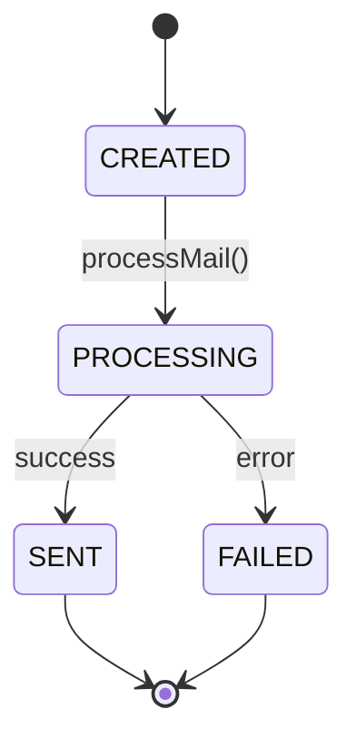
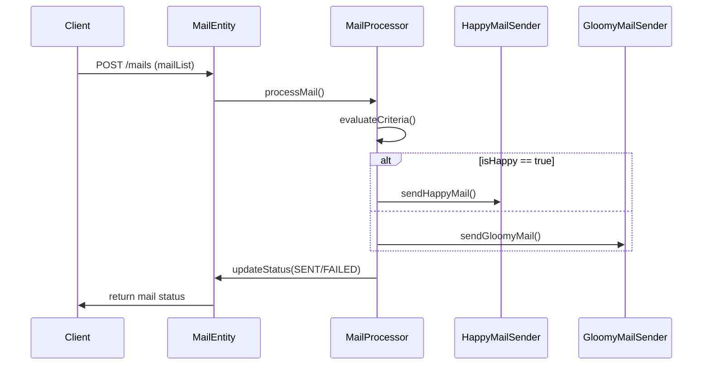

Certainly! Here is the well-formatted final version of your functional requirements following the EDA approach:

### 1. Entity Definitions

``` 
Mail:
- id: UUID (unique identifier)
- isHappy: Boolean (indicates if the mail is happy or gloomy)
- mailList: List<String> (list of recipient email addresses)
- status: MailStatusEnum (entity lifecycle state: CREATED, PROCESSING, SENT, FAILED)
- criteriaMatchedCount: Integer (number of criteria matched to determine happy/gloomy)
```

### 2. Process Method Flows

```
processMail() Flow:
1. Initial State: Mail created with status = CREATED
2. Validation: Check mailList is not empty and contains well-formed email addresses
3. Criteria Evaluation: Evaluate 22 predefined criteria to determine and set isHappy and criteriaMatchedCount
4. Processing:
   - If isHappy == true → trigger sendHappyMail processor
   - Else → trigger sendGloomyMail processor
5. Sending:
   - sendHappyMail or sendGloomyMail sends emails to all recipients in mailList
6. Completion:
   - Update status to SENT on success, or FAILED on error
7. Notification:
   - Optionally log or notify processing results
```

### 3. API Endpoints

- **POST /mails**

Request:

```json
{
  "mailList": ["user1@example.com", "user2@example.com"]
}
```

Response (201 Created):

```json
{
  "id": "uuid-generated",
  "isHappy": null,
  "status": "CREATED",
  "criteriaMatchedCount": 0
}
```

- **GET /mails/{id}**

Response (200 OK):

```json
{
  "id": "uuid-generated",
  "isHappy": true,
  "mailList": ["user1@example.com", "user2@example.com"],
  "status": "SENT",
  "criteriaMatchedCount": 18
}
```

### 4. Mermaid Diagrams

#### Entity Lifecycle State Diagram


```mermaid
stateDiagram-v2
    [*] --> CREATED
    CREATED --> PROCESSING : processMail()
    PROCESSING --> SENT : success
    PROCESSING --> FAILED : error
    SENT --> [*]
    FAILED --> [*]
```

#### Event-Driven Processing Chain


```mermaid
sequenceDiagram
    participant Client
    participant MailEntity
    participant MailProcessor
    participant HappyMailSender
    participant GloomyMailSender

    Client->>MailEntity: POST /mails (mailList)
    MailEntity->>MailProcessor: processMail()
    MailProcessor->>MailProcessor: evaluateCriteria()
    alt isHappy == true
        MailProcessor->>HappyMailSender: sendHappyMail()
    else
        MailProcessor->>GloomyMailSender: sendGloomyMail()
    end
    MailProcessor->>MailEntity: updateStatus(SENT/FAILED)
    MailEntity->>Client: return mail status
```

---

If you have no further adjustments, this will serve as the functional backbone of your happy mail app on Cyoda platform using Event-Driven Architecture. Please let me know if you'd like to proceed with defining the 22 criteria or any other details!