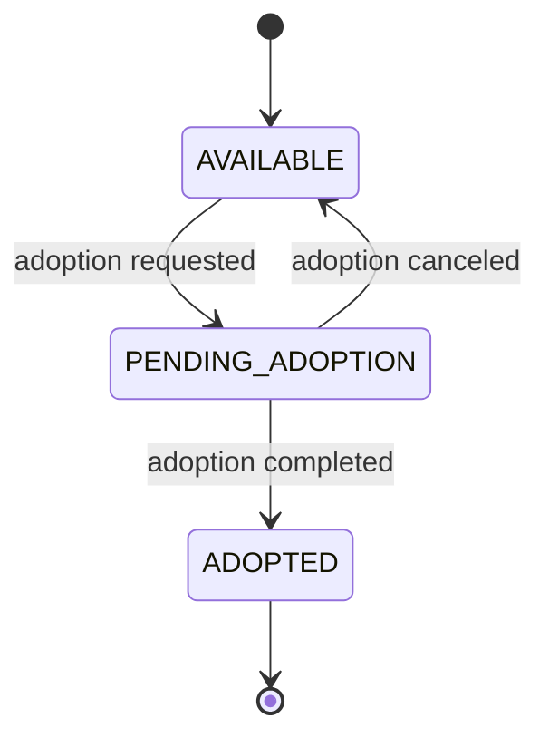
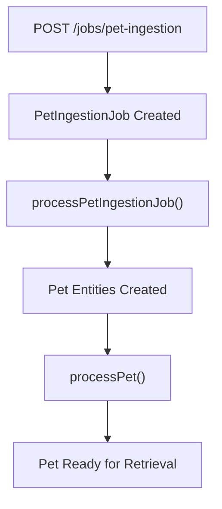

Certainly! Here is the well-formatted final version of the functional requirements for your "Purrfect Pets" API app using Event-Driven Architecture:

---

### 1. Entity Definitions
```  
PetIngestionJob:  
- id: UUID (unique identifier for the ingestion job)  
- sourceUrl: String (URL of the Petstore API data source)  
- createdAt: DateTime (job creation timestamp)  
- status: StatusEnum (PENDING, PROCESSING, COMPLETED, FAILED)  

Pet:  
- id: UUID (unique pet identifier)  
- name: String (pet's name)  
- category: String (pet category, e.g., cat, dog, bird)  
- photoUrls: List<String> (images of the pet)  
- tags: List<String> (tags describing pet features)  
- status: StatusEnum (AVAILABLE, PENDING_ADOPTION, ADOPTED)  
```

---

### 2. Process Method Flows

```  
processPetIngestionJob() Flow:  
1. Initial State: PetIngestionJob created with PENDING status  
2. Validation: Verify sourceUrl is reachable and valid  
3. Processing: Fetch Petstore API data, parse pet entities  
4. Persistence: Save new Pet entities immutably with AVAILABLE status  
5. Completion: Update PetIngestionJob status to COMPLETED or FAILED  
6. Notification: Optionally log or notify ingestion result  
```

```  
processPet() Flow:  
1. Initial State: Pet created with AVAILABLE status  
2. Validation: Check mandatory fields (name, category)  
3. Business Rules: Optionally tag or categorize pets further  
4. Completion: Confirm pet entity ready for retrieval  
```  

---

### 3. API Endpoints Design

- **POST /jobs/pet-ingestion**  
  - Request:  
    ```json
    { "sourceUrl": "https://petstore.swagger.io/v2/pet/findByStatus?status=available" }
    ```  
  - Response:  
    ```json
    { "id": "job-uuid", "status": "PENDING", "createdAt": "timestamp" }
    ```  
  - Effect: Creates PetIngestionJob → triggers `processPetIngestionJob()`  

- **POST /pets**  
  - Request:  
    ```json
    {
      "name": "Fluffy",
      "category": "cat",
      "photoUrls": [],
      "tags": [],
      "status": "AVAILABLE"
    }
    ```  
  - Response:  
    ```json
    { "id": "pet-uuid", "status": "AVAILABLE" }
    ```  
  - Effect: Creates Pet → triggers `processPet()`  

- **GET /pets**  
  - Response: List of all persisted Pet entities with their details  

---

### 4. Request/Response JSON Examples

**POST /jobs/pet-ingestion**  
Request:  
```json  
{  
  "sourceUrl": "https://petstore.swagger.io/v2/pet/findByStatus?status=available"  
}  
```  
Response:  
```json  
{  
  "id": "123e4567-e89b-12d3-a456-426614174000",  
  "status": "PENDING",  
  "createdAt": "2024-06-01T12:00:00Z"  
}  
```

**POST /pets**  
Request:  
```json  
{  
  "name": "Whiskers",  
  "category": "cat",  
  "photoUrls": ["http://example.com/cat.jpg"],  
  "tags": ["cute", "playful"],  
  "status": "AVAILABLE"  
}  
```  
Response:  
```json  
{  
  "id": "987e6543-e21b-12d3-a456-426614174999",  
  "status": "AVAILABLE"  
}  
```

**GET /pets**  
Response:  
```json  
[  
  {  
    "id": "987e6543-e21b-12d3-a456-426614174999",  
    "name": "Whiskers",  
    "category": "cat",  
    "photoUrls": ["http://example.com/cat.jpg"],  
    "tags": ["cute", "playful"],  
    "status": "AVAILABLE"  
  }  
]  
```

---

### 5. Mermaid Diagrams

**PetIngestionJob Lifecycle State Diagram**  

```mermaid  
stateDiagram-v2  
    [*] --> PENDING  
    PENDING --> PROCESSING : processPetIngestionJob()  
    PROCESSING --> COMPLETED : success  
    PROCESSING --> FAILED : error  
    COMPLETED --> [*]  
    FAILED --> [*]  
```

**Pet Lifecycle State Diagram**  

```mermaid  
stateDiagram-v2  
    [*] --> AVAILABLE  
    AVAILABLE --> PENDING_ADOPTION : adoption requested  
    PENDING_ADOPTION --> ADOPTED : adoption completed  
    PENDING_ADOPTION --> AVAILABLE : adoption canceled  
    ADOPTED --> [*]  
```

**Event-Driven Processing Chain**  

```mermaid  
graph TD  
    POST_Job_Creation["POST /jobs/pet-ingestion"] --> PetIngestionJob_Created["PetIngestionJob Created"]  
    PetIngestionJob_Created --> processPetIngestionJob["processPetIngestionJob()"]  
    processPetIngestionJob --> PetEntitiesCreated["Pet Entities Created"]  
    PetEntitiesCreated --> processPet["processPet()"]  
    processPet --> PetReady["Pet Ready for Retrieval"]  
```

---

If you would like me to assist next with implementation details or further refinements, just let me know!