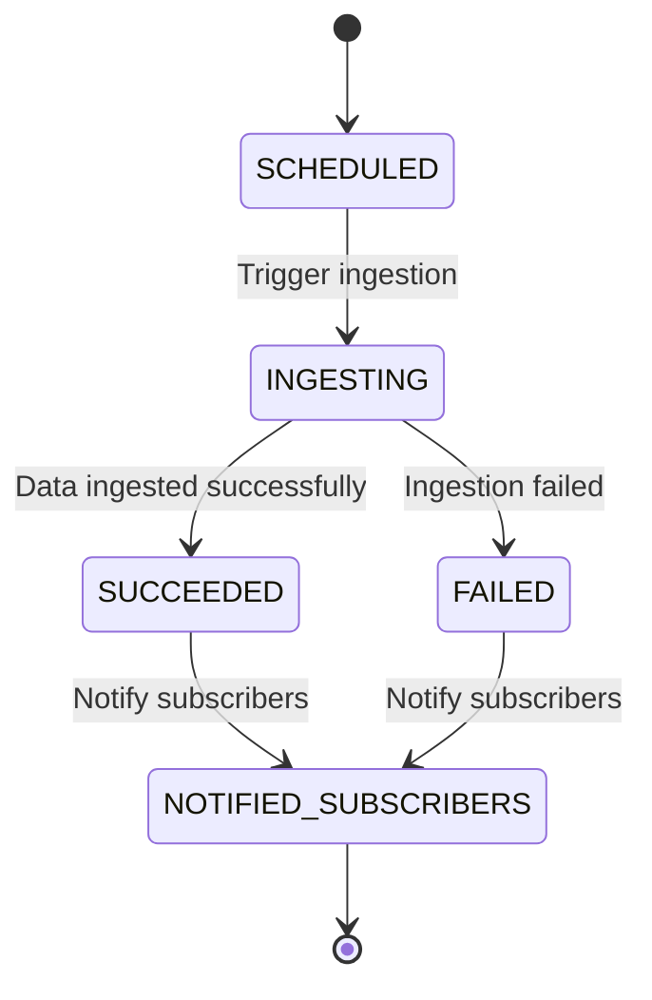
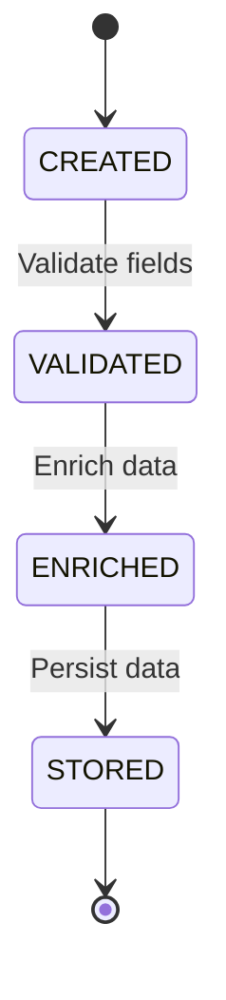
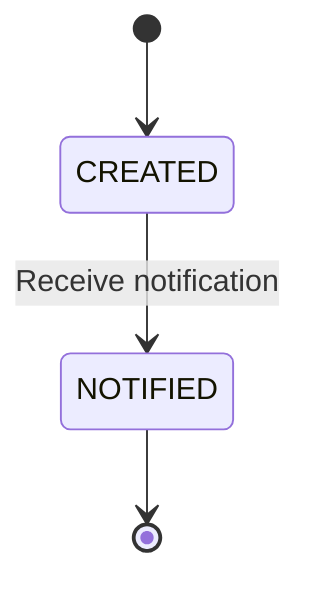
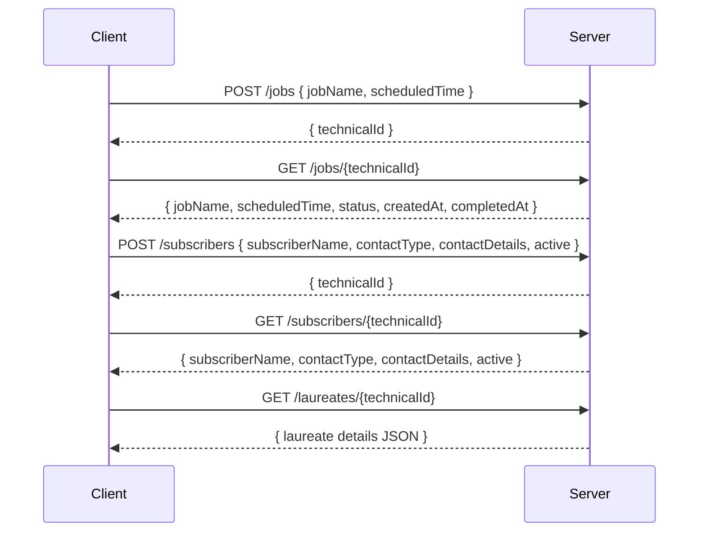

# Functional Requirements for Nobel Laureates Ingestion & Notification System

---

## 1. Entity Definitions

```
Job:
- jobName: String (name or identifier for the ingestion job)
- scheduledTime: String (ISO 8601 datetime when the job is scheduled to run)
- status: String (current workflow state: SCHEDULED, INGESTING, SUCCEEDED, FAILED, NOTIFIED_SUBSCRIBERS)
- createdAt: String (ISO 8601 datetime when job was created)
- completedAt: String (ISO 8601 datetime when job finished, nullable)

Laureate:
- laureateId: Integer (unique laureate identifier from source)
- firstname: String (first name)
- surname: String (surname/last name)
- born: String (ISO 8601 date of birth)
- died: String (ISO 8601 date of death, nullable)
- borncountry: String (country of birth)
- borncountrycode: String (ISO country code of birth)
- borncity: String (city of birth)
- gender: String (gender)
- year: String (year awarded Nobel Prize)
- category: String (category of Nobel Prize)
- motivation: String (reason for award)
- affiliationName: String (name of affiliated institution)
- affiliationCity: String (city of affiliated institution)
- affiliationCountry: String (country of affiliated institution)

Subscriber:
- subscriberName: String (name of subscriber)
- contactType: String (notification channel type, e.g., email, webhook)
- contactDetails: String (email address or webhook URL)
- active: Boolean (whether subscriber is active or not)
```

---

## 2. Entity Workflows

### Job workflow
1. Initial State: Job created with status = SCHEDULED  
2. Ingestion: On trigger, status changes to INGESTING, data is fetched from OpenDataSoft API  
3. Processing:  
   - Parse JSON laureate data  
   - Validate and enrich each Laureate entity (trigger Laureate creation events)  
4. Completion:  
   - On success, status changes to SUCCEEDED  
   - On failure, status changes to FAILED  
5. Notification:  
   - After job completion (SUCCEEDED or FAILED), notify all active Subscribers asynchronously  
   - Status changes to NOTIFIED_SUBSCRIBERS  


```mermaid
stateDiagram-v2
    [*] --> SCHEDULED
    SCHEDULED --> INGESTING : Trigger ingestion
    INGESTING --> SUCCEEDED : Data ingested successfully
    INGESTING --> FAILED : Ingestion failed
    SUCCEEDED --> NOTIFIED_SUBSCRIBERS : Notify subscribers
    FAILED --> NOTIFIED_SUBSCRIBERS : Notify subscribers
    NOTIFIED_SUBSCRIBERS --> [*]
```

---

### Laureate workflow
1. Creation: On Job ingestion, Laureate entity created (immutable)  
2. Validation: Check required fields and formats  
3. Enrichment: Normalize data (e.g., age calculation, country codes)  
4. Persistence: Store enriched laureate data  


```mermaid
stateDiagram-v2
    [*] --> CREATED
    CREATED --> VALIDATED : Validate fields
    VALIDATED --> ENRICHED : Enrich data
    ENRICHED --> STORED : Persist data
    STORED --> [*]
```

---

### Subscriber workflow
1. Creation: Subscriber entity created with contact details and active status  
2. Notification: On Job completion, send notification asynchronously according to contactType  
3. No updates/deletes unless explicitly requested (favor immutable creation)  


```mermaid
stateDiagram-v2
    [*] --> CREATED
    CREATED --> NOTIFIED : Receive notification
    NOTIFIED --> [*]
```

---

## 3. API Endpoints

### Job APIs
- `POST /jobs`  
  - Creates a new Job entity (triggers ingestion workflow)  
  - **Request:**
    ```json
    {
      "jobName": "NobelIngestionJob1",
      "scheduledTime": "2024-06-15T10:00:00Z"
    }
    ```
  - **Response:**
    ```json
    {
      "technicalId": "job-uuid-1234"
    }
    ```

- `GET /jobs/{technicalId}`  
  - Retrieves Job by technicalId  
  - **Response:**
    ```json
    {
      "jobName": "NobelIngestionJob1",
      "scheduledTime": "2024-06-15T10:00:00Z",
      "status": "SUCCEEDED",
      "createdAt": "2024-06-15T09:59:00Z",
      "completedAt": "2024-06-15T10:05:00Z"
    }
    ```

---

### Laureate APIs
- Laureate entities are created as immutable events triggered by Job ingestion workflow.  
- `GET /laureates/{technicalId}`  
  - Retrieve laureate details by technicalId  
  - **Response:**
    ```json
    {
      "laureateId": 853,
      "firstname": "Akira",
      "surname": "Suzuki",
      "born": "1930-09-12",
      "died": null,
      "borncountry": "Japan",
      "borncountrycode": "JP",
      "borncity": "Mukawa",
      "gender": "male",
      "year": "2010",
      "category": "Chemistry",
      "motivation": "for palladium-catalyzed cross couplings in organic synthesis",
      "affiliationName": "Hokkaido University",
      "affiliationCity": "Sapporo",
      "affiliationCountry": "Japan"
    }
    ```

---

### Subscriber APIs
- `POST /subscribers`  
  - Create a new subscriber (triggers event for notifications)  
  - **Request:**
    ```json
    {
      "subscriberName": "Research Group A",
      "contactType": "email",
      "contactDetails": "researchgroup@example.com",
      "active": true
    }
    ```
  - **Response:**
    ```json
    {
      "technicalId": "subscriber-uuid-5678"
    }
    ```

- `GET /subscribers/{technicalId}`  
  - Retrieve subscriber details  
  - **Response:**
    ```json
    {
      "subscriberName": "Research Group A",
      "contactType": "email",
      "contactDetails": "researchgroup@example.com",
      "active": true
    }
    ```

---

## 4. Request/Response Formats Visualization


```mermaid
sequenceDiagram
    participant Client
    participant Server

    Client->>Server: POST /jobs { jobName, scheduledTime }
    Server-->>Client: { technicalId }

    Client->>Server: GET /jobs/{technicalId}
    Server-->>Client: { jobName, scheduledTime, status, createdAt, completedAt }

    Client->>Server: POST /subscribers { subscriberName, contactType, contactDetails, active }
    Server-->>Client: { technicalId }

    Client->>Server: GET /subscribers/{technicalId}
    Server-->>Client: { subscriberName, contactType, contactDetails, active }

    Client->>Server: GET /laureates/{technicalId}
    Server-->>Client: { laureate details JSON }
```

---

This document represents the complete and finalized functional requirements for the Cyoda platform-based implementation of the Nobel laureates data ingestion and notification system.