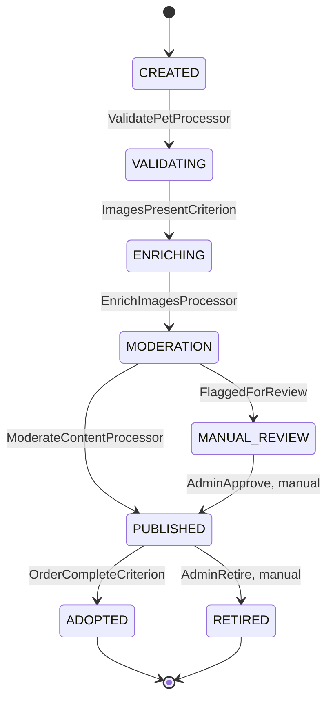
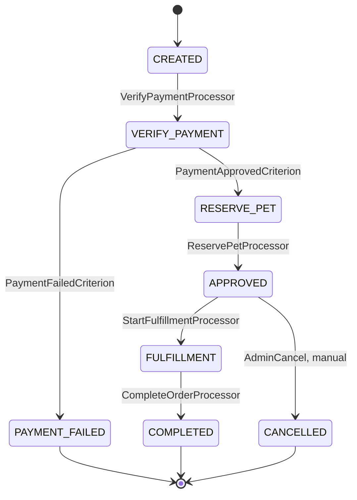
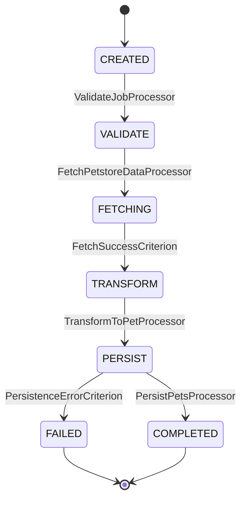

### 1. Entity Definitions
Pet:
- id: String (business id from Petstore)
- name: String (pet name)
- species: String (dog/cat/other)
- breed: String (breed info)
- age: Integer (years/months)
- status: String (available/adopted/pending)
- description: String (bio)
- images: Array[String] (image URLs)
- tags: Array[String] (search tags)
- source: String (origin, e.g., Petstore)

Order:
- orderId: String (business order identifier)
- userId: String (customer placing order)
- petId: String (reference to Pet.id)
- amount: Number (total)
- paymentStatus: String (pending/paid/failed)
- status: String (CREATED/APPROVED/DELIVERED/CANCELLED)
- shippingAddress: String
- placedAt: String (ISO datetime)

SyncJob:
- jobId: String (job identifier)
- source: String (Petstore)
- startedBy: String (system/admin)
- config: Object (query params, page size)
- status: String (CREATED/RUNNING/COMPLETED/FAILED)
- createdAt: String
- resultSummary: Object (counts/errors)

### 2. Entity workflows

Pet workflow:
1. Created (via SyncJob or manual admin add) -> Validation (automatic)
2. Enrichment (automatic): download/validate images, normalize tags
3. Moderation (automatic + manual): if flags -> Manual Review
4. Publish: mark as AVAILABLE or PENDING
5. Lifecycle: Adopted or Retired (manual admin or Order completion)


```mermaid
stateDiagram-v2
    [*] --> CREATED
    CREATED --> VALIDATING : ValidatePetProcessor
    VALIDATING --> ENRICHING : ImagesPresentCriterion
    ENRICHING --> MODERATION : EnrichImagesProcessor
    MODERATION --> PUBLISHED : ModerateContentProcessor
    MODERATION --> MANUAL_REVIEW : FlaggedForReview
    MANUAL_REVIEW --> PUBLISHED : AdminApprove, manual
    PUBLISHED --> ADOPTED : OrderCompleteCriterion
    PUBLISHED --> RETIRED : AdminRetire, manual
    ADOPTED --> [*]
    RETIRED --> [*]
```

Pet processors/criteria:
- Criteria: ImagesPresentCriterion, DataCompleteCriterion
- Processors: ValidatePetProcessor, EnrichImagesProcessor, ModerateContentProcessor, PublishNotifierProcessor

Order workflow:
1. CREATED on POST -> Payment Verification (automatic)
2. Reserve Pet (automatic) -> APPROVED
3. Fulfillment (manual/automatic): arrange delivery/adoption
4. COMPLETE or CANCELLED / FAILED


```mermaid
stateDiagram-v2
    [*] --> CREATED
    CREATED --> VERIFY_PAYMENT : VerifyPaymentProcessor
    VERIFY_PAYMENT --> PAYMENT_FAILED : PaymentFailedCriterion
    VERIFY_PAYMENT --> RESERVE_PET : PaymentApprovedCriterion
    RESERVE_PET --> APPROVED : ReservePetProcessor
    APPROVED --> FULFILLMENT : StartFulfillmentProcessor
    FULFILLMENT --> COMPLETED : CompleteOrderProcessor
    APPROVED --> CANCELLED : AdminCancel, manual
    PAYMENT_FAILED --> [*]
    COMPLETED --> [*]
    CANCELLED --> [*]
```

Order processors/criteria:
- Criteria: PaymentApprovedCriterion, PetAvailableCriterion
- Processors: VerifyPaymentProcessor, ReservePetProcessor, StartFulfillmentProcessor, CompleteOrderProcessor, NotifyUserProcessor

SyncJob workflow:
1. CREATED via POST -> Validate config -> FETCH
2. Fetch pages from Petstore -> Transform -> Persist Pets
3. On success -> COMPLETED; on errors -> FAILED (with partial results)


```mermaid
stateDiagram-v2
    [*] --> CREATED
    CREATED --> VALIDATE : ValidateJobProcessor
    VALIDATE --> FETCHING : FetchPetstoreDataProcessor
    FETCHING --> TRANSFORM : FetchSuccessCriterion
    TRANSFORM --> PERSIST : TransformToPetProcessor
    PERSIST --> COMPLETED : PersistPetsProcessor
    PERSIST --> FAILED : PersistenceErrorCriterion
    FAILED --> [*]
    COMPLETED --> [*]
```

SyncJob processors/criteria:
- Criteria: FetchSuccessCriterion, PersistenceSuccessCriterion
- Processors: ValidateJobProcessor, FetchPetstoreDataProcessor, TransformToPetProcessor, PersistPetsProcessor, NotifyCompletionProcessor

### 3. Pseudo code for processor classes (concise)

ValidatePetProcessor
```
class ValidatePetProcessor {
  process(pet) {
    if missing required fields -> mark pet.validationErrors and route to MANUAL_REVIEW
    else mark pet.validated = true
  }
}
```

EnrichImagesProcessor
```
class EnrichImagesProcessor {
  process(pet) {
    for url in pet.images -> verify accessible, generate thumbnail, store reference
    update pet.images with canonical urls
  }
}
```

VerifyPaymentProcessor
```
class VerifyPaymentProcessor {
  process(order) {
    call payment gateway (async)
    if paid -> set order.paymentStatus = paid
    else -> set paymentStatus = failed
  }
}
```

ReservePetProcessor
```
class ReservePetProcessor {
  process(order) {
    fetch pet by petId
    if pet.status == available -> set pet.status = pending; set order.status = APPROVED
    else -> fail order
  }
}
```

FetchPetstoreDataProcessor
```
class FetchPetstoreDataProcessor {
  process(job) {
    while pages remain {
      fetch page from Petstore using job.config
      emit transformed items to PersistPetsProcessor
    }
  }
}
```

PersistPetsProcessor
```
class PersistPetsProcessor {
  process(batch) {
    for item in batch -> upsert Pet entity into datastore
    collect counts/errors -> update job.resultSummary
  }
}
```

### 4. API Endpoints Design Rules

- POST /sync-jobs
  - Purpose: create SyncJob (triggers fetch)
  - Request -> returns only technicalId
```json
{ "source":"Petstore", "config": {"query":"cats","pageSize":50}, "startedBy":"system" }
```
Response
```json
{ "technicalId":"syncjob-xxxx" }
```

- GET /sync-jobs/{technicalId}
```json
{ "technicalId":"syncjob-xxxx", "jobId":"job-1", "status":"RUNNING", "resultSummary":{} }
```

- POST /orders
  - Purpose: create Order (triggers Order workflow)
```json
{ "userId":"user-1", "petId":"pet-123", "amount":199.99, "shippingAddress":"123 Lane" }
```
Response
```json
{ "technicalId":"order-abc" }
```

- GET /orders/{technicalId}
```json
{ "technicalId":"order-abc","orderId":"order-1","status":"CREATED","paymentStatus":"pending","petId":"pet-123" }
```

- GET /pets/{id}
```json
{ "id":"pet-123","name":"Mittens","species":"cat","status":"available","images":[ "..."] }
```

Notes and rules summary:
- POST endpoints trigger Cyoda workflows and must return only technicalId.
- GET endpoints only retrieve stored results.
- SyncJob and Order have POST + GET by technicalId. Pets are read via GET.
- Criteria and Processor classes listed above map to Cyoda process and criterion implementations; each entity persistence triggers the corresponding workflow automatically.