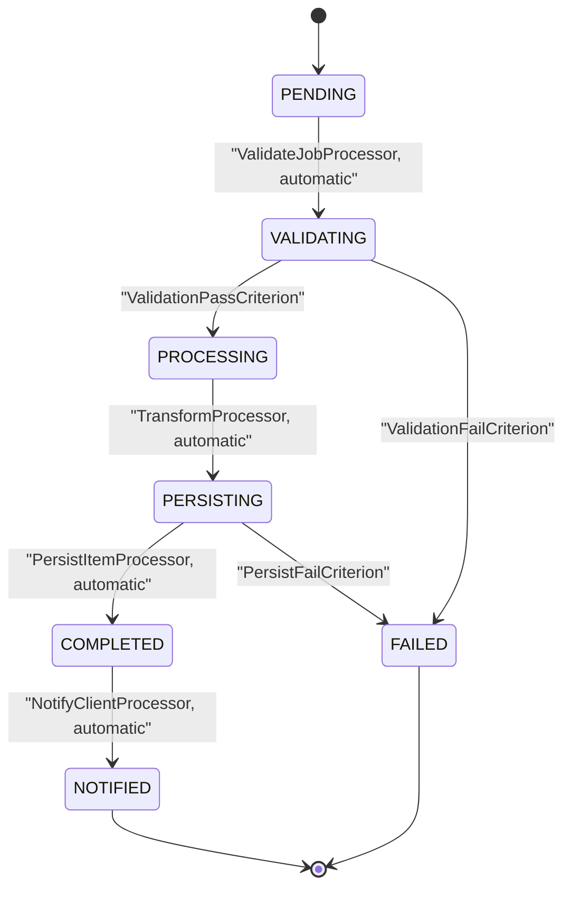
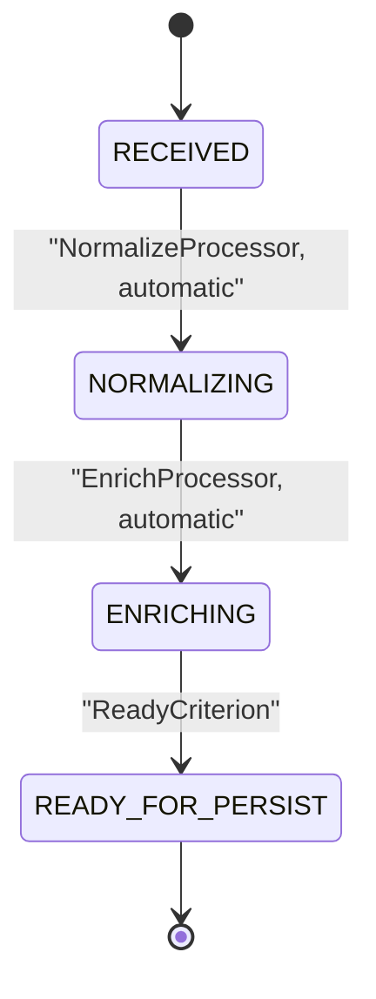
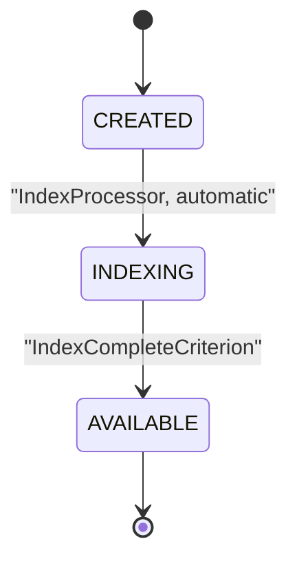

### 1. Entity Definitions
(Max entities used: 3 — if you want more, ask and I will expand)

```
IngestJob:
- hn_payload: JSON (Hacker News JSON payload received from client)
- client_id: String (optional identifier from caller)
- created_at: DateTime (time job was created)
- status: String (PENDING / VALIDATING / PROCESSING / COMPLETED / FAILED)
- stored_item_technicalId: String (filled when stored item is persisted)
- error_message: String (optional, filled on failure)

HNItem:
- id: Number (original HN id field if present)
- by: String (author)
- title: String (item title)
- time: Number (unix timestamp)
- type: String (story, comment, job, etc)
- url: String (optional)
- text: String (optional)
- kids: Array<Number> (child ids)
- score: Number (optional)
- descendants: Number (optional)
- raw_json: JSON (full original payload for fidelity)

StoredItem:
- hn_item: HNItem (canonical stored HN item)
- stored_at: DateTime (persistence time)
- storage_technicalId: String (datastore technical id returned by GET /items)
- size_bytes: Number (approx size of stored payload)
```

---

### 2. Entity workflows

In this EDA design the client creates an IngestJob (POST /ingest-jobs). Persisting IngestJob triggers its process method in Cyoda which runs the workflow automatically: validate payload, transform/normalize, persist as StoredItem, and notify job completion. StoredItem is a resulting business entity produced by the Job workflow.

IngestJob workflow:
1. Initial State: Job created with PENDING status (automatic on POST)
2. Validation: Validate JSON shape and required fields (automatic)
3. Processing: Transform/normalize and persist HNItem as StoredItem (automatic)
4. Completion: Update Job status to COMPLETED and set stored_item_technicalId, or FAILED on errors (automatic)
5. Notification: Job remains queryable via GET /jobs/{technicalId} and client can then GET /items/{storage_technicalId} (manual retrieval by client)

mermaid

```mermaid
stateDiagram-v2
    [*] --> PENDING
    PENDING --> VALIDATING : "ValidateJobProcessor, automatic"
    VALIDATING --> PROCESSING : "ValidationPassCriterion"
    VALIDATING --> FAILED : "ValidationFailCriterion"
    PROCESSING --> PERSISTING : "TransformProcessor, automatic"
    PERSISTING --> COMPLETED : "PersistItemProcessor, automatic"
    PERSISTING --> FAILED : "PersistFailCriterion"
    COMPLETED --> NOTIFIED : "NotifyClientProcessor, automatic"
    NOTIFIED --> [*]
    FAILED --> [*]
```

Processors and criteria needed for IngestJob:
- Processors: ValidateJobProcessor, TransformProcessor, PersistItemProcessor, NotifyClientProcessor
- Criteria: ValidationPassCriterion, ValidationFailCriterion, PersistFailCriterion

HNItem workflow (conceptual — HNItem is carried inside the Job; no public POST is required for HNItem itself):
1. Initial: HN JSON arrives inside IngestJob payload
2. Schema Normalize: Ensure fields are present or populate raw_json
3. Enrichment (optional): populate derived fields (e.g., normalized URL)
4. Hand-off to storage

mermaid

```mermaid
stateDiagram-v2
    [*] --> RECEIVED
    RECEIVED --> NORMALIZING : "NormalizeProcessor, automatic"
    NORMALIZING --> ENRICHING : "EnrichProcessor, automatic"
    ENRICHING --> READY_FOR_PERSIST : "ReadyCriterion"
    READY_FOR_PERSIST --> [*]
```

Processors/criteria for HNItem:
- Processors: NormalizeProcessor, EnrichProcessor
- Criteria: ReadyCriterion

StoredItem workflow:
1. Initial State: StoredItem created by PersistItemProcessor (status implicitly stored)
2. Indexing: Optionally create indexes/metadata (automatic)
3. Available: Stored item ready for retrieval by GET /items/{technicalId}

mermaid

```mermaid
stateDiagram-v2
    [*] --> CREATED
    CREATED --> INDEXING : "IndexProcessor, automatic"
    INDEXING --> AVAILABLE : "IndexCompleteCriterion"
    AVAILABLE --> [*]
```

Processors/criteria for StoredItem:
- Processors: PersistItemProcessor (creates StoredItem), IndexProcessor, AuditProcessor (optional)
- Criteria: IndexCompleteCriterion

---

### 3. Pseudo code for processor classes

ValidateJobProcessor
```
process(IngestJob job):
    if job.hn_payload is not valid JSON:
        job.status = FAILED
        job.error_message = "invalid json"
        persist(job)
        return
    if required fields missing (e.g., type and time or title for story):
        job.status = FAILED
        job.error_message = "missing required fields"
        persist(job)
        return
    job.status = PROCESSING
    persist(job)
```

TransformProcessor
```
process(IngestJob job):
    hn = job.hn_payload
    normalized = NormalizeProcessor.normalize(hn)
    job.hn_payload = normalized
    persist(job)
```

PersistItemProcessor
```
process(IngestJob job):
    stored = new StoredItem()
    stored.hn_item = job.hn_payload
    stored.stored_at = now()
    stored.storage_technicalId = generateTechnicalId()
    saveStoredItem(stored)
    job.stored_item_technicalId = stored.storage_technicalId
    job.status = COMPLETED
    persist(job)
```

NotifyClientProcessor
```
process(IngestJob job):
    if job.client_id present:
        createNotification(job.client_id, job.stored_item_technicalId)
    // job is already persisted as COMPLETED
```

IndexProcessor (for StoredItem)
```
process(StoredItem item):
    buildIndexes(item.hn_item)
    markIndexComplete(item)
    persist(item)
```

---

### 4. API Endpoints Design Rules

Notes:
- Max entities used: 3 (IngestJob, HNItem, StoredItem). If you want fewer or different entities, tell me and I will adapt.
- POST endpoints return only technicalId (the Cyoda datastore technical id). Client must GET job status to discover stored item id if needed.

1) Create Ingest Job (triggers event/workflow)
- POST /ingest-jobs
- Request: full HN JSON payload (wrapped as job body)
- Response: only technicalId

Request/Response:
```json
POST /ingest-jobs
Body:
{
  "hn_payload": { /* full Firebase HN JSON shape */ },
  "client_id": "optional-caller-id"
}

Response (201):
{
  "technicalId": "job_abc123"
}
```

2) Get Ingest Job by technicalId (retrieve job status and result)
- GET /jobs/{technicalId}
- Response: job details including status and stored_item_technicalId when available

```json
GET /jobs/job_abc123
Response (200):
{
  "technicalId": "job_abc123",
  "status": "COMPLETED",
  "created_at": "2025-08-22T12:00:00Z",
  "stored_item_technicalId": "item_def456",
  "error_message": null
}
```

3) Get Stored Item by technicalId (retrieve stored HN item)
- GET /items/{technicalId}

```json
GET /items/item_def456
Response (200):
{
  "technicalId": "item_def456",
  "stored_at": "2025-08-22T12:00:03Z",
  "hn_item": {
    "by": "pg",
    "id": 12345,
    "title": "Example",
    "time": 1354161176,
    "type": "story",
    "url": "https://example.com",
    "text": "..."
  }
}
```

Design rules summary:
- Only POST endpoint in this design: POST /ingest-jobs (orchestration entity). It triggers persistence of business entity StoredItem via processing.
- POST returns only technicalId.
- GET endpoints exist to retrieve Job and StoredItem by technicalId.
- No GET-by-condition endpoints included (not requested).
- Business logic (validation, transformation, persistence) is executed automatically by Cyoda when IngestJob is persisted (event-driven).

---

If you want the API to behave synchronously (POST returns the stored item technicalId directly) I can provide an alternative flow that performs inline processing and returns the item technicalId — tell me if you prefer that synchronous behavior.