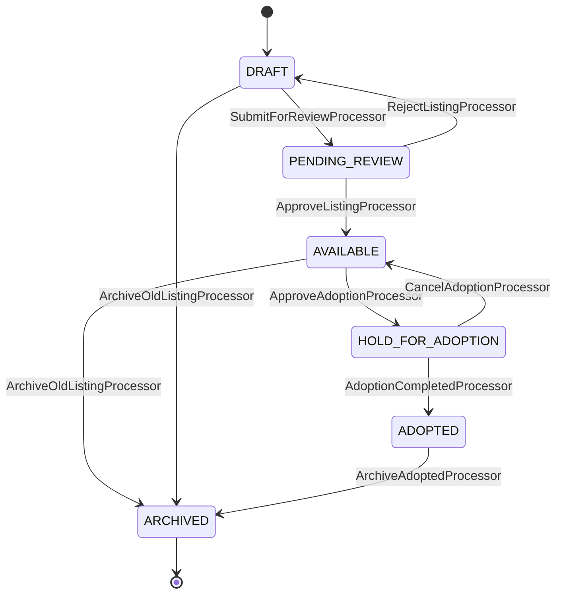
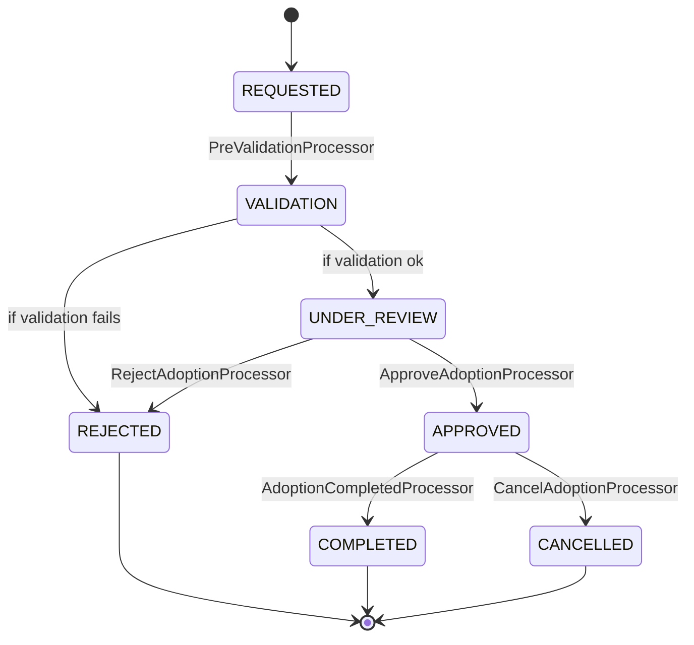

# Functional Requirements - Pet Adoption Prototype

Version: 1.1
Last updated: 2025-08-15

Purpose: capture domain entities, states/workflows, processors/criteria, API rules, and integration/orchestration behavior for the pet adoption prototype. This document updates and clarifies workflow logic and state transitions (notably pet reservation vs final adoption), archival rules, concurrency/race handling for adoption requests, and Job ingestion semantics.

---

## 1. Entities (domain model)

Notes: All timestamps are ISO8601 (UTC recommended). "id" fields are domain identifiers (business id). Every persisted record also receives a datastore technicalId that is returned by POST responses and used for subsequent GET operations.

- Pet:
  - id: String (domain identifier assigned by owner/system)
  - name: String
  - species: String
  - breed: String
  - ageMonths: Integer
  - gender: String (male/female/unknown)
  - status: String (one of: DRAFT, PENDING_REVIEW, AVAILABLE, HOLD_FOR_ADOPTION, ADOPTED, ARCHIVED)
  - images: List<String>
  - tags: List<String>
  - description: String
  - shelterId: String (nullable reference to Shelter)
  - ownerUserId: String (reference to User who listed the pet)
  - publishedAt: String (ISO8601 timestamp when listing became AVAILABLE)
  - createdAt: String
  - updatedAt: String
  - archivedReason: String (optional)

- User:
  - id: String
  - name: String
  - email: String
  - phone: String
  - address: String
  - role: String (guest/user/owner/admin)
  - verified: Boolean
  - createdAt: String
  - updatedAt: String

- AdoptionRequest:
  - id: String
  - petId: String
  - requesterUserId: String
  - status: String (REQUESTED, UNDER_REVIEW, APPROVED, REJECTED, CANCELLED, COMPLETED, FAILED)
  - notes: String (optional applicant notes)
  - rejectionReason: String (optional)
  - approvedAt: String (ISO8601 when admin approved)
  - completedAt: String (ISO8601 when adoption completed)
  - cancelledAt: String (ISO8601 when cancelled)
  - createdAt: String
  - updatedAt: String

- Category:
  - id: String
  - name: String
  - description: String
  - createdAt: String
  - updatedAt: String

- Review:
  - id: String
  - petId: String
  - userId: String
  - rating: Integer (1-5)
  - comment: String
  - status: String (SUBMITTED, PUBLISHED, FLAGGED, REMOVED)
  - createdAt: String
  - moderatedAt: String (optional)

- Shelter:
  - id: String
  - name: String
  - location: String
  - contactEmail: String
  - contactPhone: String
  - verified: Boolean
  - createdAt: String
  - updatedAt: String

- Appointment:
  - id: String
  - petId: String
  - userId: String
  - type: String (meet, grooming, vet, foster_transfer)
  - scheduledAt: String (ISO8601 datetime)
  - status: String (REQUESTED, CONFIRMED, COMPLETED, CANCELLED)
  - notes: String
  - createdAt: String
  - updatedAt: String

- Favorite:
  - id: String
  - petId: String
  - userId: String
  - createdAt: String

- Job (orchestration entity):
  - id: String
  - jobType: String (INGEST_PETSTORE_DATA, SEND_NOTIFICATIONS, CLEANUP, SYNC_SHELTERS, ...)
  - parameters: Map<String,Object>
  - status: String (PENDING, VALIDATING, RUNNING, COMPLETED, FAILED)
  - startedAt: String
  - finishedAt: String
  - resultSummary: String
  - createdAt: String
  - updatedAt: String

---

## 2. Global rules and conventions

- POST endpoints create domain records and MUST return only a technicalId (datastore id). The client-supplied domain id (id) can be accepted but must be validated for uniqueness.
- GET endpoints by technicalId are required for all entities created via POST.
- GET by condition/collection endpoints are provided only if explicitly requested by product teams (not enabled by default).
- Persistence of an entity emits an EntityCreated or EntityUpdated event (technicalId + entity type) which triggers the associated workflow processors.
- Manual transitions (approve/reject, verify, admin suspend) require authenticated callers with appropriate roles.
- Concurrency: adoption-related transitions must be implemented atomically to avoid race conditions (see AdoptionRequest section).

---

## 3. Pet workflow (revised)

Goal: Pet lifecycle now distinguishes reservation (HOLD_FOR_ADOPTION) from final adoption (ADOPTED). Approving an adoption request reserves the pet; the final adoption action or completion marks the pet ADOPTED.

States: DRAFT -> PENDING_REVIEW -> AVAILABLE -> HOLD_FOR_ADOPTION -> ADOPTED -> ARCHIVED

Steps:
1. DRAFT: Owner creates a Pet listing (POST). Listing may be incomplete (DRAFT).
2. Submit for Review: Owner triggers submission -> PENDING_REVIEW.
3. Review: Admin inspects; Approve -> AVAILABLE, Reject -> DRAFT.
4. AVAILABLE: Pet is visible and can receive AdoptionRequests.
5. Adoption approved: When an AdoptionRequest is APPROVED, the pet transitions to HOLD_FOR_ADOPTION (reservation) and the approving admin must record approvedAt and the related AdoptionRequest id.
6. Adoption completed: After required steps (meetings, paperwork), the responsible process sets PET -> ADOPTED and AdoptionRequest -> COMPLETED.
7. Cancellation or rejection: If an approved adoption is cancelled or expires, pet returns from HOLD_FOR_ADOPTION -> AVAILABLE.
8. Archived: Manual or automated archival of old/inactive listings.

State diagram (mermaid):

```mermaid
stateDiagram-v2
    [*] --> DRAFT
    DRAFT --> PENDING_REVIEW : SubmitForReviewProcessor
    PENDING_REVIEW --> AVAILABLE : ApproveListingProcessor
    PENDING_REVIEW --> DRAFT : RejectListingProcessor
    AVAILABLE --> HOLD_FOR_ADOPTION : ApproveAdoptionProcessor
    HOLD_FOR_ADOPTION --> ADOPTED : AdoptionCompletedProcessor
    HOLD_FOR_ADOPTION --> AVAILABLE : CancelAdoptionProcessor
    AVAILABLE --> ARCHIVED : ArchiveOldListingProcessor
    DRAFT --> ARCHIVED : ArchiveOldListingProcessor
    ADOPTED --> ARCHIVED : ArchiveAdoptedProcessor
    ARCHIVED --> [*]
```

Processors and logic summaries:
- SubmitForReviewProcessor:
  - Validate required listing fields (name, species, at least one image unless explicitly allowed)
  - Ensure ownerUserId exists
  - Set status = PENDING_REVIEW; update timestamps; persist; emit event

- ApproveListingProcessor:
  - Verify caller has admin role
  - Check IsOwnerVerifiedCriterion (owner.verified == true)
  - Set status = AVAILABLE; set publishedAt; updatedAt; persist; emit PetMadeAvailable event

- RejectListingProcessor:
  - Verify caller has admin role
  - Set status = DRAFT; record rejectionReason on an audit trail or comments; notify owner

- ApproveAdoptionProcessor (IMPORTANT change):
  - Verify admin role (or shelter/owner authorization as defined)
  - Atomically check IsPetAvailableCriterion (pet.status == AVAILABLE)
  - Set pet.status = HOLD_FOR_ADOPTION; record reservation metadata (approvedAt, adopterRequestId)
  - Set AdoptionRequest.status = APPROVED and approvedAt
  - Persist both entities in a single transactional update (or atomic operation) and emit AdoptionApproved event
  - Notify owner and requester

- CancelAdoptionProcessor:
  - Can be invoked by admin or requester (if cancellation allowed)
  - Set AdoptionRequest.status = CANCELLED (with cancelledAt)
  - If pet.status == HOLD_FOR_ADOPTION and holds the same request id, set pet.status = AVAILABLE
  - Persist and emit events

- AdoptionCompletedProcessor:
  - Validate required completion checks (paperwork, meetups done) via business rules/criteria
  - Set AdoptionRequest.status = COMPLETED and completedAt
  - Set pet.status = ADOPTED
  - Persist and emit AdoptionCompleted & PetAdopted events; notify both parties

- ArchiveOldListingProcessor (clarified rules):
  - Uses configurable thresholds (e.g., draftThresholdDays, availableStaleThresholdDays, adoptedArchiveDelayDays)
  - Archive rules examples:
    - DRAFT listings with no updates for draftThresholdDays -> ARCHIVED
    - AVAILABLE listings with no activity/owner response for availableStaleThresholdDays -> ARCHIVED (optional)
    - ADOPTED listings older than adoptedArchiveDelayDays -> ARCHIVED
  - When archiving, set archivedReason and updatedAt; emit PetArchived

Pet criteria:
- IsOwnerVerifiedCriterion: owner.verified == true
- IsPetAvailableCriterion: pet.status == AVAILABLE

Concurrency note: ApproveAdoptionProcessor must perform a read-modify-write under a lock or within a database transaction that verifies pet is still AVAILABLE to avoid double-approvals.

---

## 4. AdoptionRequest workflow (revised)

Purpose: ensure pre-validation rejects requests early; manual approval reserves pet (HOLD_FOR_ADOPTION); completion finalizes adoption.

States and transitions:

1. REQUESTED — created by user POST
2. VALIDATION (internal) — PreValidationProcessor runs automatic checks
3. UNDER_REVIEW — if validation passes
4. APPROVED — manual admin approval (also reserves pet to HOLD_FOR_ADOPTION)
5. COMPLETED — adoption finalized (sets pet.ADOPTED)
6. REJECTED / CANCELLED / FAILED — various termination states

State diagram:

```mermaid
stateDiagram-v2
    [*] --> REQUESTED
    REQUESTED --> VALIDATION : PreValidationProcessor
    VALIDATION --> UNDER_REVIEW : if validation ok
    VALIDATION --> REJECTED : if validation fails
    UNDER_REVIEW --> APPROVED : ApproveAdoptionProcessor
    UNDER_REVIEW --> REJECTED : RejectAdoptionProcessor
    APPROVED --> COMPLETED : AdoptionCompletedProcessor
    APPROVED --> CANCELLED : CancelAdoptionProcessor
    REJECTED --> [*]
    COMPLETED --> [*]
    CANCELLED --> [*]
```

Processors and details:
- PreValidationProcessor:
  - Checks:
    - IsPetAvailableCriterion (pet.status == AVAILABLE)
    - IsUserVerifiedCriterion (user.verified == true)
    - Any other business checks (e.g., requester already adopted X pets)
  - If any check fails, set AdoptionRequest.status = REJECTED and record rejectionReason; persist and emit event. Otherwise set status = UNDER_REVIEW and persist; emit AdoptionRequestUnderReview

- ApproveAdoptionProcessor (see Pet section):
  - Manual admin action that MUST reserve the pet and set AdoptionRequest.status = APPROVED
  - Persist both pet and request atomically

- RejectAdoptionProcessor:
  - Manual admin action to set status = REJECTED, record reason; notify requester

- AdoptionCompletedProcessor:
  - Per business rules, finalize adoption and set both entities to COMPLETED and ADOPTED respectively

Failure handling:
- If any system error occurs during processing, AdoptionRequest.status may be set to FAILED with diagnostic info

---

## 5. User workflow (slight clarifications)

States: CREATED -> VERIFIED -> (SUSPENDED) -> (DELETED)

Key processors:
- VerifyUserProcessor: triggers email/SMS verification flow; on success set verified = true
- AdminSuspendProcessor / AdminReinstateProcessor: manual admin transitions

Security: some actions (e.g., create Pet listing) require verified owner status to progress to AVAILABLE.

---

## 6. Other entity workflows (summaries)

Category:
- CREATED -> ACTIVE -> ARCHIVED
- ArchiveCategoryProcessor must ensure no active pets reference the category (CategoryInUseCriterion)

Review (moderation):
- SUBMITTED -> (AutoModerationProcessor) -> PUBLISHED or FLAGGED
- FLAGGED -> REMOVED (manual)
- AutoModerationProcessor uses ProfanityCheckCriterion and SpamCriterion

Shelter:
- CREATED -> VERIFIED -> INACTIVE -> ARCHIVED
- VerifyShelterProcessor validates contact info and optionally verifies ownership

Appointment:
- REQUESTED -> PRECHECK -> CONFIRMED -> (COMPLETED or CANCELLED)
- AppointmentPrecheckProcessor checks pet availability (IsPetAvailableCriterion) and schedule conflicts; if conflicts set CANCELLED or signal time negotiation

Favorite:
- CREATED -> ACTIVE -> REMOVED
- Prevent duplicate favorites (ActivateFavoriteProcessor must be idempotent)

Job:
- PENDING -> VALIDATING -> RUNNING -> (COMPLETED or FAILED) -> NOTIFY
- JobValidationProcessor ensures parameters are present; ExternalEndpointReachableCriterion can be used for ingestion jobs
- StartJobProcessor branches by jobType. For INGEST_PETSTORE_DATA: fetch external data, transform to domain Pet objects, and persist each Pet. Each Pet persistence triggers the Pet workflow.

---

## 7. API Endpoints and interaction rules (unchanged principles, clarified behaviors)

General rule: POST endpoints create domain entities and return only the datastore technicalId.

- POST /jobs
  - Creates Job and returns technicalId only
  - GET /jobs/{technicalId} returns job status and result metadata

- POST /pets
  - Request body contains domain Pet fields (domain id optional)
  - Response: { "technicalId": "petrec-<uuid>" }
  - Persisting a Pet emits event that starts Pet workflow
  - GET /pets/{technicalId} returns full persisted Pet record with status

- POST /users
  - Creates user -> returns technicalId
  - GET /users/{technicalId}

- POST /adoptionRequests
  - Creates AdoptionRequest -> returns technicalId
  - Persistence triggers PreValidationProcessor (automatic)
  - GET /adoptionRequests/{technicalId}

- POST /appointments, /favorites, /categories, /reviews, /shelters
  - Follow the same POST -> technicalId and GET by technicalId patterns

- GET collection endpoints (e.g., GET /pets?status=AVAILABLE) are optional and provided by explicit product requests only.

Examples: JSON request/response bodies are unchanged from prior document, except adoption approval now results in pet.status = HOLD_FOR_ADOPTION (not immediately ADOPTED).

---

## 8. Events and persistence model

- Every successful POST persists a domain record and returns technicalId.
- The system emits EntityCreated events carrying technicalId and entity type; orchestration (e.g., Cyoda) consumes events and runs processors.
- Processors may update entities and emit domain-specific events (PetMadeAvailable, AdoptionApproved, AdoptionCompleted, PetArchived, JobCompleted, JobFailed, etc.)

Event naming convention: <Entity><Action> e.g., PetMadeAvailable, AdoptionApproved, JobCompleted

---

## 9. Security and authorization

- Manual transitions (approve/reject listings, approve adoption, verify shelter/user) must validate caller's role (admin or delegated shelter manager).
- Processors that perform role-sensitive actions must assert caller identity/roles before performing modifications.
- Sensitive data (user contact info) must be protected in responses according to privacy rules.

---

## 10. Processors and Criteria (required)

Processors (high level):
- SubmitForReviewProcessor
- ApproveListingProcessor
- RejectListingProcessor
- ApproveAdoptionProcessor (reserves pet and approves request)
- CancelAdoptionProcessor
- AdoptionCompletedProcessor
- PreValidationProcessor
- RejectAdoptionProcessor
- PetstoreIngestProcessor (used by Job)
- JobValidationProcessor
- StartJobProcessor
- JobSuccessProcessor
- JobFailureProcessor
- JobNotificationProcessor
- AppointmentPrecheckProcessor
- AutoModerationProcessor
- ActivateFavoriteProcessor
- ArchiveOldListingProcessor

Criteria (high level):
- IsOwnerVerifiedCriterion
- IsPetAvailableCriterion
- HasRequiredParametersCriterion
- ExternalEndpointReachableCriterion
- ProfanityCheckCriterion
- SpamCriterion
- CategoryInUseCriterion

Concurrency & atomicity: any processor that modifies both AdoptionRequest and Pet state (e.g., ApproveAdoptionProcessor, CancelAdoptionProcessor, AdoptionCompletedProcessor) MUST perform updates atomically (single DB transaction or equivalent) to avoid race conditions.

---

## 11. Job ingestion specifics (clarified)

- The INGEST_PETSTORE_DATA job type accepts parameter "sourceUrl" (default: https://petstore.swagger.io/v2/pet) and optional batchSize.
- PetstoreIngestProcessor should:
  - Validate parameters (JobValidationProcessor)
  - Fetch records (paginated/batched)
  - Transform external items into domain Pet objects (ensure domain id uniqueness or generate ids)
  - Persist each Pet; persistence triggers Pet workflow per record
  - Record job.resultSummary (e.g., "ingested 123 pets; 10 skipped (duplicates); 2 failures")

Failure behavior: partial failures should be captured in job.resultSummary and job.status should be COMPLETED if the job finishes but with non-zero failures, or FAILED if execution couldn't complete.

---

## 12. Required Java classes (high level)

Processors (classes):
- SubmitForReviewProcessor
- ApproveListingProcessor
- RejectListingProcessor
- ApproveAdoptionProcessor
- CancelAdoptionProcessor
- AdoptionCompletedProcessor
- PreValidationProcessor
- RejectAdoptionProcessor
- PetstoreIngestProcessor
- JobValidationProcessor
- StartJobProcessor
- JobSuccessProcessor
- JobFailureProcessor
- JobNotificationProcessor
- AppointmentPrecheckProcessor
- AutoModerationProcessor
- ArchiveOldListingProcessor

Criteria (interfaces / classes):
- IsOwnerVerifiedCriterion
- IsPetAvailableCriterion
- HasRequiredParametersCriterion
- ExternalEndpointReachableCriterion
- ProfanityCheckCriterion
- SpamCriterion
- CategoryInUseCriterion

Interfaces:
- interface Processor { void process(EntityContext ctx); }
- interface Criterion { boolean test(EntityContext ctx); }

---

## 13. Backwards-compatibility and change log

This update clarifies and corrects earlier ambiguity where approving an adoption request directly set pet.status = ADOPTED. The correct flow is now:
- APPROVE -> HOLD_FOR_ADOPTION (reservation)
- COMPLETION -> ADOPTED (final)

Other clarifications:
- Archive rules made explicit and configurable.
- Atomicity requirements for adoption processors added to avoid double-reservations.

---

If you want the document to include additional diagrams, example event payloads, or more strict API schemas (OpenAPI), tell me which sections to expand.