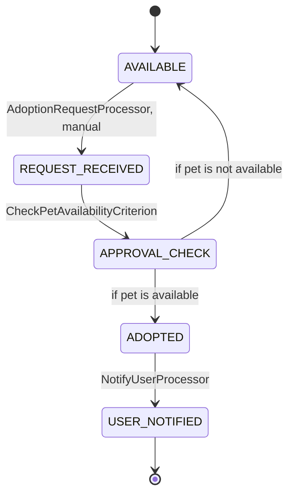
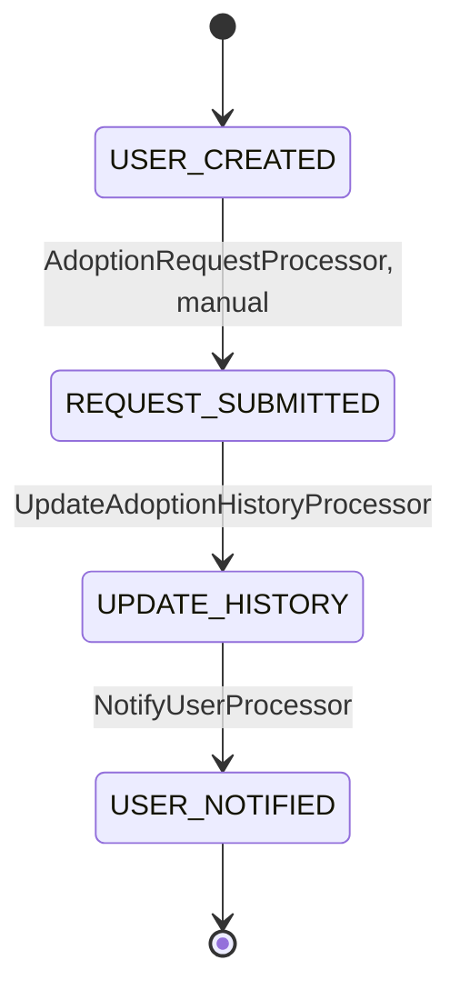
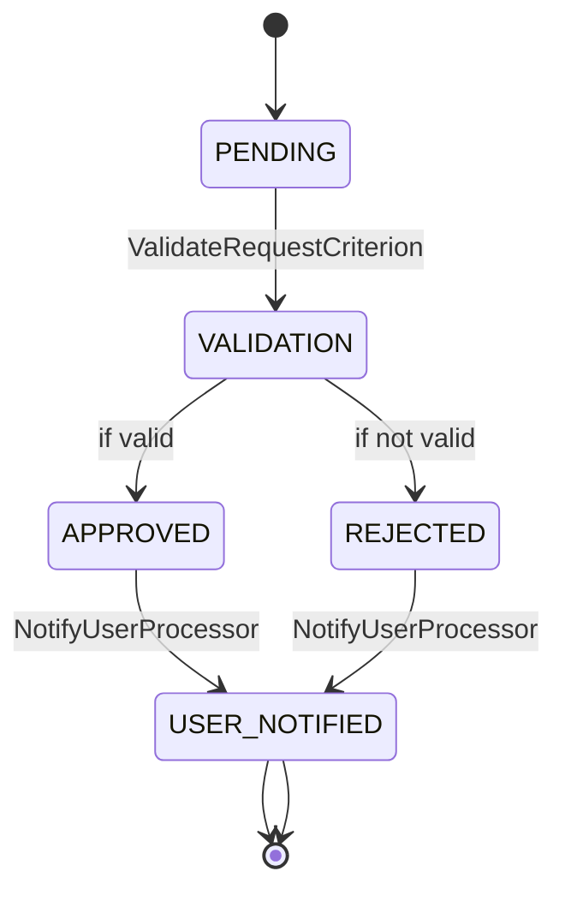

# Functional Requirements for 'Purrfect Pets' API App

This document outlines the functional requirements for the 'Purrfect Pets' API application using an Event-Driven Architecture (EDA) approach.

## 1. Entity Definitions

### Pet Entity (Implemented)
**Location**: `src/main/java/com/java_template/application/entity/pet/version_1/Pet.java`
```java
Pet:
- id: String (unique identifier for each pet)
- name: String (name of the pet)
- type: String (type of pet, e.g., cat, dog)
- age: Integer (age of the pet)
- breed: String (breed of the pet)
- status: String (adoption status, e.g., available, adopted)
```

### User Entity (Implemented)
**Location**: `src/main/java/com/java_template/application/entity/user/version_1/User.java`
```java
User:
- id: String (unique identifier for each user)
- username: String (name of the user)
- contactInfo: String (contact details of the user)
- adoptionHistory: String[] (array of pet IDs the user has adopted)
```

### AdoptionRequest Entity (Implemented)
**Location**: `src/main/java/com/java_template/application/entity/adoptionrequest/version_1/AdoptionRequest.java`
```java
AdoptionRequest:
- id: String (unique identifier for the adoption request)
- petId: String (ID of the pet being adopted)
- userId: String (ID of the user requesting the adoption)
- status: String (status of the request, e.g., pending, approved, rejected)
- requestDate: String (ISO date string when the request was made)
```

## 2. Entity Workflows

### Pet Workflow
```
1. Initial State: Pet created with AVAILABLE status
2. Adoption Request: User submits an adoption request
3. Approval: Check if pet is still available for adoption
4. Status Update: Update pet status to ADOPTED or remain AVAILABLE
5. Notification: Notify user of approval/rejection
```

### User Workflow
```
1. Initial State: User created
2. Adoption Request: User submits a request to adopt a pet
3. Update History: Add pet ID to adoptionHistory upon successful adoption
4. Notification: Notify user of successful adoption
```

### AdoptionRequest Workflow
```
1. Initial State: Request created with PENDING status
2. Validation: Validate user and pet availability
3. Processing: Update request status to APPROVED or REJECTED
4. Notification: Notify user of request status
```

### State Diagrams


```mermaid
stateDiagram-v2
    [*] --> AVAILABLE
    AVAILABLE --> REQUEST_RECEIVED : AdoptionRequestProcessor, manual
    REQUEST_RECEIVED --> APPROVAL_CHECK : CheckPetAvailabilityCriterion
    APPROVAL_CHECK --> ADOPTED : if pet is available
    APPROVAL_CHECK --> AVAILABLE : if pet is not available
    ADOPTED --> USER_NOTIFIED : NotifyUserProcessor
    USER_NOTIFIED --> [*]
```


```mermaid
stateDiagram-v2
    [*] --> USER_CREATED
    USER_CREATED --> REQUEST_SUBMITTED : AdoptionRequestProcessor, manual
    REQUEST_SUBMITTED --> UPDATE_HISTORY : UpdateAdoptionHistoryProcessor
    UPDATE_HISTORY --> USER_NOTIFIED : NotifyUserProcessor
    USER_NOTIFIED --> [*]
```


```mermaid
stateDiagram-v2
    [*] --> PENDING
    PENDING --> VALIDATION : ValidateRequestCriterion
    VALIDATION --> APPROVED : if valid
    VALIDATION --> REJECTED : if not valid
    APPROVED --> USER_NOTIFIED : NotifyUserProcessor
    USER_NOTIFIED --> [*]
    REJECTED --> USER_NOTIFIED : NotifyUserProcessor
    USER_NOTIFIED --> [*]
```

## 3. Implemented Processors and Criteria

### Processors (Implemented)

#### AdoptionRequestProcessor
**Location**: `src/main/java/com/java_template/application/processor/AdoptionRequestProcessor.java`
- **Purpose**: Handles adoption request processing
- **Business Logic**:
  - Sets request date if not provided (current timestamp)
  - Sets status to "PENDING" if not provided
  - Validates adoption request entity
- **Workflow Integration**: Used in Pet, User, and AdoptionRequest workflows

#### NotifyUserProcessor
**Location**: `src/main/java/com/java_template/application/processor/NotifyUserProcessor.java`
- **Purpose**: Sends notifications to users and logs system events
- **Business Logic**:
  - Detects entity type (User, Pet, or AdoptionRequest)
  - Sends appropriate notifications based on entity type
  - Logs notification details for audit trail
- **Workflow Integration**: Used in all workflows for user notification

#### UpdateAdoptionHistoryProcessor
**Location**: `src/main/java/com/java_template/application/processor/UpdateAdoptionHistoryProcessor.java`
- **Purpose**: Updates user's adoption history when pets are adopted
- **Business Logic**:
  - Extracts pet ID from request context
  - Adds pet ID to user's adoption history array
  - Prevents duplicate entries in adoption history
- **Workflow Integration**: Used in User workflow

### Criteria (Implemented)

#### CheckPetAvailabilityCriterion
**Location**: `src/main/java/com/java_template/application/criterion/CheckPetAvailabilityCriterion.java`
- **Purpose**: Validates if a pet is available for adoption
- **Business Logic**:
  - Checks if pet status is "AVAILABLE"
  - Returns success for available pets
  - Returns failure for "ADOPTED" or other statuses
- **Workflow Integration**: Used in Pet workflow for approval decisions

#### ValidateRequestCriterion
**Location**: `src/main/java/com/java_template/application/criterion/ValidateRequestCriterion.java`
- **Purpose**: Validates adoption request data and business rules
- **Business Logic**:
  - Validates required fields (petId, userId, status, requestDate)
  - Checks status is valid (PENDING, APPROVED, REJECTED)
  - Validates request date format and business rules
  - Rejects requests that are too old (>30 days) or in future
- **Workflow Integration**: Used in AdoptionRequest workflow for validation

## 4. API Endpoints Implementation

### Pet Controller (Implemented)
**Location**: `src/main/java/com/java_template/application/controller/pet/version_1/PetController.java`

#### Endpoints:
- **POST /pets**: Adds a pet. Returns `technicalId` and success message.
  - Request Body: Pet entity JSON
  - Response: `{"technicalId": "uuid", "message": "Pet added successfully"}`
  - Status: 201 Created on success, 500 on error

- **GET /pets/{technicalId}**: Retrieves pet details by `technicalId`.
  - Response: Pet entity JSON with embedded `technicalId`
  - Status: 200 OK on success, 404 if not found, 500 on error

- **GET /pets**: Retrieves all pets with pagination.
  - Query Parameters: `pageSize` (default: 100), `pageNumber` (default: 1)
  - Response: `{"count": number, "pets": [array of pet objects]}`
  - Status: 200 OK on success, 500 on error

- **PUT /pets/{technicalId}**: Updates a pet by `technicalId`.
  - Request Body: Updated Pet entity JSON
  - Response: `{"technicalId": "uuid", "message": "Pet updated successfully"}`
  - Status: 200 OK on success, 500 on error

- **DELETE /pets/{technicalId}**: Deletes a pet by `technicalId`.
  - Response: `{"technicalId": "uuid", "message": "Pet deleted successfully"}`
  - Status: 200 OK on success, 500 on error

### User Controller (Implemented)
**Location**: `src/main/java/com/java_template/application/controller/user/version_1/UserController.java`

#### Endpoints:
- **POST /users**: Adds a user. Returns `technicalId` and success message.
  - Request Body: User entity JSON
  - Response: `{"technicalId": "uuid", "message": "User added successfully"}`
  - Status: 201 Created on success, 500 on error

- **GET /users/{technicalId}**: Retrieves user details by `technicalId`.
  - Response: User entity JSON with embedded `technicalId`
  - Status: 200 OK on success, 404 if not found, 500 on error

- **GET /users**: Retrieves all users with pagination.
  - Query Parameters: `pageSize` (default: 100), `pageNumber` (default: 1)
  - Response: `{"count": number, "users": [array of user objects]}`
  - Status: 200 OK on success, 500 on error

- **PUT /users/{technicalId}**: Updates a user by `technicalId`.
  - Request Body: Updated User entity JSON
  - Response: `{"technicalId": "uuid", "message": "User updated successfully"}`
  - Status: 200 OK on success, 500 on error

- **DELETE /users/{technicalId}**: Deletes a user by `technicalId`.
  - Response: `{"technicalId": "uuid", "message": "User deleted successfully"}`
  - Status: 200 OK on success, 500 on error

### AdoptionRequest Controller (Implemented)
**Location**: `src/main/java/com/java_template/application/controller/adoptionrequest/version_1/AdoptionRequestController.java`

#### Endpoints:
- **POST /adoptionRequests**: Submits an adoption request. Returns `technicalId`.
  - Request Body: AdoptionRequest entity JSON
  - Response: `{"technicalId": "uuid", "message": "Adoption request submitted successfully"}`
  - Status: 201 Created on success, 500 on error

- **GET /adoptionRequests/{technicalId}**: Retrieves adoption request details by `technicalId`.
  - Response: AdoptionRequest entity JSON with embedded `technicalId`
  - Status: 200 OK on success, 404 if not found, 500 on error

- **GET /adoptionRequests**: Retrieves all adoption requests with pagination.
  - Query Parameters: `pageSize` (default: 100), `pageNumber` (default: 1)
  - Response: `{"count": number, "adoptionRequests": [array of adoption request objects]}`
  - Status: 200 OK on success, 500 on error

- **PUT /adoptionRequests/{technicalId}**: Updates an adoption request by `technicalId`.
  - Request Body: Updated AdoptionRequest entity JSON
  - Response: `{"technicalId": "uuid", "message": "Adoption request updated successfully"}`
  - Status: 200 OK on success, 500 on error

- **DELETE /adoptionRequests/{technicalId}**: Deletes an adoption request by `technicalId`.
  - Response: `{"technicalId": "uuid", "message": "Adoption request deleted successfully"}`
  - Status: 200 OK on success, 500 on error

## 5. Implementation Summary

This document provides a complete implementation framework for the 'Purrfect Pets' API app using an Event-Driven Architecture. All components have been implemented:

- **Entities**: Pet, User, AdoptionRequest with proper validation
- **Workflows**: JSON configurations defining state transitions and business logic
- **Processors**: AdoptionRequestProcessor, NotifyUserProcessor, UpdateAdoptionHistoryProcessor
- **Criteria**: CheckPetAvailabilityCriterion, ValidateRequestCriterion
- **Controllers**: Full REST API with CRUD operations for all entities
- **Error Handling**: Comprehensive error handling with proper HTTP status codes
- **Logging**: Detailed logging for debugging and audit trails

The implementation follows Cyoda's event-driven architecture patterns and integrates seamlessly with the workflow engine for automated business process execution.