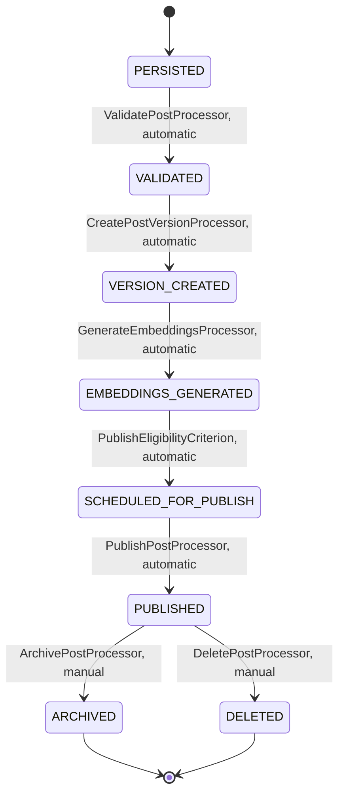
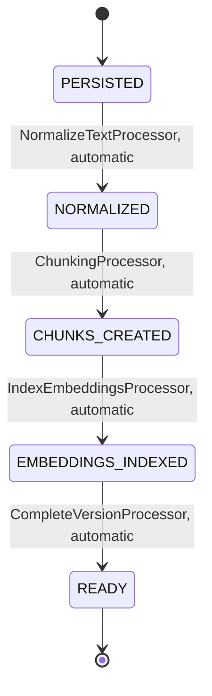
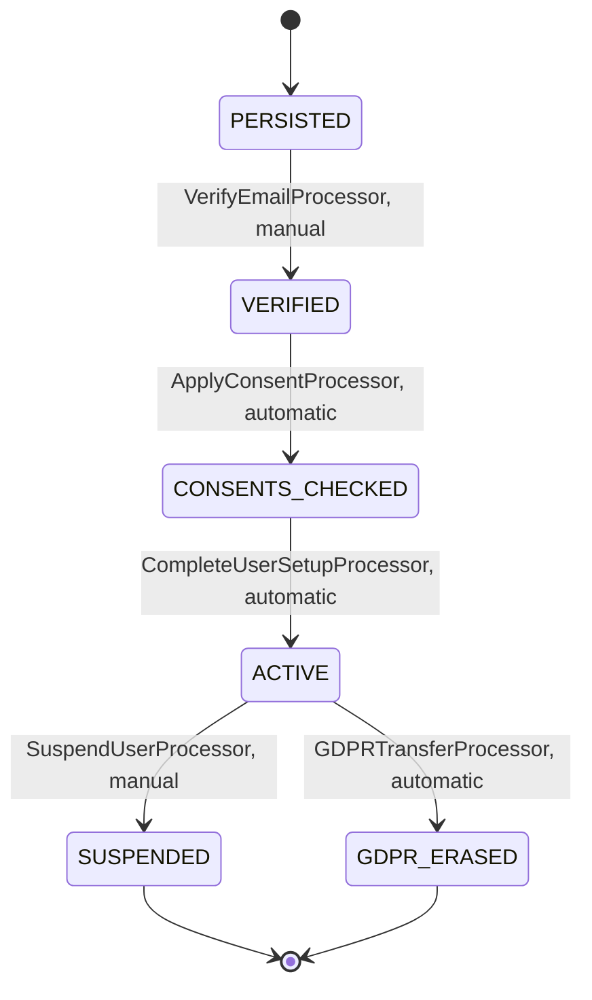
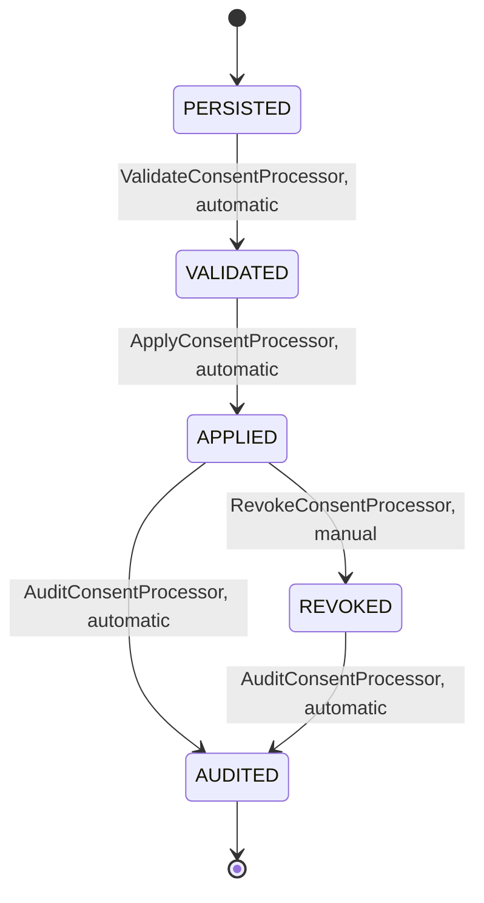
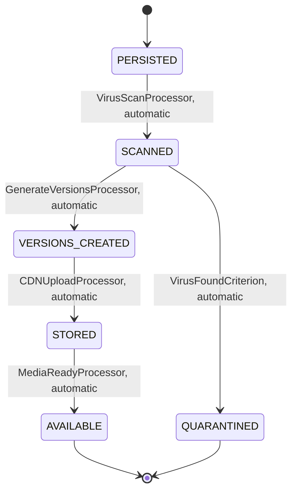
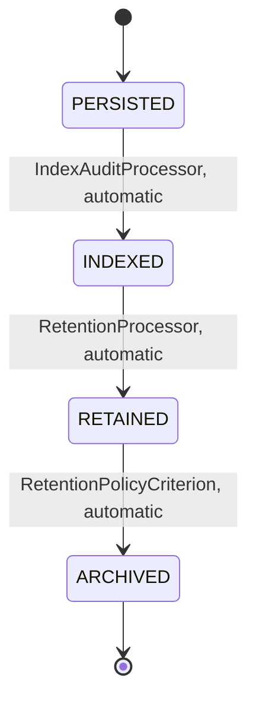

### 1. Entity Definitions
(Using only the entities you provided — 6 entities)

```
Post:
- id: String (canonical id)
- title: String (headline)
- slug: String (canonical URL fragment)
- summary: String (short summary)
- locale: String (content locale, e.g. en-GB)
- status: String (workflow state)
- current_version_id: String (ref to PostVersion)
- author_id: String (user who authored)
- owner_id: String (current owner; transfers to Admin on GDPR)
- tags: Array String (freeform tags)
- media_refs: Array String (refs to Media)
- publish_datetime: String (ISO timestamp optional for scheduled publish)
- published_at: String (ISO timestamp when published)
- cache_control: String (CDN directive)

PostVersion:
- version_id: String (id)
- post_id: String (parent Post)
- author_id: String (who edited this version)
- content_rich: String (editor content)
- normalized_text: String (plaintext normalized)
- chunks_meta: Array Object (plaintext chunk refs)
- embeddings_ref: String (vector store ref)
- change_summary: String
- created_at: String (ISO timestamp)

User:
- user_id: String
- email: String
- email_verified: Boolean
- profile: Object (name, locale, bio)
- marketing_flags: Object (marketing_enabled Boolean)
- owner_of_posts: Array String (post ids)
- gdpr_state: String
- audit_refs: Array String

Consent:
- consent_id: String
- user_id: String
- type: String (marketing/analytics)
- status: String
- evidence_ref: String
- requested_at: String
- granted_at: String
- revoked_at: String
- source: String

Media:
- media_id: String
- owner_id: String
- filename: String
- mime: String
- status: String
- versions: Array Object
- cdn_ref: String
- created_at: String

Audit:
- audit_id: String
- entity_ref: String (entity id + type)
- action: String
- actor_id: String
- timestamp: String
- evidence_ref: String
- metadata: Object
```

---

### 2. Entity workflows

General EDA rule: each entity persistence (POST or system-created) triggers Cyoda to start that entity's workflow (automatic and/or manual transitions). Processors perform actions; Criteria gate transitions.

Post workflow:
1. Initial State: PERSISTED (Post created or updated) — automatic
2. Validation: VALIDATED if required fields and author exist (automatic via ValidatePostProcessor)
3. Versioning: VERSION_CREATED (CreatePostVersionProcessor creates a PostVersion) — automatic
4. Embeddings: EMBEDDINGS_GENERATED (GenerateEmbeddingsProcessor). Also update search/index. — automatic
5. Scheduling: If publish_datetime present, SCHEDULED_FOR_PUBLISH (PublishEligibilityCriterion) — automatic; otherwise proceed to immediate publish if status requires
6. Published: PUBLISHED (PublishPostProcessor) — automatic or manual trigger
7. PostLifecycle: ARCHIVED or DELETED (manual admin actions; automatic GDPR transfer can set owner and archive)

Mermaid state diagram for Post:

```mermaid
stateDiagram-v2
    [*] --> PERSISTED
    PERSISTED --> VALIDATED : ValidatePostProcessor, automatic
    VALIDATED --> VERSION_CREATED : CreatePostVersionProcessor, automatic
    VERSION_CREATED --> EMBEDDINGS_GENERATED : GenerateEmbeddingsProcessor, automatic
    EMBEDDINGS_GENERATED --> SCHEDULED_FOR_PUBLISH : PublishEligibilityCriterion, automatic
    SCHEDULED_FOR_PUBLISH --> PUBLISHED : PublishPostProcessor, automatic
    PUBLISHED --> ARCHIVED : ArchivePostProcessor, manual
    PUBLISHED --> DELETED : DeletePostProcessor, manual
    ARCHIVED --> [*]
    DELETED --> [*]
```

Processors and criteria needed (Post):
- Criteria: AuthorExistsCriterion, PublishEligibilityCriterion
- Processors: ValidatePostProcessor, CreatePostVersionProcessor, GenerateEmbeddingsProcessor, PublishPostProcessor, ArchivePostProcessor

PostVersion workflow:
1. Initial State: PERSISTED (version saved)
2. Normalization: NORMALIZED (NormalizeTextProcessor) — automatic
3. Chunking: CHUNKS_CREATED (ChunkingProcessor) — automatic
4. Indexing: EMBEDDINGS_INDEXED (IndexEmbeddingsProcessor) — automatic
5. READY: READY (available for search, diff, and linking to Post.current_version_id)

Mermaid for PostVersion:

```mermaid
stateDiagram-v2
    [*] --> PERSISTED
    PERSISTED --> NORMALIZED : NormalizeTextProcessor, automatic
    NORMALIZED --> CHUNKS_CREATED : ChunkingProcessor, automatic
    CHUNKS_CREATED --> EMBEDDINGS_INDEXED : IndexEmbeddingsProcessor, automatic
    EMBEDDINGS_INDEXED --> READY : CompleteVersionProcessor, automatic
    READY --> [*]
```

Processors and criteria (PostVersion):
- Criteria: ContentSizeCriterion (optional, to split very large versions)
- Processors: NormalizeTextProcessor, ChunkingProcessor, IndexEmbeddingsProcessor, CompleteVersionProcessor

User workflow:
1. Initial State: PERSISTED (user created)
2. Verification: VERIFIED (VerifyEmailProcessor/manual verification) — manual or automatic depending on flow
3. Consent Check: CONSENTS_CHECKED (ApplyConsentProcessor) — automatic on creation or update
4. Active: ACTIVE (normal user state) — automatic
5. Suspension/GDPR_ERASED: SUSPENDED or GDPR_ERASED (manual admin or GDPRTransferProcessor) — manual or automatic on GDPR request

Mermaid for User:

```mermaid
stateDiagram-v2
    [*] --> PERSISTED
    PERSISTED --> VERIFIED : VerifyEmailProcessor, manual
    VERIFIED --> CONSENTS_CHECKED : ApplyConsentProcessor, automatic
    CONSENTS_CHECKED --> ACTIVE : CompleteUserSetupProcessor, automatic
    ACTIVE --> SUSPENDED : SuspendUserProcessor, manual
    ACTIVE --> GDPR_ERASED : GDPRTransferProcessor, automatic
    SUSPENDED --> [*]
    GDPR_ERASED --> [*]
```

Processors and criteria (User):
- Criteria: EmailVerifiedCriterion, GDPRRequestCriterion
- Processors: VerifyEmailProcessor, CreateProfileProcessor, ApplyConsentProcessor, GDPRTransferProcessor

Consent workflow:
1. Initial State: PERSISTED (consent record created)
2. Validation: VALIDATED (ValidateConsentProcessor) — automatic
3. Applied: APPLIED (consent effect applied to user marketing flags) — automatic
4. Revoked: REVOKED (RevokeConsentProcessor) — manual or automatic on revoke event
5. Audit: AUDITED (AuditConsentProcessor logs evidence) — automatic

Mermaid for Consent:

```mermaid
stateDiagram-v2
    [*] --> PERSISTED
    PERSISTED --> VALIDATED : ValidateConsentProcessor, automatic
    VALIDATED --> APPLIED : ApplyConsentProcessor, automatic
    APPLIED --> REVOKED : RevokeConsentProcessor, manual
    APPLIED --> AUDITED : AuditConsentProcessor, automatic
    REVOKED --> AUDITED : AuditConsentProcessor, automatic
    AUDITED --> [*]
```

Processors and criteria (Consent):
- Criteria: ConsentTypeCriterion
- Processors: ValidateConsentProcessor, ApplyConsentProcessor, RevokeConsentProcessor, AuditConsentProcessor

Media workflow:
1. Initial State: PERSISTED (upload recorded)
2. Scan: SCANNED (VirusScanProcessor) — automatic
3. Processing: VERSIONS_CREATED (GenerateVersionsProcessor) — automatic
4. CDN: STORED (CDNUploadProcessor) — automatic
5. Available or QUARANTINED: AVAILABLE or QUARANTINED (based on scan result; MimeTypeCriterion)

Mermaid for Media:

```mermaid
stateDiagram-v2
    [*] --> PERSISTED
    PERSISTED --> SCANNED : VirusScanProcessor, automatic
    SCANNED --> VERSIONS_CREATED : GenerateVersionsProcessor, automatic
    VERSIONS_CREATED --> STORED : CDNUploadProcessor, automatic
    STORED --> AVAILABLE : MediaReadyProcessor, automatic
    SCANNED --> QUARANTINED : VirusFoundCriterion, automatic
    AVAILABLE --> [*]
    QUARANTINED --> [*]
```

Processors and criteria (Media):
- Criteria: MimeTypeCriterion, VirusFoundCriterion
- Processors: VirusScanProcessor, GenerateVersionsProcessor, CDNUploadProcessor, MediaReadyProcessor

Audit workflow:
1. Initial State: PERSISTED (audit record created)
2. Indexing: INDEXED (IndexAuditProcessor) — automatic
3. Retention: RETAINED (RetentionProcessor) — automatic until retention expiry
4. Expired/Archived: ARCHIVED or EXPIRED (RetentionPolicyCriterion) — automatic

Mermaid for Audit:

```mermaid
stateDiagram-v2
    [*] --> PERSISTED
    PERSISTED --> INDEXED : IndexAuditProcessor, automatic
    INDEXED --> RETAINED : RetentionProcessor, automatic
    RETAINED --> ARCHIVED : RetentionPolicyCriterion, automatic
    ARCHIVED --> [*]
```

Processors and criteria (Audit):
- Criteria: RetentionPolicyCriterion
- Processors: IndexAuditProcessor, RetentionProcessor

---

### 3. Pseudo code for processor classes
(Keep processors focused on business behaviour; Cyoda will call these when entity is persisted.)

ValidatePostProcessor
```text
class ValidatePostProcessor {
  void process(Post post) {
    if (post.title == null || post.author_id == null) {
      throw ValidationException("title and author required");
    }
    if (!AuthorExistsCriterion.check(post.author_id)) {
      throw ValidationException("author not found");
    }
    post.status = "VALIDATED";
    persist(post);
  }
}
```

CreatePostVersionProcessor
```text
class CreatePostVersionProcessor {
  void process(Post post) {
    PostVersion v = new PostVersion();
    v.version_id = generateId();
    v.post_id = post.id;
    v.author_id = post.author_id;
    v.content_rich = fetchEditorContent(post);
    v.created_at = now();
    persist(v);
    post.current_version_id = v.version_id;
    persist(post);
  }
}
```

GenerateEmbeddingsProcessor
```text
class GenerateEmbeddingsProcessor {
  void process(PostVersion version) {
    version.normalized_text = NormalizeTextProcessor.normalize(version.content_rich);
    List chunks = ChunkingProcessor.chunk(version.normalized_text);
    version.chunks_meta = createChunksMeta(chunks);
    version.embeddings_ref = indexEmbeddings(chunks);
    persist(version);
  }
}
```

PublishPostProcessor
```text
class PublishPostProcessor {
  void process(Post post) {
    if (!PublishEligibilityCriterion.check(post)) return;
    post.published_at = now();
    post.status = "PUBLISHED";
    persist(post);
    AuditProcessor.log(post.id, "PUBLISHED", currentActor());
  }
}
```

VirusScanProcessor (Media)
```text
class VirusScanProcessor {
  void process(Media media) {
    boolean clean = scanFile(media);
    if (!clean) {
      media.status = "QUARANTINED";
      persist(media);
      AuditProcessor.log(media.media_id, "QUARANTINED", "system");
      return;
    }
    media.status = "SCANNED";
    persist(media);
  }
}
```

IndexAuditProcessor
```text
class IndexAuditProcessor {
  void process(Audit audit) {
    indexToSearch(audit);
    persist(audit);
  }
}
```

---

### 4. API Endpoints Design Rules (following Cyoda POST event pattern)

Rules summary:
- POST endpoints create entities and trigger Cyoda workflows.
- POST must return only the generated technicalId (datastore imitated id) in response.
- GET by technicalId must be available for entities created via POST and for other stored results.
- GET endpoints are read-only.

Entities with public POST endpoints (user-provided business actions): Post, User, Media, Consent
Entities created by processors (no public POST required): PostVersion, Audit (readable via GET)

Example endpoints and JSON formats:

1) Create Post (triggers Post workflow)
POST /posts
Request:
```json
{
  "id": "post-123",
  "title": "How to write event driven systems",
  "slug": "how-to-write-event-driven-systems",
  "summary": "Short summary",
  "locale": "en-GB",
  "author_id": "user-42",
  "tags": ["eda","cms"],
  "media_refs": ["media-1"],
  "publish_datetime": "2025-09-01T10:00:00Z"
}
```
Response (must return only technicalId):
```json
{
  "technicalId": "tx-post-0001"
}
```

GET Post by technicalId:
GET /posts/tx-post-0001
Response:
```json
{
  "technicalId": "tx-post-0001",
  "entity": {
    "id": "post-123",
    "title": "How to write event driven systems",
    "slug": "how-to-write-event-driven-systems",
    "status": "PERSISTED",
    "...": "other fields as stored"
  }
}
```

2) Create User (triggers User workflow)
POST /users
Request:
```json
{
  "user_id": "user-42",
  "email": "alice@example.com",
  "profile": {"name":"Alice","locale":"en-GB"}
}
```
Response:
```json
{
  "technicalId": "tx-user-0001"
}
```

GET User by technicalId:
GET /users/tx-user-0001
Response:
```json
{
  "technicalId": "tx-user-0001",
  "entity": { "user_id":"user-42", "email":"alice@example.com", "email_verified": false, "...": {} }
}
```

3) Upload Media (triggers Media workflow)
POST /media
Request:
```json
{
  "media_id": "media-1",
  "owner_id": "user-42",
  "filename": "hero.jpg",
  "mime": "image/jpeg"
}
```
Response:
```json
{
  "technicalId": "tx-media-0001"
}
```

GET Media by technicalId:
GET /media/tx-media-0001
Response:
```json
{
  "technicalId": "tx-media-0001",
  "entity": { "media_id":"media-1", "status":"STORED", "...": {} }
}
```

4) Create Consent (triggers Consent workflow)
POST /consents
Request:
```json
{
  "consent_id": "cons-987",
  "user_id": "user-42",
  "type": "marketing",
  "status": "requested",
  "source": "web_form"
}
```
Response:
```json
{
  "technicalId": "tx-consent-0001"
}
```

GET Consent by technicalId:
GET /consents/tx-consent-0001
Response:
```json
{
  "technicalId": "tx-consent-0001",
  "entity": { "consent_id":"cons-987", "status":"APPLIED", "...": {} }
}
```

5) Read-only GET endpoints for system-created entities
GET /post_versions/{technicalId}
GET /audits/{technicalId}
Responses return technicalId and stored entity payload.

Notes:
- POST endpoints trigger Cyoda to start the corresponding entity workflow automatically.
- POST responses must contain only technicalId; all status and results are observable via GET by technicalId.
- Business rule: any external data source or heavy processing (embeddings, CDN upload, scans) is executed inside processors kicked off by Cyoda workflows on persistence.

If you want, we can now:
- Trim or expand workflows (e.g., add editorial review steps for Post),
- Add role-based manual transitions (editor approvals) or
- Produce a compact list of processor/criterion class names to hand to Cyoda.

Which next step would you like?