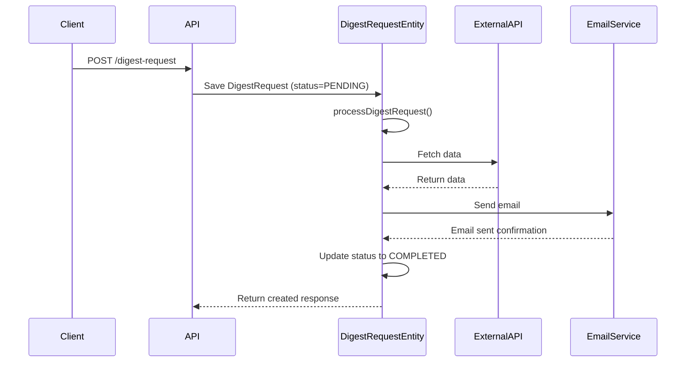

### 1. Entity Definitions

``` 
DigestRequest:
- id: UUID (unique identifier)
- userId: String (user who requested the digest)
- requestTime: DateTime (when the digest was requested)
- status: StatusEnum {PENDING, PROCESSING, COMPLETED, FAILED} (lifecycle state)
- externalApiUrl: String (API endpoint to retrieve data)
- emailRecipients: List<String> (email addresses to send digest)
- emailTemplateId: String (optional template identifier for email content)
- createdAt: DateTime
- updatedAt: DateTime
```

### 2. Process Method Flows

```
processDigestRequest() Flow:
1. Initial State: DigestRequest created with PENDING status.
2. Validation: Confirm externalApiUrl and emailRecipients are valid.
3. Fetch Data: Call external API to retrieve required data.
4. Data Processing: Transform/format the retrieved data as needed.
5. Email Dispatch: Generate email content (using template if provided) and send to recipients.
6. Completion: Update status to COMPLETED if all steps succeed or FAILED on error.
7. Notification: Optionally log or emit event for downstream systems.
```

### 3. API Endpoints & Request/Response Formats

- **POST /digest-request**  
  Request:  
  ```json
  {
    "userId": "user123",
    "externalApiUrl": "https://api.example.com/data",
    "emailRecipients": ["user@example.com"],
    "emailTemplateId": "template_basic"
  }
  ```  
  Response:  
  ```json
  {
    "id": "uuid-generated",
    "status": "PENDING",
    "createdAt": "2024-06-01T12:00:00Z"
  }
  ```

- **GET /digest-request/{id}**  
  Response:  
  ```json
  {
    "id": "uuid-generated",
    "userId": "user123",
    "status": "COMPLETED",
    "requestTime": "2024-06-01T12:00:00Z",
    "emailRecipients": ["user@example.com"],
    "createdAt": "2024-06-01T12:00:00Z",
    "updatedAt": "2024-06-01T12:30:00Z"
  }
  ```

### 4. Visual Representations

**Entity Lifecycle State Diagram**


```mermaid
stateDiagram-v2
    [*] --> PENDING
    PENDING --> PROCESSING : processDigestRequest()
    PROCESSING --> COMPLETED : success
    PROCESSING --> FAILED : error
    COMPLETED --> [*]
    FAILED --> [*]
```

**Event-Driven Processing Chain**


```mermaid
sequenceDiagram
    participant Client
    participant API
    participant DigestRequestEntity
    participant ExternalAPI
    participant EmailService

    Client->>API: POST /digest-request
    API->>DigestRequestEntity: Save DigestRequest (status=PENDING)
    DigestRequestEntity->>DigestRequestEntity: processDigestRequest()
    DigestRequestEntity->>ExternalAPI: Fetch data
    ExternalAPI-->>DigestRequestEntity: Return data
    DigestRequestEntity->>EmailService: Send email
    EmailService-->>DigestRequestEntity: Email sent confirmation
    DigestRequestEntity->>DigestRequestEntity: Update status to COMPLETED
    DigestRequestEntity-->>API: Return created response
```

---

If you have no further questions, I will finish the discussion.  
Thank you for working together on this!