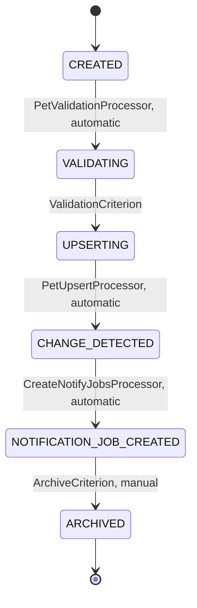
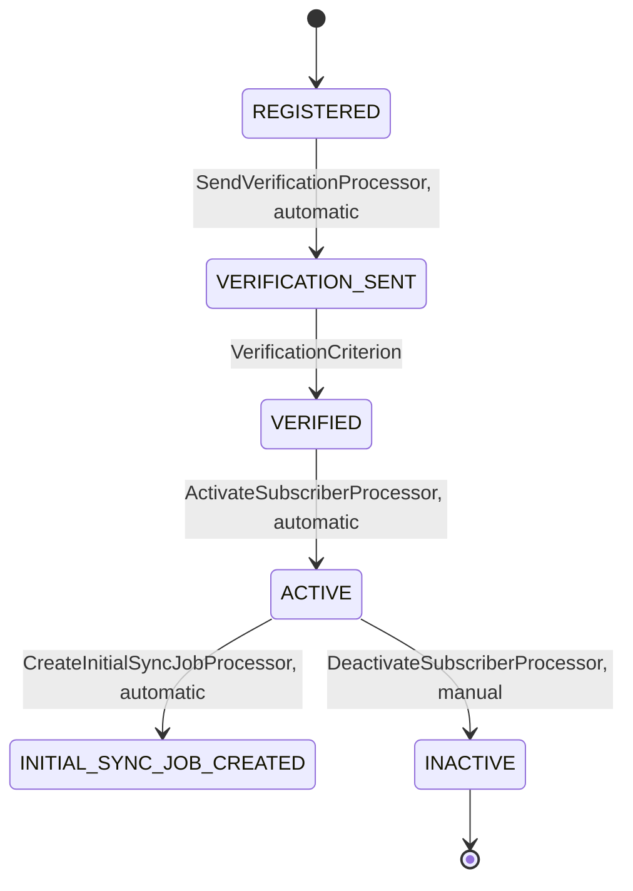
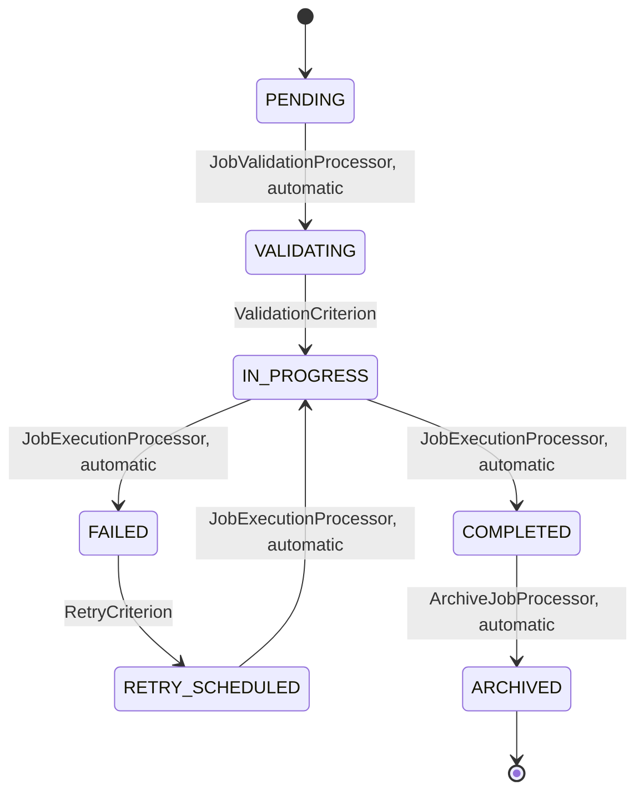

### 1. Entity Definitions
```
Pet:
- id: String (internal id assigned by datastore)
- sourceId: String (id from Petstore API)
- name: String (pet name)
- species: String (e.g., cat, dog)
- breed: String (breed description)
- age: Number (age in years or months)
- status: String (available adopted foster etc.)
- tags: Array<String> (keywords like kitten friendly)
- images: Array<String> (image URLs)
- description: String (free text)
- sourceUpdatedAt: String (timestamp from source)
- createdAt: String (record created timestamp)
- updatedAt: String (record updated timestamp)

Subscriber:
- id: String (internal id)
- name: String (subscriber display name)
- contactType: String (email webhook sms)
- contactDetails: String (email address or webhook URL or phone)
- preferences: Object (species: Array<String>, tags: Array<String>, frequency: String immediate digest)
- verified: Boolean (contact verification state)
- active: Boolean (subscribed state)
- createdAt: String
- updatedAt: String

Job:
- id: String (internal id)
- type: String (ingest notify)
- status: String (pending in_progress completed failed)
- payload: Object (job-specific data, e.g., ingest parameters or notification payload)
- petIds: Array<String> (related pet ids)
- subscriberIds: Array<String> (related subscriber ids)
- scheduledAt: String (when to run)
- attempts: Number
- lastError: String
- result: Object
- createdAt: String
- updatedAt: String
```

### 2. Entity workflows

Pet workflow:
1. Initial State: Pet record created/updated by an ingest Job (EVENT)
2. Validate Source Data: apply data sanity checks (automatic)
3. Upsert & Enrich: merge with existing pet, enrich tags/images (automatic)
4. Change Detection: determine NEW / UPDATED / REMOVED status and mark delta (automatic)
5. Notify Orchestrator: emit notifications by creating notify Jobs for matching subscribers (automatic)
6. Archived: manual or automatic archival for removed/old records (manual/automatic)


```mermaid
stateDiagram-v2
    [*] --> CREATED
    CREATED --> VALIDATING : PetValidationProcessor, automatic
    VALIDATING --> UPSERTING : ValidationCriterion
    UPSERTING --> CHANGE_DETECTED : PetUpsertProcessor, automatic
    CHANGE_DETECTED --> NOTIFICATION_JOB_CREATED : CreateNotifyJobsProcessor, automatic
    NOTIFICATION_JOB_CREATED --> ARCHIVED : ArchiveCriterion, manual
    ARCHIVED --> [*]
```

Pet workflow - criteria and processors:
- Criteria: ValidationCriterion (checks required fields), ChangeDetectionCriterion (detects new vs updated)
- Processors: PetValidationProcessor, PetUpsertProcessor, TagEnrichmentProcessor, CreateNotifyJobsProcessor

Subscriber workflow:
1. Initial State: Subscriber POST registered (EVENT)
2. Verify Contact: send verification challenge (automatic)
3. Activate: mark verified and active (automatic)
4. Initial Sync Option: if requested, create a Job to find current matching pets (manual trigger option) (automatic when requested)
5. Update Preferences / Deactivate: manual updates by user (manual)


```mermaid
stateDiagram-v2
    [*] --> REGISTERED
    REGISTERED --> VERIFICATION_SENT : SendVerificationProcessor, automatic
    VERIFICATION_SENT --> VERIFIED : VerificationCriterion
    VERIFIED --> ACTIVE : ActivateSubscriberProcessor, automatic
    ACTIVE --> INITIAL_SYNC_JOB_CREATED : CreateInitialSyncJobProcessor, automatic
    ACTIVE --> INACTIVE : DeactivateSubscriberProcessor, manual
    INACTIVE --> [*]
```

Subscriber workflow - criteria and processors:
- Criteria: VerificationCriterion (checks verification response)
- Processors: SendVerificationProcessor, ActivateSubscriberProcessor, CreateInitialSyncJobProcessor, UpdatePreferencesProcessor

Job workflow:
1. Initial State: Job created via POST or by system (EVENT)
2. Validate Job: check parameters and required resources (automatic)
3. Execute: perform ingest or notify work (automatic)
4. Success / Failure: mark job completed or failed (automatic)
5. Retry or Escalate: retry according to policy or escalate (automatic)
6. Completed: archived and produce metrics/notifications (automatic)


```mermaid
stateDiagram-v2
    [*] --> PENDING
    PENDING --> VALIDATING : JobValidationProcessor, automatic
    VALIDATING --> IN_PROGRESS : ValidationCriterion
    IN_PROGRESS --> COMPLETED : JobExecutionProcessor, automatic
    IN_PROGRESS --> FAILED : JobExecutionProcessor, automatic
    FAILED --> RETRY_SCHEDULED : RetryCriterion
    RETRY_SCHEDULED --> IN_PROGRESS : JobExecutionProcessor, automatic
    COMPLETED --> ARCHIVED : ArchiveJobProcessor, automatic
    ARCHIVED --> [*]
```

Job workflow - criteria and processors:
- Criteria: ValidationCriterion (job params), RetryCriterion (attempts limit/backoff)
- Processors: JobValidationProcessor, JobExecutionProcessor (ingest or notify dispatcher), RetrySchedulerProcessor, ArchiveJobProcessor

### 3. Pseudo code for processor classes

PetValidationProcessor
```
process(pet):
  if missing required fields then mark pet.invalid and set lastError
  else set pet.valid = true
  return pet
```

PetUpsertProcessor
```
process(pet):
  existing = findBySourceId(pet.sourceId)
  if existing == null then insert pet and mark delta = new
  else merge fields, update timestamps, compute delta = updatedFields
  save pet
  if delta present then emit CreateNotifyJobsEvent with pet.id and delta
```

CreateNotifyJobsProcessor
```
process(pet):
  subs = findSubscribersMatching(pet)
  for each sub in subs:
    if dedupWindowNotViolated(sub,pet) then
      create Job type notify with petId and subscriberId
```

SendVerificationProcessor
```
process(subscriber):
  send verification message to subscriber.contactDetails
  set subscriber.verificationSentAt
```

JobValidationProcessor
```
process(job):
  verify job.type and payload present
  if invalid set job.status = failed
```

JobExecutionProcessor
```
process(job):
  if job.type == ingest:
    call Petstore fetch using payload.params
    for each item produce Pet entity persistence (triggers Pet workflow)
  if job.type == notify:
    for each subscriberId in job:
      build notification payload
      attempt delivery
      record attempt result
  update job.status = completed or failed
```

RetrySchedulerProcessor
```
process(job):
  if job.attempts < maxAttempts:
    schedule job.scheduledAt = now + backoff(attempts)
    increment attempts
  else mark job as failed permanently and notify admin
```

Criteria pseudo:
- ValidationCriterion.check(entity): return boolean
- RetryCriterion.check(job): return attempts < maxAttempts
- MatchingPreferencesCriterion.match(pet,subscriber): return true/false

### 4. API Endpoints Design Rules

Notes:
- Creating an entity via POST triggers Cyoda to persist entity and start its workflow automatically.
- POST endpoints must return only technicalId field in response.
- Job is orchestration entity: provide POST and GET by technicalId.
- Subscriber is user-facing: provide POST and GET by technicalId.
- Pet is produced by ingest Jobs; provide GET and GET all for retrieval only.

Endpoints:

1) Create Job (POST) — triggers ingestion or notification
POST /jobs
Request:
```json
{
  "type":"ingest",
  "payload": { "source":"petstore", "since":"2025-08-25T00:00:00Z" },
  "scheduledAt":"2025-08-25T12:00:00Z"
}
```
Response:
```json
{
  "technicalId":"job_abc123"
}
```

GET job by technicalId
GET /jobs/{technicalId}
Response:
```json
{
  "id":"job_abc123",
  "type":"ingest",
  "status":"completed",
  "payload":{ "source":"petstore" },
  "petIds":[ "pet_1", "pet_2" ],
  "attempts":1,
  "result":{ "fetched":10 },
  "createdAt":"2025-08-25T12:00:00Z"
}
```

2) Register Subscriber (POST) — triggers verification workflow
POST /subscribers
Request:
```json
{
  "name":"Alex",
  "contactType":"email",
  "contactDetails":"alex@example.com",
  "preferences": { "species":["cat"], "tags":["kitten"], "frequency":"immediate" }
}
```
Response:
```json
{
  "technicalId":"sub_xyz789"
}
```

GET subscriber by technicalId
GET /subscribers/{technicalId}
Response:
```json
{
  "id":"sub_xyz789",
  "name":"Alex",
  "contactType":"email",
  "contactDetails":"alex@example.com",
  "preferences": { "species":["cat"], "tags":["kitten"], "frequency":"immediate" },
  "verified":false,
  "active":true,
  "createdAt":"2025-08-25T12:05:00Z"
}
```

3) Retrieve Pet by technicalId (GET) — read-only (no POST)
GET /pets/{technicalId}
Response:
```json
{
  "id":"pet_123",
  "sourceId":"ps_987",
  "name":"Mittens",
  "species":"cat",
  "breed":"Tabby",
  "status":"available",
  "tags":["kitten","friendly"],
  "images":["https://..."],
  "sourceUpdatedAt":"2025-08-25T12:00:00Z",
  "createdAt":"2025-08-25T12:01:00Z",
  "updatedAt":"2025-08-25T12:01:00Z"
}
```

4) Optional: List Pets (GET)
GET /pets
Response:
```json
[
  { /* pet object 1 */ },
  { /* pet object 2 */ }
]
```

Operational rules (functional):
- Deduplication: CreateNotifyJobsProcessor enforces a per-subscriber deduplication window before creating notify Jobs.
- Frequency options: subscriber.preferences.frequency drives whether CreateNotifyJobsProcessor creates immediate notify Jobs or bundles into digest Jobs.
- Retry policy: RetryCriterion and RetrySchedulerProcessor define attempts/backoff; failing jobs escalate to admin via JobExecutionProcessor.
- Verification required: subscribers must be verified before notifications are delivered.
- Auditing: every Job and Pet change persisted; Cyoda workflow ensures traceability.

If you want, I can now:
- tune subscriber preference options (digest cadence),
- define deduplication window value,
- or produce a compact Cyoda model mapping entities to processors and criteria for import. Which would you like next?