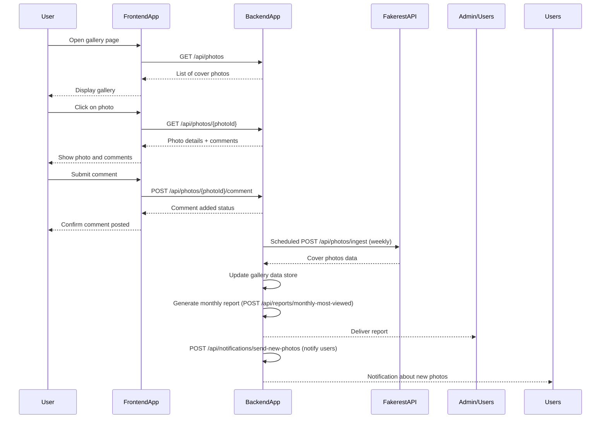

# Functional Requirements and API Design for Cover Photo Gallery Application

---

## API Endpoints

### 1. **POST /api/photos/ingest**  
- **Purpose:** Trigger data ingestion from the Fakerest API to update the gallery (scheduled weekly).  
- **Request:** Empty JSON object `{}`  
- **Response:**  
```json
{
  "status": "success",
  "message": "Photos ingested and gallery updated.",
  "newPhotosCount": 10
}
```

---

### 2. **GET /api/photos**  
- **Purpose:** Retrieve all cover photos for display in the gallery.  
- **Request:** No body.  
- **Response:**  
```json
[
  {
    "id": "string",
    "title": "string",
    "thumbnailUrl": "string",
    "views": 123
  }
]
```

---

### 3. **GET /api/photos/{photoId}**  
- **Purpose:** Retrieve detailed data of a specific photo including full image URL and comments.  
- **Request:** No body.  
- **Response:**  
```json
{
  "id": "string",
  "title": "string",
  "imageUrl": "string",
  "views": 123,
  "comments": [
    {
      "commentId": "string",
      "author": "string | null",
      "text": "string",
      "createdAt": "ISO8601 timestamp"
    }
  ]
}
```

---

### 4. **POST /api/photos/{photoId}/comment**  
- **Purpose:** Add a comment to a photo.  
- **Request:**  
```json
{
  "author": "string | null",
  "text": "string"
}
```  
- **Response:**  
```json
{
  "status": "success",
  "commentId": "string"
}
```

---

### 5. **POST /api/reports/monthly-most-viewed**  
- **Purpose:** Generate monthly report of the most viewed cover photos.  
- **Request:**  
```json
{
  "month": "YYYY-MM"
}
```  
- **Response:**  
```json
{
  "month": "YYYY-MM",
  "mostViewedPhotos": [
    {
      "id": "string",
      "title": "string",
      "views": 123
    }
  ]
}
```

---

### 6. **POST /api/notifications/send-new-photos**  
- **Purpose:** Notify users about newly added photos since last notification.  
- **Request:** Empty JSON `{}`  
- **Response:**  
```json
{
  "status": "success",
  "notifiedCount": 10
}
```

---

## User-App Interaction Sequence


```mermaid
sequenceDiagram
    participant User
    participant FrontendApp
    participant BackendApp
    participant FakerestAPI

    User->>FrontendApp: Open gallery page
    FrontendApp->>BackendApp: GET /api/photos
    BackendApp-->>FrontendApp: List of cover photos
    FrontendApp-->>User: Display gallery

    User->>FrontendApp: Click on photo
    FrontendApp->>BackendApp: GET /api/photos/{photoId}
    BackendApp-->>FrontendApp: Photo details + comments
    FrontendApp-->>User: Show photo and comments

    User->>FrontendApp: Submit comment
    FrontendApp->>BackendApp: POST /api/photos/{photoId}/comment
    BackendApp-->>FrontendApp: Comment added status
    FrontendApp-->>User: Confirm comment posted

    BackendApp->>FakerestAPI: Scheduled POST /api/photos/ingest (weekly)
    FakerestAPI-->>BackendApp: Cover photos data
    BackendApp->>BackendApp: Update gallery data store

    BackendApp->>BackendApp: Generate monthly report (POST /api/reports/monthly-most-viewed)
    BackendApp-->>Admin/Users: Deliver report

    BackendApp->>BackendApp: POST /api/notifications/send-new-photos (notify users)
    BackendApp-->>Users: Notification about new photos
```