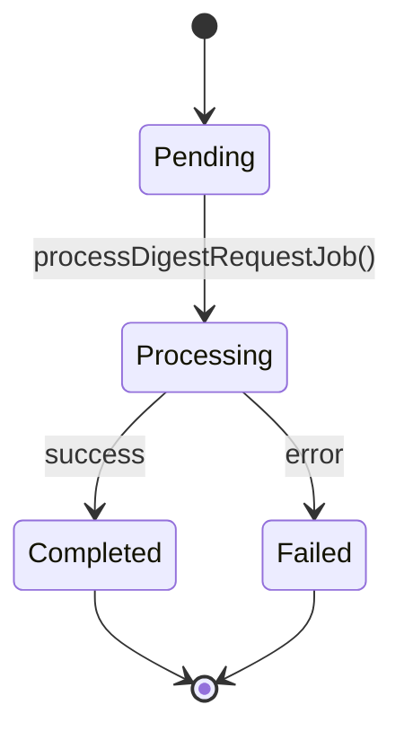
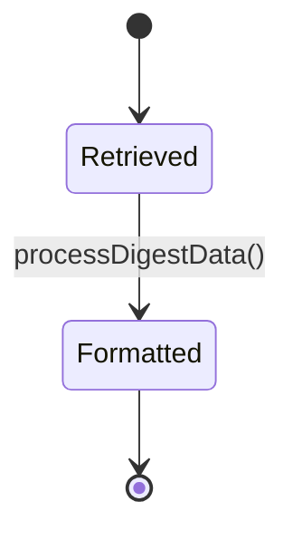
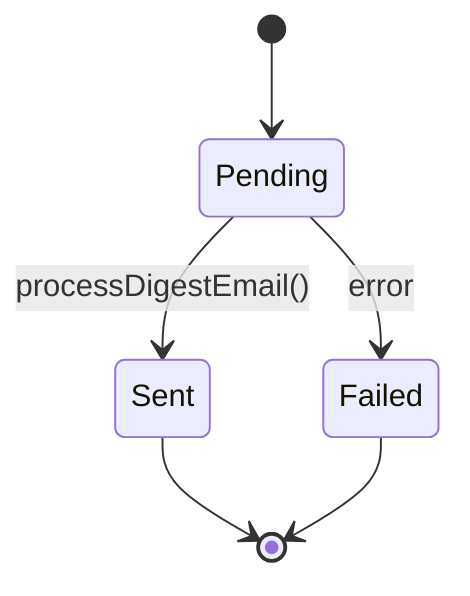
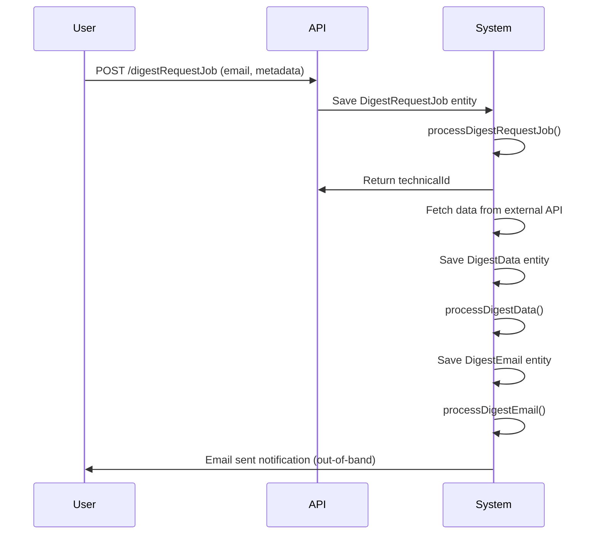

### 1. Entity Definitions

``` 
DigestRequestJob:  
- email: String (User's email address to receive the digest)  
- metadata: String (Additional metadata used to determine API endpoints or parameters)  
- status: String (Job status, e.g., PENDING, PROCESSING, COMPLETED, FAILED)  
- createdAt: DateTime (Timestamp when the job was created)  

DigestData:  
- jobTechnicalId: String (Reference to DigestRequestJob's technicalId)  
- retrievedData: String (Raw or structured data fetched from external API)  
- format: String (Format of the digest, e.g., plain text, HTML)  
- createdAt: DateTime (Timestamp when data was retrieved)  

DigestEmail:  
- jobTechnicalId: String (Reference to DigestRequestJob's technicalId)  
- email: String (Recipient email, same as in DigestRequestJob)  
- content: String (Compiled digest content ready for sending)  
- sentAt: DateTime (Timestamp when email was sent)  
- status: String (Email send status, e.g., SENT, FAILED)  
```

### 2. Process Method Flows

```
processDigestRequestJob() Flow:
1. Initial State: DigestRequestJob created with status = PENDING
2. Validation: Validate email format and required metadata presence
3. Status Update: Set status = PROCESSING
4. Trigger: Save DigestData entity by fetching data from https://petstore.swagger.io/ 
   - Determine endpoint/parameters based on metadata or defaults
5. Await DigestData completion for further processing

processDigestData() Flow:
1. Initial State: DigestData created with raw data retrieved from external API
2. Format: Compile the retrieved data into the specified digest format (plain text/HTML)
3. Save DigestEmail entity with compiled content and reference to DigestRequestJob
4. Trigger sending email to the user's email address

processDigestEmail() Flow:
1. Initial State: DigestEmail created with content ready to send and status = PENDING
2. Send Email: Dispatch the digest content to the specified email address
3. Update status: SENT if successful, FAILED otherwise
4. Log/send notification if needed (using logger)
```

### 3. API Endpoints Design

| HTTP Method | Endpoint                      | Purpose                                            | Request Body                          | Response                 |
|-------------|-------------------------------|--------------------------------------------------|-------------------------------------|--------------------------|
| POST        | `/digestRequestJob`            | Create a new DigestRequestJob (triggers processing) | `{ "email": "...", "metadata": "..." }` | `{ "technicalId": "..." }` |
| GET         | `/digestRequestJob/{technicalId}` | Retrieve DigestRequestJob status & details          | N/A                                 | Job details JSON          |
| GET         | `/digestData/{technicalId}`    | Retrieve DigestData by technicalId                  | N/A                                 | Data details JSON         |
| GET         | `/digestEmail/{technicalId}`   | Retrieve DigestEmail status & content                | N/A                                 | Email details JSON        |

### 4. Request/Response Formats

**POST /digestRequestJob Request**

```json
{
  "email": "user@example.com",
  "metadata": "{\"endpoint\":\"/pet/findByStatus\",\"params\":{\"status\":\"available\"}}"
}
```

**POST /digestRequestJob Response**

```json
{
  "technicalId": "job-123456"
}
```

**GET /digestRequestJob/{technicalId} Response**

```json
{
  "email": "user@example.com",
  "metadata": "{\"endpoint\":\"/pet/findByStatus\",\"params\":{\"status\":\"available\"}}",
  "status": "COMPLETED",
  "createdAt": "2024-06-12T10:00:00Z"
}
```

**GET /digestData/{technicalId} Response**

```json
{
  "jobTechnicalId": "job-123456",
  "retrievedData": "[{...}]", 
  "format": "HTML",
  "createdAt": "2024-06-12T10:01:00Z"
}
```

**GET /digestEmail/{technicalId} Response**

```json
{
  "jobTechnicalId": "job-123456",
  "email": "user@example.com",
  "content": "<html>...</html>",
  "sentAt": "2024-06-12T10:02:00Z",
  "status": "SENT"
}
```

### 5. Mermaid Diagrams

**Entity Lifecycle State Diagram: DigestRequestJob**


```mermaid
stateDiagram-v2
    [*] --> Pending
    Pending --> Processing : processDigestRequestJob()
    Processing --> Completed : success
    Processing --> Failed : error
    Completed --> [*]
    Failed --> [*]
```

**Entity Lifecycle State Diagram: DigestData**


```mermaid
stateDiagram-v2
    [*] --> Retrieved
    Retrieved --> Formatted : processDigestData()
    Formatted --> [*]
```

**Entity Lifecycle State Diagram: DigestEmail**


```mermaid
stateDiagram-v2
    [*] --> Pending
    Pending --> Sent : processDigestEmail()
    Pending --> Failed : error
    Sent --> [*]
    Failed --> [*]
```

**Event-Driven Processing Chain**

```mermaid
graph TD
    A[DigestRequestJob Created] --> B[processDigestRequestJob()]
    B --> C[DigestData Created by fetching API data]
    C --> D[processDigestData()]
    D --> E[DigestEmail Created with compiled content]
    E --> F[processDigestEmail()]
    F --> G[Email Sent]
```

**User Interaction Sequence Flow**


```mermaid
sequenceDiagram
    participant User
    participant API
    participant System

    User->>API: POST /digestRequestJob (email, metadata)
    API->>System: Save DigestRequestJob entity
    System->>System: processDigestRequestJob()
    System->>API: Return technicalId
    System->>System: Fetch data from external API
    System->>System: Save DigestData entity
    System->>System: processDigestData()
    System->>System: Save DigestEmail entity
    System->>System: processDigestEmail()
    System->>User: Email sent notification (out-of-band)
```