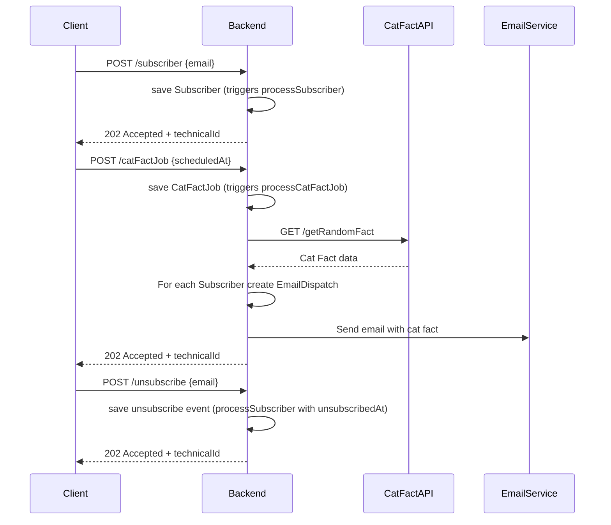
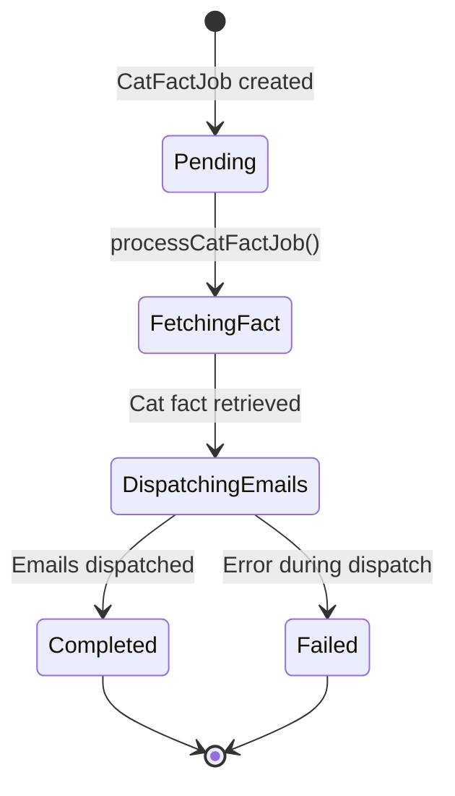

# Functional Requirements for Weekly Cat Fact Subscription Backend Application

---

## 1. Entity Definitions

```
CatFactJob:
- scheduledAt: String (ISO8601 datetime string for when the job is scheduled)
- status: String (job status: PENDING, COMPLETED, FAILED)

Subscriber:
- email: String (subscriber's email address)
- subscribedAt: String (ISO8601 datetime string when subscription occurred)
- unsubscribedAt: String (ISO8601 datetime string when unsubscribed; null if active)

EmailDispatch:
- subscriberEmail: String (email address of the subscriber receiving the email)
- catFact: String (the cat fact content sent)
- dispatchedAt: String (ISO8601 datetime string when the email was sent)
```

---

## 2. Process Method Flows

### processCatFactJob() Flow:
1. Initial State: CatFactJob created with status PENDING and scheduledAt set.  
2. Fetch Fact: Call Cat Fact API (https://catfact.ninja/#/Facts/getRandomFact) to retrieve a new cat fact.  
3. Email Dispatch Creation: For each active Subscriber (unsubscribedAt == null), create an EmailDispatch entity with the fact and subscriber's email.  
4. Completion: Update CatFactJob status to COMPLETED or FAILED accordingly.

### processSubscriber() Flow:
1. Initial State: Subscriber entity created with email and subscribedAt timestamp.  
2. Validation: Check for duplicate emails or basic email format.  
3. Post-Processing: Optionally send a welcome email or prepare subscriber for upcoming email dispatches.

### processEmailDispatch() Flow:
1. Initial State: EmailDispatch created with subscriberEmail, catFact, and dispatchedAt timestamp.  
2. Processing: Trigger sending of the email to the subscriber.  
3. Logging: Record success/failure of the email send (optional extension).

---

## 3. API Endpoints Design

| Method | Endpoint               | Description                                                  | Request Body Example                       | Response Example               |
|--------|------------------------|--------------------------------------------------------------|--------------------------------------------|-------------------------------|
| POST   | /catFactJob            | Create new CatFactJob (triggers cat fact fetching & emailing) | `{ "scheduledAt": "2024-07-01T10:00:00Z" }` | `{ "technicalId": "string" }` |
| GET    | /catFactJob/{technicalId} | Retrieve CatFactJob details by technicalId                    | N/A                                        | CatFactJob entity JSON        |
| POST   | /subscriber            | Create new Subscriber (sign-up)                              | `{ "email": "user@example.com" }`           | `{ "technicalId": "string" }` |
| GET    | /subscriber/{technicalId} | Retrieve Subscriber details by technicalId                    | N/A                                        | Subscriber entity JSON        |
| POST   | /unsubscribe           | Unsubscribe a subscriber by email                             | `{ "email": "user@example.com" }`           | `{ "technicalId": "string" }` |
| GET    | /emailDispatch/{technicalId} | Retrieve EmailDispatch details by technicalId                 | N/A                                        | EmailDispatch entity JSON     |
| GET    | /report/subscribersCount | Retrieve total number of active subscribers                   | N/A                                        | `{ "count": number }`         |
| GET    | /report/emailsSentCount  | Retrieve total number of emails sent weekly                   | N/A                                        | `{ "count": number }`         |

---

## 4. Request / Response Formats

### POST /subscriber

**Request:**

```json
{
  "email": "user@example.com"
}
```

**Response:**

```json
{
  "technicalId": "string"
}
```

---

### POST /unsubscribe

**Request:**

```json
{
  "email": "user@example.com"
}
```

**Response:**

```json
{
  "technicalId": "string"
}
```

---

### POST /catFactJob

**Request:**

```json
{
  "scheduledAt": "2024-07-01T10:00:00Z"
}
```

**Response:**

```json
{
  "technicalId": "string"
}
```

---

## 5. Mermaid Diagrams

### Sequence Diagram


```mermaid
sequenceDiagram
    participant Client
    participant Backend
    participant CatFactAPI
    participant EmailService

    Client->>Backend: POST /subscriber {email}
    Backend->>Backend: save Subscriber (triggers processSubscriber)
    Backend-->>Client: 202 Accepted + technicalId

    Client->>Backend: POST /catFactJob {scheduledAt}
    Backend->>Backend: save CatFactJob (triggers processCatFactJob)
    Backend->>CatFactAPI: GET /getRandomFact
    CatFactAPI-->>Backend: Cat Fact data
    Backend->>Backend: For each Subscriber create EmailDispatch
    Backend->>EmailService: Send email with cat fact
    Backend-->>Client: 202 Accepted + technicalId

    Client->>Backend: POST /unsubscribe {email}
    Backend->>Backend: save unsubscribe event (processSubscriber with unsubscribedAt)
    Backend-->>Client: 202 Accepted + technicalId
```

---

### CatFactJob Lifecycle State Diagram


```mermaid
stateDiagram-v2
    [*] --> Pending : CatFactJob created
    Pending --> FetchingFact : processCatFactJob()
    FetchingFact --> DispatchingEmails : Cat fact retrieved
    DispatchingEmails --> Completed : Emails dispatched
    DispatchingEmails --> Failed : Error during dispatch
    Completed --> [*]
    Failed --> [*]
```

---

This document represents the finalized functional requirements suitable for direct use in implementation and further documentation.