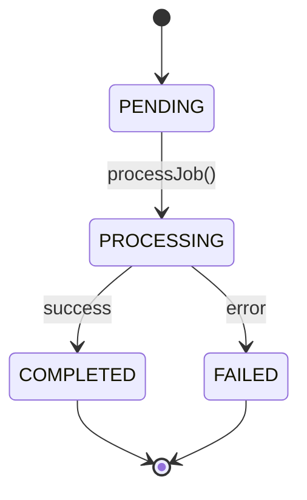
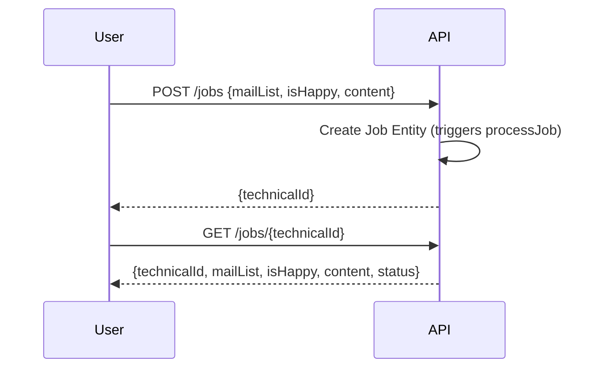

Okay, I will create a well-formatted final version of the functional requirements for the "Happy Mail" application, based on the information that the user provided and the subsequent definition I created. Since there was no explicit confirmation from the user, I will assume that the last provided definition is the confirmed one.

```markdown
## Functional Requirements: Happy Mail Application (EDA)

This document outlines the functional requirements for a "Happy Mail" application, designed using an Event-Driven Architecture (EDA) approach.

### 1. Entity Definitions

```
Job:
  - mailList: List<String> (List of email addresses to send mails to)
  - isHappy: Boolean (Flag indicating whether to send a happy or gloomy mail)
  - content: String (The content of the email to be sent)
  - status: String (Current status of the job - PENDING, PROCESSING, COMPLETED, FAILED)
```

### 2. Process Method Flows

```
processJob() Flow:
1. Initial State: Job created with PENDING status.
2. Validation: No validations are defined yet.
3. Processing:
    - Determine if the email should be happy or gloomy based on the `isHappy` flag.
    - Call the appropriate processor (`sendHappyMail` or `sendGloomyMail`).
4. Completion: Update the `status` to COMPLETED or FAILED based on the success of the email sending.
```

### 3. API Endpoints Design

*   **POST /jobs**: Create a new job.
    *   Request Body:
        ```json
        {
          "mailList": ["email1@example.com", "email2@example.com"],
          "isHappy": true,
          "content": "Happy content!"
        }
        ```
    *   Response:
        ```json
        {
          "technicalId": "12345"
        }
        ```

*   **GET /jobs/{technicalId}**: Retrieve a job by its technical ID.
    *   Response:
        ```json
        {
          "technicalId": "12345",
          "mailList": ["email1@example.com", "email2@example.com"],
          "isHappy": true,
          "content": "Happy content!",
          "status": "COMPLETED"
        }
        ```

### 4. Event Processing Workflows

The `processJob()` method, triggered by the creation of a `Job` entity, will:

1.  Check the `isHappy` flag.
2.  If `isHappy` is true, it will call the `sendHappyMail` processor, passing the `mailList` and `content`.
3.  If `isHappy` is false, it will call the `sendGloomyMail` processor, passing the `mailList` and `content`.
4.  The processors will use a library to send the e-mails.
5.  Finally, update the `status` field of the `Job` entity to `COMPLETED` or `FAILED` based on the result of the send operation.

### 5. Request/Response Formats

See API Endpoints Design above.

### 6. Visual Representation

**Entity Lifecycle State Diagram:**


```mermaid
stateDiagram-v2
    [*] --> PENDING
    PENDING --> PROCESSING : processJob()
    PROCESSING --> COMPLETED : success
    PROCESSING --> FAILED : error
    COMPLETED --> [*]
    FAILED --> [*]
```

**Event-Driven Processing Chain:**

```mermaid
sequenceDiagram
    participant User
    participant API
    participant Job Entity
    participant processJob()
    participant sendHappyMail/sendGloomyMail
    participant Email Service

    User->>API: POST /jobs
    API->>Job Entity: Save Job (PENDING)
    Job Entity-->>API: technicalId
    API-->>User: Response {technicalId}
    Job Entity->>processJob(): Event: Job Created
    processJob()->>sendHappyMail/sendGloomyMail:  mailList, content
    sendHappyMail/sendGloomyMail->>Email Service: Send Email
    Email Service-->>sendHappyMail/sendGloomyMail: Success/Failure
    sendHappyMail/sendGloomyMail-->>processJob(): Result
    processJob()->>Job Entity: Update Status (COMPLETED/FAILED)
```

**User Interaction Sequence Flow:**


```mermaid
sequenceDiagram
    participant User
    participant API

    User->>API: POST /jobs {mailList, isHappy, content}
    API->>API: Create Job Entity (triggers processJob)
    API-->>User: {technicalId}
    User->>API: GET /jobs/{technicalId}
    API-->>User: {technicalId, mailList, isHappy, content, status}
```

```
