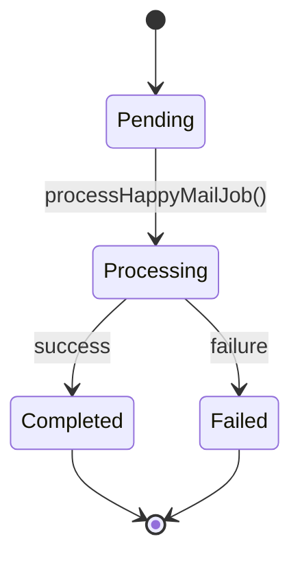
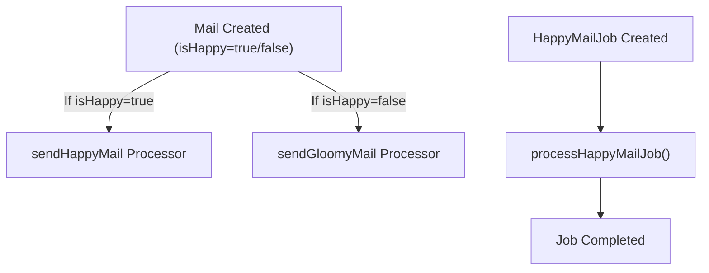
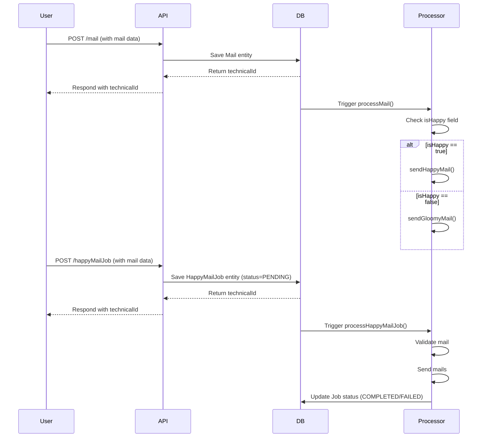

### 1. Entity Definitions

``` 
Mail:  
- isHappy: Boolean (Indicates if the mail is happy (true) or gloomy (false))  
- mailList: List<String> (List of recipient email addresses)  

HappyMailJob:  
- mail: Mail (The mail entity to be processed)  
- status: String (Job status: PENDING, COMPLETED, FAILED)  
- resultMessage: String (Optional message about job result or error)  
```  

---

### 2. Process Method Flows

``` 
processHappyMailJob() Flow:  
1. Initial State: HappyMailJob created with status = PENDING  
2. Validation: Confirm mailList is not empty; mail.isHappy must be true  
3. Processing: Invoke sendHappyMail processor to send mails to all recipients  
4. Completion: Update status to COMPLETED if all mails sent successfully, else FAILED  
5. Notification: Log the result or error message in resultMessage field  
```  

``` 
processMail() Flow:  
1. Initial State: Mail entity created  
2. Criteria Check: Evaluate isHappy field  
3. Processing:  
   - If isHappy == true, trigger sendHappyMail processor  
   - Else trigger sendGloomyMail processor  
4. Completion: No status update on Mail itself (immutable), processing side-effects only  
```  

---

### 3. API Endpoints Design

| Endpoint                    | Method | Description                                        | Request Body Example                          | Response Example                |
|-----------------------------|--------|--------------------------------------------------|-----------------------------------------------|--------------------------------|
| /happyMailJob               | POST   | Create a HappyMailJob to send happy mails        | `{ "mail": { "isHappy": true, "mailList": ["a@b.com"] } }` | `{ "technicalId": "abc123" }`  |
| /happyMailJob/{technicalId} | GET    | Retrieve status/result of HappyMailJob by ID     | N/A                                           | `{ "status": "COMPLETED", "resultMessage": "Sent to 3 recipients" }` |
| /mail                      | POST   | Create a Mail entity triggering appropriate processor | `{ "isHappy": true, "mailList": ["a@b.com","b@c.com"] }` | `{ "technicalId": "mail123" }`  |
| /mail/{technicalId}          | GET    | Retrieve Mail entity info by ID                   | N/A                                           | `{ "isHappy": true, "mailList": ["a@b.com","b@c.com"] }` |

- No update/delete endpoints are provided, favoring immutable creation.

---

### 4. Request/Response Formats

**POST /happyMailJob**

Request:  
```json
{
  "mail": {
    "isHappy": true,
    "mailList": ["recipient1@example.com", "recipient2@example.com"]
  }
}
```

Response:  
```json
{
  "technicalId": "happyJob123"
}
```

---

**GET /happyMailJob/{technicalId}**

Response:  
```json
{
  "status": "COMPLETED",
  "resultMessage": "Mails sent successfully to 2 recipients"
}
```

---

**POST /mail**

Request:  
```json
{
  "isHappy": false,
  "mailList": ["recipient@example.com"]
}
```

Response:  
```json
{
  "technicalId": "mail456"
}
```

---

**GET /mail/{technicalId}**

Response:  
```json
{
  "isHappy": false,
  "mailList": ["recipient@example.com"]
}
```

---

### 5. Visual Representations

#### Entity Lifecycle State Diagram for HappyMailJob


```mermaid
stateDiagram-v2
    [*] --> Pending
    Pending --> Processing : processHappyMailJob()
    Processing --> Completed : success
    Processing --> Failed : failure
    Completed --> [*]
    Failed --> [*]
```

---

#### Event-Driven Processing Chain


```mermaid
flowchart TD
    MailCreated["Mail Created (isHappy=true/false)"]
    MailCreated -->|If isHappy=true| SendHappyMail["sendHappyMail Processor"]
    MailCreated -->|If isHappy=false| SendGloomyMail["sendGloomyMail Processor"]
    HappyMailJobCreated["HappyMailJob Created"]
    HappyMailJobCreated --> processHappyMailJob["processHappyMailJob()"]
    processHappyMailJob --> JobCompleted["Job Completed"]
```

---

#### User Interaction Sequence Flow


```mermaid
sequenceDiagram
    participant User
    participant API
    participant DB
    participant Processor

    User->>API: POST /mail (with mail data)
    API->>DB: Save Mail entity
    DB-->>API: Return technicalId
    API-->>User: Respond with technicalId

    DB->>Processor: Trigger processMail()
    Processor->>Processor: Check isHappy field
    alt isHappy == true
        Processor->>Processor: sendHappyMail()
    else isHappy == false
        Processor->>Processor: sendGloomyMail()
    end

    User->>API: POST /happyMailJob (with mail data)
    API->>DB: Save HappyMailJob entity (status=PENDING)
    DB-->>API: Return technicalId
    API-->>User: Respond with technicalId

    DB->>Processor: Trigger processHappyMailJob()
    Processor->>Processor: Validate mail
    Processor->>Processor: Send mails
    Processor->>DB: Update Job status (COMPLETED/FAILED)
```

---

If you need any further refinements or additions, please let me know!