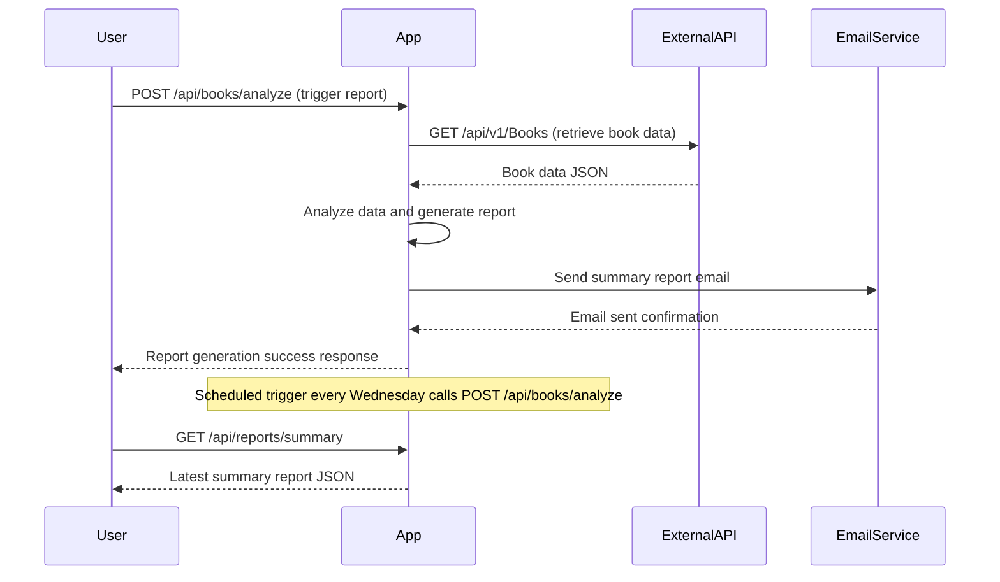

# Functional Requirements and API Design

## API Endpoints

### 1. `POST /api/books/analyze`
- **Description:** Triggers the process to retrieve book data from the external Fake REST API, analyze key metrics, and generate a summary report.
- **Request:**  
  ```json
  {
    "triggerDate": "2024-06-19"  // Optional: date for which the report is generated; defaults to current date if omitted
  }
  ```
- **Response:**  
  ```json
  {
    "status": "success",
    "message": "Book data analyzed and report generated and emailed."
  }
  ```
- **Business Logic:**  
  - Retrieves book data from `https://fakerestapi.azurewebsites.net/api/v1/Books`  
  - Extracts and analyzes fields: `id`, `title`, `description`, `pageCount`, `excerpt`, `publishDate`  
  - Calculates insights including total page counts, publication date ranges, and identifies popular titles based on highest `pageCount`  
  - Generates a summary report (HTML email format)  
  - Emails the report to the analytics team  
  - Scheduled to run automatically every Wednesday  

---

### 2. `GET /api/reports/summary`
- **Description:** Retrieves the latest generated summary report.
- **Response:**  
  ```json
  {
    "reportDate": "2024-06-19",
    "totalBooks": 100,
    "totalPageCount": 45230,
    "publicationDateRange": {
      "earliest": "2000-01-01",
      "latest": "2024-05-30"
    },
    "popularTitles": [
      {
        "id": 12,
        "title": "Popular Book Title",
        "description": "...",
        "excerpt": "...",
        "pageCount": 850,
        "publishDate": "2023-11-10"
      }
    ],
    "summaryText": "Summary insights here..."
  }
  ```

---

# User-App Interaction Sequence


```mermaid
sequenceDiagram
    participant User
    participant App
    participant ExternalAPI
    participant EmailService

    User->>App: POST /api/books/analyze (trigger report)
    App->>ExternalAPI: GET /api/v1/Books (retrieve book data)
    ExternalAPI-->>App: Book data JSON
    App->>App: Analyze data and generate report
    App->>EmailService: Send summary report email
    EmailService-->>App: Email sent confirmation
    App-->>User: Report generation success response

    Note over App: Scheduled trigger every Wednesday calls POST /api/books/analyze

    User->>App: GET /api/reports/summary
    App-->>User: Latest summary report JSON
```

---

If you need any further adjustments or details, I’m here to help!