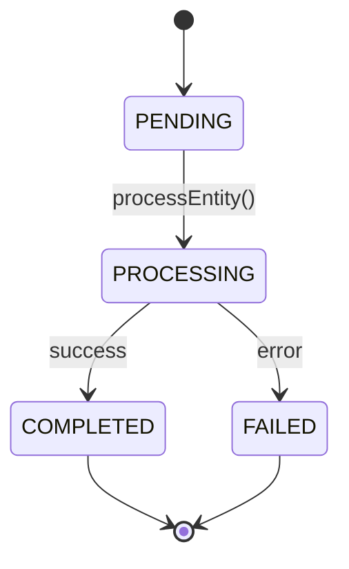
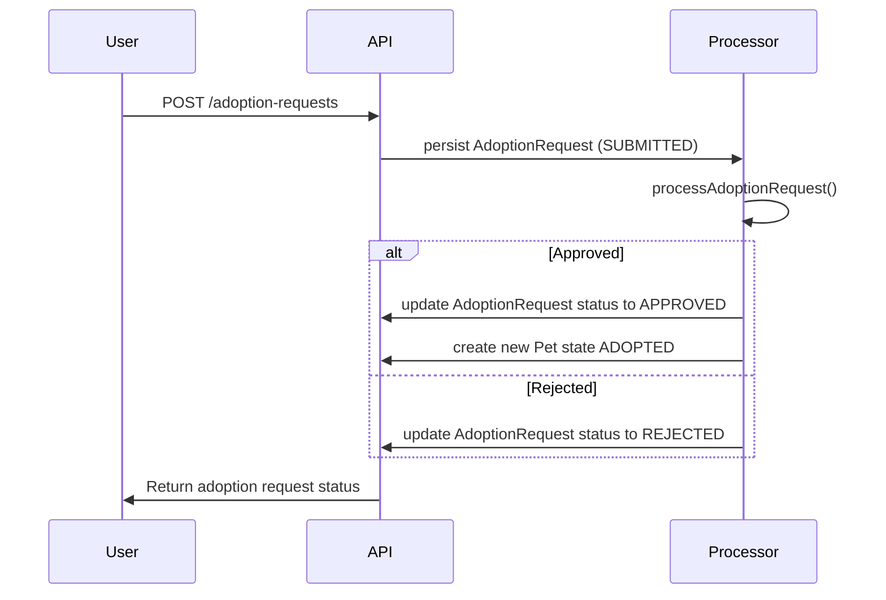

Certainly! Here is the well-formatted final version of the functional requirements for the "Purrfect Pets" API app using Event-Driven Architecture:

### 1. Entity Definitions

``` 
PetIngestionJob:
- jobId: String (unique identifier for the ingestion job)
- source: String (data source info, e.g., Petstore API)
- status: StatusEnum (PENDING, PROCESSING, COMPLETED, FAILED)
- createdAt: DateTime (timestamp of job creation)

Pet:
- petId: String (unique pet identifier)
- name: String (pet's name)
- type: String (e.g., Cat, Dog, Bird)
- status: StatusEnum (AVAILABLE, PENDING_ADOPTION, ADOPTED)
- createdAt: DateTime (timestamp of pet record creation)

AdoptionRequest:
- requestId: String (unique identifier for adoption request)
- petId: String (referencing Pet)
- adopterName: String (name of person requesting adoption)
- status: StatusEnum (SUBMITTED, APPROVED, REJECTED)
- createdAt: DateTime (timestamp of request creation)
```

### 2. Process Method Flows

``` 
processPetIngestionJob() Flow:
1. Initial State: PetIngestionJob created with PENDING status
2. Validation: Verify the source URL and job parameters
3. Data Fetching: Call Petstore API and retrieve pet data
4. Pet Creation: Create immutable Pet entities for each pet fetched
5. Completion: Update PetIngestionJob status to COMPLETED or FAILED
6. Notification: Log job result and notify downstream systems if needed

processPet() Flow:
1. Initial State: Pet created with AVAILABLE or specified status
2. Validation: Ensure pet data completeness and correctness
3. Business Logic: (Optional) Trigger alerts or enrich pet info
4. Completion: Mark pet as AVAILABLE for adoption or other states

processAdoptionRequest() Flow:
1. Initial State: AdoptionRequest created with SUBMITTED status
2. Validation: Check pet availability and adopter eligibility
3. Decision: Approve or Reject adoption request based on rules
4. Completion: Update request status to APPROVED or REJECTED
5. Side Effect: If approved, update Pet status to ADOPTED by creating a new Pet state entity (immutable update)
```

### 3. API Endpoints and JSON Formats

- **POST /pet-ingestion-jobs**  
  Request:  
  ```json
  {
    "source": "https://petstore.swagger.io/v2/pet"
  }
  ```  
  Response:  
  ```json
  {
    "jobId": "job-123",
    "status": "PENDING",
    "createdAt": "2024-06-01T12:00:00Z"
  }
  ```

- **POST /pets**  
  Request:  
  ```json
  {
    "name": "Whiskers",
    "type": "Cat",
    "status": "AVAILABLE"
  }
  ```  
  Response:  
  ```json
  {
    "petId": "pet-456",
    "status": "AVAILABLE",
    "createdAt": "2024-06-01T12:05:00Z"
  }
  ```

- **POST /adoption-requests**  
  Request:  
  ```json
  {
    "petId": "pet-456",
    "adopterName": "Alice"
  }
  ```  
  Response:  
  ```json
  {
    "requestId": "req-789",
    "status": "SUBMITTED",
    "createdAt": "2024-06-01T12:10:00Z"
  }
  ```

- **GET /pets/{petId}**  
  Response:  
  ```json
  {
    "petId": "pet-456",
    "name": "Whiskers",
    "type": "Cat",
    "status": "AVAILABLE",
    "createdAt": "2024-06-01T12:05:00Z"
  }
  ```

### 4. Visual Representations

#### Entity Lifecycle State Diagram


```mermaid
stateDiagram-v2
    [*] --> PENDING
    PENDING --> PROCESSING : processEntity()
    PROCESSING --> COMPLETED : success
    PROCESSING --> FAILED : error
    COMPLETED --> [*]
    FAILED --> [*]
```

#### Event-Driven Processing Chain for PetIngestionJob

```mermaid
graph TD
    A[Create PetIngestionJob] --> B[processPetIngestionJob()]
    B --> C[Fetch Petstore API Data]
    C --> D[Create Pet Entities]
    D --> E[Complete PetIngestionJob]
```

#### User Interaction Sequence Flow for AdoptionRequest


```mermaid
sequenceDiagram
    participant User
    participant API
    participant Processor

    User->>API: POST /adoption-requests
    API->>Processor: persist AdoptionRequest (SUBMITTED)
    Processor->>Processor: processAdoptionRequest()
    alt Approved
        Processor->>API: update AdoptionRequest status to APPROVED
        Processor->>API: create new Pet state ADOPTED
    else Rejected
        Processor->>API: update AdoptionRequest status to REJECTED
    end
    API->>User: Return adoption request status
```

---

If you need any further refinements or next steps, please let me know!