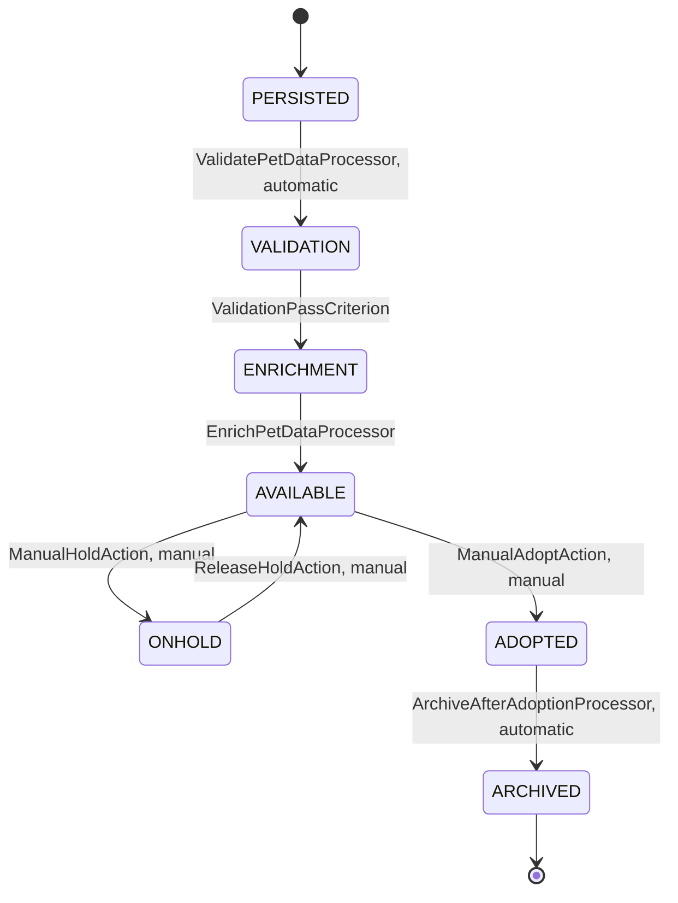
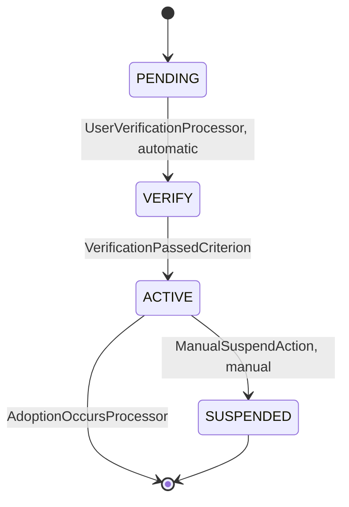
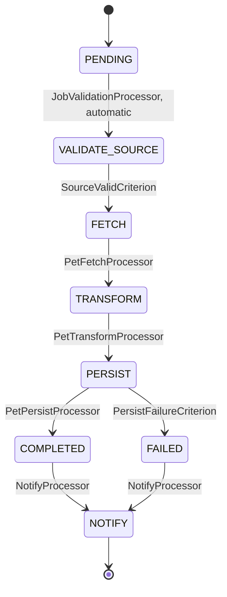

Note: You did not list entities explicitly, so I used the default of 3 entities per your instructions: Pet, User, PetIngestionJob.

### 1. Entity Definitions
```
Pet:
- id: String (business identifier from Petstore)
- name: String (pet name)
- species: String (cat, dog, etc.)
- breed: String (breed info)
- ageMonths: Integer (age in months)
- status: String (AVAILABLE/ONHOLD/ADOPTED/ARCHIVED)
- sourceMeta: Object (origin data from Petstore)

User:
- username: String (unique username)
- fullName: String (user full name)
- contactEmail: String (email)
- phone: String (phone number)
- verified: Boolean (verification status)
- adoptionHistory: List<String> (pet ids adopted)

PetIngestionJob:
- sourceUrl: String (Petstore endpoint)
- requestedBy: String (username triggering job)
- scheduledAt: String (optional schedule timestamp)
- status: String (PENDING/IN_PROGRESS/COMPLETED/FAILED)
- processedCount: Integer (number of pets processed)
```

### 2. Entity workflows

Pet workflow:
1. PERSISTED (created by PetIngestionJob process)
2. VALIDATION (automatic)
3. ENRICHMENT (automatic)
4. AVAILABLE (ready for adoption) or ONHOLD (manual) or ADOPTED (manual)
5. ARCHIVED (automatic when removed)

```mermaid
stateDiagram-v2
    [*] --> PERSISTED
    PERSISTED --> VALIDATION : ValidatePetDataProcessor, automatic
    VALIDATION --> ENRICHMENT : ValidationPassCriterion
    ENRICHMENT --> AVAILABLE : EnrichPetDataProcessor
    AVAILABLE --> ONHOLD : ManualHoldAction, manual
    AVAILABLE --> ADOPTED : ManualAdoptAction, manual
    ADOPTED --> ARCHIVED : ArchiveAfterAdoptionProcessor, automatic
    ONHOLD --> AVAILABLE : ReleaseHoldAction, manual
    ARCHIVED --> [*]
```
Processors: ValidatePetDataProcessor, EnrichPetDataProcessor, ArchiveAfterAdoptionProcessor
Criteria: ValidationPassCriterion

User workflow:
1. CREATED (via POST, state PENDING)
2. VERIFY (automatic/email manual step)
3. ACTIVE (can adopt) or SUSPENDED (manual)
4. ADOPTION_ACTIONS (triggers adoption processors)

```mermaid
stateDiagram-v2
    [*] --> PENDING
    PENDING --> VERIFY : UserVerificationProcessor, automatic
    VERIFY --> ACTIVE : VerificationPassedCriterion
    ACTIVE --> SUSPENDED : ManualSuspendAction, manual
    ACTIVE --> [*] : AdoptionOccursProcessor
    SUSPENDED --> [*]
```
Processors: UserVerificationProcessor, AdoptionOccursProcessor
Criteria: VerificationPassedCriterion

PetIngestionJob workflow:
1. PENDING (job created via POST)
2. VALIDATE_SOURCE (automatic)
3. FETCH (automatic)
4. TRANSFORM (automatic)
5. PERSIST (automatic - creates Pet entities)
6. COMPLETED or FAILED
7. NOTIFY (automatic)

```mermaid
stateDiagram-v2
    [*] --> PENDING
    PENDING --> VALIDATE_SOURCE : JobValidationProcessor, automatic
    VALIDATE_SOURCE --> FETCH : SourceValidCriterion
    FETCH --> TRANSFORM : PetFetchProcessor
    TRANSFORM --> PERSIST : PetTransformProcessor
    PERSIST --> COMPLETED : PetPersistProcessor
    PERSIST --> FAILED : PersistFailureCriterion
    COMPLETED --> NOTIFY : NotifyProcessor
    NOTIFY --> [*]
    FAILED --> NOTIFY : NotifyProcessor
```
Processors: JobValidationProcessor, PetFetchProcessor, PetTransformProcessor, PetPersistProcessor, NotifyProcessor
Criteria: SourceValidCriterion, PersistFailureCriterion

### 3. Pseudo code for processor classes (concise)

ValidatePetDataProcessor:
```
process(pet):
  if missing required fields -> mark pet.invalid else mark pet.valid
```
EnrichPetDataProcessor:
```
process(pet):
  add friendlyAgeLabel, compute tags from breed/species
```
PetFetchProcessor:
```
process(job):
  results = httpGet(job.sourceUrl)
  return resultsList
```
PetTransformProcessor:
```
process(raw):
  map raw fields -> Pet entity
```
PetPersistProcessor:
```
process(petList):
  for pet in petList persist pet and emit PERSISTED event
  update job.processedCount
```
NotifyProcessor:
```
process(job):
  send summary to requestedBy
```

### 4. API Endpoints Design Rules & JSON formats

Rules applied:
- POST triggers event and returns only technicalId.
- POST endpoints: /jobs, /users
- GET by technicalId for all created-via-POST entities and for Pets (read-only)
- GET by condition not added (not requested)

Endpoints:

POST /jobs
Request:
```json
{
  "sourceUrl":"https://petstore.example/api/pets",
  "requestedBy":"alice",
  "scheduledAt":"2025-09-08T10:00:00Z"
}
```
Response:
```json
{ "technicalId":"job-uuid-123" }
```

GET /jobs/{technicalId}
Response:
```json
{
  "technicalId":"job-uuid-123",
  "sourceUrl":"https://petstore.example/api/pets",
  "status":"IN_PROGRESS",
  "processedCount":12
}
```

POST /users
Request:
```json
{
  "username":"alice",
  "fullName":"Alice Catlover",
  "contactEmail":"alice@example.com",
  "phone":"+1234567"
}
```
Response:
```json
{ "technicalId":"user-uuid-456" }
```

GET /users/{technicalId}
Response:
```json
{
  "technicalId":"user-uuid-456",
  "username":"alice",
  "verified":false,
  "adoptionHistory":[]
}
```

GET /pets/{technicalId}
Response:
```json
{
  "technicalId":"pet-uuid-789",
  "id":"store-123",
  "name":"Mittens",
  "species":"cat",
  "status":"AVAILABLE"
}
```

If you'd like, we can: add an AdoptionRequest entity, GET-by-condition (e.g., search available pets), or expand criteria/processors. Which would you prefer next?