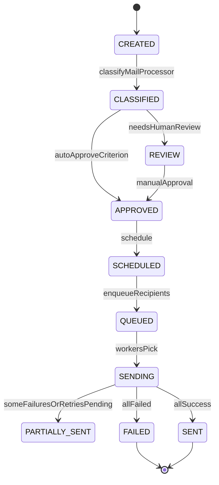
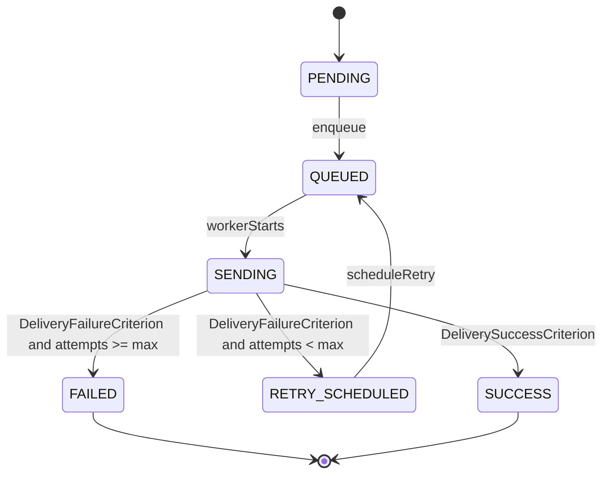
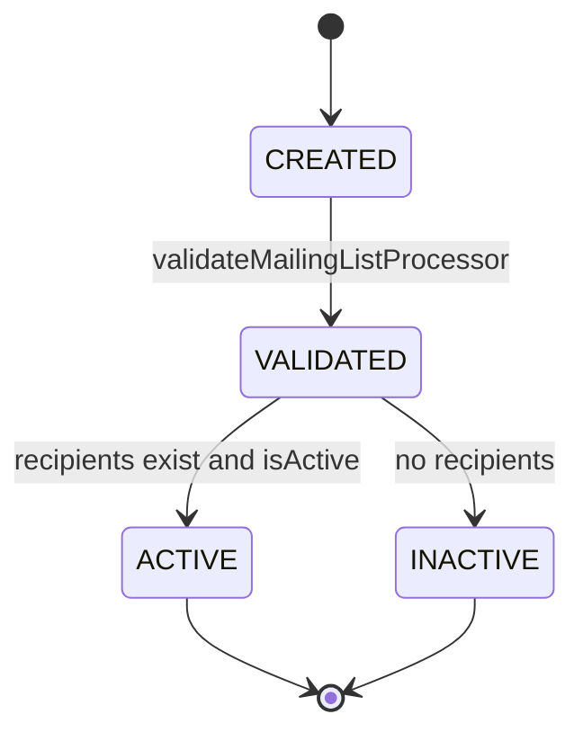
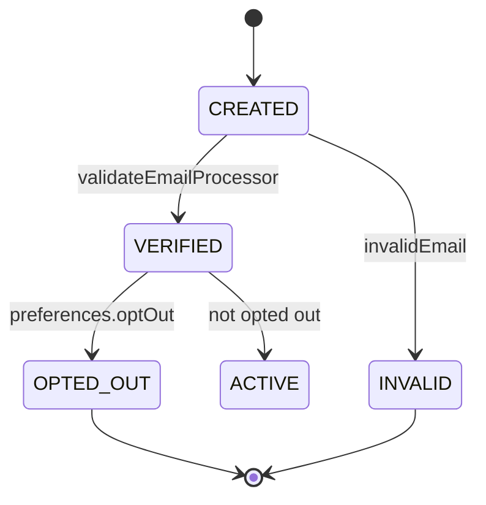

# Functional Requirements

Purpose: capture the canonical functional logic for Mails, MailingLists and Recipients used by the prototype. This document describes entity definitions, state machines, processors and API contracts. It also documents expected behaviors for retries, manual review and delivery tracking.

---

## 1. Entities
All timestamps are ISO8601 strings. All id fields are business ids and unique within the system. The system also issues a technicalId (UUID) on creation which is returned by POST endpoints.

### Mail
- id: String (business id, optional friendly id)
- technicalId: String (UUID assigned on create)
- subject: String (message subject)
- body: String (message body / HTML)
- isHappy: Boolean|null (true / false / null means unknown)
- classificationConfidence: Number|null (0..1 confidence score from automatic classifier)
- templateId: String|null (optional template reference used when sending)
- mailList: String | Array<String> (either id of MailingList or inline array of recipient emails/ids)
- status: Enum (CREATED | CLASSIFIED | REVIEW | APPROVED | SCHEDULED | QUEUED | SENDING | PARTIALLY_SENT | SENT | FAILED | CANCELLED)
- createdBy: String (user id)
- createdAt: String (timestamp)
- updatedAt: String (timestamp)
- meta: Object (free-form metadata, e.g., tags, category)

Notes:
- Mail.status reflects overall mail-level progress. Individual delivery outcomes are tracked separately via DeliveryRecord.

### DeliveryRecord (new — per recipient delivery tracking)
- id: String (business id)
- mailTechnicalId: String (reference to Mail.technicalId)
- recipientId: String|null (reference to Recipient or null if inline email)
- recipientEmail: String (recipient email used for this delivery)
- status: Enum (PENDING | QUEUED | SENDING | SUCCESS | FAILED | RETRY_SCHEDULED | BOUNCED)
- attempts: Integer (number of send attempts)
- lastAttemptAt: String|null (timestamp)
- lastError: String|null (provider error or reason)
- createdAt: String
- updatedAt: String

Notes:
- DeliveryRecord.status is the authoritative record for a single recipient's delivery lifecycle. The Mail.status is derived from aggregate DeliveryRecord statuses.

### MailingList
- id: String (business id)
- technicalId: String (UUID assigned on create)
- name: String
- recipients: Array<String> (list of recipient ids or inline emails)
- isActive: Boolean
- createdAt: String
- updatedAt: String

Notes:
- MailingList recipients can be references to Recipient entities or inline emails. The system resolves and validates recipients at send time.

### Recipient
- id: String (business id)
- technicalId: String (UUID assigned on create)
- email: String
- name: String|null
- preferences: Object {
    optOut: Boolean,
    allowedCategories: Array<String> (if empty -> all allowed),
    dailyLimit: Integer|null
  }
- status: Enum (CREATED | VERIFIED | OPTED_OUT | INVALID | SUSPENDED)
- createdAt: String
- updatedAt: String

Notes:
- Opted-out recipients must never be targeted.
- Verification means email validated (format + optional verification handshake).

---

## 2. State machines / Workflows
This section describes canonical state transitions. Processors (services) drive transitions. Persistence changes are considered events that may trigger processors.

### Mail workflow (mail-level)
Canonical states: CREATED -> CLASSIFIED -> {REVIEW | APPROVED} -> SCHEDULED -> QUEUED -> SENDING -> {PARTIALLY_SENT | SENT | FAILED}

High level transitions and rules:
1. CREATED (persisted by POST /mails) triggers Classification processor (automatic) -> CLASSIFIED.
2. CLASSIFIED: classification sets isHappy and classificationConfidence.
   - If isHappy = true -> automatically APPROVED (unless classificationConfidence < classificationApprovalThreshold -> go to REVIEW).
   - If isHappy = false -> either automatically APPROVED (send gloomy) or route to REVIEW depending on policy flag gloomyAutoSend; default configurable.
   - If isHappy = null or classificationConfidence below threshold -> REVIEW.
3. REVIEW state: manual human action required (approve, modify, cancel). Manual approval sets status APPROVED (optionally updates mail fields and template).
4. APPROVED -> SCHEDULED (scheduled send time may be immediate).
5. SCHEDULED -> QUEUED (job enqueues recipients) -> SENDING (workers process DeliveryRecords). During SENDING, per-recipient DeliveryRecords are created and progressed.
6. Aggregate evaluation:
   - If all delivery records SUCCESS -> Mail.status = SENT.
   - If some success and some failed but retries pending -> PARTIALLY_SENT.
   - If all failed after retries -> FAILED.
7. On persistent failures after max attempts, DeliveryRecord status -> FAILED and system notifies admin per escalation policy.

Mermaid (overview):

```mermaid
stateDiagram-v2
    [*] --> CREATED
    CREATED --> CLASSIFIED : classifyMailProcessor
    CLASSIFIED --> APPROVED : autoApproveCriterion
    CLASSIFIED --> REVIEW : needsHumanReview
    REVIEW --> APPROVED : manualApproval
    APPROVED --> SCHEDULED : schedule
    SCHEDULED --> QUEUED : enqueueRecipients
    QUEUED --> SENDING : workersPick
    SENDING --> PARTIALLY_SENT : someFailuresOrRetriesPending
    SENDING --> SENT : allSuccess
    SENDING --> FAILED : allFailed
    FAILED --> [*]
    SENT --> [*]
```

Notes:
- Mail-level transitions should be idempotent. Classification may re-run if mail content is edited and mail is re-persisted in REVIEW.

### DeliveryRecord workflow (per recipient)
States: PENDING -> QUEUED -> SENDING -> {SUCCESS | FAILED | BOUNCED} with RETRY_SCHEDULED transient state.

Rules:
- A DeliveryRecord is created in PENDING when the mail is queued for sending.
- Sending attempts increment attempts and update lastAttemptAt/lastError.
- On failure and attempts < maxAttempts -> RETRY_SCHEDULED -> QUEUED (after backoff) -> SENDING.
- On failure and attempts >= maxAttempts -> FAILED and optionally notify owner / escalate.
- BOUNCED is a terminal failure with specific handling.

Mermaid:

```mermaid
stateDiagram-v2
    [*] --> PENDING
    PENDING --> QUEUED : enqueue
    QUEUED --> SENDING : workerStarts
    SENDING --> SUCCESS : DeliverySuccessCriterion
    SENDING --> RETRY_SCHEDULED : DeliveryFailureCriterion and attempts < max
    SENDING --> FAILED : DeliveryFailureCriterion and attempts >= max
    RETRY_SCHEDULED --> QUEUED : scheduleRetry
    FAILED --> [*]
    SUCCESS --> [*]
```

### MailingList workflow
States: CREATED -> VALIDATED -> {ACTIVE | INACTIVE}

Rules:
- On creation, validateMailingListProcessor runs and sets VALIDATED.
- VALIDATED -> ACTIVE if recipients > 0 and isActive true; otherwise INACTIVE.
- When used for a send, invalid recipients are filtered (removeInvalidRecipientsProcessor) and a snapshot of resolved recipients is taken for that send.

Mermaid:

```mermaid
stateDiagram-v2
    [*] --> CREATED
    CREATED --> VALIDATED : validateMailingListProcessor
    VALIDATED --> ACTIVE : recipients exist and isActive
    VALIDATED --> INACTIVE : no recipients
    ACTIVE --> [*]
    INACTIVE --> [*]
```

### Recipient workflow
States: CREATED -> VERIFIED | INVALID
VERIFIED -> {ACTIVE | OPTED_OUT | SUSPENDED}

Rules:
- validateEmailProcessor validates email format and optional verification step.
- If preferences.optOut true -> OPTED_OUT.
- OPTED_OUT recipients are excluded from sends and may be reactivated only by opt-in flow.

Mermaid:

```mermaid
stateDiagram-v2
    [*] --> CREATED
    CREATED --> VERIFIED : validateEmailProcessor
    CREATED --> INVALID : invalidEmail
    VERIFIED --> ACTIVE : not opted out
    VERIFIED --> OPTED_OUT : preferences.optOut
    OPTED_OUT --> [*]
    INVALID --> [*]
```

---

## 3. Processors and Criteria (detailed)
A non-exhaustive list of processors and criteria expected to exist; responsibilities are described at the functional level.

Processors:
- classifyMailProcessor(mail):
  - Runs automatic classification (keyword rules or ML). Sets mail.isHappy (true/false/null) and classificationConfidence.
  - Persist mail to trigger downstream transitions.
- enqueueForReviewProcessor(mail):
  - Sets mail.status = REVIEW, records reviewer notifications.
- sendMailProcessor(mail): (single unified send processor)
  - Resolves recipients from mail.mailList (resolve mailing list ids and inline recipients), applies recipient filters (optOut, status, allowedCategories), deduplicates recipients, applies per-recipient daily limits.
  - Creates DeliveryRecord for each recipient with status PENDING and persists.
  - Enqueues DeliveryRecords for sending (QUEUED) to worker queue.
  - Selects template variant depending on mail.isHappy and templateId.
- deliveryWorker(deliveryRecord):
  - Picks QUEUED DeliveryRecord, marks SENDING, invokes external provider (SMTP / API) with appropriate template.
  - On success -> set status SUCCESS and record provider response.
  - On failure -> increment attempts, set lastError; if attempts < maxAttempt -> schedule retry (exponential backoff) -> set RETRY_SCHEDULED; else set FAILED and record failure reason.
- retryFailedDeliveryProcessor(deliveryRecord):
  - Runs scheduling logic for retries, enforces maxAttempts and backoff strategy, escalates repeated failures.
- validateMailingListProcessor(list):
  - Validates recipient references and inline emails, flags invalid recipients, sets list VALIDATED.
- validateEmailProcessor(recipient):
  - Validates format, optional verification (email bounce/handshake) and updates status to VERIFIED or INVALID.
- removeInvalidRecipientsProcessor(list):
  - Removes or flags recipients that are invalid when a list is used for a send.

Criteria / Policy Flags:
- HappyKeywordCriterion(mail.body) — returns true if keyword-based rules match.
- GloomyKeywordCriterion(mail.body)
- classificationApprovalThreshold (numeric) — if classifier confidence >= threshold auto-approve; otherwise require review.
- gloomAutoSend (boolean) — determines whether isHappy=false mails are auto-sent or require review.
- DeliverySuccessCriterion / DeliveryFailureCriterion — provider response determines success/failure.
- OptOutCriterion — recipient.preferences.optOut.
- RecipientCountCriterion — used when deciding mailing list ACTIVE/INACTIVE.

Pseudocode highlights (functional):

classifyMailProcessor(mail):
- result = classifier.classify(mail.subject, mail.body) // returns {isHappy, confidence}
- mail.isHappy = result.isHappy // true/false/null
- mail.classificationConfidence = result.confidence
- persist mail

sendMailProcessor(mail):
- resolvedRecipients = resolveRecipients(mail.mailList)
- for each r in resolvedRecipients:
    if r.status != VERIFIED or r.preferences.optOut then continue
    if not allowedByCategory(r, mail.meta) then continue
    if exceedsDailyLimit(r) then continue
    create DeliveryRecord(mailTechnicalId=mail.technicalId, recipientId=r.id, recipientEmail=r.email, status=PENDING)
- enqueue DeliveryRecords
- set mail.status = QUEUED
- persist

deliveryWorker(deliveryRecord):
- providerResponse = provider.send(renderTemplate(mail, deliveryRecord.recipientEmail))
- if providerResponse.success:
    deliveryRecord.status = SUCCESS
  else:
    deliveryRecord.attempts += 1
    deliveryRecord.lastError = providerResponse.error
    if deliveryRecord.attempts < maxAttempts:
       scheduleRetry(deliveryRecord)
       deliveryRecord.status = RETRY_SCHEDULED
    else:
       deliveryRecord.status = FAILED
- persist deliveryRecord
- emit event to update aggregate mail status

Retry policy:
- Default maxAttempts = 3 (configurable)
- Backoff: exponential (baseDelay configurable) with jitter
- On final failure trigger escalation (email to admin, create incident)

---

## 4. API Endpoints and Contracts
API design rules:
- POST creation endpoints return { technicalId } only.
- GET by technicalId returns full stored entity.
- Mutations (PUT/PATCH) operate by technicalId.
- No API for GET-by-condition (search) is specified here (can be added later).

Endpoints (summary):

POST /mails
Request JSON:
{
  "subject": "String",
  "body": "String",
  "mailList": "mailingListId" | ["email1@example.com", ...] ,
  "createdBy": "String",
  "templateId": "String|null",
  "meta": { ... },
  "sendAt": "ISO timestamp|null" // optional scheduled time
}
Response:
{
  "technicalId": "UUID"
}

GET /mails/{technicalId}
Response JSON includes:
{
  "technicalId": "UUID",
  "id": "String",
  "subject": "String",
  "body": "String",
  "isHappy": true|false|null,
  "classificationConfidence": 0.0,
  "mailList": "String|Array",
  "status": "ENUM",
  "createdBy": "String",
  "createdAt": "ISO timestamp",
  "updatedAt": "ISO timestamp",
  "meta": { }
}

POST /mailinglists
Request:
{
  "name": "String",
  "recipients": ["recipientId" | "email@example.com"],
  "isActive": true|false
}
Response:
{
  "technicalId": "UUID"
}

GET /mailinglists/{technicalId}
Response JSON:
{
  "technicalId": "UUID",
  "id": "String",
  "name": "String",
  "recipients": ["recipientId"|"email@example.com"],
  "isActive": true|false,
  "createdAt": "ISO timestamp",
  "updatedAt": "ISO timestamp"
}

POST /recipients
Request:
{
  "email": "String",
  "name": "String|null",
  "preferences": { "optOut": false, "allowedCategories": [] }
}
Response:
{
  "technicalId": "UUID"
}

GET /recipients/{technicalId}
Response:
{
  "technicalId": "UUID",
  "id": "String",
  "email": "String",
  "name": "String|null",
  "preferences": { ... },
  "status": "ENUM",
  "createdAt": "ISO timestamp",
  "updatedAt": "ISO timestamp"
}

POST /deliveryRecords (internal/administrative)
- Create or query delivery records for troubleshooting. Not required for initial public API but recommended.

GET /mails/{technicalId}/deliveryRecords
- Returns list of DeliveryRecord objects for the mail (used for monitoring).

Notes:
- All POSTs are idempotent if client supplies idempotency-key header; server must handle at-most-once creation.
- TechnicalId is used by clients to reference created resources.

---

## 5. Events and Consistency
- Processors should emit domain events on major state changes (MailCreated, MailClassified, MailQueued, DeliveryRecordUpdated, MailSent, MailFailed).
- Consumers should treat data as eventually consistent; reads may lag writes.
- All state-changing processors should be idempotent and resilient to retries.

---

## 6. Error Handling, Monitoring and Escalation
- Retry strategy: default maxAttempts = 3; configurable per provider/mailing campaign.
- Backoff: exponential with jitter.
- Escalation: On per-delivery persistent failure, mark DeliveryRecord FAILED and after N failed deliveries for a mail, set Mail.status to PARTIALLY_SENT or FAILED and notify admin if failure rate exceeds threshold.
- Logging: all failures include provider response, attempt count and timestamps. Audit logs for manual REVIEW actions must be kept.

---

## 7. Security and Privacy Considerations
- PII: recipient emails and preferences are sensitive. Ensure encryption at rest and access controls.
- Opt-out handling must be immediate and authoritative.
- Rate limits and anti-abuse protections should be applied to API endpoints.

---

## 8. Open decisions / Next steps
- Option A: keep model as-is.
- Option B: add an orchestration Job entity for batched sends (recommended if bulk sends > 1k recipients).
- Option C: replace keyword classifier with an ML classifier (requires model training and A/B trial).

Recommend: add DeliveryRecord entity (done here) and use unified sendMailProcessor that creates per-recipient DeliveryRecords. Consider Job entity if you expect large batch orchestration.

---

Revision history:
- Updated: Added DeliveryRecord entity, clarified Mail/DeliveryRecord separation, refined statuses and processors, added API endpoints for delivery records and guidance on retry/backoff and manual review flow.
