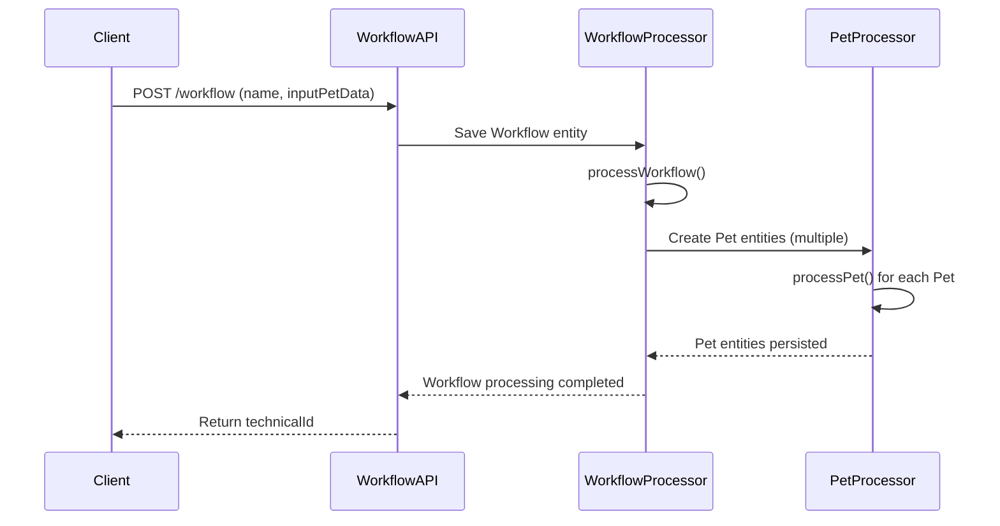
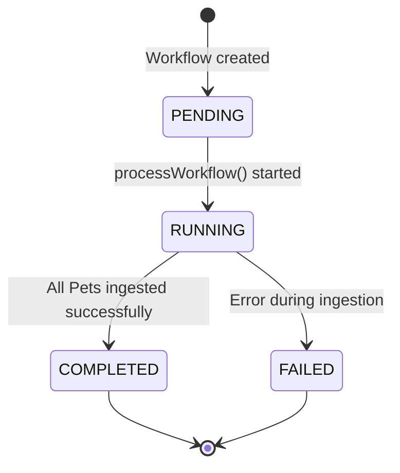
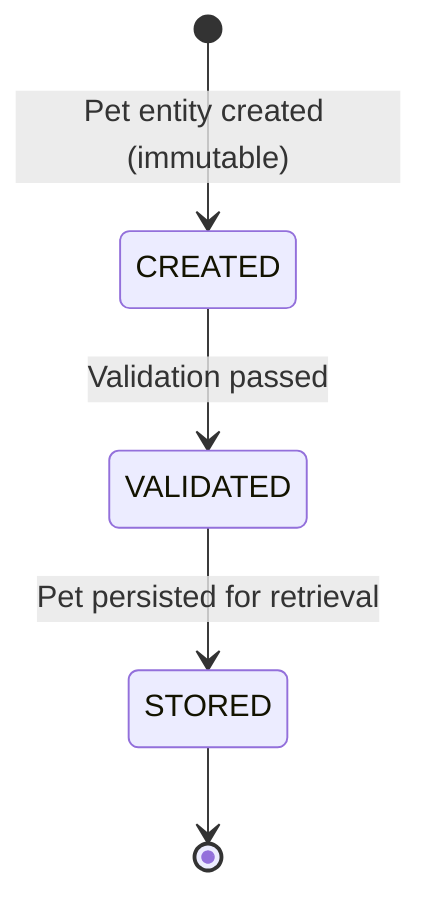

# Functional Requirements for "Purrfect Pets" API App (Event-Driven Architecture)

---

## 1. Entity Definitions

```
Workflow:
- name: String (human-readable name of the workflow)
- description: String (optional description of the workflow purpose)
- status: String (current processing status: e.g., PENDING, RUNNING, COMPLETED, FAILED)
- createdAt: String (timestamp of creation)
- inputPetData: String (raw Petstore API data or reference to input data)

Pet:
- petId: String (Petstore API pet identifier)
- name: String (name of the pet)
- category: String (category/type of pet)
- status: String (availability status: e.g., available, pending, sold)
- photoUrls: String (comma-separated URLs of pet photos)
- tags: String (comma-separated tags related to the pet)
- createdAt: String (timestamp of pet record creation)
```

---

## 2. Process Method Flows

```
processWorkflow() Flow:
1. Initial State: Workflow created with status PENDING
2. Validation: Check mandatory fields (name, inputPetData)
3. Processing:
   - Ingest Petstore API data from inputPetData
   - For each pet record in the data, create a new immutable Pet entity (trigger processPet())
4. Completion: Update Workflow status to COMPLETED or FAILED based on ingestion results
5. Notification: Optionally trigger external callbacks or events (if implemented)
```

```
processPet() Flow:
1. Initial State: Pet entity created (immutable)
2. Validation: Check required Pet fields (petId, name, category, status)
3. Processing: Store pet data for retrieval; no updates/deletes allowed by default
4. Completion: Pet entity persisted, ready for GET queries
```

---

## 3. API Endpoints Design

### Workflow API

- **POST /workflow**

  - Request Body:
    ```json
    {
      "name": "string",
      "description": "string",
      "inputPetData": "string"
    }
    ```
  - Response Body:
    ```json
    {
      "technicalId": "string"
    }
    ```
  - Behavior:  
    Creates a new Workflow entity, triggers `processWorkflow()` event.

- **GET /workflow/{technicalId}**

  - Response Body:
    ```json
    {
      "name": "string",
      "description": "string",
      "status": "string",
      "createdAt": "string",
      "inputPetData": "string"
    }
    ```

### Pet API

- **GET /pet/{technicalId}**

  - Response Body:
    ```json
    {
      "petId": "string",
      "name": "string",
      "category": "string",
      "status": "string",
      "photoUrls": "string",
      "tags": "string",
      "createdAt": "string"
    }
    ```

- **Optional:** `GET /pet?status=available` (only if explicitly requested)

---

## 4. Event-Driven Architecture Principles

- Entity creation is immutable; no update or delete endpoints are provided unless explicitly requested.
- Creating a Workflow entity triggers `processWorkflow()` event.
- Creating Pet entities is done internally during workflow processing and triggers `processPet()` events.
- POST endpoints only create entities and trigger processing events.
- GET endpoints retrieve stored results by technicalId.
- GET by other conditions (e.g., pet status) is optional and only provided if explicitly requested.

---

## 5. Mermaid Diagrams


```mermaid
sequenceDiagram
    participant Client
    participant WorkflowAPI
    participant WorkflowProcessor
    participant PetProcessor
    Client->>WorkflowAPI: POST /workflow (name, inputPetData)
    WorkflowAPI->>WorkflowProcessor: Save Workflow entity
    WorkflowProcessor->>WorkflowProcessor: processWorkflow()
    WorkflowProcessor->>PetProcessor: Create Pet entities (multiple)
    PetProcessor->>PetProcessor: processPet() for each Pet
    PetProcessor-->>WorkflowProcessor: Pet entities persisted
    WorkflowProcessor-->>WorkflowAPI: Workflow processing completed
    WorkflowAPI-->>Client: Return technicalId
```


```mermaid
stateDiagram-v2
    [*] --> PENDING : Workflow created
    PENDING --> RUNNING : processWorkflow() started
    RUNNING --> COMPLETED : All Pets ingested successfully
    RUNNING --> FAILED : Error during ingestion
    COMPLETED --> [*]
    FAILED --> [*]
```


```mermaid
stateDiagram-v2
    [*] --> CREATED : Pet entity created (immutable)
    CREATED --> VALIDATED : Validation passed
    VALIDATED --> STORED : Pet persisted for retrieval
    STORED --> [*]
```

---

This document represents the finalized functional requirements suitable for direct implementation in the Java Spring Boot backend on the Cyoda platform using an Event-Driven Architecture approach.