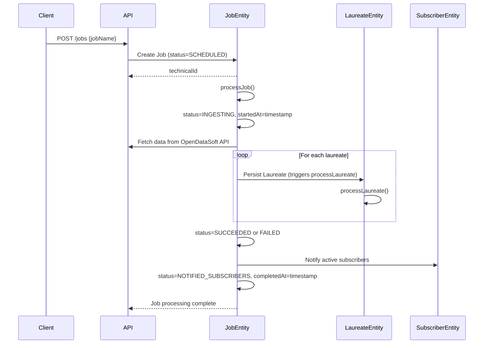
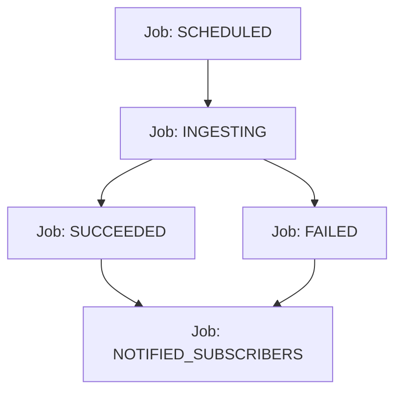

# Functional Requirements

---

## 1. Entity Definitions

### Job
- **jobName:** String (Identifier for the job instance)
- **status:** String (Current job state: SCHEDULED, INGESTING, SUCCEEDED, FAILED, NOTIFIED_SUBSCRIBERS)
- **scheduledAt:** String (ISO8601 timestamp when job is scheduled)
- **startedAt:** String (ISO8601 timestamp when ingestion begins)
- **completedAt:** String (ISO8601 timestamp when job finishes)
- **resultSummary:** String (Summary or message about job outcome)

### Laureate
- **id:** Integer (Unique laureate identifier from data source)
- **firstname:** String (Laureate first name)
- **surname:** String (Laureate last name)
- **gender:** String (Gender of laureate)
- **born:** String (ISO8601 date of birth)
- **died:** String (ISO8601 date of death or null)
- **borncountry:** String (Country of birth)
- **borncountrycode:** String (Country code of birth)
- **borncity:** String (City of birth)
- **year:** String (Year Nobel prize awarded)
- **category:** String (Prize category)
- **motivation:** String (Award motivation text)
- **name:** String (Affiliation/institution name)
- **city:** String (Affiliation city)
- **country:** String (Affiliation country)

### Subscriber
- **contactType:** String (Type of contact: e.g., email, webhook)
- **contactValue:** String (Email address or webhook URL)
- **active:** Boolean (Indicates if subscriber is active)

---

## 2. Process Method Flows

### processJob() Flow:
1. Initial State: Job created with status = "SCHEDULED".
2. Validation: Validate required job parameters (e.g., jobName).
3. Transition: Update status to "INGESTING" and set startedAt timestamp.
4. Data Ingestion: Fetch laureates data from OpenDataSoft API.
5. For each laureate in data:
   - Persist Laureate entity (triggers processLaureate()).
6. On successful ingestion of all laureates:
   - Update job status to "SUCCEEDED".
7. On failure during ingestion:
   - Update job status to "FAILED".
8. Trigger notification by persisting SubscriberNotification entity or invoking notification logic.
9. Update job status to "NOTIFIED_SUBSCRIBERS" and set completedAt timestamp.

### processLaureate() Flow:
1. Validation: Execute checks on mandatory fields (firstname, surname, year, category).
2. Enrichment: Normalize country codes, calculate additional attributes if needed.
3. Persist enriched Laureate record.
4. No direct external calls; processing limited to data normalization and storage.

### processSubscriber() Flow:
1. Validation: Check if contactType and contactValue are valid and present.
2. Store subscriber entity.
3. No further processing unless triggered by job notification.

---

## 3. API Endpoints Design

- **POST /jobs**  
  - Creates a new Job entity (immutable creation).  
  - Returns: `{ "technicalId": "string" }`  
  - Triggers `processJob()` event.

- **GET /jobs/{technicalId}**  
  - Retrieve Job entity and status by technicalId.

- **GET /jobs** (optional)  
  - Retrieve list of jobs (if requested).

- **POST /subscribers**  
  - Create a new Subscriber entity.  
  - Returns: `{ "technicalId": "string" }`

- **GET /subscribers/{technicalId}**  
  - Retrieve Subscriber details by technicalId.

- **GET /subscribers** (optional)  
  - Retrieve all subscribers.

- **GET /laureates/{technicalId}**  
  - Retrieve Laureate by technicalId.

- No POST endpoints for Laureate entity; creation is triggered by ingestion job process.

---

## 4. Request/Response Formats

### POST /jobs Request:
```json
{
  "jobName": "NobelLaureatesIngestionJob"
}
```

### POST /jobs Response:
```json
{
  "technicalId": "job-123456"
}
```

### GET /jobs/{technicalId} Response:
```json
{
  "jobName": "NobelLaureatesIngestionJob",
  "status": "NOTIFIED_SUBSCRIBERS",
  "scheduledAt": "2024-06-01T08:00:00Z",
  "startedAt": "2024-06-01T08:01:00Z",
  "completedAt": "2024-06-01T08:05:00Z",
  "resultSummary": "Ingested 100 laureates, notifications sent."
}
```

### POST /subscribers Request:
```json
{
  "contactType": "email",
  "contactValue": "user@example.com",
  "active": true
}
```

### POST /subscribers Response:
```json
{
  "technicalId": "sub-987654"
}
```

### GET /subscribers/{technicalId} Response:
```json
{
  "contactType": "email",
  "contactValue": "user@example.com",
  "active": true
}
```

### GET /laureates/{technicalId} Response:
```json
{
  "id": 853,
  "firstname": "Akira",
  "surname": "Suzuki",
  "gender": "male",
  "born": "1930-09-12",
  "died": null,
  "borncountry": "Japan",
  "borncountrycode": "JP",
  "borncity": "Mukawa",
  "year": "2010",
  "category": "Chemistry",
  "motivation": "\"for palladium-catalyzed cross couplings in organic synthesis\"",
  "name": "Hokkaido University",
  "city": "Sapporo",
  "country": "Japan"
}
```

---

## 5. Mermaid Diagrams


```mermaid
sequenceDiagram
    participant Client
    participant API
    participant JobEntity
    participant LaureateEntity
    participant SubscriberEntity

    Client->>API: POST /jobs {jobName}
    API->>JobEntity: Create Job (status=SCHEDULED)
    JobEntity-->>API: technicalId
    JobEntity->>JobEntity: processJob()
    JobEntity->>JobEntity: status=INGESTING, startedAt=timestamp
    JobEntity->>API: Fetch data from OpenDataSoft API
    loop For each laureate
        JobEntity->>LaureateEntity: Persist Laureate (triggers processLaureate)
        LaureateEntity->>LaureateEntity: processLaureate()
    end
    JobEntity->>JobEntity: status=SUCCEEDED or FAILED
    JobEntity->>SubscriberEntity: Notify active subscribers
    JobEntity->>JobEntity: status=NOTIFIED_SUBSCRIBERS, completedAt=timestamp
    JobEntity-->>API: Job processing complete
```


```mermaid
graph TD
    Job_SCHEDULED["Job: SCHEDULED"]
    Job_INGESTING["Job: INGESTING"]
    Job_SUCCEEDED["Job: SUCCEEDED"]
    Job_FAILED["Job: FAILED"]
    Job_NOTIFIED["Job: NOTIFIED_SUBSCRIBERS"]

    Job_SCHEDULED --> Job_INGESTING
    Job_INGESTING --> Job_SUCCEEDED
    Job_INGESTING --> Job_FAILED
    Job_SUCCEEDED --> Job_NOTIFIED
    Job_FAILED --> Job_NOTIFIED
```
