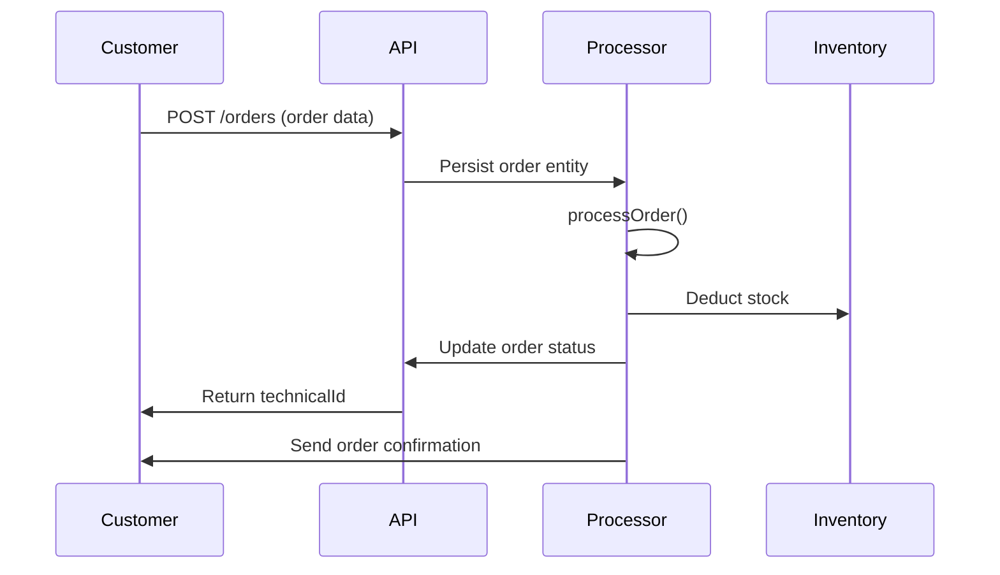

### 1. Entity Definitions

``` 
ProductUploadJob:
- jobName: String (Name or description of the upload job)
- csvData: String (Base64 or raw CSV content to be processed)
- createdBy: String (User who initiated the job)
- status: String (Job status: PENDING, PROCESSING, COMPLETED, FAILED)
- createdAt: String (Timestamp of job creation)

CustomerProfileUpdate:
- customerId: String (ID of the customer being updated)
- updatedFields: Map<String, String> (Field names and new values)
- updatedAt: String (Timestamp of profile update event)
- updatedBy: String (Customer user ID or system)

Order:
- customerId: String (ID of the customer who placed the order)
- orderItems: List<OrderItem> (List of items in the order)
- totalAmount: Decimal (Total price of the order)
- orderDate: String (Timestamp when order was placed)
- status: String (Order status: PENDING, SHIPPED, DELIVERED, CANCELLED)

OrderItem:
- productId: String (ID of the product ordered)
- quantity: Integer (Number of units ordered)
- priceAtPurchase: Decimal (Price per unit at ordering time)
```

---

### 2. Process Method Flows

``` 
processProductUploadJob() Flow:
1. Initial State: Job created with status = PENDING
2. Validation: Check CSV format and required fields
3. Processing: Parse CSV, create immutable Product entities for each item
4. Completion: Update status to COMPLETED if all items processed successfully, else FAILED
5. Notification: Log results and optionally notify admin

processCustomerProfileUpdate() Flow:
1. Initial State: CustomerProfileUpdate entity created
2. Validation: Check updatedFields are valid and allowed
3. Processing: Apply changes as immutable events linked to customer history
4. Completion: Mark update event as processed
5. Notification: Confirm update success to user

processOrder() Flow:
1. Initial State: Order entity created with status = PENDING
2. Validation: Verify product stock availability for each order item
3. Processing: Deduct stock, calculate totals, save order snapshot
4. Completion: Update order status to CONFIRMED or FAILED
5. Notification: Send order confirmation to customer, notify inventory
```

---

### 3. API Endpoints Design

| Entity               | POST Endpoint                    | GET by technicalId                 | GET by condition (optional)                 |
|----------------------|---------------------------------|----------------------------------|---------------------------------------------|
| ProductUploadJob     | POST /api/product-upload-jobs    | GET /api/product-upload-jobs/{id} | N/A                                         |
| CustomerProfileUpdate| POST /api/customer-profile-updates | GET /api/customer-profile-updates/{id} | N/A                                         |
| Order                | POST /api/orders                 | GET /api/orders/{id}               | GET /api/orders?customerId=...&status=...   |

- POST requests return only the `technicalId` of the created entity.
- No update/delete endpoints; all changes modeled as new entities.

---

### 4. Request/Response Formats

**POST /api/product-upload-jobs**

Request:
```json
{
  "jobName": "March Bulk Upload",
  "csvData": "<base64-encoded-csv>",
  "createdBy": "adminUser123"
}
```

Response:
```json
{
  "technicalId": "job-uuid-1234"
}
```

---

**POST /api/customer-profile-updates**

Request:
```json
{
  "customerId": "cust-5678",
  "updatedFields": {
    "email": "newemail@example.com",
    "phone": "+1234567890"
  },
  "updatedBy": "cust-5678",
  "updatedAt": "2024-06-01T12:34:56Z"
}
```

Response:
```json
{
  "technicalId": "profile-update-uuid-9012"
}
```

---

**POST /api/orders**

Request:
```json
{
  "customerId": "cust-5678",
  "orderItems": [
    {
      "productId": "prod-111",
      "quantity": 2,
      "priceAtPurchase": 19.99
    },
    {
      "productId": "prod-222",
      "quantity": 1,
      "priceAtPurchase": 49.95
    }
  ],
  "totalAmount": 89.93,
  "orderDate": "2024-06-01T13:00:00Z",
  "status": "PENDING"
}
```

Response:
```json
{
  "technicalId": "order-uuid-3456"
}
```

---

### 5. Visual Representations

#### Entity Lifecycle State Diagram


```mermaid
stateDiagram-v2
    [*] --> Pending
    Pending --> Processing : processEntity()
    Processing --> Completed : success
    Processing --> Failed : error
    Completed --> [*]
    Failed --> [*]
```

#### Event-Driven Processing Chain (Example for ProductUploadJob)

```mermaid
graph TD
    A[POST ProductUploadJob] --> B[Entity Persisted]
    B --> C[processProductUploadJob()]
    C --> D[Validate CSV]
    D --> E[Create Product Entities]
    E --> F[Update Job Status]
    F --> G[Notify Admin]
```

#### User Interaction Sequence Flow (Order Creation)


```mermaid
sequenceDiagram
    participant Customer
    participant API
    participant Processor
    Customer->>API: POST /orders (order data)
    API->>Processor: Persist order entity
    Processor->>Processor: processOrder()
    Processor->>Inventory: Deduct stock
    Processor->>API: Update order status
    API->>Customer: Return technicalId
    Processor->>Customer: Send order confirmation
```
