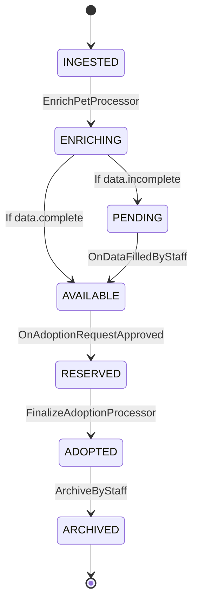
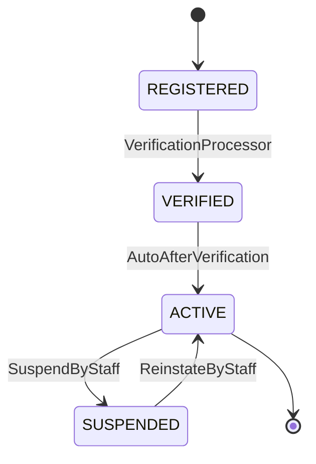
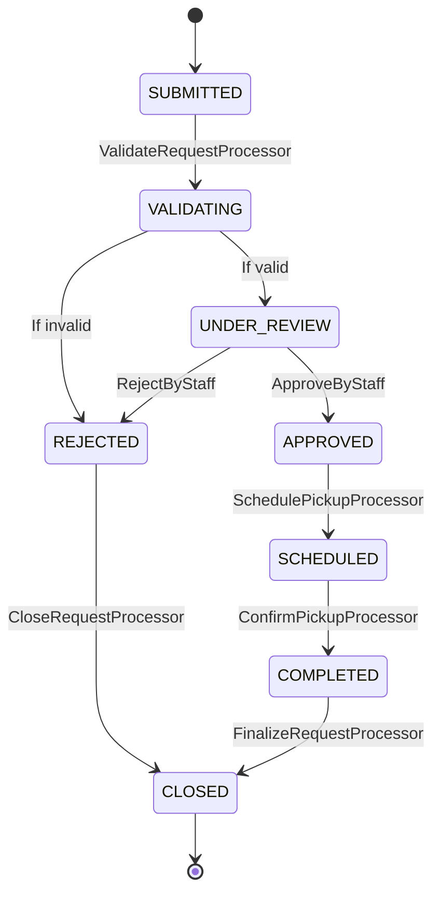
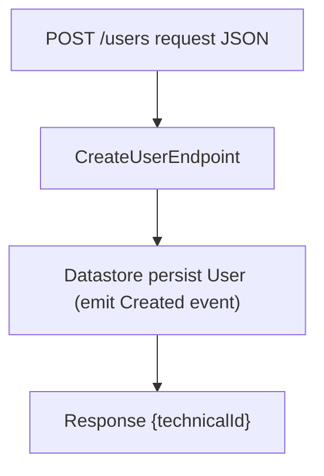
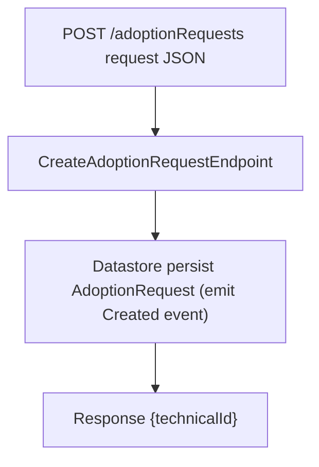

### 1. Entity Definitions
```
Pet:
- id: String (business id from Petstore or internal)
- name: String (pet name)
- species: String (dog, cat, etc.)
- breed: String (breed info)
- age: Number (years or months)
- status: String (available, pending, adopted)
- photos: Array (list of image metadata)
- description: String (short bio)
- healthNotes: String (vaccines, conditions)
- sourceId: String (original Petstore id)

User:
- id: String (business id)
- fullName: String (name)
- contactInfo: Object (email, phone)
- role: String (public, staff, admin)
- favorites: Array (list of Pet ids)
- createdAt: String (ISO timestamp)

AdoptionRequest:
- id: String (business id)
- petId: String (linked Pet.id)
- userId: String (linked User.id)
- status: String (submitted, under_review, approved, rejected, completed)
- submittedAt: String (ISO timestamp)
- reviewNotes: String (staff notes)
- scheduledPickup: String (ISO timestamp or null)
```

### 2. Entity workflows

Pet workflow:
1. Initial State: Created via ingestion event (Petstore sync) or manual add
2. Enrichment: Fetch images/description, validate data (automatic)
3. Availability: Become AVAILABLE or PENDING if incomplete (automatic)
4. Adoption Lock: When an AdoptionRequest approved, transition to ADOPTED (automatic/manual)
5. Archive: Old or removed pets go to archived (manual)


```mermaid
stateDiagram-v2
    [*] --> INGESTED
    INGESTED --> ENRICHING : EnrichPetProcessor
    ENRICHING --> AVAILABLE : If data.complete
    ENRICHING --> PENDING : If data.incomplete
    AVAILABLE --> RESERVED : OnAdoptionRequestApproved
    RESERVED --> ADOPTED : FinalizeAdoptionProcessor
    PENDING --> AVAILABLE : OnDataFilledByStaff
    ADOPTED --> ARCHIVED : ArchiveByStaff
    ARCHIVED --> [*]
```

Pet processors/criteria:
- EnrichPetProcessor: fetch images, normalize breed; if missing critical fields mark incomplete.
- CheckAdoptionCriterion: verifies pet still available before approving.
Pseudo:
```
class EnrichPetProcessor:
  process(entity):
    fetch images by sourceId
    normalize breed
    entity.data.complete = check_required_fields(entity)
    persist(entity)
```

User workflow:
1. Initial State: Registered (via POST) or created by admin
2. Verify: Email/contact verification (automatic/manual)
3. Active: Can favorite, submit requests
4. Suspended/Disabled: Manual action by staff


```mermaid
stateDiagram-v2
    [*] --> REGISTERED
    REGISTERED --> VERIFIED : VerificationProcessor
    VERIFIED --> ACTIVE : AutoAfterVerification
    ACTIVE --> SUSPENDED : SuspendByStaff
    SUSPENDED --> ACTIVE : ReinstateByStaff
    ACTIVE --> [*]
```

User processors/criteria:
- VerificationProcessor: check contactInfo, send verification event.
Pseudo:
```
class VerificationProcessor:
  process(entity):
    if contactInfo.valid:
      mark verified
    persist(entity)
```

AdoptionRequest workflow:
1. Initial State: submitted (POST by user)
2. Validate: System checks pet availability and user eligibility (automatic)
3. Review: Staff reviews (manual)
4. Decision: Approve or Reject (manual)
5. Fulfillment: On approve schedule pickup and set Pet.status to adopted (automatic)
6. Closed: Completed after pickup or canceled


```mermaid
stateDiagram-v2
    [*] --> SUBMITTED
    SUBMITTED --> VALIDATING : ValidateRequestProcessor
    VALIDATING --> UNDER_REVIEW : If valid
    VALIDATING --> REJECTED : If invalid
    UNDER_REVIEW --> APPROVED : ApproveByStaff
    UNDER_REVIEW --> REJECTED : RejectByStaff
    APPROVED --> SCHEDULED : SchedulePickupProcessor
    SCHEDULED --> COMPLETED : ConfirmPickupProcessor
    REJECTED --> CLOSED : CloseRequestProcessor
    COMPLETED --> CLOSED : FinalizeRequestProcessor
    CLOSED --> [*]
```

AdoptionRequest processors/criteria:
- ValidateRequestProcessor: Check pet.status == available and user not suspended.
- SchedulePickupProcessor: Reserve pet and propose pickup times.
- FinalizeRequestProcessor: On completion set Pet.status = adopted and clear reservations.
Pseudo:
```
class ValidateRequestProcessor:
  process(entity):
    pet = loadPet(entity.petId)
    user = loadUser(entity.userId)
    if pet.status != available or user.suspended:
      entity.status = rejected
    else:
      entity.status = under_review
    persist(entity)
```

### 3. Pseudo code for processor classes
(Already included minimal pseudo above; concise repeat)

EnrichPetProcessor, ValidateRequestProcessor, SchedulePickupProcessor, FinalizeRequestProcessor, VerificationProcessor — each implements process(entity) performing checks, calling helper services (image fetch, availability check), updating fields, persisting entity and emitting follow-up events.

Example:
```
class FinalizeRequestProcessor:
  process(request):
    pet = loadPet(request.petId)
    pet.status = adopted
    request.status = completed
    request.scheduledPickup = now_if_not_set
    persist(pet)
    persist(request)
    emit Event PetAdopted with pet.id
```

### 4. API Endpoints Design Rules

Rules applied:
- POST endpoints that create entities return only technicalId.
- GET endpoints retrieve stored results.
- GET by technicalId present for entities created via POST.

Endpoints:
1) POST /users
Request JSON:
```json
{ "fullName": "...", "contactInfo": {"email":"...","phone":"..."}, "role":"public" }
```
Response:
```json
{ "technicalId": "tx_user_123" }
```

2) GET /users/{technicalId}
Response JSON: full persisted User object (as defined fields)

3) POST /adoptionRequests
Request JSON:
```json
{ "petId":"pet_123", "userId":"user_456", "submittedAt":"2025-08-18T12:00:00Z" }
```
Response:
```json
{ "technicalId": "tx_req_789" }
```

4) GET /adoptionRequests/{technicalId}
Response: full AdoptionRequest object persisted.

5) GET /pets
Response: list of Pet objects (for browse)

6) GET /pets/{id}
Response: single Pet object

Mermaid visualization for POST user and POST adoptionRequest flows:

```mermaid
flowchart TD
  RequestUser["POST /users request JSON"]
  EndpointUser["CreateUserEndpoint"]
  StoreUser["Datastore persist User (emit Created event)"]
  ResponseUser["Response {technicalId}"]

  RequestUser --> EndpointUser
  EndpointUser --> StoreUser
  StoreUser --> ResponseUser
```


```mermaid
flowchart TD
  RequestReq["POST /adoptionRequests request JSON"]
  EndpointReq["CreateAdoptionRequestEndpoint"]
  StoreReq["Datastore persist AdoptionRequest (emit Created event)"]
  ResponseReq["Response {technicalId}"]

  RequestReq --> EndpointReq
  EndpointReq --> StoreReq
  StoreReq --> ResponseReq
```

Notes / constraints (high-level):
- Pet ingestion from Petstore is modeled as incoming events that persist Pet entities; each persisted Pet triggers EnrichPetProcessor automatically.
- POST endpoints return only technicalId per rule.
- Search/filter GET by condition not included (only GET all /pets and GET by id). If you want filtered search (species/breed/age) I can add GET by condition endpoints.
- If you want an explicit orchestration Job entity (to run scheduled Petstore syncs), ask and I will add it (counts toward entity limit).