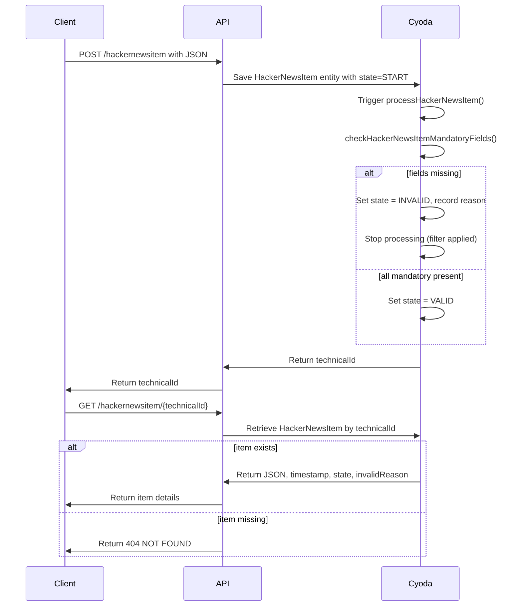
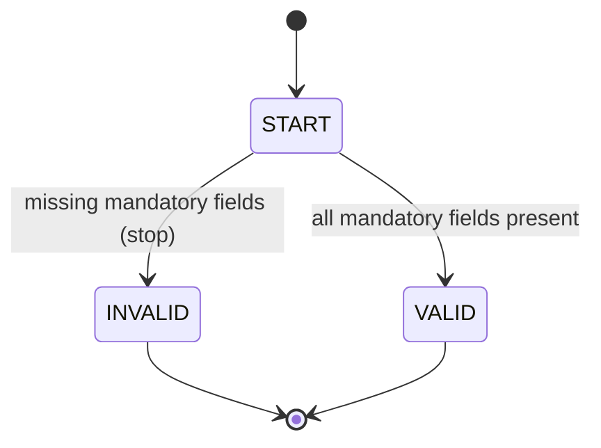

### 1. Entity Definitions

```
HackerNewsItem:
- id: Long (mandatory, Hacker News item identifier)
- type: String (mandatory, Hacker News item type)
- json: String (optional, full JSON payload of the Hacker News item)
- state: String (mandatory, one of "START", "INVALID", "VALID")
- invalidReason: String (optional, reason for INVALID state)
- creationTimestamp: Instant (mandatory, timestamp when the item was stored)
```

### 2. Process Method Flows

```
processHackerNewsItem() Flow:
1. Initial State: HackerNewsItem entity created with state = START
2. Validation: checkHackerNewsItemMandatoryFields() verifies presence of "id" and "type"
3. Filtering:
    - If mandatory fields are missing:
        - Set state = INVALID
        - Record invalidReason with missing fields
        - Stop further processing (do not proceed to VALID)
    - Else:
        - Set state = VALID
4. Completion: Persist entity with final state and creationTimestamp
```

### 3. API Endpoints Design

- **POST /hackernewsitem**
  - Request Body: Full Hacker News JSON with mandatory fields "id" and "type"
  - Behavior: Creates a new immutable HackerNewsItem entity with initial state = START, triggering the `processHackerNewsItem()` event that applies validation and filtering.
  - Response: `{ "technicalId": "string" }` (unique system-generated ID for the stored entity)

- **GET /hackernewsitem/{technicalId}**
  - Behavior: Retrieves the stored HackerNewsItem by technicalId.
  - Response:
    ```json
    {
      "json": "{...}",                    // exact JSON string stored
      "creationTimestamp": "ISO8601",    // stored creation timestamp
      "state": "START" | "INVALID" | "VALID",
      "invalidReason": "string or null"
    }
    ```
  - Returns 404 NOT FOUND if the item does not exist.

### 4. Request/Response Formats

**POST /hackernewsitem Request:**

```json
{
  "id": 12345,
  "type": "story",
  ... // optional other Hacker News fields
}
```

**POST /hackernewsitem Response:**

```json
{
  "technicalId": "abc123xyz"
}
```

**GET /hackernewsitem/{technicalId} Response:**

```json
{
  "json": "{...}",
  "creationTimestamp": "2024-06-01T12:34:56Z",
  "state": "VALID",
  "invalidReason": null
}
```

### 5. Mermaid Diagrams


```mermaid
sequenceDiagram
    participant Client
    participant API
    participant Cyoda

    Client->>API: POST /hackernewsitem with JSON
    API->>Cyoda: Save HackerNewsItem entity with state=START
    Cyoda->>Cyoda: Trigger processHackerNewsItem()
    Cyoda->>Cyoda: checkHackerNewsItemMandatoryFields()
    alt fields missing
        Cyoda->>Cyoda: Set state = INVALID, record reason
        Cyoda->>Cyoda: Stop processing (filter applied)
    else all mandatory present
        Cyoda->>Cyoda: Set state = VALID
    end
    Cyoda->>API: Return technicalId
    API->>Client: Return technicalId

    Client->>API: GET /hackernewsitem/{technicalId}
    API->>Cyoda: Retrieve HackerNewsItem by technicalId
    alt item exists
        Cyoda->>API: Return JSON, timestamp, state, invalidReason
        API->>Client: Return item details
    else item missing
        API->>Client: Return 404 NOT FOUND
    end
```


```mermaid
stateDiagram-v2
    [*] --> START
    START --> INVALID : missing mandatory fields (stop)
    START --> VALID : all mandatory fields present
    INVALID --> [*]
    VALID --> [*]
```

---

This document fully captures the functional requirements, entity definitions, event-driven workflows, API specifications, and data formats as confirmed.