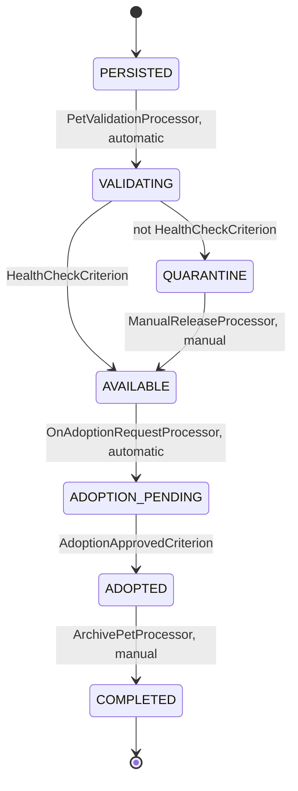
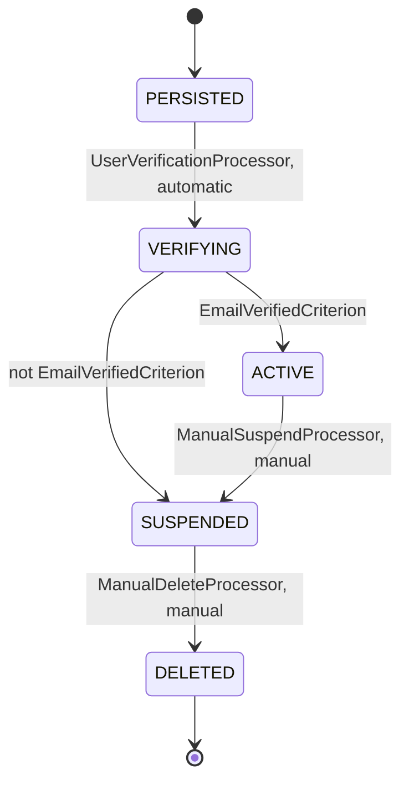
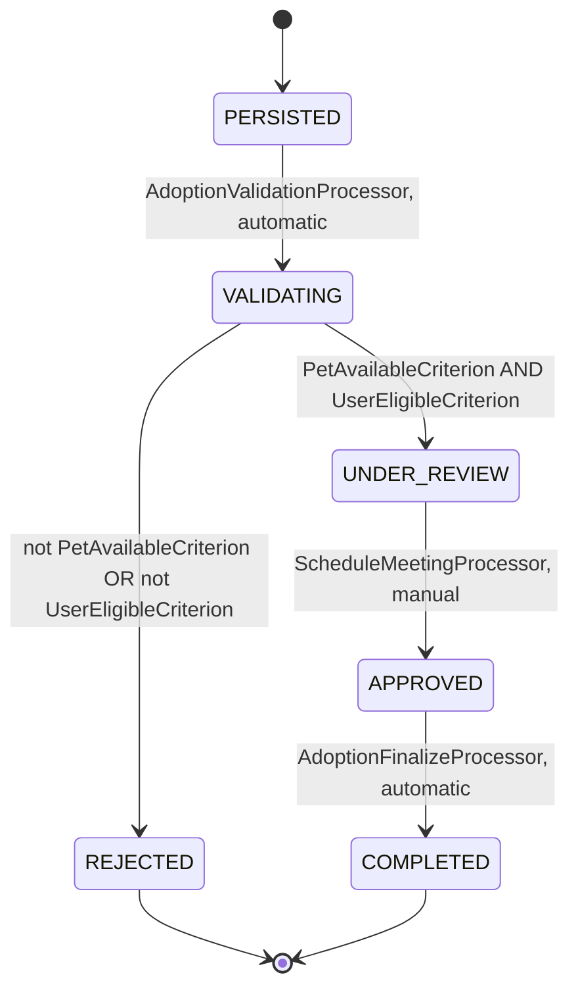

You did not list entities explicitly, so I used the default of 3 entities. If you want more (up to 10) tell me and I will expand.

### 1. Entity Definitions
```
Pet:
- id: String (business id from Petstore or external source)
- name: String (pet name)
- species: String (cat, dog, etc.)
- breed: String (breed details)
- ageMonths: Integer (age in months)
- status: String (available, adopted, quarantine, unavailable)
- healthNotes: String (vet notes, vaccinations)
- createdAt: String (timestamp)

User:
- userId: String (external user id)
- fullName: String (owner name)
- email: String (contact email)
- phone: String (contact phone)
- role: String (adopter, staff)
- verified: Boolean (identity/phone verified)
- createdAt: String (timestamp)

AdoptionRequest:
- petId: String (reference to Pet.id)
- requesterUserId: String (reference to User.userId)
- requestedAt: String (timestamp)
- status: String (PENDING, UNDER_REVIEW, APPROVED, REJECTED, COMPLETED)
- notes: String (requester message)
- meetingScheduledAt: String (optional)
```

### 2. Entity workflows

Pet workflow:
1. Initial State: PERSISTED (event when Pet POSTed)
2. Validation: run health & data checks (automatic)
3. Listing: if valid -> AVAILABLE (automatic); if issues -> QUARANTINE (automatic/manual review)
4. Adoption: when AdoptionRequest APPROVED -> ADOPTED (automatic)
5. Completion: mark UNAVAILABLE/ARCHIVED (manual or automatic)
Processors: PetValidationProcessor, PetListingProcessor, NotifyStaffProcessor
Criteria: HealthCheckCriterion, RequiredFieldsCriterion


```mermaid
stateDiagram-v2
    [*] --> PERSISTED
    PERSISTED --> VALIDATING : PetValidationProcessor, automatic
    VALIDATING --> AVAILABLE : HealthCheckCriterion
    VALIDATING --> QUARANTINE : not HealthCheckCriterion
    AVAILABLE --> ADOPTION_PENDING : OnAdoptionRequestProcessor, automatic
    ADOPTION_PENDING --> ADOPTED : AdoptionApprovedCriterion
    ADOPTED --> COMPLETED : ArchivePetProcessor, manual
    QUARANTINE --> AVAILABLE : ManualReleaseProcessor, manual
    COMPLETED --> [*]
```

User workflow:
1. Initial State: PERSISTED
2. Verification: send verification to user (automatic)
3. Activation: if verified -> ACTIVE (automatic), else -> SUSPENDED (manual follow-up)
4. Deletion/Archival: manual
Processors: UserVerificationProcessor, NotifyVerificationProcessor
Criteria: EmailVerifiedCriterion


```mermaid
stateDiagram-v2
    [*] --> PERSISTED
    PERSISTED --> VERIFYING : UserVerificationProcessor, automatic
    VERIFYING --> ACTIVE : EmailVerifiedCriterion
    VERIFYING --> SUSPENDED : not EmailVerifiedCriterion
    ACTIVE --> SUSPENDED : ManualSuspendProcessor, manual
    SUSPENDED --> DELETED : ManualDeleteProcessor, manual
    DELETED --> [*]
```

AdoptionRequest workflow:
1. Initial State: PERSISTED (user POSTs request)
2. Validation: check pet availability & user verification (automatic)
3. Review: staff review and schedule meeting (manual)
4. Decision: APPROVED or REJECTED (manual)
5. Fulfillment: if approved -> COMPLETED (after pickup/confirmation) (automatic)
Processors: AdoptionValidationProcessor, ScheduleMeetingProcessor, AdoptionFinalizeProcessor
Criteria: PetAvailableCriterion, UserEligibleCriterion


```mermaid
stateDiagram-v2
    [*] --> PERSISTED
    PERSISTED --> VALIDATING : AdoptionValidationProcessor, automatic
    VALIDATING --> UNDER_REVIEW : PetAvailableCriterion AND UserEligibleCriterion
    VALIDATING --> REJECTED : not PetAvailableCriterion OR not UserEligibleCriterion
    UNDER_REVIEW --> APPROVED : ScheduleMeetingProcessor, manual
    APPROVED --> COMPLETED : AdoptionFinalizeProcessor, automatic
    REJECTED --> [*]
    COMPLETED --> [*]
```

### 3. Pseudo code for processor classes
```text
class PetValidationProcessor:
    process(entity):
        if requiredFieldsMissing(entity): mark INVALID
        if healthIssues(entity): mark QUARANTINE
        else mark VALID

class PetListingProcessor:
    process(entity):
        if entity.status == VALID: set status AVAILABLE; NotifyStaffProcessor.process(entity)

class AdoptionValidationProcessor:
    process(entity):
        if not PetAvailableCriterion.check(entity.petId): set status REJECTED
        if not UserEligibleCriterion.check(entity.requesterUserId): set status REJECTED
        else set status UNDER_REVIEW

class ScheduleMeetingProcessor:
    process(entity):
        create meeting proposal; update entity.meetingScheduledAt

class AdoptionFinalizeProcessor:
    process(entity):
        set Pet.status = ADOPTED
        set adoption request status COMPLETED
        NotifyUsersProcessor.process(entity)
```

Criteria pseudo:
```text
class PetAvailableCriterion:
    check(petId): return Pet.status == AVAILABLE

class UserEligibleCriterion:
    check(userId): return User.verified == true
```

### 4. API Endpoints Design Rules

- POST endpoints create entities (trigger Cyoda workflows). POST returns only technicalId.
- GET by technicalId returns stored entity result.
- No GET by condition provided (not requested).

Endpoints and JSON formats:

1) Create Pet
POST /pets
Request:
```json
{
  "id":"external-pet-123",
  "name":"Mittens",
  "species":"cat",
  "breed":"Tabby",
  "ageMonths":14,
  "healthNotes":"Vaccinated"
}
```
Response:
```json
{
  "technicalId":"pet_0001"
}
```
GET Pet by technicalId
GET /pets/{technicalId}
Response:
```json
{
  "technicalId":"pet_0001",
  "id":"external-pet-123",
  "name":"Mittens",
  "species":"cat",
  "breed":"Tabby",
  "ageMonths":14,
  "status":"AVAILABLE",
  "healthNotes":"Vaccinated",
  "createdAt":"2025-09-12T10:00:00Z"
}
```

2) Create User
POST /users
Request:
```json
{
  "userId":"user_42",
  "fullName":"Alex Doe",
  "email":"alex@example.com",
  "phone":"+123456789"
}
```
Response:
```json
{
  "technicalId":"user_0001"
}
```
GET /users/{technicalId}
Response:
```json
{
  "technicalId":"user_0001",
  "userId":"user_42",
  "fullName":"Alex Doe",
  "email":"alex@example.com",
  "verified":false,
  "createdAt":"2025-09-12T10:05:00Z"
}
```

3) Create AdoptionRequest
POST /adoptions
Request:
```json
{
  "petId":"external-pet-123",
  "requesterUserId":"user_42",
  "notes":"We have a loving home!"
}
```
Response:
```json
{
  "technicalId":"adoption_0001"
}
```
GET /adoptions/{technicalId}
Response:
```json
{
  "technicalId":"adoption_0001",
  "petId":"external-pet-123",
  "requesterUserId":"user_42",
  "status":"UNDER_REVIEW",
  "requestedAt":"2025-09-12T10:10:00Z",
  "meetingScheduledAt":null
}
```

If you want more entities (appointments, invoices, inventory) or different workflow branching, tell me which ones and I will expand the model.