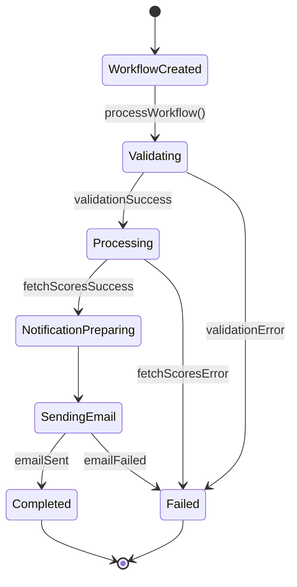
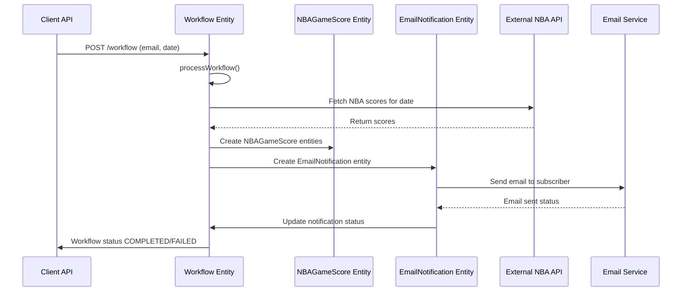
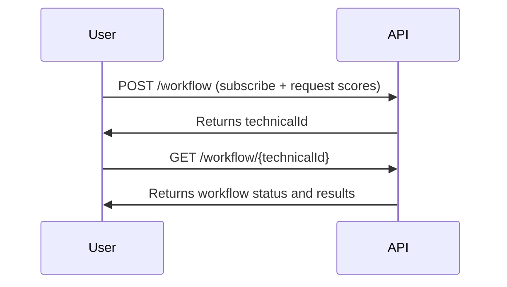

### 1. Entity Definitions

``` 
Workflow: 
- subscriberEmail: String (Email of the user subscribing to daily notifications)
- requestedDate: String (Date for which NBA scores are requested, format YYYY-MM-DD)
- status: String (Workflow status: PENDING, PROCESSING, COMPLETED, FAILED)
- createdAt: String (Timestamp of workflow creation)

NBAGameScore:
- gameDate: String (Date of the NBA game, format YYYY-MM-DD)
- homeTeam: String (Name of the home team)
- awayTeam: String (Name of the away team)
- homeScore: Integer (Score of the home team)
- awayScore: Integer (Score of the away team)
- status: String (Game status, e.g., FINAL, IN_PROGRESS)
- venue: String (Location of the game)

EmailNotification:
- subscriberEmail: String (Email address to notify)
- notificationDate: String (Date of the scores included in the notification, format YYYY-MM-DD)
- emailSentStatus: String (Status of email delivery: PENDING, SENT, FAILED)
- sentAt: String (Timestamp when email was sent)
```

---

### 2. Process Method Flows

``` 
processWorkflow() Flow:
1. Initial State: Workflow created with status PENDING.
2. Validation: Validate subscriberEmail format and requestedDate.
3. Processing:
   a. Fetch NBA game scores for requestedDate from external API asynchronously.
   b. For each game fetched, create immutable NBAGameScore entities.
4. Notification Preparation:
   a. Create EmailNotification entity for subscriberEmail and requestedDate with status PENDING.
5. Completion:
   a. Send email with daily scores to subscriberEmail.
   b. Update EmailNotification status to SENT or FAILED accordingly.
6. Finalize Workflow status to COMPLETED or FAILED based on overall success.

processNBAGameScore() Flow:
1. Initial State: NBAGameScore entity created and persisted.
2. Validation: (Optional) Validate game data completeness if triggered explicitly.
3. No further processing by default (scores are stored as immutable records).

processEmailNotification() Flow:
1. Initial State: EmailNotification created with PENDING status.
2. Processing: Send email to subscriberEmail with NBA scores summary.
3. Completion: Update emailSentStatus to SENT if successful, otherwise FAILED.
```

---

### 3. API Endpoints Design

| Method | Path               | Description                                          | Request Body                     | Response                  |
|--------|--------------------|------------------------------------------------------|---------------------------------|---------------------------|
| POST   | /workflow          | Create a new Workflow (subscribe & request scores) | `{ "subscriberEmail": "...", "requestedDate": "YYYY-MM-DD" }` | `{ "technicalId": "..." }` |
| GET    | /workflow/{id}     | Retrieve Workflow status/results by technicalId     | N/A                             | Workflow entity JSON       |
| GET    | /nbagames/{date}   | Get all NBAGameScore entities for a specific date   | N/A                             | List of NBAGameScore JSON  |
| GET    | /emailnotification/{id} | Retrieve EmailNotification status by technicalId | N/A                             | EmailNotification JSON     |

---

### 4. Request/Response Formats

**POST /workflow**  
_Request:_  
```json
{
  "subscriberEmail": "user@example.com",
  "requestedDate": "2024-06-15"
}
```

_Response:_  
```json
{
  "technicalId": "workflow-1234"
}
```

**GET /workflow/{technicalId}**  
_Response:_  
```json
{
  "subscriberEmail": "user@example.com",
  "requestedDate": "2024-06-15",
  "status": "COMPLETED",
  "createdAt": "2024-06-15T18:00:00Z"
}
```

**GET /nbagames/{date}**  
_Response:_  
```json
[
  {
    "gameDate": "2024-06-15",
    "homeTeam": "Lakers",
    "awayTeam": "Warriors",
    "homeScore": 110,
    "awayScore": 105,
    "status": "FINAL",
    "venue": "Staples Center"
  }
]
```

**GET /emailnotification/{technicalId}**  
_Response:_  
```json
{
  "subscriberEmail": "user@example.com",
  "notificationDate": "2024-06-15",
  "emailSentStatus": "SENT",
  "sentAt": "2024-06-15T18:30:00Z"
}
```

---

### 5. Visual Representations

#### Workflow Entity Lifecycle


```mermaid
stateDiagram-v2
    [*] --> WorkflowCreated
    WorkflowCreated --> Validating : processWorkflow()
    Validating --> Processing : validationSuccess
    Validating --> Failed : validationError
    Processing --> NotificationPreparing : fetchScoresSuccess
    Processing --> Failed : fetchScoresError
    NotificationPreparing --> SendingEmail
    SendingEmail --> Completed : emailSent
    SendingEmail --> Failed : emailFailed
    Completed --> [*]
    Failed --> [*]
```

#### Event-Driven Processing Chain


```mermaid
sequenceDiagram
    participant API as Client API
    participant WF as Workflow Entity
    participant NBAG as NBAGameScore Entity
    participant EN as EmailNotification Entity
    participant EXT as External NBA API
    participant SMTP as Email Service

    API->>WF: POST /workflow (email, date)
    WF->>WF: processWorkflow()
    WF->>EXT: Fetch NBA scores for date
    EXT-->>WF: Return scores
    WF->>NBAG: Create NBAGameScore entities
    WF->>EN: Create EmailNotification entity
    EN->>SMTP: Send email to subscriber
    SMTP-->>EN: Email sent status
    EN->>WF: Update notification status
    WF->>API: Workflow status COMPLETED/FAILED
```

#### User Interaction Sequence Flow


```mermaid
sequenceDiagram
    participant User
    participant API

    User->>API: POST /workflow (subscribe + request scores)
    API->>User: Returns technicalId
    User->>API: GET /workflow/{technicalId}
    API->>User: Returns workflow status and results
```
