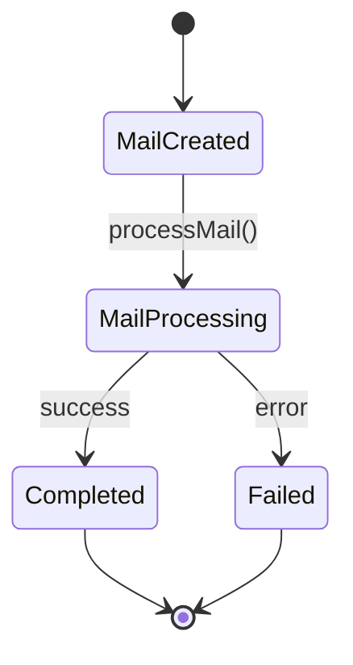
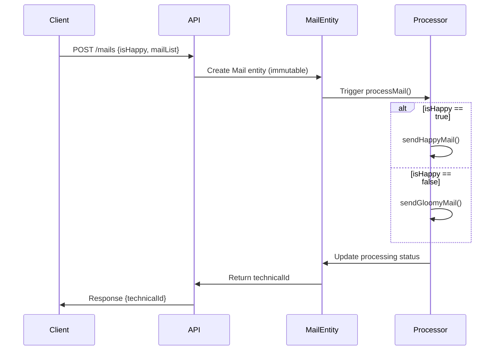
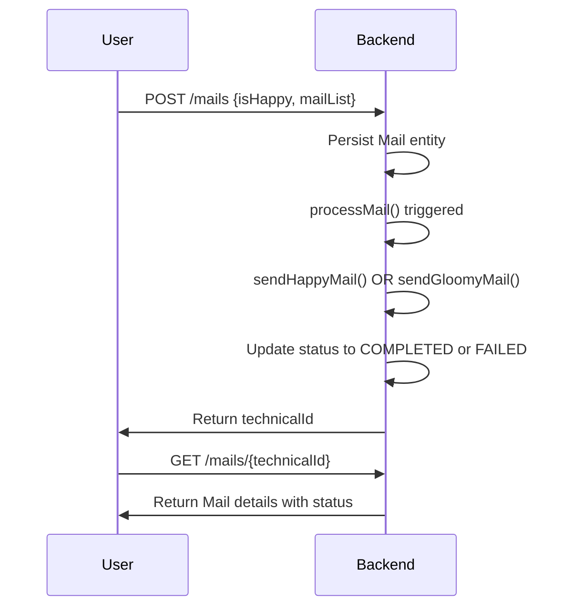

### 1. Entity Definitions

```
Mail:
- isHappy: boolean (indicates if the mail is happy or gloomy)
- mailList: List<String> (list of recipient email addresses)
```

---

### 2. Process Method Flows

```
processMail() Flow:
1. Initial State: Mail entity is created with fields isHappy and mailList populated.
2. Validation: Optionally, run checkMailHappyCriteria() and checkMailGloomyCriteria() if criteria are explicitly invoked to validate the mail mood.
3. Processing:
   - If isHappy == true → invoke sendHappyMail processor logic (send happy mails to mailList)
   - If isHappy == false → invoke sendGloomyMail processor logic (send gloomy mails to mailList)
4. Completion: Mark mail processing as completed.
5. Notification: (Optional) Log or notify about sending status.
```

---

### 3. API Endpoints Design

- **POST /mails**  
  Create a new Mail entity (immutable creation) → triggers `processMail()` automatically if only one processor or optionally `processMailSendHappyMail()` or `processMailSendGloomyMail()` if explicitly asked.  
  **Response:** `{ "technicalId": "generated-uuid" }`

- **GET /mails/{technicalId}**  
  Retrieve processed Mail entity by its technicalId.  
  **Response:** Full Mail entity details including status and recipients.

- **GET /mails** (optional)  
  Retrieve all mails (only if explicitly requested).

- No update or delete endpoints for Mail (immutable principle).

---

### 4. Request / Response Formats

**POST /mails**  
_Request Body:_

```json
{
  "isHappy": true,
  "mailList": [
    "recipient1@example.com",
    "recipient2@example.com"
  ]
}
```

_Response Body:_

```json
{
  "technicalId": "uuid-generated-id"
}
```

---

**GET /mails/{technicalId}**  
_Response Body:_

```json
{
  "isHappy": true,
  "mailList": [
    "recipient1@example.com",
    "recipient2@example.com"
  ],
  "processingStatus": "COMPLETED",
  "sentTimestamp": "2024-06-01T12:00:00Z"
}
```

---

### 5. Mermaid Diagrams

**Entity Lifecycle State Diagram for Mail**


```mermaid
stateDiagram-v2
    [*] --> MailCreated
    MailCreated --> MailProcessing : processMail()
    MailProcessing --> Completed : success
    MailProcessing --> Failed : error
    Completed --> [*]
    Failed --> [*]
```

---

**Event-Driven Processing Chain**


```mermaid
sequenceDiagram
    participant Client
    participant API
    participant MailEntity
    participant Processor

    Client->>API: POST /mails {isHappy, mailList}
    API->>MailEntity: Create Mail entity (immutable)
    MailEntity->>Processor: Trigger processMail()
    alt isHappy == true
        Processor->>Processor: sendHappyMail()
    else isHappy == false
        Processor->>Processor: sendGloomyMail()
    end
    Processor->>MailEntity: Update processing status
    MailEntity->>API: Return technicalId
    API->>Client: Response {technicalId}
```

---

**User Interaction Sequence Flow**


```mermaid
sequenceDiagram
    participant User
    participant Backend

    User->>Backend: POST /mails {isHappy, mailList}
    Backend->>Backend: Persist Mail entity
    Backend->>Backend: processMail() triggered
    Backend->>Backend: sendHappyMail() OR sendGloomyMail()
    Backend->>Backend: Update status to COMPLETED or FAILED
    Backend->>User: Return technicalId
    User->>Backend: GET /mails/{technicalId}
    Backend->>User: Return Mail details with status
```

---

If you need further details or additions, feel free to ask!