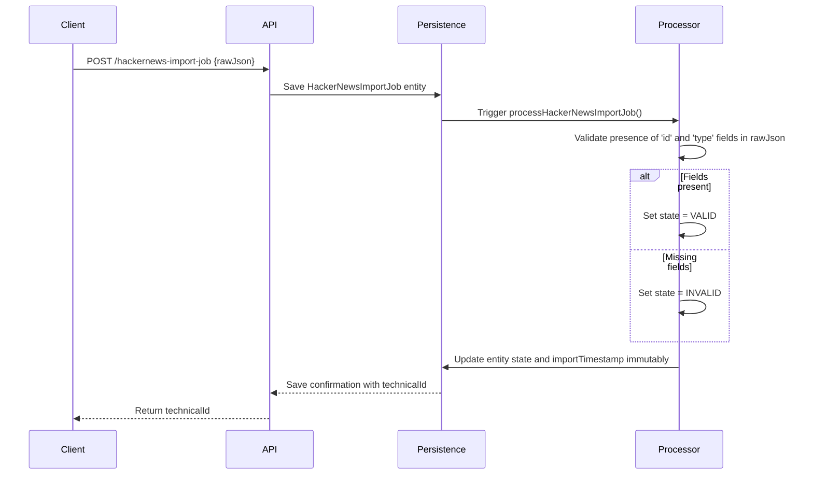

### 1. Entity Definitions

```
HackerNewsImportJob:
- technicalId: String (auto-generated unique identifier for persistence and retrieval)
- importTimestamp: String (ISO 8601 format, timestamp when the item was imported)
- rawJson: String (original JSON of the Hacker News item as received)
- state: String (VALID or INVALID depending on presence of required fields)
- id: Long (id field from the Hacker News item, required)
- type: String (type field from the Hacker News item, required)
```

### 2. Process Method Flows

```
processHackerNewsImportJob() Flow:
1. Initial State: HackerNewsImportJob entity created with rawJson and importTimestamp set.
2. Validation: Check presence of required fields 'id' and 'type' in rawJson.
3. State Assignment: 
   - If both fields exist, set state to VALID.
   - Otherwise, set state to INVALID.
4. Persistence: Save the enriched entity (with importTimestamp and state) immutably.
5. Completion: Entity is ready for retrieval via technicalId.
```

### 3. API Endpoints Design

- **POST /hackernews-import-job**  
  - Description: Create a new HackerNewsImportJob entity (triggers `processHackerNewsImportJob()` event).  
  - Request Body:  
    ```json
    {
      "rawJson": "{...}"  // JSON string in Firebase HN API format
    }
    ```  
  - Response Body:  
    ```json
    {
      "technicalId": "string"
    }
    ```

- **GET /hackernews-import-job/{technicalId}**  
  - Description: Retrieve the HackerNewsImportJob by technicalId.  
  - Response Body:  
    ```json
    {
      "technicalId": "string",
      "rawJson": "{...}",       // Original JSON string
      "importTimestamp": "string",  // ISO 8601 timestamp
      "state": "VALID|INVALID",
      "id": long,
      "type": "string"
    }
    ```

### 4. Event Processing Workflow Diagram


```mermaid
sequenceDiagram
  participant Client
  participant API
  participant Persistence
  participant Processor

  Client->>API: POST /hackernews-import-job {rawJson}
  API->>Persistence: Save HackerNewsImportJob entity
  Persistence->>Processor: Trigger processHackerNewsImportJob()
  Processor->>Processor: Validate presence of 'id' and 'type' fields in rawJson
  alt Fields present
    Processor->>Processor: Set state = VALID
  else Missing fields
    Processor->>Processor: Set state = INVALID
  end
  Processor->>Persistence: Update entity state and importTimestamp immutably
  Persistence-->>API: Save confirmation with technicalId
  API-->>Client: Return technicalId
```