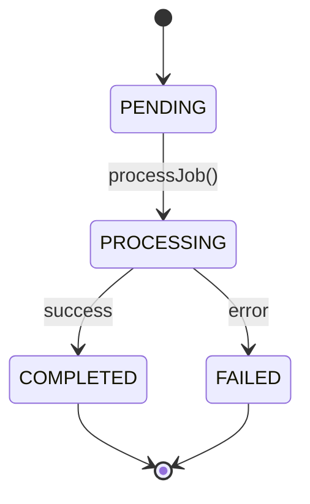
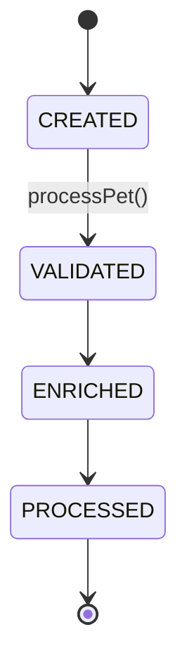
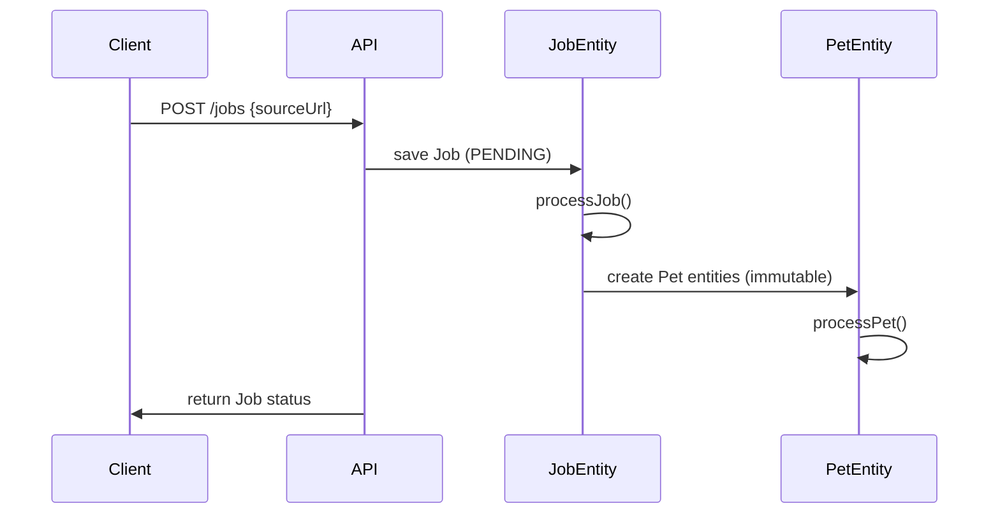

### 1. Entity Definitions

``` 
Job: 
- id: String (unique identifier for each ingestion job) 
- sourceUrl: String (Petstore API endpoint for data ingestion) 
- createdAt: DateTime (timestamp of job creation) 
- status: JobStatusEnum (PENDING, PROCESSING, COMPLETED, FAILED)

Pet: 
- id: String (unique pet identifier, immutable) 
- name: String (pet's name) 
- category: String (type of pet, e.g., dog, cat, bird) 
- photoUrls: List<String> (images of the pet) 
- tags: List<String> (keywords or labels) 
- status: PetStatusEnum (available, pending, sold) 
- createdAt: DateTime (timestamp of pet entity creation)
```

### 2. Process Method Flows

```
processJob() Flow:
1. Initial State: Job created with status = PENDING
2. Validation: Verify `sourceUrl` is reachable and valid
3. Processing: Fetch data from Petstore API, parse pet records
4. For each pet record, create a new immutable Pet entity (triggers processPet())
5. Completion: Update Job status to COMPLETED or FAILED based on outcome
6. Notification: Optionally send completion/failure notice

processPet() Flow:
1. Initial State: Pet entity created (immutable)
2. Validation: Check required fields (name, category, status)
3. Enrichment: Add default tags or photo URLs if missing
4. Persistence: Save Pet entity to storage (immutable)
5. Completion: Mark Pet entity as processed (optional status update)
```

### 3. API Endpoints Design

- **POST /jobs**  
  Create a new Job entity to ingest/sync Petstore data (triggers processJob event).

- **POST /pets**  
  Add a new Pet entity (immutable creation event, triggers processPet event).

- **GET /pets**  
  Retrieve list of stored Pet entities.

- **GET /pets/{id}**  
  Retrieve a single Pet entity by id.

### 4. Request/Response Formats

**POST /jobs**  
Request JSON:  
```json
{
  "sourceUrl": "https://petstore.swagger.io/v2/pet/findByStatus?status=available"
}
```  
Response JSON:  
```json
{
  "id": "job123",
  "sourceUrl": "https://petstore.swagger.io/v2/pet/findByStatus?status=available",
  "createdAt": "2024-06-01T12:00:00Z",
  "status": "PENDING"
}
```

**POST /pets**  
Request JSON:  
```json
{
  "name": "Whiskers",
  "category": "cat",
  "photoUrls": ["http://example.com/cat1.jpg"],
  "tags": ["cute", "indoor"],
  "status": "available"
}
```  
Response JSON:  
```json
{
  "id": "pet789",
  "name": "Whiskers",
  "category": "cat",
  "photoUrls": ["http://example.com/cat1.jpg"],
  "tags": ["cute", "indoor"],
  "status": "available",
  "createdAt": "2024-06-01T12:01:00Z"
}
```

### 5. Mermaid Diagrams

**Entity Lifecycle State Diagram (Job)**  

```mermaid
stateDiagram-v2
    [*] --> PENDING
    PENDING --> PROCESSING : processJob()
    PROCESSING --> COMPLETED : success
    PROCESSING --> FAILED : error
    COMPLETED --> [*]
    FAILED --> [*]
```

**Entity Lifecycle State Diagram (Pet)**  

```mermaid
stateDiagram-v2
    [*] --> CREATED
    CREATED --> VALIDATED : processPet()
    VALIDATED --> ENRICHED
    ENRICHED --> PROCESSED
    PROCESSED --> [*]
```

**Event-Driven Processing Chain**  

```mermaid
sequenceDiagram
    participant Client
    participant API
    participant JobEntity
    participant PetEntity

    Client->>API: POST /jobs {sourceUrl}
    API->>JobEntity: save Job (PENDING)
    JobEntity->>JobEntity: processJob()
    JobEntity->>PetEntity: create Pet entities (immutable)
    PetEntity->>PetEntity: processPet()
    API->>Client: return Job status
```

---

If you want me to proceed with implementation details or additional specs, please let me know!