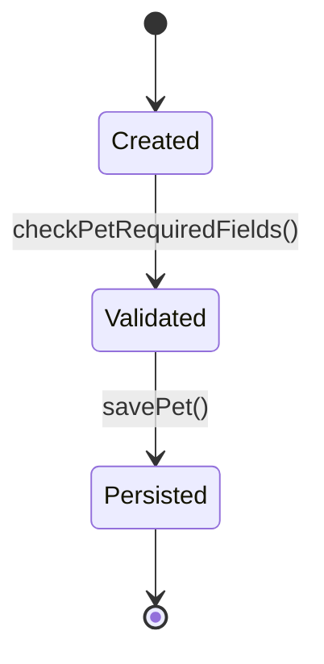
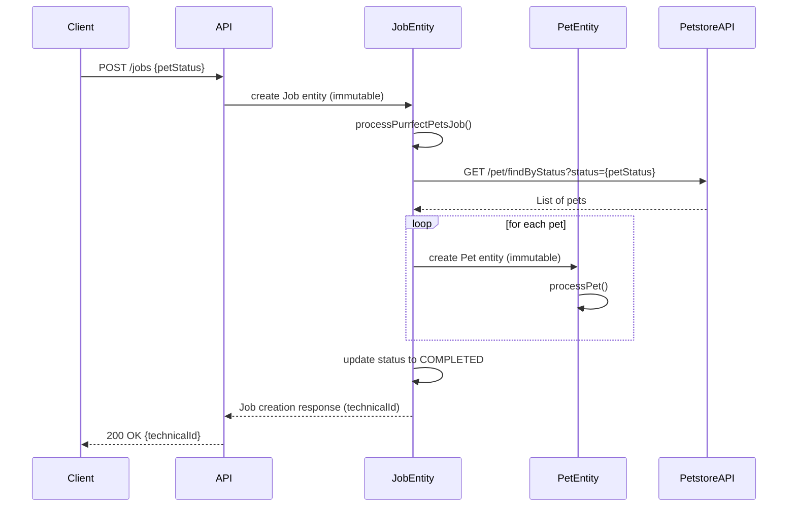

### 1. Entity Definitions

``` 
PurrfectPetsJob:  
- technicalId: String (unique identifier generated by datastore)  
- petStatus: String (status filter for pet ingestion, e.g., available, pending, sold)  
- requestedAt: String (ISO timestamp when job was created)  
- status: String (job status: PENDING, PROCESSING, COMPLETED, FAILED)  
- resultSummary: String (summary or count of ingested pets)  

Pet:  
- petId: Long (ID from Petstore API)  
- name: String (pet name)  
- category: String (pet category name)  
- photoUrls: List<String> (photos of the pet)  
- tags: List<String> (tags associated with pet)  
- status: String (pet status from Petstore: available, pending, sold)  
- ingestedAt: String (ISO timestamp when pet data was ingested)  
```

---

### 2. Process Method Flows

```
processPurrfectPetsJob() Flow:  
1. Initial State: Job created with status = PENDING and petStatus filter set  
2. Validation: Ensure petStatus field is valid (non-empty)  
3. Processing: Call Petstore API GET /pet/findByStatus?status={petStatus}  
4. For each pet in response: create immutable Pet entities with ingestedAt timestamp  
5. Completion: Update job status to COMPLETED and fill resultSummary with count of pets ingested  
6. Error Handling: On any failure, update job status to FAILED with error details  
7. Notification: (Optional) trigger event or log completion  
```

```
processPet() Flow:  
1. Initial State: Pet entity created (immutable)  
2. Validation: Validate required fields (petId, name, status)  
3. Enrichment: (Optional) Add any additional business logic or transformations  
4. Persistence: Save pet data for querying  
5. Completion: Ready to be retrieved by GET endpoints  
```

---

### 3. API Endpoints Design

| Method | Path                | Description                      | Request Body (JSON)                    | Response Body           |
|--------|---------------------|--------------------------------|--------------------------------------|------------------------|
| POST   | /jobs               | Create a new ingestion job      | `{ "petStatus": "available" }`       | `{ "technicalId": "..." }` |
| GET    | /jobs/{technicalId} | Get job status and summary      | N/A                                  | Job entity JSON         |
| GET    | /pets/{technicalId} | Retrieve pet by technicalId     | N/A                                  | Pet entity JSON         |

- No update or delete endpoints provided per EDA immutability principle.
- No GET by condition endpoints unless explicitly requested.

---

### 4. Request/Response Formats

**POST /jobs Request Example**  
```json
{
  "petStatus": "available"
}
```

**POST /jobs Response Example**  
```json
{
  "technicalId": "job-123456"
}
```

**GET /jobs/{technicalId} Response Example**  
```json
{
  "technicalId": "job-123456",
  "petStatus": "available",
  "requestedAt": "2024-06-15T12:00:00Z",
  "status": "COMPLETED",
  "resultSummary": "Ingested 25 pets"
}
```

**GET /pets/{technicalId} Response Example**  
```json
{
  "technicalId": "pet-789012",
  "petId": 789012,
  "name": "Fluffy",
  "category": "Cat",
  "photoUrls": ["http://example.com/cat1.jpg"],
  "tags": ["cute", "small"],
  "status": "available",
  "ingestedAt": "2024-06-15T12:05:00Z"
}
```

---

### 5. Visual Representations

#### Entity Lifecycle State Diagram — PurrfectPetsJob


```mermaid
stateDiagram-v2
    [*] --> Created
    Created --> Processing : processPurrfectPetsJob()
    Processing --> Completed : success
    Processing --> Failed : error
    Completed --> [*]
    Failed --> [*]
```

#### Entity Lifecycle State Diagram — Pet


```mermaid
stateDiagram-v2
    [*] --> Created
    Created --> Validated : checkPetRequiredFields()
    Validated --> Persisted : savePet()
    Persisted --> [*]
```

#### Event-Driven Processing Chain for Job


```mermaid
sequenceDiagram
    participant Client
    participant API
    participant JobEntity
    participant PetEntity
    participant PetstoreAPI

    Client->>API: POST /jobs {petStatus}
    API->>JobEntity: create Job entity (immutable)
    JobEntity->>JobEntity: processPurrfectPetsJob()
    JobEntity->>PetstoreAPI: GET /pet/findByStatus?status={petStatus}
    PetstoreAPI-->>JobEntity: List of pets
    loop for each pet
        JobEntity->>PetEntity: create Pet entity (immutable)
        PetEntity->>PetEntity: processPet()
    end
    JobEntity->>JobEntity: update status to COMPLETED
    JobEntity-->>API: Job creation response (technicalId)
    API-->>Client: 200 OK {technicalId}
```
