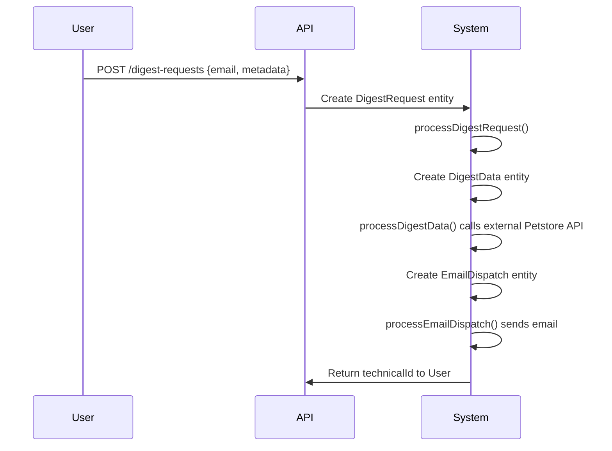

### 1. Entity Definitions

``` 
DigestRequest:
- email: String (User email to receive the digest)
- requestMetadata: String (Additional data influencing API data retrieval or digest content)
- createdAt: DateTime (Timestamp of the request creation)
- status: String (Current status of processing: PENDING, PROCESSING, COMPLETED, FAILED)

DigestData:
- digestRequestId: String (Reference to the originating DigestRequest)
- apiData: String (Raw or processed data retrieved from Petstore API, stored as JSON string)
- createdAt: DateTime (Timestamp of data retrieval)
- status: String (Data retrieval status: PENDING, SUCCESS, FAILED)

EmailDispatch:
- digestRequestId: String (Reference to the originating DigestRequest)
- emailContent: String (Formatted content of the digest email)
- sentAt: DateTime (Timestamp when email was dispatched)
- status: String (Email sending status: PENDING, SENT, FAILED)
```

---

### 2. Process Method Flows

```
processDigestRequest() Flow:
1. Initial State: DigestRequest entity created with status = PENDING
2. Validation: Basic validation of email and metadata (if any)
3. Status Update: Set DigestRequest status to PROCESSING
4. Trigger: Create DigestData entity linked to DigestRequest to start data retrieval

processDigestData() Flow:
1. Initial State: DigestData created with status = PENDING
2. Data Retrieval: Call Petstore external API using requestMetadata or defaults
3. Data Processing: Parse and prepare data for digest
4. Status Update: Set DigestData status to SUCCESS or FAILED
5. Trigger: Create EmailDispatch entity linked to DigestRequest to start email sending

processEmailDispatch() Flow:
1. Initial State: EmailDispatch created with status = PENDING
2. Email Preparation: Format digest content from DigestData (plain text or HTML)
3. Email Sending: Send email to DigestRequest.email
4. Status Update: Set EmailDispatch status to SENT or FAILED
5. Completion: Optionally update DigestRequest status to COMPLETED or FAILED depending on outcomes
```

---

### 3. API Endpoints

| Endpoint                  | Method | Description                                  | Request Body Example                         | Response Example                    |
|---------------------------|--------|----------------------------------------------|----------------------------------------------|-----------------------------------|
| `/digest-requests`        | POST   | Create a DigestRequest (triggers processing) | `{ "email": "user@example.com", "requestMetadata": "some info" }` | `{ "technicalId": "abc123" }`      |
| `/digest-requests/{id}`   | GET    | Retrieve DigestRequest status and details     | N/A                                          | `{ "email": "...", "status": "...", "createdAt": "..." }` |
| `/digest-data/{id}`       | GET    | Retrieve DigestData by technicalId             | N/A                                          | `{ "apiData": "...", "status": "...", "createdAt": "..." }` |
| `/email-dispatch/{id}`    | GET    | Retrieve EmailDispatch status by technicalId  | N/A                                          | `{ "status": "...", "sentAt": "..." }` |

- No update/delete endpoints are provided, consistent with immutable event creation.
- POST endpoint only exists for the orchestration entity `DigestRequest`.
- Business entity creation is implicit via process methods triggered on entity creation.

---

### 4. Request/Response Formats

**POST /digest-requests Request**

```json
{
  "email": "user@example.com",
  "requestMetadata": "optional metadata to guide API data retrieval"
}
```

**POST /digest-requests Response**

```json
{
  "technicalId": "string-unique-id"
}
```

**GET /digest-requests/{technicalId} Response**

```json
{
  "email": "user@example.com",
  "requestMetadata": "optional metadata to guide API data retrieval",
  "status": "PROCESSING",
  "createdAt": "2024-06-15T12:00:00Z"
}
```

**GET /digest-data/{technicalId} Response**

```json
{
  "apiData": "{...JSON data from Petstore API...}",
  "status": "SUCCESS",
  "createdAt": "2024-06-15T12:01:00Z"
}
```

**GET /email-dispatch/{technicalId} Response**

```json
{
  "status": "SENT",
  "sentAt": "2024-06-15T12:02:00Z"
}
```

---

### 5. Visual Representations

**Entity Lifecycle State Diagram for DigestRequest**


```mermaid
stateDiagram-v2
    [*] --> Created
    Created --> Processing : processDigestRequest()
    Processing --> Completed : success
    Processing --> Failed : error
    Completed --> [*]
    Failed --> [*]
```

**Event-Driven Processing Chain**

```mermaid
graph TD
    A[DigestRequest Created] --> B[processDigestRequest()]
    B --> C[DigestData Created]
    C --> D[processDigestData()]
    D --> E[EmailDispatch Created]
    E --> F[processEmailDispatch()]
    F --> G[DigestRequest Completed or Failed]
```

**User Interaction Sequence Flow**


```mermaid
sequenceDiagram
    participant User
    participant API
    participant System

    User->>API: POST /digest-requests {email, metadata}
    API->>System: Create DigestRequest entity
    System->>System: processDigestRequest()
    System->>System: Create DigestData entity
    System->>System: processDigestData() calls external Petstore API
    System->>System: Create EmailDispatch entity
    System->>System: processEmailDispatch() sends email
    System->>API: Return technicalId to User
```

---

Please let me know if you need any further adjustments or additions!