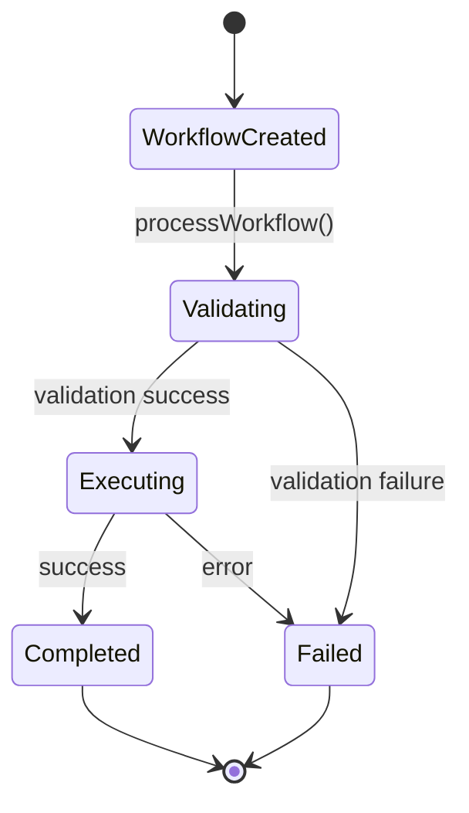
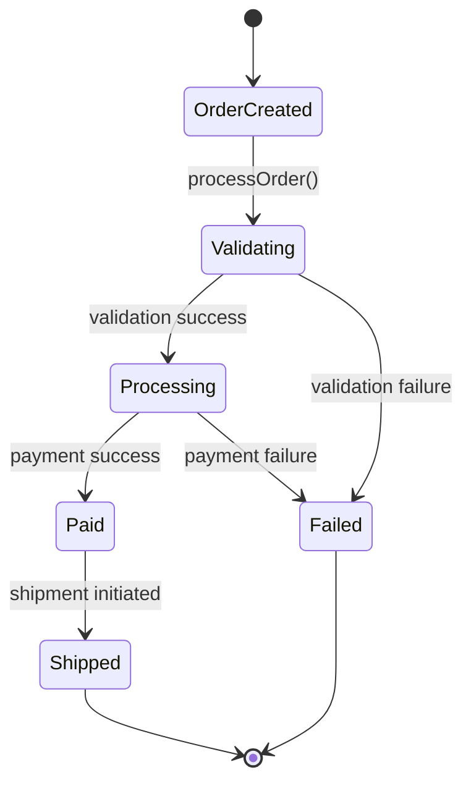
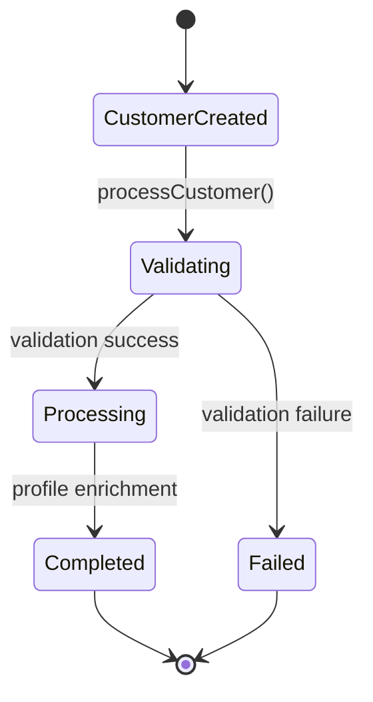
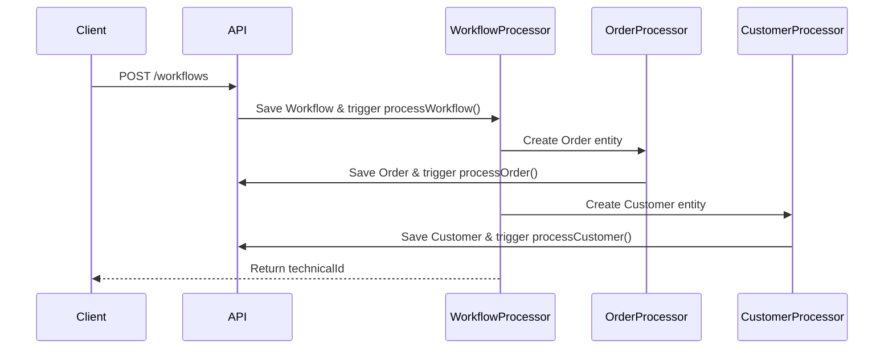

### 1. Entity Definitions

``` 
Workflow: 
- name: String (Name of the workflow/orchestration process)
- createdAt: String (ISO timestamp of creation)
- status: String (Current workflow status, e.g., PENDING, RUNNING, COMPLETED, FAILED)
- parameters: Map<String, Object> (Input parameters for the workflow)

Order: 
- orderId: String (Business order identifier)
- customerId: String (Reference to the customer placing the order)
- items: List<Map<String, Object>> (List of products and quantities, e.g., [{productId, quantity}])
- shippingAddress: String (Shipping address for the order)
- paymentMethod: String (Payment method description)
- createdAt: String (ISO timestamp when order was placed)
- status: String (Order status, e.g., CREATED, PAID, SHIPPED)

Customer: 
- customerId: String (Business customer identifier)
- name: String (Customer full name)
- email: String (Customer email address)
- phone: String (Customer phone number)
- createdAt: String (ISO timestamp of customer registration)
```

---

### 2. Process Method Flows

```
processWorkflow() Flow:
1. Initial State: Workflow entity created with PENDING status.
2. Validation: Check presence and correctness of required parameters.
3. Execution: Orchestrate sub-processes such as order creation or customer verification by creating corresponding entities.
4. Monitoring: Track progress and update Workflow status to RUNNING.
5. Completion: Upon successful orchestration, set status to COMPLETED; on failure, set to FAILED.
6. Notification: Trigger notifications or callbacks as needed.

processOrder() Flow:
1. Initial State: Order entity saved with status CREATED.
2. Validation: Validate customer existence and product availability.
3. Processing: Reserve stock, initiate payment processing (external system calls).
4. Update Status: Move order status to PAID, SHIPPED, or FAILED based on processing results.
5. Event Emission: Emit events for shipment or customer notification.

processCustomer() Flow:
1. Initial State: Customer entity created with registration timestamp.
2. Validation: Validate email format and uniqueness.
3. Processing: Verify customer data, enrich profile if needed.
4. Completion: Save customer profile and emit registration event.
```

---

### 3. API Endpoints Design

| Entity    | HTTP Method | Endpoint            | Description                          | Request Body/Response                          |
| --------- | ----------- | ------------------- | ---------------------------------- | --------------------------------------------- |
| Workflow  | POST        | /workflows          | Create new workflow (triggers processWorkflow) | Request: workflow fields (name, parameters) <br> Response: `{ "technicalId": "<id>" }` |
| Workflow  | GET         | /workflows/{technicalId} | Retrieve workflow by technicalId    | Response: full workflow entity including status |
| Order     | POST        | /orders             | Create new order (triggers processOrder) | Request: order fields <br> Response: `{ "technicalId": "<id>" }` |
| Order     | GET         | /orders/{technicalId} | Retrieve order by technicalId       | Response: full order entity including status |
| Customer  | POST        | /customers          | Create new customer (triggers processCustomer) | Request: customer fields <br> Response: `{ "technicalId": "<id>" }` |
| Customer  | GET         | /customers/{technicalId} | Retrieve customer by technicalId   | Response: full customer entity |

*No update or delete endpoints are provided to preserve immutability and event history.*

---

### 4. Request/Response Formats

**POST /workflows Request**

```json
{
  "name": "OrderProcessingWorkflow",
  "parameters": {
    "orderId": "ORD123",
    "priority": "high"
  }
}
```

**POST /workflows Response**

```json
{
  "technicalId": "wf-001"
}
```

**POST /orders Request**

```json
{
  "orderId": "ORD123",
  "customerId": "CUST456",
  "items": [
    { "productId": "PROD789", "quantity": 2 },
    { "productId": "PROD012", "quantity": 1 }
  ],
  "shippingAddress": "123 Main St, City, Country",
  "paymentMethod": "credit card",
  "createdAt": "2024-06-01T12:00:00Z",
  "status": "CREATED"
}
```

**POST /orders Response**

```json
{
  "technicalId": "ord-001"
}
```

**POST /customers Request**

```json
{
  "customerId": "CUST456",
  "name": "John Doe",
  "email": "john.doe@example.com",
  "phone": "+1234567890",
  "createdAt": "2024-06-01T12:00:00Z"
}
```

**POST /customers Response**

```json
{
  "technicalId": "cust-001"
}
```

---

### 5. Visual Representation

**Workflow Entity Lifecycle**


```mermaid
stateDiagram-v2
    [*] --> WorkflowCreated
    WorkflowCreated --> Validating : processWorkflow()
    Validating --> Executing : validation success
    Validating --> Failed : validation failure
    Executing --> Completed : success
    Executing --> Failed : error
    Completed --> [*]
    Failed --> [*]
```

**Order Entity Lifecycle**


```mermaid
stateDiagram-v2
    [*] --> OrderCreated
    OrderCreated --> Validating : processOrder()
    Validating --> Processing : validation success
    Validating --> Failed : validation failure
    Processing --> Paid : payment success
    Paid --> Shipped : shipment initiated
    Processing --> Failed : payment failure
    Shipped --> [*]
    Failed --> [*]
```

**Customer Entity Lifecycle**


```mermaid
stateDiagram-v2
    [*] --> CustomerCreated
    CustomerCreated --> Validating : processCustomer()
    Validating --> Processing : validation success
    Validating --> Failed : validation failure
    Processing --> Completed : profile enrichment
    Completed --> [*]
    Failed --> [*]
```

**Event-Driven Processing Chain (Simplified)**


```mermaid
sequenceDiagram
    participant Client
    participant API
    participant WorkflowProcessor
    participant OrderProcessor
    participant CustomerProcessor

    Client->>API: POST /workflows
    API->>WorkflowProcessor: Save Workflow & trigger processWorkflow()
    WorkflowProcessor->>OrderProcessor: Create Order entity
    OrderProcessor->>API: Save Order & trigger processOrder()
    WorkflowProcessor->>CustomerProcessor: Create Customer entity
    CustomerProcessor->>API: Save Customer & trigger processCustomer()
    WorkflowProcessor-->>Client: Return technicalId
```
